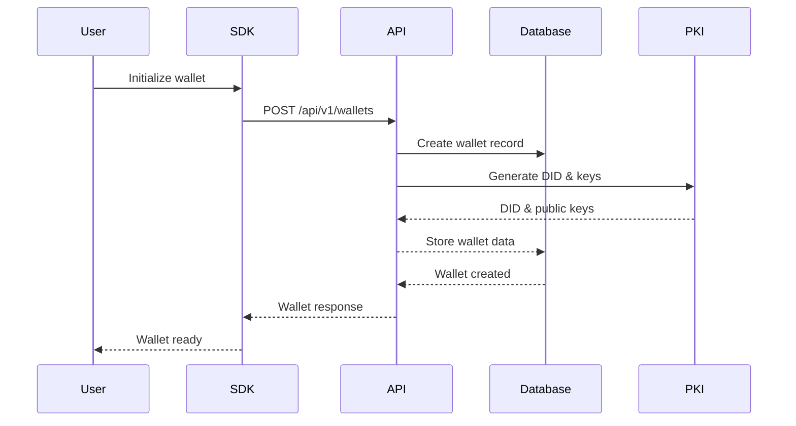
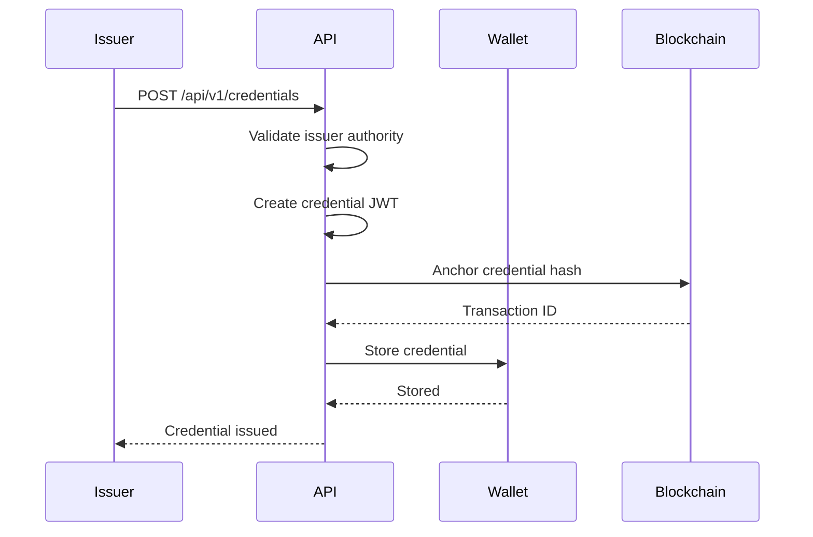
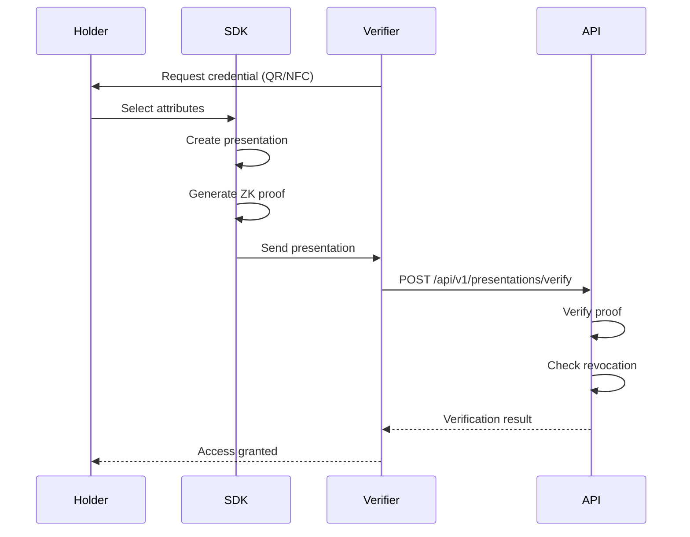
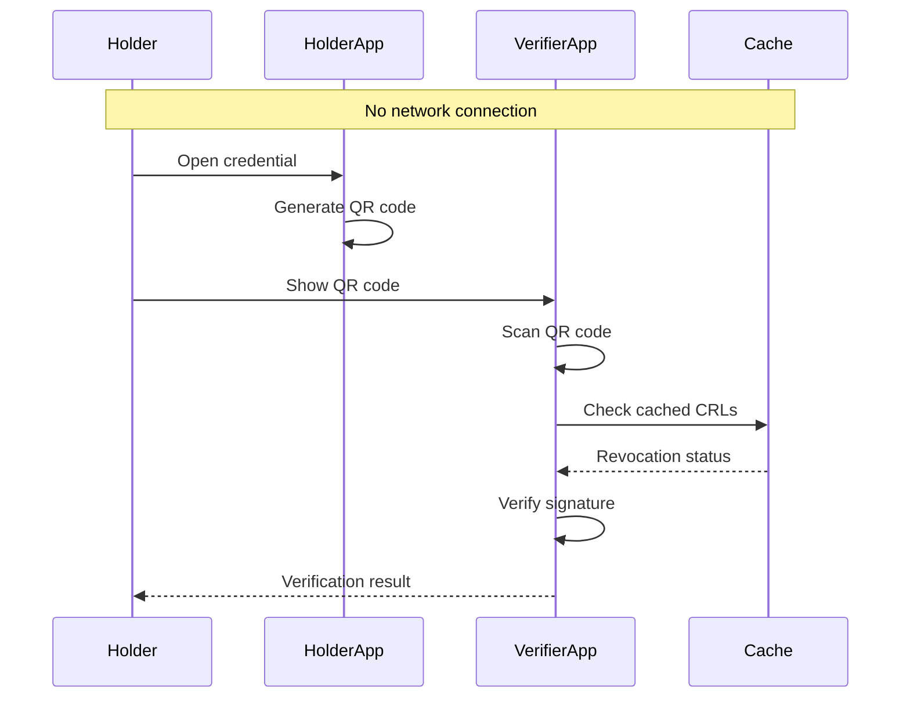

# NumbatWallet API Definitions for SDK Development

## Overview
This document defines the complete API specifications for the NumbatWallet SDK, supporting both GraphQL (primary) and REST (secondary) endpoints. The SDK will use these definitions to integrate wallet capabilities into the ServiceWA mobile application.

## Table of Contents
1. [Authentication & Authorization](#authentication--authorization)
2. [Core API Operations](#core-api-operations)
3. [GraphQL Schema](#graphql-schema)
4. [REST Endpoints](#rest-endpoints)
5. [Data Models & Contracts](#data-models--contracts)
6. [Workflow Examples](#workflow-examples)
7. [Error Handling](#error-handling)
8. [SDK Integration Guide](#sdk-integration-guide)

---

## Authentication & Authorization

### API Key Authentication
```typescript
// Request Headers
{
  "X-API-Key": "tenant_live_4fbb4c....",
  "X-Tenant-Id": "550e8400-e29b-41d4-a716-446655440000"
}
```

### OAuth 2.0 / OIDC Flow
```typescript
// Authorization endpoint
GET /auth/authorize?
  response_type=code&
  client_id={client_id}&
  redirect_uri={redirect_uri}&
  scope=wallet.read wallet.write credential.issue&
  state={state}

// Token exchange
POST /auth/token
{
  "grant_type": "authorization_code",
  "code": "{authorization_code}",
  "client_id": "{client_id}",
  "client_secret": "{client_secret}"
}

// Response
{
  "access_token": "eyJhbGciOiJSUzI1NiIs...",
  "token_type": "Bearer",
  "expires_in": 3600,
  "refresh_token": "8xLOxBtZp8",
  "scope": "wallet.read wallet.write"
}
```

---

## Core API Operations

### 1. Wallet Lifecycle Management

#### Create Wallet
```graphql
mutation CreateWallet($input: CreateWalletInput!) {
  createWallet(input: $input) {
    walletId
    did
    status
    createdAt
  }
}
```

#### Update Wallet
```graphql
mutation UpdateWallet($walletId: ID!, $input: UpdateWalletInput!) {
  updateWallet(walletId: $walletId, input: $input) {
    walletId
    status
    updatedAt
  }
}
```

#### Delete Wallet
```graphql
mutation DeleteWallet($walletId: ID!) {
  deleteWallet(walletId: $walletId) {
    success
    message
  }
}
```

### 2. Credential Operations

#### Issue Credential
```graphql
mutation IssueCredential($input: IssueCredentialInput!) {
  issueCredential(input: $input) {
    credentialId
    type
    issuedAt
    expiresAt
    status
  }
}
```

#### Verify Credential
```graphql
query VerifyCredential($credentialId: ID!, $options: VerifyOptions) {
  verifyCredential(credentialId: $credentialId, options: $options) {
    isValid
    checks {
      signature
      expiry
      revocation
      schema
    }
  }
}
```

#### Revoke Credential
```graphql
mutation RevokeCredential($credentialId: ID!, $reason: String!) {
  revokeCredential(credentialId: $credentialId, reason: $reason) {
    success
    revokedAt
  }
}
```

### 3. Presentation Operations

#### Create Presentation
```graphql
mutation CreatePresentation($input: CreatePresentationInput!) {
  createPresentation(input: $input) {
    presentationId
    verifier
    disclosedAttributes
    proofToken
  }
}
```

---

## GraphQL Schema

```graphql
# Root Types
type Query {
  # Wallet queries
  wallet(walletId: ID!): Wallet
  wallets(filter: WalletFilter, pagination: PaginationInput): WalletConnection!

  # Credential queries
  credential(credentialId: ID!): Credential
  credentials(walletId: ID!, filter: CredentialFilter): [Credential!]!
  verifyCredential(credentialId: ID!, options: VerifyOptions): VerificationResult!

  # Person queries
  person(personId: ID!): Person
  persons(filter: PersonFilter): [Person!]!
}

type Mutation {
  # Wallet mutations
  createWallet(input: CreateWalletInput!): Wallet!
  updateWallet(walletId: ID!, input: UpdateWalletInput!): Wallet!
  deleteWallet(walletId: ID!): DeleteResult!

  # Credential mutations
  issueCredential(input: IssueCredentialInput!): Credential!
  revokeCredential(credentialId: ID!, reason: String!): RevokeResult!

  # Presentation mutations
  createPresentation(input: CreatePresentationInput!): Presentation!
}

# Core Types
type Wallet {
  walletId: ID!
  did: String!
  personId: ID!
  status: WalletStatus!
  credentials: [Credential!]!
  devices: [Device!]!
  createdAt: DateTime!
  updatedAt: DateTime!
}

type Credential {
  credentialId: ID!
  type: CredentialType!
  issuer: String!
  subject: ID!
  data: JSON!
  status: CredentialStatus!
  issuedAt: DateTime!
  expiresAt: DateTime
  proof: Proof!
}

type Person {
  personId: ID!
  email: String!
  name: String!
  wallets: [Wallet!]!
  createdAt: DateTime!
}

# Enums
enum WalletStatus {
  ACTIVE
  SUSPENDED
  REVOKED
}

enum CredentialType {
  DRIVERS_LICENSE
  PROOF_OF_AGE
  WORKING_WITH_CHILDREN
  IDENTITY_CARD
}

enum CredentialStatus {
  ACTIVE
  EXPIRED
  REVOKED
  SUSPENDED
}

# Input Types
input CreateWalletInput {
  personId: ID!
  deviceInfo: DeviceInfoInput!
}

input IssueCredentialInput {
  walletId: ID!
  type: CredentialType!
  data: JSON!
  expiresAt: DateTime
}

input CreatePresentationInput {
  credentialId: ID!
  verifierDid: String!
  disclosedAttributes: [String!]!
  challenge: String
}
```

---

## REST Endpoints

### Wallet Endpoints
```yaml
# Create Wallet
POST /api/v1/wallets
Content-Type: application/json
{
  "personId": "550e8400-e29b-41d4-a716-446655440000",
  "deviceInfo": {
    "platform": "iOS",
    "deviceId": "A1B2C3D4"
  }
}

# Get Wallet
GET /api/v1/wallets/{walletId}

# Update Wallet
PATCH /api/v1/wallets/{walletId}
{
  "status": "SUSPENDED"
}

# Delete Wallet
DELETE /api/v1/wallets/{walletId}

# List Wallets
GET /api/v1/wallets?personId={personId}&status=ACTIVE
```

### Credential Endpoints
```yaml
# Issue Credential
POST /api/v1/credentials
{
  "walletId": "550e8400-e29b-41d4-a716-446655440000",
  "type": "DRIVERS_LICENSE",
  "data": {
    "licenseNumber": "DL123456",
    "name": "John Doe",
    "dateOfBirth": "1990-01-01",
    "address": "123 Main St, Perth WA 6000"
  },
  "expiresAt": "2030-01-01T00:00:00Z"
}

# Get Credential
GET /api/v1/credentials/{credentialId}

# Verify Credential
POST /api/v1/credentials/{credentialId}/verify
{
  "options": {
    "checkRevocation": true,
    "checkExpiry": true
  }
}

# Revoke Credential
POST /api/v1/credentials/{credentialId}/revoke
{
  "reason": "Lost or stolen"
}

# List Credentials
GET /api/v1/wallets/{walletId}/credentials
```

### Presentation Endpoints
```yaml
# Create Presentation
POST /api/v1/presentations
{
  "credentialId": "550e8400-e29b-41d4-a716-446655440000",
  "verifierDid": "did:web:verifier.example.com",
  "disclosedAttributes": ["name", "dateOfBirth"],
  "challenge": "random-challenge-string"
}

# Verify Presentation
POST /api/v1/presentations/verify
{
  "presentationToken": "eyJhbGciOiJSUzI1NiIs..."
}
```

---

## Data Models & Contracts

### Core Models

```typescript
// Wallet Model
interface Wallet {
  walletId: string;
  did: string;
  personId: string;
  status: 'ACTIVE' | 'SUSPENDED' | 'REVOKED';
  publicKeys: PublicKey[];
  credentials: Credential[];
  devices: Device[];
  createdAt: Date;
  updatedAt: Date;
}

// Credential Model
interface Credential {
  credentialId: string;
  type: CredentialType;
  issuer: string;
  subject: string;
  data: any; // Encrypted JSON
  status: 'ACTIVE' | 'EXPIRED' | 'REVOKED' | 'SUSPENDED';
  issuedAt: Date;
  expiresAt?: Date;
  proof: Proof;
}

// Person Model
interface Person {
  personId: string;
  email: string;
  name: string;
  phoneNumber?: string;
  wallets: Wallet[];
  createdAt: Date;
  updatedAt: Date;
}

// Device Model
interface Device {
  deviceId: string;
  walletId: string;
  platform: 'iOS' | 'Android';
  deviceName: string;
  deviceInfo: any;
  registeredAt: Date;
  lastSeen: Date;
}

// Proof Model
interface Proof {
  type: 'Ed25519Signature2020' | 'BbsBlsSignature2020';
  created: Date;
  verificationMethod: string;
  proofPurpose: string;
  proofValue: string;
}
```

### Response Formats

```typescript
// Success Response
interface ApiResponse<T> {
  success: true;
  data: T;
  metadata?: {
    timestamp: Date;
    version: string;
  };
}

// Error Response
interface ApiError {
  success: false;
  error: {
    code: string;
    message: string;
    details?: any;
  };
  metadata?: {
    timestamp: Date;
    traceId: string;
  };
}

// Paginated Response
interface PaginatedResponse<T> {
  success: true;
  data: T[];
  pagination: {
    page: number;
    pageSize: number;
    total: number;
    hasNext: boolean;
    hasPrevious: boolean;
  };
}
```

---

## Workflow Examples

### 1. Complete Wallet Setup Flow



### 2. Credential Issuance Flow



### 3. Selective Disclosure Presentation



### 4. Offline Verification Flow



---

## Error Handling

### Error Codes

| Code | HTTP Status | Description |
|------|-------------|-------------|
| `AUTH_001` | 401 | Invalid API key |
| `AUTH_002` | 401 | Expired token |
| `AUTH_003` | 403 | Insufficient permissions |
| `WALLET_001` | 404 | Wallet not found |
| `WALLET_002` | 409 | Wallet already exists |
| `WALLET_003` | 400 | Invalid wallet status |
| `CRED_001` | 404 | Credential not found |
| `CRED_002` | 400 | Invalid credential type |
| `CRED_003` | 409 | Credential already revoked |
| `CRED_004` | 400 | Credential expired |
| `VALID_001` | 400 | Invalid input format |
| `VALID_002` | 400 | Missing required field |
| `SERVER_001` | 500 | Internal server error |
| `SERVER_002` | 503 | Service unavailable |

### Error Response Examples

```json
// Authentication Error
{
  "success": false,
  "error": {
    "code": "AUTH_001",
    "message": "Invalid API key provided",
    "details": {
      "hint": "Check your API key format and ensure it's active"
    }
  },
  "metadata": {
    "timestamp": "2025-09-21T10:30:00Z",
    "traceId": "abc123def456"
  }
}

// Validation Error
{
  "success": false,
  "error": {
    "code": "VALID_001",
    "message": "Invalid input format",
    "details": {
      "fields": [
        {
          "field": "email",
          "message": "Invalid email format"
        },
        {
          "field": "personId",
          "message": "Must be a valid UUID"
        }
      ]
    }
  }
}
```

---

## SDK Integration Guide

### 1. Installation

```bash
# Flutter SDK
flutter pub add numbatwallet_sdk

# .NET SDK
dotnet add package NumbatWallet.SDK

# TypeScript/JavaScript
npm install @numbatwallet/sdk
```

### 2. Initialization

```typescript
// TypeScript Example
import { NumbatWalletSDK } from '@numbatwallet/sdk';

const sdk = new NumbatWalletSDK({
  apiKey: process.env.NUMBATWALLET_API_KEY,
  tenantId: process.env.TENANT_ID,
  environment: 'production', // or 'sandbox'
  apiUrl: 'https://api.numbatwallet.wa.gov.au'
});

// Initialize with OAuth
const sdk = new NumbatWalletSDK({
  authType: 'oauth',
  clientId: process.env.CLIENT_ID,
  clientSecret: process.env.CLIENT_SECRET,
  redirectUri: 'myapp://callback'
});
```

### 3. Basic Operations

```typescript
// Create a wallet
const wallet = await sdk.wallets.create({
  personId: '550e8400-e29b-41d4-a716-446655440000',
  deviceInfo: {
    platform: 'iOS',
    deviceId: 'A1B2C3D4'
  }
});

// Issue a credential
const credential = await sdk.credentials.issue({
  walletId: wallet.walletId,
  type: 'DRIVERS_LICENSE',
  data: {
    licenseNumber: 'DL123456',
    name: 'John Doe',
    dateOfBirth: '1990-01-01'
  },
  expiresAt: new Date('2030-01-01')
});

// Verify a credential
const verification = await sdk.credentials.verify(credential.credentialId, {
  checkRevocation: true,
  checkExpiry: true
});

// Create a presentation
const presentation = await sdk.presentations.create({
  credentialId: credential.credentialId,
  verifierDid: 'did:web:verifier.example.com',
  disclosedAttributes: ['name', 'dateOfBirth'],
  challenge: 'random-challenge'
});
```

### 4. Advanced Features

```typescript
// Batch operations
const credentials = await sdk.credentials.issueBatch([
  { walletId: wallet1, type: 'DRIVERS_LICENSE', data: {...} },
  { walletId: wallet2, type: 'PROOF_OF_AGE', data: {...} }
]);

// Offline mode
sdk.enableOfflineMode({
  cacheSize: 50, // MB
  syncInterval: 3600 // seconds
});

// Event listeners
sdk.on('credential.issued', (event) => {
  console.log('Credential issued:', event.credentialId);
});

sdk.on('wallet.suspended', (event) => {
  console.log('Wallet suspended:', event.walletId);
});

// Custom error handling
sdk.setErrorHandler((error) => {
  if (error.code === 'AUTH_001') {
    // Refresh API key
    return refreshApiKey();
  }
  throw error;
});
```

### 5. Security Best Practices

```typescript
// Enable request signing
sdk.enableRequestSigning({
  algorithm: 'RS256',
  privateKey: privateKeyPem
});

// Enable end-to-end encryption
sdk.enableEncryption({
  publicKey: serverPublicKey
});

// Rate limiting
sdk.setRateLimits({
  maxRequestsPerSecond: 10,
  burstSize: 20
});

// Audit logging
sdk.enableAuditLogging({
  logLevel: 'info',
  destination: './audit.log'
});
```

---

## Testing

### Test Credentials

```json
{
  "sandbox": {
    "apiKey": "test_4fbb4c6d3ba840a2b24816fb030ec6e6",
    "tenantId": "test-tenant-001",
    "apiUrl": "https://sandbox.numbatwallet.wa.gov.au"
  },
  "testWallet": {
    "walletId": "test-wallet-001",
    "did": "did:key:z6MkhaXgBZDvotDkL5257faiztiGiC2QtKLGpbnnEGta2doK"
  },
  "testCredential": {
    "credentialId": "test-cred-001",
    "type": "DRIVERS_LICENSE"
  }
}
```

### Test Scenarios

1. **Happy Path**: Complete issuance and verification
2. **Expired Credential**: Test expiry validation
3. **Revoked Credential**: Test revocation checking
4. **Offline Mode**: Test without network
5. **Rate Limiting**: Test API throttling
6. **Error Recovery**: Test retry mechanisms

---

## Rate Limits

| Operation | Limit | Window |
|-----------|-------|--------|
| Wallet Creation | 10 | per minute |
| Credential Issuance | 100 | per minute |
| Credential Verification | 1000 | per minute |
| Presentation Creation | 100 | per minute |
| API Key Authentication | 10 | per second |
| OAuth Token Exchange | 5 | per minute |

---

## Support & Resources

- **API Status**: https://status.numbatwallet.wa.gov.au
- **Developer Portal**: https://developers.numbatwallet.wa.gov.au
- **SDK Documentation**: https://docs.numbatwallet.wa.gov.au/sdk
- **Support Email**: support@numbatwallet.wa.gov.au
- **GitHub**: https://github.com/Credenxia/numbatwallet-sdk

---

## Changelog

| Version | Date | Changes |
|---------|------|---------|
| 1.0.0 | 2025-09-21 | Initial API definitions |
| 1.1.0 | TBD | Add batch operations |
| 1.2.0 | TBD | Add webhook support |

---

*This document is part of the NumbatWallet POA implementation for the Western Australia Digital Wallet tender (DPC2142)*