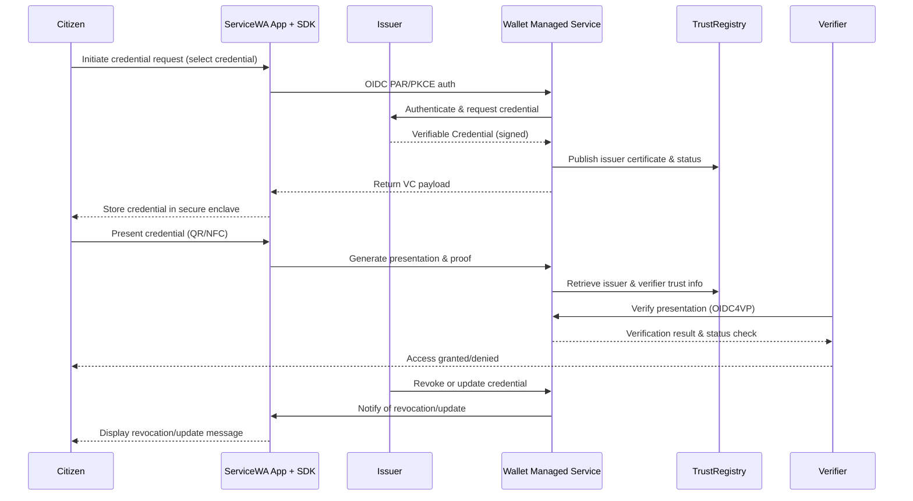
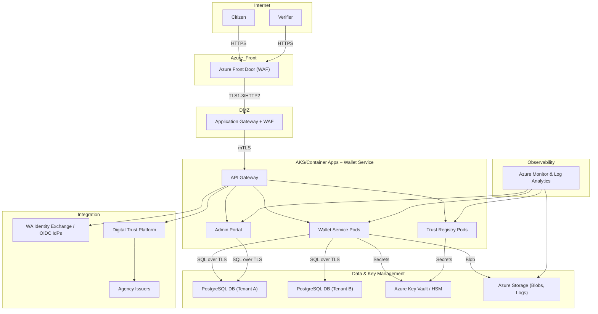

# Appendix A – Solution Architecture

[← Back to Master PRD](PRD_Master.md#documentation-structure)

## Overview

This appendix describes the overall architecture of the digital wallet and verifiable credentials solution.  It covers the high‑level context, logical components, deployment topology and key integration points with existing WA government infrastructure.  The goal is to provide a clear picture of how the managed wallet service interacts with the ServiceWA app, issuers, verifiers, trust registries and the broader identity ecosystem.

### High‑level context

The following sequence diagram illustrates the core interactions between a citizen, the ServiceWA app (with embedded SDK), an issuer agency, the managed wallet service, the trust registry and a verifier.  It summarises credential issuance and presentation flows and highlights where PKI and trust services are used.

### Logical architecture

At a high level, the solution consists of the following subsystems:

1. **Mobile Wallet SDK (Flutter)** – Embedded in ServiceWA.  Provides local credential storage, OIDC authentication, secure key storage, offline presentation, selective disclosure and device recovery.  Communicates with the managed service via REST APIs.
2. **Wallet Managed Service (SaaS)** – A multi‑tenant platform implemented in .NET running on Azure Container Apps.  Provides APIs for issuance, presentation/verification, revocation, trust management and admin functions.  Handles PKI, key binding, status lists and analytics.  Uses PostgreSQL (per‑tenant or shared with RLS) for storage and Azure Key Vault for secrets.
3. **Public Key Infrastructure (PKI)** – A hierarchical CA structure with a root CA managed by DGov; subordinate CAs (Issuer Authority Certificate Authorities – IACAs) managed by the wallet service.  Issues document signing certificates and maintains certificate revocation lists (CRLs) and status lists.
4. **Trust Registry** – Stores lists of trusted issuers, wallet providers and verifiers.  Maintains trust lists and fingerprints.  Exposes APIs for verifiers to retrieve trust anchors and certificates.
5. **Digital Trust Platform (DTP)** – Provided by DGov; acts as the back‑end for ServiceWA.  Supplies credential objects to the wallet service and manages identity federation via the WA Identity Exchange (IdX).  DGov also handles custom integration code for agency enrolment flows.
6. **Identity Providers** – WA Identity Exchange or agency identity providers (OIDC/SAML).  Perform user and administrative authentication and provide identity claims.
7. **Admin Portal & Dashboards** – A secure web interface for DGov administrators and agency operators to configure tenants, manage credentials, view logs, set policies and generate reports.  Implements RBAC and MFA.
8. **Observability & Monitoring** – Utilises Azure Monitor, Application Insights, Event Hubs and Log Analytics to collect telemetry, metrics and logs.  Feeds dashboards and consumption reports.

### Deployment diagram

The following Mermaid diagram describes the proposed deployment in Azure.  It emphasises network tiers, high availability, multi‑tenancy and secure connectivity.

### Integration points

* **ServiceWA SDK integration:** The Flutter SDK uses OIDC PAR/PKCE to authenticate the citizen and exchanges tokens for credential issuance.  It also interacts with the Wallet Managed Service for presentation/verification and calls the WA Identity Exchange for federated login when necessary.
* **Agency integration:** Agencies connect to DGov’s DTP to supply credential data.  DGov handles the integration code; our service ingests credential objects from DTP and transforms them into verifiable credentials for wallet delivery.  Agencies can also use the .NET SDK to interact directly with the wallet service if delegated.
* **Verifier integration:** Verifiers integrate via the web SDK or backend API to receive and verify presentations.  They fetch trust lists and status information from the trust registry and call the verification endpoint to obtain validity results.  In offline scenarios verifiers can validate presentations using embedded certificates and offline status lists.
* **PKI & trust:** The wallet service generates and manages subordinate CAs and document signing keys.  DGov hosts the root CA/HSM.  The service publishes status lists and trust lists to the trust registry.  Verifiers and wallets use these lists to validate certificates.
* **Observability:** Telemetry flows to Azure Monitor and Log Analytics via Event Hubs.  Dashboards provide metrics on issuance volume, verification success rates, latency, error rates and SLA compliance.  Consumption reports use this data for billing and operational insights.

The architecture supports future enhancements such as optional biometrics, additional credential types, and cross‑jurisdictional verification by virtue of open standards and modular services.
