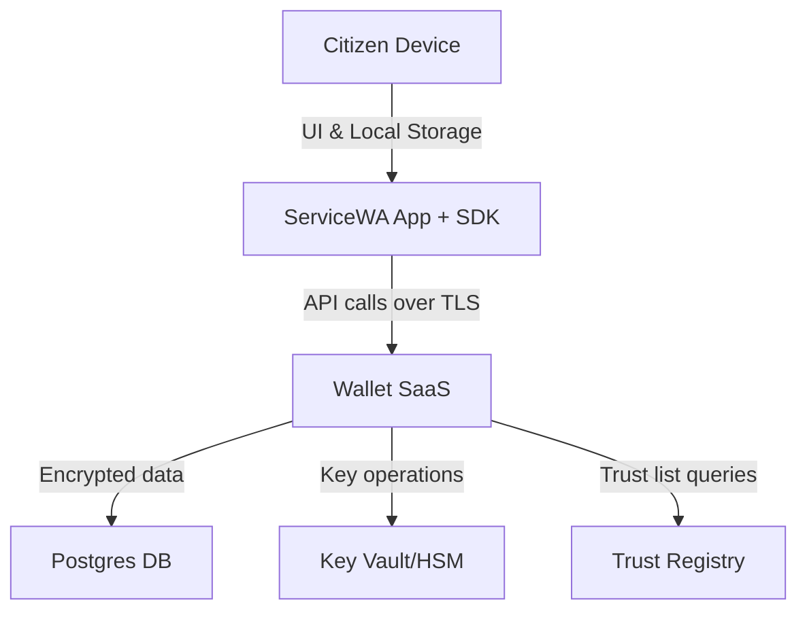

# Appendix B – Security, Privacy & Compliance

[← Back to Master PRD](PRD_Master.md#documentation-structure)

## Security architecture and controls

Our platform implements **defence‑in‑depth** across all layers – network, application, storage and key management – to meet the tender’s security standards.

* **Encryption at rest and in transit:** All data persisted in the wallet is encrypted using **AES‑256‑GCM**; each tenant has its own **Data Encryption Key (DEK)** stored in Azure Key Vault/HSM.  Connections between clients and services use **TLS 1.3** with mutual TLS for administrative APIs.  Keys for signing verifiable credentials are stored in FIPS 140‑2 validated HSMs and rotated regularly.
* **Identity and access management:** Administrative access to the platform requires **multi‑factor authentication (MFA)** and federated single sign‑on via OIDC/SAML.  Role‑based access control (RBAC) governs issuance, revocation and policy management.  Citizens authenticate via ServiceWA; issuers and verifiers authenticate using IdX or their own IdPs.
* **Network security:** The Azure deployment uses segregated subnets and Network Security Groups.  Azure Front Door and Application Gateway enforce WAF policies.  Private Link is used for database and key store connectivity.  Service‑to‑service communication within the cluster is authenticated via mTLS.
* **PKI & trust management:** A dedicated PKI service issues issuer authority certificates and document signing certificates in accordance with **ISO 18013‑5** and **ISO 23220**.  It publishes certificate revocation lists (CRLs) and status lists and integrates with a **trust registry** of issuers, wallets and verifiers.  The root CA and hardware security modules are managed by DGov.
* **Audit logging and monitoring:** The platform produces immutable audit logs for all administrative actions, credential lifecycle events and API calls.  Logs are stored in a tamper‑evident ledger and exported to DGov’s SIEM via Event Hub.  Dashboards report issuance volumes, revocations, latency and error rates.
* **Secure development:** Code is developed using secure coding practices (OWASP ASVS), scanned with SAST/DAST tools and penetration tested before release.  Infrastructure is provisioned with Terraform/Bicep; changes undergo peer review and automated security checks.

## Privacy and data minimisation

Privacy is an explicit requirement in the specifications.  Our design minimises the collection and storage of personally identifiable information (PII) by adhering to these principles:

1. **Purpose limitation:** The wallet stores only the attributes necessary for credential display and cryptographic proof.  Issuers retain authoritative data; the wallet never stores full identity profiles or government records.
2. **Data minimisation & selective disclosure:** Verifiable presentations use zero‑knowledge proofs and selective disclosure so that only the requested attributes are shared with a verifier.  The wallet avoids transmitting unused fields and supports offline presentations.
3. **Pseudonymisation:** User identifiers in our database are pseudonymous (UUIDs) and unrelated to government IDs.  PII within OIDC tokens is obfuscated at rest.
4. **User consent & transparency:** The SDK prompts citizens for consent before issuance, presentation, revocation and analytics collection.  A transaction log within the app allows citizens to review all data exchanges and request erasure.
5. **Retention policies:** Credentials expire based on issuer‑defined lifetimes.  Audit logs are retained for seven years (or as mandated by DGov) and then securely shredded.  Backups inherit the same retention and encryption policies.

## Compliance with standards and frameworks

The tender references numerous standards.  Our solution aligns with or will achieve certification for each as summarised below.  Where full certification is not yet available, we commit to achieving it by the end of the Pilot.

| Category | Standards/Guidelines | Compliance approach |
| --- | --- | --- |
| **Digital identity & credentials** | **W3C Verifiable Credentials**, **DID**, **OpenID for Verifiable Credential Issuance (OID4VCI)**, **OpenID for Verifiable Presentations (OIDC4VP)** | Issuance and presentation APIs and SDKs adhere to OID4VCI/OIDC4VP workflows; our platform participates in conformance testing and publishes results.  DID methods align with W3C Decentralised Identifiers. |
| **Mobile driver’s licence / mDL** | **ISO/IEC 18013‑5** (Part 5) and **ISO/IEC 18013‑7** (mDL technical spec) | Implement mDL‑compliant credential formats and offline NFC presentation.  Seek third‑party conformity assessment once available. |
| **Wallet interoperability** | **ISO/IEC 23220‑1/2/3** | Support standardised data elements, offline presentation and secure messaging.  Provide attribute schema templates as part of product documentation. |
| **Security management** | **ISO/IEC 27001/27002**, **IRAP**, **SOC 2**, **GDPR/APPs** | Operate an ISO 27001/27002‑aligned ISMS; undergo annual IRAP and SOC 2 audits.  Comply with Australian Privacy Act and APPs, including cross‑border data restriction. |
| **Encryption & cryptographic modules** | **ISO/IEC 19790:2025** | Use FIPS 140‑2/3 certified HSMs for key storage and cryptographic operations. |
| **Software lifecycle & IT service management** | **ISO/IEC 12207**, **ITIL v4**, **ISO 9001/90003** | Follow SDLC and ITIL practices for change management, incident response and continual improvement. |
| **Accessibility & usability** | **WCAG 2.2 AA** | Ensure SDK examples and admin UIs meet accessibility requirements. |
| **Privacy & data protection** | **ISO/IEC 29100**, **eIDAS 2.0** Art. 5a, **GDPR** | Enforce data minimisation, anonymisation and purpose limitation; implement privacy impact assessments; store data exclusively in Australian sovereign regions. |

## Threat model and risk assessment

We performed a **STRIDE** analysis across our system components.  The following diagram illustrates data flows and trust boundaries.

Key threats and mitigations:

* **Spoofing & identity misuse:** Use OIDC/OAuth2 with PKCE and PAR for citizen authentication; enforce MFA for administrators and issuers.  Use DIDs and cryptographic binding to devices to prevent cloned wallets.
* **Tampering & repudiation:** All credentials and presentations are digitally signed; metadata includes nonces and timestamps.  Audit logs are immutable and stored in append‑only ledgers.
* **Information disclosure:** Data at rest is encrypted with per‑tenant keys; PII is obfuscated; selective disclosure prevents over‑sharing.
* **Denial of service:** Use rate limiting and resource quotas; autoscale horizontally; isolate tenants to prevent noisy neighbour effects.
* **Elevation of privilege:** Enforce least‑privilege roles; separate duties between operators, PKI administrators and database administrators; implement continuous access reviews.

## Incident response, business continuity & disaster recovery

We maintain a documented **Incident Response Plan** aligned with ISO 27035 and WA Cyber Security Policy.  Incidents are classified by severity and responded to via a 24/7 on‑call rotation.  Post‑incident reports feed into continuous improvement.

**Business Continuity & Disaster Recovery (BCP/DR):**

* **RTO/RPO:** Critical services target **RTO < 4 hours** and **RPO < 15 minutes**.  Multi‑AZ deployment and geo‑replicated backups support these objectives.
* **Backup & restore:** Databases are backed up hourly with encrypted storage and daily snapshots retained for 35 days.  Key Vault secrets and certificates are backed up via Azure’s built‑in mechanisms.
* **Failover drills:** We perform semi‑annual DR simulations to validate failover procedures and recovery scripts.  DR plans are updated based on test outcomes and regulatory changes.

This appendix demonstrates that the proposed solution not only meets the technical requirements but also embeds security and privacy by design, ensuring compliance with WA and international standards while providing clear paths to certification.
