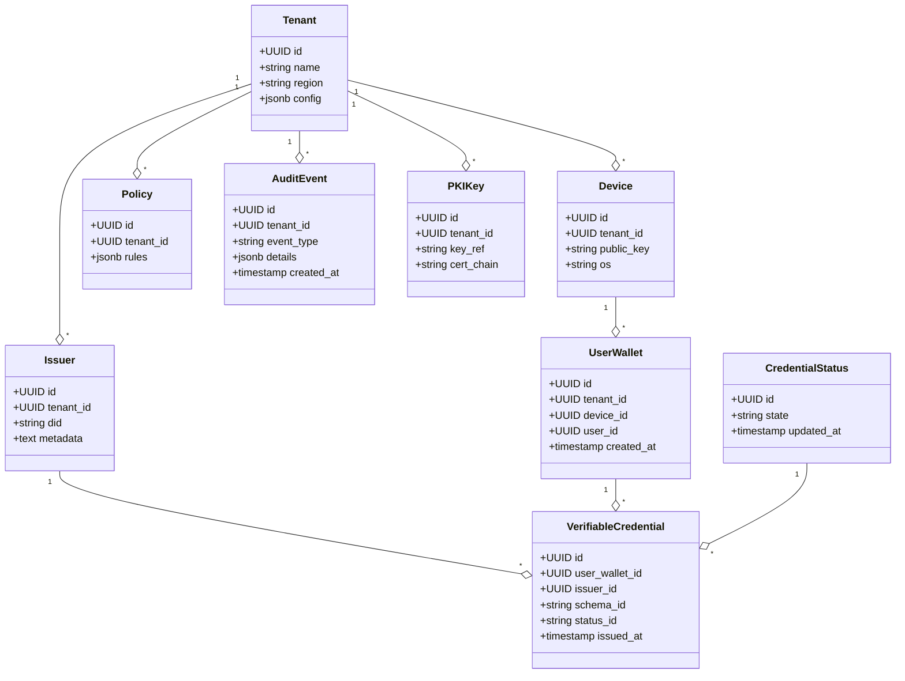
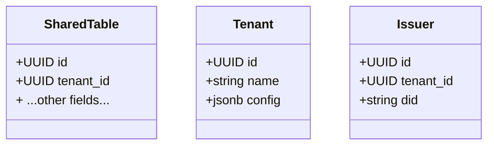

# Appendix C – Data Model & Multi‑Tenancy Analysis

[← Back to Master PRD](PRD_Master.md#documentation-structure)

## Data entities

The wallet platform stores only essential metadata to manage verifiable credentials and support lifecycle operations.  Core entities include:

| Entity | Description |
| --- | --- |
| **Tenant** | Represents an agency or issuer.  Holds configuration parameters (branding, credential types, policies) and has a unique PKI container. |
| **Issuer** | A government agency or delegated authority that issues credentials.  Linked to a tenant.  Contains DID and certificate metadata. |
| **UserWallet** | Represents a citizen’s wallet instance bound to a device.  Stores encrypted credential envelopes and references to issuance status. |
| **Device** | Metadata about the citizen’s device (public key, device identifier, operating system) used for key binding and recovery. |
| **VerifiableCredential** | The credential payload stored encrypted on the device.  In the backend, only the credential identifier, hash and metadata are stored for revocation and audit purposes. |
| **CredentialStatus** | Tracks the status of a credential (issued, updated, suspended, revoked) and points to revocation lists/status endpoints. |
| **Policy** | Defines issuance and presentation rules (allowed wallets, number of copies, expiry, purpose limitation). |
| **AuditEvent** | Immutable record of significant actions such as issuance, presentation, revocation and administrative configuration. |
| **PKIKey** | Stores references to cryptographic keys and certificates (IACAs, document signing keys) managed in the HSM.  Actual private keys never leave the HSM. |

## Option A – Per‑tenant database (recommended)

Under this model each tenant has its own PostgreSQL database.  This maximises isolation and simplifies compliance audits.  The schema below illustrates the core tables and relationships.

### Advantages

* **Isolation & compliance:** Data separation prevents cross‑tenant leakage and simplifies meeting PRH‑1 (data must remain within Australian borders).  Each database can be deployed in the agency’s preferred region.
* **Custom configuration:** Tenants can customise policies, PKI hierarchies and schemas without affecting others.
* **Operational safety:** Issues in one tenant (e.g., mis‑configured RLS) cannot impact others; easier to perform per‑tenant upgrades and backups.

### Disadvantages

* **Operational overhead:** More databases to provision, monitor and upgrade; automation mitigates much of this complexity.
* **Aggregate analytics:** Cross‑tenant analytics require federated queries or a separate analytics pipeline.

## Option B – Shared database with row‑level security (RLS)

This model stores data for all tenants in a single database.  Tenant isolation is enforced by Postgres RLS policies.  Every table includes a `tenant_id` column and RLS rules ensure that sessions can access only rows matching their tenant.  The simplified schema is as follows.

### Advantages

* **Cost efficiency:** Fewer database servers and simplified backup/restore operations.
* **Cross‑tenant analytics:** Easier to run queries across tenants for aggregated reporting.

### Disadvantages & risks

* **Security risk:** Misconfigured RLS policies could expose data across tenants.  Each schema change requires thorough testing to prevent leaks.
* **Compliance challenges:** Auditors may be sceptical of logical separation; demonstrating strong isolation may require additional controls and encryption layers.
* **Noisy neighbours:** Heavy workloads from one tenant can impact performance for others.  Resource governors and workload isolation must be configured.

## Decision matrix

| Criteria | Option A – Per‑tenant DB | Option B – Shared DB with RLS |
| --- | --- | --- |
| **Isolation & security** | Strong physical and logical isolation; minimal risk of cross‑tenant leakage. | Logical isolation only; depends on correct RLS configuration. |
| **Operational complexity** | Requires automating database provisioning, backups and upgrades; more infrastructure to manage. | Simpler infrastructure but more complex policy management and testing. |
| **Cost** | Higher base cost per tenant; scales linearly with number of tenants. | Lower cost; economies of scale. |
| **Analytics & reporting** | Cross‑tenant reports require federated queries or ETL. | Easy to query across tenants. |
| **Migration risk** | Straightforward to migrate from per‑tenant to shared by combining databases and enabling RLS. | Difficult to split a shared DB into per‑tenant instances; high risk of downtime. |

## Recommendation and migration plan

Given the security and compliance obligations of the WA Government and the need for clear data sovereignty, **Option A (per‑tenant database)** is recommended for the Pilot and early production phases.  It aligns with PRH‑1’s requirement for data to remain within Australian borders and simplifies independent certifications for each agency.  Should the number of tenants grow significantly, we propose evaluating Option B during a later phase.  Our architecture supports a reversible migration: each service writes through an abstraction layer that can target different database backends.  To migrate to RLS, we would:

1. Introduce a shared database environment and replicate existing tenant schemas into a unified schema with a `tenant_id` column.
2. Configure RLS policies and run comprehensive automated tests to verify data isolation across tenants.
3. Gradually cut over tenants by updating configuration in the abstraction layer; maintain read‑only replicas of old databases for rollback.
4. Monitor performance and security metrics; if unacceptable risks surface, revert using the read‑only replicas.

This strategy ensures the Department retains flexibility to optimise cost while maintaining strict privacy and compliance requirements.
