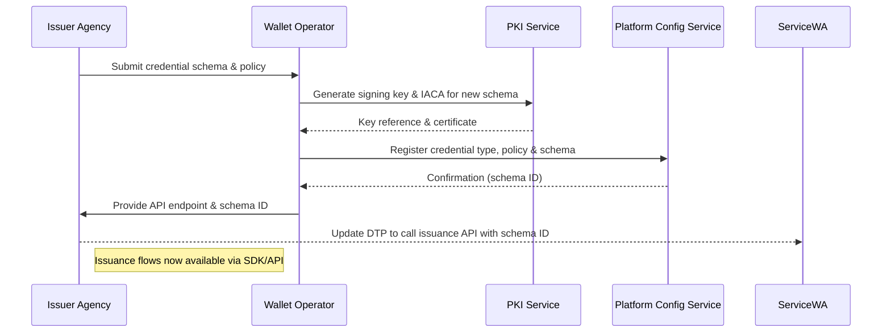
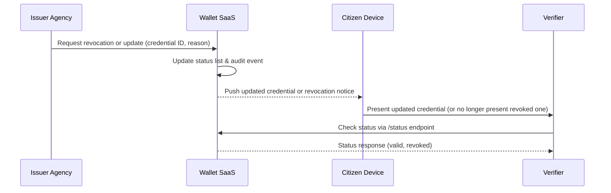
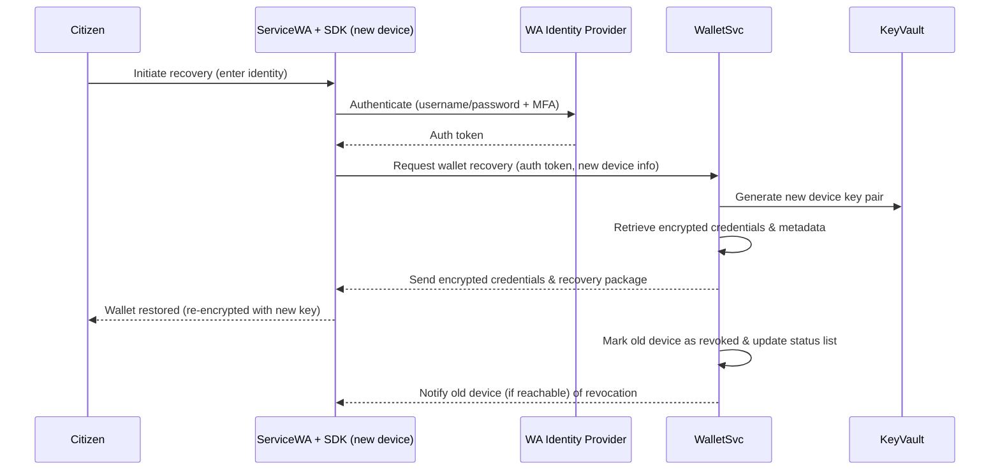
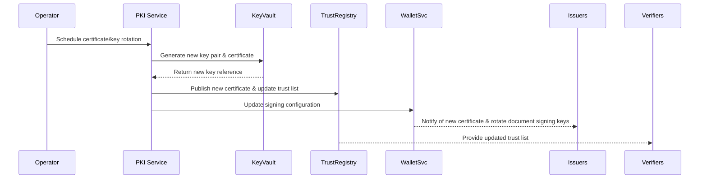
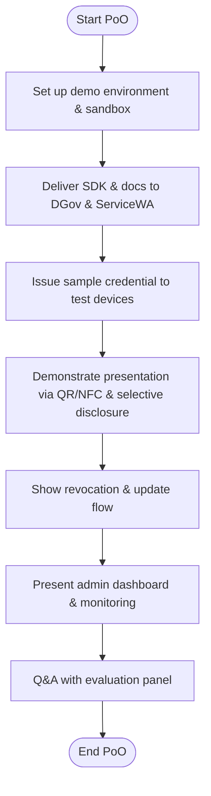

# Appendix E – Operational & Support Workflows

[← Back to Master PRD](PRD_Master.md#documentation-structure)

This appendix presents key workflows for administering the wallet service and supporting end users.  Each workflow is depicted using Mermaid flowcharts or sequence diagrams and reflects the functional requirements defined in Schedule 2 (Proof‑of‑Operation and Pilot activities).

## Onboarding a new credential type

When DGov or another agency wishes to issue a new credential, the following steps are performed.  These steps may occur during the Pilot or later phases and require cooperation between the issuer, DGov, our operations team and the ServiceWA development partner.



**Key points:**

* Credential types include schema definitions, allowed attributes, validity periods and policy rules (e.g., number of copies, allowed wallets).
* The PKI service issues a dedicated document signing key for each credential type and publishes it in the trust registry.
* Configuration changes are version‑controlled and auditable.

## Credential revocation / update workflow



* Revocations are effective immediately; updates propagate within minutes.
* Citizens receive in‑app notifications via the SDK; revocations remove credentials from the wallet UI.

## New tenant onboarding workflow

```mermaid
flowchart TD
  DGov(DGov / Contract Owner) -->|Request new tenant| Ops[Wallet Operator]
  Ops --> Config[Provision Tenant]
  Config --> PKI[Generate PKI container]
  PKI --> Secrets[Store keys in Key Vault]
  Config --> Database[Create DB/schema]
  Config --> Dashboard[Provision monitoring & metrics]
  Ops --> DGov: Provide tenant ID & onboarding package
  DGov --> Issuer: Train issuer staff on SDK/API
```

This workflow illustrates how a new agency is onboarded into the platform, aligning with multi‑tenancy requirements.

## Chatbot and support escalation flow

To support citizens and relying parties, the solution includes a tiered support model.  A chatbot/voice‑bot handles common queries (password resets, how to add a credential, how to verify), with escalation to human agents if needed.

```mermaid
flowchart TD
  User[Citizen / Verifier] --> Chatbot[Tier 0 Chatbot]
  Chatbot -->|FAQ resolved| User
  Chatbot -->|Not resolved / complex| Tier1[Tier 1 Voice‑bot]
  Tier1 -->|Collect intent & context| Tier2[Human Support Agent]
  Tier2 --> CRM[Case Management System]
  Tier2 --> User: Provide resolution & feedback survey
  CRM --> Ops[Operations Team]
  Ops -->|Update knowledge base & runbooks| Chatbot
```

**Highlights:**

* The chatbot uses natural language processing to answer FAQs and triage issues.  It has access to up‑to‑date knowledge articles, usage data and common error codes.
* Voice‑bot provides an IVR option for users who prefer phone support or have accessibility requirements.
* Tier 2 agents are DGov or contractor personnel trained on wallet operations and can access audit logs and service dashboards to resolve issues.
* Lessons learned feed into continuous improvement of runbooks and training materials.

These workflows demonstrate that operational tasks (onboarding, revocation) and support processes are well defined and align with the pilot objectives and end‑to‑end service delivery.

## Account and device recovery workflow

Citizens may lose or replace their device during the Pilot.  The wallet must provide a secure recovery mechanism that re‑binds credentials to a new device while invalidating the old copy.  The sequence diagram below shows the recovery flow.



**Notes:**

* Recovery requires the citizen to authenticate via IdX or a designated identity provider.  Multi‑factor authentication ensures only the rightful owner can restore credentials.
* Credentials remain encrypted during transfer; new device keys are generated in the HSM and never exposed to the client.
* Once recovery completes, the old device’s copy is revoked to prevent misuse.  The revocation propagates via status lists.

## Key rotation & certificate renewal workflow

PKI keys and certificates have limited lifetimes and must be rotated regularly.  The following sequence diagram illustrates how an operator initiates rotation and how new certificates propagate through the system.



**Highlights:**

* Rotation is performed ahead of expiry to avoid service disruptions.  The HSM generates the new key pair and stores it securely.
* The PKI service updates the trust registry with the new certificate chain so that verifiers can trust credentials signed with the rotated key.
* Issuers are notified to update their signing configurations; older certificates remain valid until their revocation date, ensuring a smooth transition.

## Proof‑of‑Operation (PoO) end‑to‑end workflow

The Proof‑of‑Operation evaluation requires a structured demonstration of the wallet’s capabilities.  The flowchart below summarises the key steps performed during PoO.



This high‑level workflow ensures that all PoO objectives—SDK delivery, issuance, presentation, revocation, security demonstration and stakeholder Q&A—are covered within the five‑week schedule.
