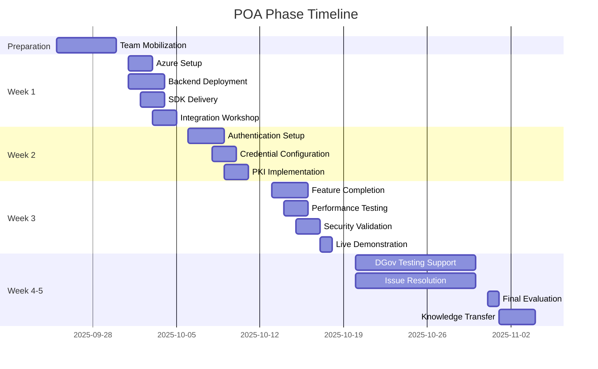

# NumbatWallet POA Master Execution Plan

**Version:** 1.0  
**Date:** September 10, 2025  
**Duration:** October 1 - November 4, 2025 (5 weeks)  
**Investment:** $55,000 (at-risk)

## Table of Contents
- [Executive Summary](#executive-summary)
- [Timeline Overview](#timeline-overview)
- [Team Structure](#team-structure)
- [Weekly Objectives](#weekly-objectives)
- [Deliverables](#deliverables)
- [Success Criteria](#success-criteria)
- [Risk Management](#risk-management)
- [Communication Plan](#communication-plan)

## Executive Summary

The Proof-of-Operation (POA) phase demonstrates the NumbatWallet Digital Wallet and Verifiable Credentials solution to the WA Government. This 5-week engagement will deliver production-ready architecture, integrated SDKs, and a working demonstration of credential issuance and verification.

### Key Objectives
1. **Prove Technical Capability** - Demonstrate all required features
2. **Validate Integration** - Confirm ServiceWA and WA IdX compatibility
3. **Establish Foundation** - Build production architecture for pilot phase
4. **Transfer Knowledge** - Enable DGov team understanding

### Critical Success Factors
- ✅ ServiceWA SDK integration working
- ✅ End-to-end credential lifecycle demonstrated
- ✅ Performance targets met (<500ms response time)
- ✅ Security requirements validated
- ✅ >95% acceptance criteria passed

## Timeline Overview

## Team Structure

### Core Team (On-site Perth)

| Role | Name | Allocation | Weeks On-site |
|------|------|------------|---------------|
| Solution Architect | TBD | 100% | Week 1, 3, 5 |
| Senior Backend Developer | TBD | 100% | Week 1-5 |
| Flutter Developer | TBD | 100% | Week 1-3 |
| Project Manager | TBD | 50% | Week 1, 3, 5 |

### Remote Support Team

| Role | Allocation | Responsibilities |
|------|------------|------------------|
| DevOps Engineer | 100% | Infrastructure, CI/CD, monitoring |
| Security Specialist | 50% | PKI, security testing, compliance |
| QA Engineer | 75% | Test automation, performance testing |
| Business Analyst | 50% | Documentation, requirements validation |

### Stakeholder Matrix

| Stakeholder | Role | Engagement |
|-------------|------|------------|
| DGov Project Manager | Primary Contact | Daily |
| ServiceWA Tech Lead | Integration Partner | Week 1-2 |
| Adapptor Dev Team | SDK Integration | Week 1-2 |
| DGov Test Team | Validation | Week 4-5 |
| Evaluation Panel | Decision Makers | Week 3, 5 |

## Weekly Objectives

### Week 1: Foundation (October 1-4)
**Goal:** Establish infrastructure and deliver SDKs

#### Deliverables
- ✅ Azure infrastructure deployed
- ✅ Backend API operational
- ✅ Flutter SDK delivered to ServiceWA
- ✅ .NET SDK v1.0 packaged
- ✅ API documentation complete
- ✅ CI/CD pipeline operational

#### Key Meetings
- Monday: Kickoff with DGov
- Wednesday: ServiceWA integration workshop
- Friday: Week 1 checkpoint

#### Success Metrics
- Health check endpoints responding
- SDK compiles in ServiceWA project
- No blocking dependencies
- Database migrations applied
- Test infrastructure operational
- 80% domain layer test coverage achieved
- CI/CD pipeline running all tests

### Week 2: Integration (October 7-11)
**Goal:** Complete authentication and credential operations

#### Deliverables
- ✅ OIDC authentication working
- ✅ Credential issuance API complete
- ✅ PKI certificates configured
- ✅ Multi-tenant isolation verified
- ✅ Integration tests passing

#### Key Meetings
- Monday: Technical deep-dive
- Wednesday: Security review
- Friday: Week 2 demonstration

#### Success Metrics
- 10+ test credentials issued
- Authentication flow <2 seconds
- Tenant isolation confirmed
- API response <500ms
- Integration tests passing (100%)
- 85% overall test coverage
- Security tests passing
- Performance baseline established

### Week 3: Demonstration (October 14-18)
**Goal:** Complete features and conduct live demonstration

#### Deliverables
- ✅ Offline verification working
- ✅ QR code generation/scanning
- ✅ Demo wallet app complete
- ✅ Admin portal functional
- ✅ Performance test results
- ✅ Security scan complete

#### Key Meetings
- Monday: Demo preparation
- Wednesday: Dry run
- Friday: **Live Demonstration to DGov**

#### Success Metrics
- All features demonstrated
- 100 concurrent users supported
- No critical security findings
- Positive evaluation feedback
- E2E tests passing (100%)
- Load tests meeting targets (<500ms p95)
- 90% overall test coverage achieved
- Zero high-severity security issues

### Week 4: Testing Support (October 21-25)
**Goal:** Support DGov testing team

#### Activities
- Daily standup with test team (9:00 AM)
- Real-time issue triage
- Priority bug fixes
- Performance optimization
- Documentation updates

#### Support SLA
- P0 issues: 2-hour response
- P1 issues: 4-hour response
- P2 issues: Next business day
- Test blockers: Immediate

### Week 5: Evaluation (October 28 - November 1)
**Goal:** Final evaluation and handover

#### Deliverables
- ✅ All critical issues resolved
- ✅ Final documentation package
- ✅ Knowledge transfer complete
- ✅ Pilot phase plan
- ✅ Evaluation report

#### Key Meetings
- Wednesday: Technical handover
- Thursday: Final presentation
- Friday: Contract decision

## Deliverables

### Technical Deliverables

| Component | Description | Acceptance Criteria |
|-----------|-------------|-------------------|
| **Backend API** | .NET 9 GraphQL/REST API with Clean Architecture | OpenAPI docs, 99.9% uptime |
| **Flutter SDK** | Mobile integration library | Compiles in ServiceWA |
| **.NET SDK** | Server-side integration | NuGet package ready |
| **TypeScript SDK** | Web integration library | NPM package ready |
| **Demo Wallet** | Flutter mobile app | iOS/Android builds |
| **Admin Portal** | Web management interface | CRUD operations working |
| **Infrastructure** | Azure cloud deployment | Auto-scaling, monitored |

### Documentation Deliverables

| Document | Purpose | Format |
|----------|---------|--------|
| API Specification | Complete OpenAPI 3.0 spec | YAML/JSON |
| SDK Integration Guides | Step-by-step integration | Markdown |
| Architecture Diagrams | System design documentation | Draw.io/PNG |
| Security Assessment | Vulnerability analysis | PDF Report |
| Performance Report | Load test results | PDF Report |
| Runbooks | Operational procedures | Markdown |

### Demo Scenarios

1. **Credential Issuance Flow**
   - Admin logs into portal
   - Issues driver license credential
   - Credential appears in wallet
   - Audit log created

2. **Verification Flow**
   - Wallet holder presents credential
   - Verifier scans QR code
   - Selective disclosure demo
   - Offline verification

3. **Revocation Flow**
   - Admin revokes credential
   - Wallet shows revoked status
   - Verification fails appropriately

4. **Multi-tenant Demo**
   - Two agencies issue credentials
   - Complete isolation verified
   - Cross-tenant access blocked

## Success Criteria

### Technical Criteria

| Metric | Target | Minimum |
|--------|--------|---------|
| API Response Time (p95) | <400ms | <500ms |
| Concurrent Users | 100 | 50 |
| Availability | 99.9% | 99.5% |
| Test Coverage (Overall) | >90% | >85% |
| Test Coverage (Domain) | >95% | >95% |
| Test Coverage (New Code) | >90% | >90% |
| Security Vulnerabilities | 0 Critical | 0 Critical |
| TDD Compliance | 100% | 100% |

### Functional Criteria

- [ ] Issue 50+ test credentials
- [ ] Verify credentials online and offline
- [ ] QR code sharing working
- [ ] Selective disclosure functional
- [ ] Biometric authentication (iOS/Android)
- [ ] Revocation working correctly
- [ ] Multi-device support
- [ ] Admin portal all CRUD operations

### Integration Criteria

- [ ] ServiceWA SDK integration successful
- [ ] WA IdX authentication working
- [ ] DTP compliance demonstrated
- [ ] ISO 18013-5 mDL format
- [ ] W3C VC compliance

### Business Criteria

- [ ] >95% acceptance tests passing
- [ ] Positive stakeholder feedback
- [ ] Knowledge transfer completed
- [ ] Clear path to pilot phase
- [ ] Contract award recommendation

## Risk Management

### Top 5 Risks

| Risk | Probability | Impact | Mitigation |
|------|------------|--------|------------|
| **ServiceWA integration issues** | Medium | High | Early SDK delivery, dedicated support |
| **Environment access delays** | Medium | High | Pre-cleared access, backup environment |
| **Performance issues** | Low | High | Pre-optimization, caching strategy |
| **Security findings** | Low | High | Pre-scan, immediate patching |
| **Resource availability** | Low | Medium | Backup resources identified |

### Contingency Plans

1. **Integration Failure**
   - Fallback: Mock ServiceWA interface
   - Timeline impact: +2 days
   - Cost impact: None

2. **Performance Issues**
   - Fallback: Reduced concurrent users
   - Timeline impact: +3 days
   - Cost impact: $5,000

3. **Security Findings**
   - Fallback: Hotfix deployment
   - Timeline impact: +1 day
   - Cost impact: None

## GitHub Workflow and Issue Management

### GitHub Project Structure
- **Project #18**: NumbatWallet POA Phase - Central tracking board
- **40 Issues**: All POA tasks mapped with GitHub issue numbers
- **10 Milestones**: Weekly deliverables with due dates
- **Custom Fields**: Start date and Target date for roadmap view

### Development Workflow

#### Before Starting Any Task:
1. **Check GitHub Issue** - Review issue for latest requirements
2. **Verify Dependencies** - Ensure blocking issues are resolved
3. **Update Status** - Move to "In Progress" in Project #18
4. **Review Comments** - Check for additional context or changes

#### During Development:
1. **Update Progress** - Add comments on significant progress
2. **Link PRs** - Reference issue with #<number> in PR description
3. **Request Reviews** - Tag reviewers when ready
4. **Track Time** - Note actual vs estimated effort

#### Upon Task Completion:
1. **Close Issue** - Mark as closed with completion summary
2. **Update Project** - Ensure board reflects completion
3. **Check Milestone** - If all issues done, close milestone
4. **Document Learnings** - Add notes for future reference

### Issue-to-Code Mapping
All POA tasks have corresponding GitHub issues. Developers must:
- Reference issue number in commit messages
- Link PRs to issues for automatic closure
- Update issue status as work progresses
- Close issues only when acceptance criteria met

## Communication Plan

### Regular Meetings

| Meeting | Frequency | Attendees | Purpose |
|---------|-----------|-----------|---------|
| Daily Standup | Daily 9:00 AM | Core team | Progress update |
| DGov Sync | Daily 4:00 PM | PM + DGov | Status report |
| Technical Review | Weekly | Tech team | Architecture decisions |
| Stakeholder Update | Weekly | All stakeholders | Progress and risks |

### Reporting

| Report | Frequency | Audience | Format |
|--------|-----------|----------|--------|
| Daily Status | Daily | DGov PM | Email |
| Weekly Progress | Weekly | Steering Committee | PowerPoint |
| Risk Register | Weekly | All stakeholders | Excel |
| Issue Log | Real-time | Technical team | GitHub |

### Escalation Path

1. **Level 1:** Team Lead (immediate)
2. **Level 2:** Project Manager (1 hour)
3. **Level 3:** Account Director (2 hours)
4. **Level 4:** Executive Sponsor (4 hours)

### Contact Matrix

| Role | Name | Email | Mobile | Availability |
|------|------|-------|--------|-------------|
| Our PM | TBD | pm@numbat.com | +61 4XX XXX XXX | 24/7 |
| Our Tech Lead | TBD | tech@numbat.com | +61 4XX XXX XXX | Business hours |
| DGov PM | TBD | TBD | TBD | Business hours |
| ServiceWA Lead | TBD | TBD | TBD | Week 1-2 |

## Definition of Done

### POA Complete When:

1. **All deliverables accepted** by DGov
2. **>95% test scenarios** passing
3. **Documentation** complete and approved
4. **Knowledge transfer** sessions conducted
5. **No critical issues** outstanding
6. **Evaluation panel** recommendation received
7. **Pilot plan** approved
8. **Contracts** ready for signature

## Next Steps

### Immediate Actions (Before October 1)

1. [ ] Finalize team assignments
2. [ ] Obtain Azure subscription access
3. [ ] Schedule Week 1 meetings
4. [ ] Prepare SDK packages
5. [ ] Review security requirements
6. [ ] Create GitHub projects
7. [ ] Set up communication channels

### Post-POA (If Successful)

1. Transition to 52-week pilot phase
2. Scale team to 6.5 FTE
3. Production environment setup
4. Full PKI implementation
5. Compliance certifications
6. Performance optimization
7. Additional integrations