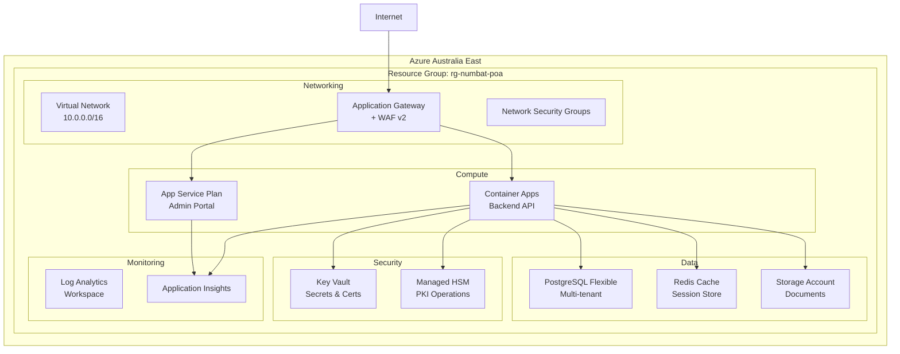

# Azure Infrastructure Setup Guide

**Version:** 1.0  
**POA Phase:** Week 1  
**Last Updated:** September 10, 2025

## Table of Contents
- [Overview](#overview)
- [Resource Architecture](#resource-architecture)
- [Azure Resources](#azure-resources)
- [Network Architecture](#network-architecture)
- [Security Configuration](#security-configuration)
- [Deployment Steps](#deployment-steps)
- [Monitoring Setup](#monitoring-setup)
- [Cost Estimates](#cost-estimates)

## Overview

This document outlines the Azure infrastructure setup for the NumbatWallet POA environment. The architecture supports multi-tenant operations, high availability, and security compliance requirements.

### Key Requirements
- **Region:** Australia East (primary), Australia Southeast (DR)
- **Availability:** 99.9% SLA during POA
- **Performance:** <500ms response time
- **Security:** Zero-trust network architecture
- **Compliance:** Australian data sovereignty

## Resource Architecture



## Azure Resources

### Resource Group Structure

```bash
# Primary resource group
rg-numbat-poa-aue           # Australia East (primary)
rg-numbat-poa-ase           # Australia Southeast (DR)
rg-numbat-poa-shared        # Shared resources (DNS, CDN)
```

### Compute Resources

#### Azure Container Apps
```json
{
  "name": "aca-numbat-api-poa",
  "location": "australiaeast",
  "properties": {
    "managedEnvironmentId": "/subscriptions/.../managedEnvironments/env-numbat-poa",
    "configuration": {
      "ingress": {
        "external": false,
        "targetPort": 8080,
        "transport": "http2"
      },
      "secrets": [
        {
          "name": "connection-string",
          "keyVaultUrl": "https://kv-numbat-poa.vault.azure.net/secrets/db-connection"
        }
      ],
      "dapr": {
        "enabled": true,
        "appId": "wallet-api",
        "appPort": 8080
      }
    },
    "template": {
      "containers": [
        {
          "image": "acrnumbatpoa.azurecr.io/wallet-api:latest",
          "name": "wallet-api",
          "resources": {
            "cpu": 1,
            "memory": "2Gi"
          }
        }
      ],
      "scale": {
        "minReplicas": 2,
        "maxReplicas": 10,
        "rules": [
          {
            "name": "http-rule",
            "http": {
              "metadata": {
                "concurrentRequests": "100"
              }
            }
          }
        ]
      }
    }
  }
}
```

#### App Service Plan
```json
{
  "name": "asp-numbat-poa",
  "location": "australiaeast",
  "sku": {
    "name": "P1v3",
    "tier": "PremiumV3",
    "capacity": 1
  },
  "properties": {
    "reserved": true,  // Linux
    "zoneRedundant": false
  }
}
```

### Data Tier

#### PostgreSQL Flexible Server
```json
{
  "name": "psql-numbat-poa",
  "location": "australiaeast",
  "sku": {
    "name": "Standard_D2ds_v4",
    "tier": "GeneralPurpose"
  },
  "properties": {
    "version": "15",
    "administratorLogin": "numbatadmin",
    "storage": {
      "storageSizeGB": 128,
      "autoGrow": "Enabled"
    },
    "backup": {
      "backupRetentionDays": 7,
      "geoRedundantBackup": "Disabled"
    },
    "network": {
      "delegatedSubnetResourceId": "/subscriptions/.../subnets/snet-data",
      "privateDnsZoneArmResourceId": "/subscriptions/.../privateDnsZones/privatelink.postgres.database.azure.com"
    },
    "highAvailability": {
      "mode": "ZoneRedundant",
      "standbyAvailabilityZone": "2"
    }
  }
}
```

#### Redis Cache
```json
{
  "name": "redis-numbat-poa",
  "location": "australiaeast",
  "properties": {
    "sku": {
      "name": "Standard",
      "family": "C",
      "capacity": 1
    },
    "enableNonSslPort": false,
    "minimumTlsVersion": "1.2",
    "publicNetworkAccess": "Disabled"
  }
}
```

### Security Resources

#### Key Vault
```json
{
  "name": "kv-numbat-poa",
  "location": "australiaeast",
  "properties": {
    "sku": {
      "family": "A",
      "name": "premium"
    },
    "tenantId": "[tenant-id]",
    "enabledForDeployment": true,
    "enabledForDiskEncryption": false,
    "enabledForTemplateDeployment": true,
    "enableSoftDelete": true,
    "softDeleteRetentionInDays": 90,
    "enableRbacAuthorization": true,
    "enablePurgeProtection": true,
    "networkAcls": {
      "bypass": "AzureServices",
      "defaultAction": "Deny",
      "virtualNetworkRules": [
        {
          "id": "/subscriptions/.../subnets/snet-app"
        }
      ]
    }
  }
}
```

#### Managed HSM (for PKI)
```json
{
  "name": "hsm-numbat-poa",
  "location": "australiaeast",
  "sku": {
    "family": "B",
    "name": "Standard_B1"
  },
  "properties": {
    "tenantId": "[tenant-id]",
    "initialAdminObjectIds": ["[admin-object-id]"],
    "enableSoftDelete": true,
    "softDeleteRetentionInDays": 90,
    "enablePurgeProtection": true,
    "networkAcls": {
      "bypass": "None",
      "defaultAction": "Deny",
      "virtualNetworkRules": [
        {
          "id": "/subscriptions/.../subnets/snet-app"
        }
      ]
    }
  }
}
```

## Network Architecture

### Virtual Network Design

```bash
# VNET Configuration
Address Space: 10.0.0.0/16

# Subnets
snet-gateway    10.0.1.0/24    # Application Gateway
snet-app        10.0.2.0/24    # Container Apps / App Services
snet-data       10.0.3.0/24    # Database tier
snet-mgmt       10.0.4.0/24    # Management/Jump boxes
snet-aci        10.0.5.0/24    # Container Apps infrastructure
```

### Network Security Groups

```json
{
  "name": "nsg-app-tier",
  "properties": {
    "securityRules": [
      {
        "name": "AllowGatewayInbound",
        "properties": {
          "priority": 100,
          "direction": "Inbound",
          "access": "Allow",
          "protocol": "Tcp",
          "sourceAddressPrefix": "10.0.1.0/24",
          "sourcePortRange": "*",
          "destinationAddressPrefix": "10.0.2.0/24",
          "destinationPortRanges": ["443", "8080"]
        }
      },
      {
        "name": "AllowAppToData",
        "properties": {
          "priority": 110,
          "direction": "Outbound",
          "access": "Allow",
          "protocol": "Tcp",
          "sourceAddressPrefix": "10.0.2.0/24",
          "sourcePortRange": "*",
          "destinationAddressPrefix": "10.0.3.0/24",
          "destinationPortRanges": ["5432", "6379"]
        }
      },
      {
        "name": "DenyAllInbound",
        "properties": {
          "priority": 4096,
          "direction": "Inbound",
          "access": "Deny",
          "protocol": "*",
          "sourceAddressPrefix": "*",
          "sourcePortRange": "*",
          "destinationAddressPrefix": "*",
          "destinationPortRange": "*"
        }
      }
    ]
  }
}
```

### Application Gateway Configuration

```json
{
  "name": "agw-numbat-poa",
  "properties": {
    "sku": {
      "name": "WAF_v2",
      "tier": "WAF_v2",
      "capacity": 2
    },
    "gatewayIPConfigurations": [{
      "name": "gatewayIP",
      "properties": {
        "subnet": {
          "id": "/subscriptions/.../subnets/snet-gateway"
        }
      }
    }],
    "sslCertificates": [{
      "name": "wallet-wa-gov-au",
      "properties": {
        "keyVaultSecretId": "https://kv-numbat-poa.vault.azure.net/secrets/ssl-cert"
      }
    }],
    "webApplicationFirewallConfiguration": {
      "enabled": true,
      "firewallMode": "Prevention",
      "ruleSetType": "OWASP",
      "ruleSetVersion": "3.2",
      "requestBodyCheck": true,
      "maxRequestBodySizeInKb": 128,
      "fileUploadLimitInMb": 100
    }
  }
}
```

## Security Configuration

### Identity & Access Management

```bash
# Managed Identities
- System-assigned for Container Apps
- User-assigned for cross-resource access

# RBAC Assignments
- Container Apps → Key Vault Secrets User
- Container Apps → Storage Blob Data Contributor
- App Service → Key Vault Secrets User
- DevOps Pipeline → Contributor (resource group)
```

### Private Endpoints

```json
{
  "name": "pe-postgresql",
  "properties": {
    "subnet": {
      "id": "/subscriptions/.../subnets/snet-data"
    },
    "privateLinkServiceConnections": [{
      "name": "psql-connection",
      "properties": {
        "privateLinkServiceId": "/subscriptions/.../servers/psql-numbat-poa",
        "groupIds": ["postgresqlServer"]
      }
    }]
  }
}
```

### Encryption Configuration

- **Data at Rest:** Azure Storage Service Encryption (256-bit AES)
- **Data in Transit:** TLS 1.2 minimum
- **Database:** Transparent Data Encryption (TDE)
- **Secrets:** Key Vault with HSM backing
- **Certificates:** Managed HSM for PKI operations

## Deployment Steps

### 1. Prerequisites

```bash
# Install Azure CLI
az --version  # Verify >= 2.50.0

# Login to Azure
az login
az account set --subscription "WA-GOV-SUBSCRIPTION"

# Set variables
export RESOURCE_GROUP="rg-numbat-poa-aue"
export LOCATION="australiaeast"
export PREFIX="numbat"
```

### 2. Create Base Resources

```bash
# Create resource group
az group create \
  --name $RESOURCE_GROUP \
  --location $LOCATION

# Create VNET
az network vnet create \
  --resource-group $RESOURCE_GROUP \
  --name vnet-$PREFIX-poa \
  --address-prefix 10.0.0.0/16 \
  --subnet-name snet-gateway \
  --subnet-prefix 10.0.1.0/24

# Add additional subnets
az network vnet subnet create \
  --resource-group $RESOURCE_GROUP \
  --vnet-name vnet-$PREFIX-poa \
  --name snet-app \
  --address-prefix 10.0.2.0/24 \
  --delegations Microsoft.App/environments
```

### 3. Deploy Infrastructure

```bash
# Deploy using ARM template
az deployment group create \
  --resource-group $RESOURCE_GROUP \
  --template-file infrastructure.json \
  --parameters @parameters.poa.json

# Or using Bicep
az deployment group create \
  --resource-group $RESOURCE_GROUP \
  --template-file main.bicep \
  --parameters environment=poa location=$LOCATION
```

### 4. Configure Container Apps

```bash
# Create Container Apps environment
az containerapp env create \
  --resource-group $RESOURCE_GROUP \
  --name env-$PREFIX-poa \
  --location $LOCATION \
  --infrastructure-subnet-resource-id "/subscriptions/.../subnets/snet-aci" \
  --internal-only false \
  --logs-workspace-id $LOG_ANALYTICS_WORKSPACE_ID \
  --logs-workspace-key $LOG_ANALYTICS_KEY

# Deploy API container
az containerapp create \
  --resource-group $RESOURCE_GROUP \
  --name aca-$PREFIX-api-poa \
  --environment env-$PREFIX-poa \
  --image acr${PREFIX}poa.azurecr.io/wallet-api:latest \
  --target-port 8080 \
  --ingress external \
  --min-replicas 2 \
  --max-replicas 10 \
  --cpu 1 --memory 2
```

## Monitoring Setup

### Application Insights Configuration

```bash
# Create Application Insights
az monitor app-insights component create \
  --app ai-$PREFIX-poa \
  --location $LOCATION \
  --resource-group $RESOURCE_GROUP \
  --application-type web \
  --workspace $LOG_ANALYTICS_WORKSPACE_ID

# Get instrumentation key
INSTRUMENTATION_KEY=$(az monitor app-insights component show \
  --app ai-$PREFIX-poa \
  --resource-group $RESOURCE_GROUP \
  --query instrumentationKey -o tsv)
```

### Log Analytics Queries

```kusto
// API Performance
requests
| where timestamp > ago(1h)
| summarize 
    requests = count(),
    avg_duration = avg(duration),
    p95_duration = percentile(duration, 95),
    p99_duration = percentile(duration, 99)
    by bin(timestamp, 5m)
| render timechart

// Error Rate
requests
| where timestamp > ago(1h)
| summarize 
    total = count(),
    failed = countif(success == false)
    by bin(timestamp, 5m)
| extend error_rate = (failed * 100.0) / total
| render timechart

// Container Health
ContainerInstanceLog_CL
| where TimeGenerated > ago(1h)
| where ContainerGroup_s == "aca-numbat-api-poa"
| summarize count() by Level_s, bin(TimeGenerated, 5m)
```

### Alerts Configuration

```json
[
  {
    "name": "High Response Time",
    "condition": "avg(duration) > 500",
    "frequency": "PT5M",
    "severity": 2,
    "action": "Email DevOps Team"
  },
  {
    "name": "High Error Rate",
    "condition": "error_rate > 1",
    "frequency": "PT5M",
    "severity": 1,
    "action": "Email + SMS DevOps Team"
  },
  {
    "name": "Container Restart",
    "condition": "restartCount > 3",
    "frequency": "PT5M",
    "severity": 2,
    "action": "Email DevOps Team"
  }
]
```

## Cost Estimates

### POA Environment (Monthly)

| Resource | SKU | Quantity | Cost (AUD) |
|----------|-----|----------|------------|
| Container Apps | 1 vCPU, 2GB RAM | 2 replicas | $180 |
| App Service | P1v3 | 1 instance | $185 |
| PostgreSQL | D2ds_v4, 128GB | 1 instance | $320 |
| Redis Cache | C1 Standard | 1 instance | $95 |
| Key Vault | Premium | 1 instance | $5 |
| Application Gateway | WAF_v2 | 2 instances | $580 |
| Storage Account | Standard LRS | 100GB | $5 |
| Log Analytics | Pay-as-you-go | 50GB/month | $180 |
| Application Insights | Basic | - | $0 |
| Network Bandwidth | - | 100GB | $12 |
| **Total** | | | **~$1,562/month** |

### Production Scaling Estimates

| Scale | Monthly Cost | Annual Cost |
|-------|-------------|-------------|
| Small (100K users) | $12,200 | $146,400 |
| Medium (500K users) | $20,200 | $242,400 |
| Large (2M users) | $57,400 | $688,800 |

## Validation Checklist

### Pre-Deployment
- [ ] Azure subscription access confirmed
- [ ] Resource naming conventions approved
- [ ] Network design reviewed by security
- [ ] Cost estimates approved
- [ ] Backup strategy defined

### Post-Deployment
- [ ] All resources successfully created
- [ ] Network connectivity verified
- [ ] Security groups properly configured
- [ ] Private endpoints working
- [ ] Monitoring dashboards active
- [ ] Alerts configured and tested
- [ ] Backup verified
- [ ] Load testing completed
- [ ] Documentation updated

## Troubleshooting

### Common Issues

1. **Container Apps not starting**
   - Check image registry credentials
   - Verify environment variables
   - Review container logs in Log Analytics

2. **Database connection failures**
   - Verify private endpoint DNS resolution
   - Check NSG rules
   - Confirm connection string in Key Vault

3. **High latency**
   - Review Application Insights metrics
   - Check container scaling rules
   - Verify Redis cache hit rate

4. **WAF blocking legitimate traffic**
   - Review WAF logs
   - Adjust custom rules
   - Consider exclusions for specific paths

## Next Steps

1. Complete infrastructure deployment (Week 1, Day 1-2)
2. Deploy backend containers (Week 1, Day 3)
3. Configure monitoring dashboards (Week 1, Day 4)
4. Perform security validation (Week 1, Day 5)
5. Document any deviations from plan
6. Prepare for Week 2 integration tasks