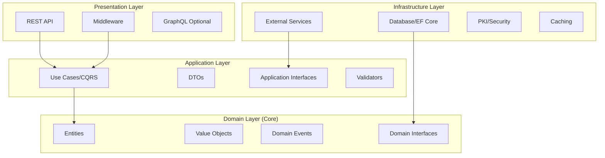

# Backend Architecture - Clean Architecture Implementation

**Version:** 1.0  
**POA Phase:** Week 1-2  
**Last Updated:** September 10, 2025

## Table of Contents
- [Overview](#overview)
- [Architecture Principles](#architecture-principles)
- [Project Structure](#project-structure)
- [Layer Responsibilities](#layer-responsibilities)
- [Domain Layer](#domain-layer)
- [Application Layer](#application-layer)
- [Infrastructure Layer](#infrastructure-layer)
- [API Layer](#api-layer)
- [Cross-Cutting Concerns](#cross-cutting-concerns)
- [Implementation Guidelines](#implementation-guidelines)

## Overview

The NumbatWallet backend implements Clean Architecture (Onion Architecture) principles to ensure maintainability, testability, and clear separation of concerns. This architecture enables the solution to be independent of frameworks, UI, databases, and external services.

### Key Benefits
- **Testable:** Business logic can be tested without UI, database, or external services
- **Independent:** Business rules don't depend on infrastructure
- **Maintainable:** Clear boundaries and single responsibility
- **Scalable:** Easy to add new features without affecting existing code
- **Multi-tenant Ready:** Tenant isolation built into every layer

## Architecture Principles

### The Dependency Rule
Dependencies only point inward. Inner layers know nothing about outer layers.



## Project Structure

```
NumbatWallet.Backend/
├── src/
│   ├── NumbatWallet.Domain/              # Core business logic
│   │   ├── Entities/
│   │   │   ├── DigitalCredential.cs
│   │   │   ├── WalletHolder.cs
│   │   │   └── CredentialSchema.cs
│   │   ├── ValueObjects/
│   │   │   ├── CredentialId.cs
│   │   │   ├── TenantId.cs
│   │   │   └── SelectiveDisclosure.cs
│   │   ├── Events/
│   │   │   ├── CredentialIssuedEvent.cs
│   │   │   └── CredentialRevokedEvent.cs
│   │   ├── Exceptions/
│   │   │   └── DomainException.cs
│   │   └── Interfaces/
│   │       ├── ICredentialRepository.cs
│   │       └── IEventBus.cs
│   │
│   ├── NumbatWallet.Application/         # Use cases and orchestration
│   │   ├── Commands/
│   │   │   ├── IssueCredential/
│   │   │   │   ├── IssueCredentialCommand.cs
│   │   │   │   ├── IssueCredentialCommandHandler.cs
│   │   │   │   └── IssueCredentialCommandValidator.cs
│   │   │   └── RevokeCredential/
│   │   ├── Queries/
│   │   │   ├── GetCredentialById/
│   │   │   └── GetWalletCredentials/
│   │   ├── DTOs/
│   │   │   ├── CredentialDto.cs
│   │   │   └── WalletDto.cs
│   │   ├── Interfaces/
│   │   │   ├── IPKIService.cs
│   │   │   └── IIdentityService.cs
│   │   ├── Behaviors/
│   │   │   ├── ValidationBehavior.cs
│   │   │   ├── LoggingBehavior.cs
│   │   │   └── TenantBehavior.cs
│   │   └── DependencyInjection.cs
│   │
│   ├── NumbatWallet.Infrastructure/      # External concerns
│   │   ├── Persistence/
│   │   │   ├── WalletDbContext.cs
│   │   │   ├── Configurations/
│   │   │   ├── Repositories/
│   │   │   └── Migrations/
│   │   ├── Identity/
│   │   │   ├── IdentityService.cs
│   │   │   └── TokenService.cs
│   │   ├── PKI/
│   │   │   ├── PKIService.cs
│   │   │   └── CertificateValidator.cs
│   │   ├── Services/
│   │   │   ├── DateTimeService.cs
│   │   │   └── EventBus.cs
│   │   └── DependencyInjection.cs
│   │
│   └── NumbatWallet.API/                 # REST API presentation
│       ├── Controllers/
│       │   ├── CredentialsController.cs
│       │   └── WalletsController.cs
│       ├── Middleware/
│       │   ├── TenantMiddleware.cs
│       │   ├── ExceptionMiddleware.cs
│       │   └── RequestLoggingMiddleware.cs
│       ├── Models/
│       │   ├── Requests/
│       │   └── Responses/
│       ├── Filters/
│       │   └── ValidationFilter.cs
│       ├── Program.cs
│       └── appsettings.json
│
└── tests/
    ├── NumbatWallet.Domain.Tests/
    ├── NumbatWallet.Application.Tests/
    ├── NumbatWallet.Infrastructure.Tests/
    ├── NumbatWallet.API.Tests/
    └── NumbatWallet.IntegrationTests/
```

## Layer Responsibilities

### Domain Layer (Inner Core)
**Purpose:** Contains enterprise business logic and rules

**Contains:**
- Entities (business objects with identity)
- Value Objects (immutable objects without identity)
- Domain Events
- Domain Exceptions
- Repository Interfaces
- Domain Services (when logic doesn't fit in entities)

**Rules:**
- No dependencies on other layers
- No infrastructure concerns
- Pure C# classes (POCOs)
- Rich domain models (not anemic)

### Application Layer
**Purpose:** Orchestrates domain objects to perform use cases

**Contains:**
- Command/Query handlers (CQRS)
- DTOs for data transfer
- Application interfaces
- Validation logic
- Mapping profiles

**Rules:**
- Depends only on Domain layer
- No infrastructure dependencies
- Defines interfaces that Infrastructure implements
- Contains application business rules

### Infrastructure Layer
**Purpose:** Implements technical capabilities

**Contains:**
- Data access (EF Core)
- External service integrations
- Security implementations
- File storage
- Message queues
- Email/SMS services

**Rules:**
- Implements interfaces defined in Application/Domain
- Contains all infrastructure-specific code
- No business logic

### API Layer (Presentation)
**Purpose:** Handles HTTP concerns and user interaction

**Contains:**
- Controllers
- Middleware
- Request/Response models
- Authentication/Authorization
- API documentation

**Rules:**
- Thin controllers (no business logic)
- Calls Application layer
- Handles HTTP-specific concerns only

## Domain Layer

### Entity Example

```csharp
namespace NumbatWallet.Domain.Entities;

public class DigitalCredential : AggregateRoot
{
    private readonly List<CredentialAttribute> _attributes = new();
    private readonly List<PresentationRecord> _presentations = new();
    
    // Properties
    public CredentialId Id { get; private set; }
    public TenantId TenantId { get; private set; }
    public WalletId WalletId { get; private set; }
    public CredentialType Type { get; private set; }
    public CredentialStatus Status { get; private set; }
    public CredentialSchema Schema { get; private set; }
    public DateTime IssuedAt { get; private set; }
    public DateTime? ExpiresAt { get; private set; }
    public DateTime? RevokedAt { get; private set; }
    public IReadOnlyList<CredentialAttribute> Attributes => _attributes.AsReadOnly();
    
    // Constructor - private to enforce factory method
    private DigitalCredential() { } // For EF Core
    
    // Factory method for creation
    public static DigitalCredential Issue(
        TenantId tenantId,
        WalletId walletId,
        CredentialType type,
        CredentialSchema schema,
        Dictionary<string, object> claims,
        DateTime? expiresAt = null)
    {
        var credential = new DigitalCredential
        {
            Id = CredentialId.New(),
            TenantId = tenantId ?? throw new ArgumentNullException(nameof(tenantId)),
            WalletId = walletId ?? throw new ArgumentNullException(nameof(walletId)),
            Type = type,
            Schema = schema ?? throw new ArgumentNullException(nameof(schema)),
            Status = CredentialStatus.Active,
            IssuedAt = DateTime.UtcNow,
            ExpiresAt = expiresAt
        };
        
        // Validate and add claims
        foreach (var claim in claims)
        {
            credential.AddAttribute(claim.Key, claim.Value);
        }
        
        // Raise domain event
        credential.AddDomainEvent(new CredentialIssuedEvent(
            credential.Id,
            credential.TenantId,
            credential.WalletId,
            credential.Type,
            credential.IssuedAt));
        
        return credential;
    }
    
    // Business methods
    public void Revoke(RevocationReason reason, string revokedBy)
    {
        if (Status == CredentialStatus.Revoked)
            throw new DomainException("Credential is already revoked");
        
        Status = CredentialStatus.Revoked;
        RevokedAt = DateTime.UtcNow;
        
        AddDomainEvent(new CredentialRevokedEvent(
            Id, TenantId, reason, revokedBy, RevokedAt.Value));
    }
    
    public void Suspend(string reason)
    {
        if (Status == CredentialStatus.Revoked)
            throw new DomainException("Cannot suspend a revoked credential");
        
        Status = CredentialStatus.Suspended;
        
        AddDomainEvent(new CredentialSuspendedEvent(Id, TenantId, reason));
    }
    
    public PresentationToken Present(SelectiveDisclosureRequest request)
    {
        EnsureNotRevoked();
        EnsureNotExpired();
        
        var disclosedAttributes = _attributes
            .Where(attr => request.RequestedAttributes.Contains(attr.Name))
            .ToList();
        
        var presentation = new PresentationRecord(
            request.VerifierId,
            disclosedAttributes,
            DateTime.UtcNow);
        
        _presentations.Add(presentation);
        
        AddDomainEvent(new CredentialPresentedEvent(
            Id, TenantId, request.VerifierId, DateTime.UtcNow));
        
        return PresentationToken.Create(this, disclosedAttributes);
    }
    
    // Private methods
    private void EnsureNotRevoked()
    {
        if (Status == CredentialStatus.Revoked)
            throw new DomainException("Cannot use a revoked credential");
    }
    
    private void EnsureNotExpired()
    {
        if (ExpiresAt.HasValue && ExpiresAt.Value < DateTime.UtcNow)
            throw new DomainException("Credential has expired");
    }
    
    private void AddAttribute(string name, object value)
    {
        if (string.IsNullOrWhiteSpace(name))
            throw new ArgumentException("Attribute name cannot be empty");
        
        if (!Schema.IsAttributeValid(name, value))
            throw new DomainException($"Attribute '{name}' is not valid for schema");
        
        _attributes.Add(new CredentialAttribute(name, value));
    }
}
```

### Value Object Example

```csharp
namespace NumbatWallet.Domain.ValueObjects;

public class CredentialId : ValueObject
{
    public string Value { get; }
    
    private CredentialId(string value)
    {
        if (string.IsNullOrWhiteSpace(value))
            throw new ArgumentException("CredentialId cannot be empty");
        
        if (!value.StartsWith("cred_"))
            throw new ArgumentException("CredentialId must start with 'cred_'");
        
        Value = value;
    }
    
    public static CredentialId New()
    {
        return new CredentialId($"cred_{GenerateUniqueId()}");
    }
    
    public static CredentialId From(string value)
    {
        return new CredentialId(value);
    }
    
    protected override IEnumerable<object> GetEqualityComponents()
    {
        yield return Value;
    }
    
    public override string ToString() => Value;
    
    private static string GenerateUniqueId()
    {
        var bytes = new byte[16];
        using var rng = RandomNumberGenerator.Create();
        rng.GetBytes(bytes);
        return Convert.ToBase64String(bytes)
            .Replace("+", "")
            .Replace("/", "")
            .Replace("=", "")
            .Substring(0, 16);
    }
}
```

## Application Layer

### Command Handler Example

```csharp
namespace NumbatWallet.Application.Commands.IssueCredential;

public record IssueCredentialCommand : IRequest<CredentialDto>
{
    public required string WalletId { get; init; }
    public required string CredentialType { get; init; }
    public required Dictionary<string, object> Claims { get; init; }
    public DateTime? ExpiresAt { get; init; }
}

public class IssueCredentialCommandValidator : AbstractValidator<IssueCredentialCommand>
{
    public IssueCredentialCommandValidator()
    {
        RuleFor(x => x.WalletId)
            .NotEmpty()
            .Must(id => id.StartsWith("wallet_"))
            .WithMessage("Invalid wallet ID format");
        
        RuleFor(x => x.CredentialType)
            .NotEmpty()
            .Must(BeValidCredentialType)
            .WithMessage("Invalid credential type");
        
        RuleFor(x => x.Claims)
            .NotEmpty()
            .WithMessage("Claims cannot be empty");
        
        RuleFor(x => x.ExpiresAt)
            .GreaterThan(DateTime.UtcNow)
            .When(x => x.ExpiresAt.HasValue)
            .WithMessage("Expiry date must be in the future");
    }
    
    private bool BeValidCredentialType(string type)
    {
        return Enum.TryParse<CredentialType>(type, out _);
    }
}

public class IssueCredentialCommandHandler : IRequestHandler<IssueCredentialCommand, CredentialDto>
{
    private readonly ICredentialRepository _credentialRepository;
    private readonly IWalletRepository _walletRepository;
    private readonly IPKIService _pkiService;
    private readonly ISchemaRegistry _schemaRegistry;
    private readonly ITenantContext _tenantContext;
    private readonly IMapper _mapper;
    private readonly ILogger<IssueCredentialCommandHandler> _logger;
    
    public IssueCredentialCommandHandler(
        ICredentialRepository credentialRepository,
        IWalletRepository walletRepository,
        IPKIService pkiService,
        ISchemaRegistry schemaRegistry,
        ITenantContext tenantContext,
        IMapper mapper,
        ILogger<IssueCredentialCommandHandler> logger)
    {
        _credentialRepository = credentialRepository;
        _walletRepository = walletRepository;
        _pkiService = pkiService;
        _schemaRegistry = schemaRegistry;
        _tenantContext = tenantContext;
        _mapper = mapper;
        _logger = logger;
    }
    
    public async Task<CredentialDto> Handle(
        IssueCredentialCommand request,
        CancellationToken cancellationToken)
    {
        // Get current tenant
        var tenantId = _tenantContext.TenantId;
        
        // Verify wallet exists and belongs to tenant
        var wallet = await _walletRepository.GetByIdAsync(
            WalletId.From(request.WalletId),
            cancellationToken);
        
        if (wallet == null || wallet.TenantId != tenantId)
            throw new NotFoundException("Wallet not found");
        
        // Get credential schema
        var credentialType = Enum.Parse<CredentialType>(request.CredentialType);
        var schema = await _schemaRegistry.GetSchemaAsync(
            credentialType,
            cancellationToken);
        
        // Create credential
        var credential = DigitalCredential.Issue(
            tenantId,
            wallet.Id,
            credentialType,
            schema,
            request.Claims,
            request.ExpiresAt);
        
        // Sign credential with PKI
        var signature = await _pkiService.SignCredentialAsync(
            credential,
            cancellationToken);
        
        credential.ApplySignature(signature);
        
        // Save to repository
        await _credentialRepository.AddAsync(credential, cancellationToken);
        await _credentialRepository.SaveChangesAsync(cancellationToken);
        
        _logger.LogInformation(
            "Credential {CredentialId} issued for wallet {WalletId} in tenant {TenantId}",
            credential.Id,
            wallet.Id,
            tenantId);
        
        // Map to DTO
        return _mapper.Map<CredentialDto>(credential);
    }
}
```

### Query Handler Example

```csharp
namespace NumbatWallet.Application.Queries.GetWalletCredentials;

public record GetWalletCredentialsQuery : IRequest<PagedResult<CredentialDto>>
{
    public required string WalletId { get; init; }
    public CredentialStatus? Status { get; init; }
    public int Page { get; init; } = 1;
    public int PageSize { get; init; } = 20;
}

public class GetWalletCredentialsQueryHandler 
    : IRequestHandler<GetWalletCredentialsQuery, PagedResult<CredentialDto>>
{
    private readonly IReadOnlyCredentialRepository _repository;
    private readonly ITenantContext _tenantContext;
    private readonly IMapper _mapper;
    
    public GetWalletCredentialsQueryHandler(
        IReadOnlyCredentialRepository repository,
        ITenantContext tenantContext,
        IMapper mapper)
    {
        _repository = repository;
        _tenantContext = tenantContext;
        _mapper = mapper;
    }
    
    public async Task<PagedResult<CredentialDto>> Handle(
        GetWalletCredentialsQuery request,
        CancellationToken cancellationToken)
    {
        var specification = new WalletCredentialsSpecification(
            _tenantContext.TenantId,
            WalletId.From(request.WalletId),
            request.Status);
        
        var credentials = await _repository.GetPagedAsync(
            specification,
            request.Page,
            request.PageSize,
            cancellationToken);
        
        return new PagedResult<CredentialDto>
        {
            Items = _mapper.Map<List<CredentialDto>>(credentials.Items),
            TotalCount = credentials.TotalCount,
            Page = credentials.Page,
            PageSize = credentials.PageSize
        };
    }
}
```

## Infrastructure Layer

### Repository Implementation

```csharp
namespace NumbatWallet.Infrastructure.Persistence.Repositories;

public class CredentialRepository : ICredentialRepository
{
    private readonly WalletDbContext _context;
    private readonly ITenantContext _tenantContext;
    
    public CredentialRepository(
        WalletDbContext context,
        ITenantContext tenantContext)
    {
        _context = context;
        _tenantContext = tenantContext;
    }
    
    public async Task<DigitalCredential?> GetByIdAsync(
        CredentialId id,
        CancellationToken cancellationToken = default)
    {
        return await _context.Credentials
            .Include(c => c.Attributes)
            .Include(c => c.Presentations)
            .FirstOrDefaultAsync(
                c => c.Id == id && c.TenantId == _tenantContext.TenantId,
                cancellationToken);
    }
    
    public async Task AddAsync(
        DigitalCredential credential,
        CancellationToken cancellationToken = default)
    {
        // Ensure tenant isolation
        if (credential.TenantId != _tenantContext.TenantId)
            throw new SecurityException("Tenant mismatch");
        
        await _context.Credentials.AddAsync(credential, cancellationToken);
    }
    
    public async Task SaveChangesAsync(CancellationToken cancellationToken = default)
    {
        // Dispatch domain events before saving
        var domainEvents = _context.ChangeTracker
            .Entries<AggregateRoot>()
            .SelectMany(x => x.Entity.GetDomainEvents())
            .ToList();
        
        await _context.SaveChangesAsync(cancellationToken);
        
        // Publish events after successful save
        foreach (var domainEvent in domainEvents)
        {
            await _mediator.Publish(domainEvent, cancellationToken);
        }
    }
}
```

### DbContext Configuration

```csharp
namespace NumbatWallet.Infrastructure.Persistence;

public class WalletDbContext : DbContext
{
    private readonly ITenantContext _tenantContext;
    private readonly IDateTimeService _dateTimeService;
    
    public WalletDbContext(
        DbContextOptions<WalletDbContext> options,
        ITenantContext tenantContext,
        IDateTimeService dateTimeService)
        : base(options)
    {
        _tenantContext = tenantContext;
        _dateTimeService = dateTimeService;
    }
    
    public DbSet<DigitalCredential> Credentials { get; set; }
    public DbSet<WalletHolder> Wallets { get; set; }
    public DbSet<CredentialSchema> Schemas { get; set; }
    
    protected override void OnModelCreating(ModelBuilder modelBuilder)
    {
        // Apply configurations
        modelBuilder.ApplyConfigurationsFromAssembly(
            typeof(WalletDbContext).Assembly);
        
        // Global query filter for multi-tenancy
        modelBuilder.Entity<DigitalCredential>()
            .HasQueryFilter(c => c.TenantId == _tenantContext.TenantId);
        
        modelBuilder.Entity<WalletHolder>()
            .HasQueryFilter(w => w.TenantId == _tenantContext.TenantId);
    }
    
    public override Task<int> SaveChangesAsync(
        CancellationToken cancellationToken = default)
    {
        // Audit fields
        foreach (var entry in ChangeTracker.Entries<AuditableEntity>())
        {
            switch (entry.State)
            {
                case EntityState.Added:
                    entry.Entity.CreatedAt = _dateTimeService.UtcNow;
                    entry.Entity.CreatedBy = _tenantContext.UserId;
                    break;
                case EntityState.Modified:
                    entry.Entity.UpdatedAt = _dateTimeService.UtcNow;
                    entry.Entity.UpdatedBy = _tenantContext.UserId;
                    break;
            }
        }
        
        return base.SaveChangesAsync(cancellationToken);
    }
}
```

## API Layer

### Controller Example

```csharp
namespace NumbatWallet.API.Controllers;

[ApiController]
[ApiVersion("1.0")]
[Route("api/v{version:apiVersion}/[controller]")]
[Authorize]
public class CredentialsController : ControllerBase
{
    private readonly IMediator _mediator;
    private readonly ILogger<CredentialsController> _logger;
    
    public CredentialsController(
        IMediator mediator,
        ILogger<CredentialsController> logger)
    {
        _mediator = mediator;
        _logger = logger;
    }
    
    /// <summary>
    /// Issues a new digital credential
    /// </summary>
    [HttpPost]
    [ProducesResponseType(typeof(CredentialResponse), StatusCodes.Status201Created)]
    [ProducesResponseType(typeof(ProblemDetails), StatusCodes.Status400BadRequest)]
    [ProducesResponseType(StatusCodes.Status401Unauthorized)]
    public async Task<IActionResult> IssueCredential(
        [FromBody] IssueCredentialRequest request,
        CancellationToken cancellationToken)
    {
        var command = new IssueCredentialCommand
        {
            WalletId = request.WalletId,
            CredentialType = request.Type,
            Claims = request.Claims,
            ExpiresAt = request.ExpiresAt
        };
        
        var result = await _mediator.Send(command, cancellationToken);
        
        return CreatedAtAction(
            nameof(GetCredential),
            new { id = result.Id },
            new CredentialResponse(result));
    }
    
    /// <summary>
    /// Retrieves a specific credential
    /// </summary>
    [HttpGet("{id}")]
    [ProducesResponseType(typeof(CredentialResponse), StatusCodes.Status200OK)]
    [ProducesResponseType(StatusCodes.Status404NotFound)]
    public async Task<IActionResult> GetCredential(
        string id,
        CancellationToken cancellationToken)
    {
        var query = new GetCredentialByIdQuery { CredentialId = id };
        var result = await _mediator.Send(query, cancellationToken);
        
        if (result == null)
            return NotFound();
        
        return Ok(new CredentialResponse(result));
    }
    
    /// <summary>
    /// Revokes a credential
    /// </summary>
    [HttpPost("{id}/revoke")]
    [ProducesResponseType(StatusCodes.Status204NoContent)]
    [ProducesResponseType(StatusCodes.Status404NotFound)]
    [Authorize(Policy = "CanRevokeCredentials")]
    public async Task<IActionResult> RevokeCredential(
        string id,
        [FromBody] RevokeCredentialRequest request,
        CancellationToken cancellationToken)
    {
        var command = new RevokeCredentialCommand
        {
            CredentialId = id,
            Reason = request.Reason,
            Comments = request.Comments
        };
        
        await _mediator.Send(command, cancellationToken);
        
        return NoContent();
    }
}
```

## Cross-Cutting Concerns

### Tenant Isolation Middleware

```csharp
public class TenantMiddleware
{
    private readonly RequestDelegate _next;
    
    public async Task InvokeAsync(
        HttpContext context,
        ITenantResolver resolver,
        ITenantContext tenantContext)
    {
        // Resolve tenant from request
        var tenant = await resolver.ResolveAsync(context);
        
        if (tenant == null)
        {
            context.Response.StatusCode = 404;
            await context.Response.WriteAsync("Tenant not found");
            return;
        }
        
        // Set tenant context for request
        tenantContext.SetTenant(tenant);
        
        // Add to HTTP context for logging
        context.Items["TenantId"] = tenant.Id;
        context.Items["TenantName"] = tenant.Name;
        
        await _next(context);
    }
}
```

### Validation Behavior

```csharp
public class ValidationBehavior<TRequest, TResponse> 
    : IPipelineBehavior<TRequest, TResponse>
    where TRequest : IRequest<TResponse>
{
    private readonly IEnumerable<IValidator<TRequest>> _validators;
    
    public ValidationBehavior(IEnumerable<IValidator<TRequest>> validators)
    {
        _validators = validators;
    }
    
    public async Task<TResponse> Handle(
        TRequest request,
        RequestHandlerDelegate<TResponse> next,
        CancellationToken cancellationToken)
    {
        if (!_validators.Any())
            return await next();
        
        var context = new ValidationContext<TRequest>(request);
        
        var validationResults = await Task.WhenAll(
            _validators.Select(v => v.ValidateAsync(context, cancellationToken)));
        
        var failures = validationResults
            .SelectMany(r => r.Errors)
            .Where(f => f != null)
            .ToList();
        
        if (failures.Any())
            throw new ValidationException(failures);
        
        return await next();
    }
}
```

## Implementation Guidelines

### Dependency Injection Setup

```csharp
// Program.cs
var builder = WebApplication.CreateBuilder(args);

// Add layers
builder.Services.AddApplication();
builder.Services.AddInfrastructure(builder.Configuration);
builder.Services.AddPresentation();

// Application Layer DI
public static class DependencyInjection
{
    public static IServiceCollection AddApplication(this IServiceCollection services)
    {
        services.AddMediatR(cfg =>
        {
            cfg.RegisterServicesFromAssembly(typeof(DependencyInjection).Assembly);
            cfg.AddBehavior(typeof(IPipelineBehavior<,>), typeof(ValidationBehavior<,>));
            cfg.AddBehavior(typeof(IPipelineBehavior<,>), typeof(LoggingBehavior<,>));
            cfg.AddBehavior(typeof(IPipelineBehavior<,>), typeof(TenantBehavior<,>));
        });
        
        services.AddValidatorsFromAssembly(typeof(DependencyInjection).Assembly);
        services.AddAutoMapper(typeof(DependencyInjection).Assembly);
        
        return services;
    }
}

// Infrastructure Layer DI
public static class DependencyInjection
{
    public static IServiceCollection AddInfrastructure(
        this IServiceCollection services,
        IConfiguration configuration)
    {
        // Database
        services.AddDbContext<WalletDbContext>(options =>
            options.UseNpgsql(configuration.GetConnectionString("Default")));
        
        // Repositories
        services.AddScoped<ICredentialRepository, CredentialRepository>();
        services.AddScoped<IWalletRepository, WalletRepository>();
        
        // Services
        services.AddScoped<IPKIService, PKIService>();
        services.AddScoped<IIdentityService, IdentityService>();
        services.AddSingleton<IDateTimeService, DateTimeService>();
        
        // Caching
        services.AddStackExchangeRedisCache(options =>
        {
            options.Configuration = configuration.GetConnectionString("Redis");
        });
        
        return services;
    }
}
```

### Testing Strategy

```csharp
// Domain Unit Test
[Fact]
public void Issue_ValidData_CreatesActiveCredential()
{
    // Arrange
    var tenantId = TenantId.New();
    var walletId = WalletId.New();
    var schema = TestDataFactory.CreateDriverLicenseSchema();
    var claims = TestDataFactory.CreateValidClaims();
    
    // Act
    var credential = DigitalCredential.Issue(
        tenantId, walletId, CredentialType.DriverLicense,
        schema, claims);
    
    // Assert
    credential.Should().NotBeNull();
    credential.Status.Should().Be(CredentialStatus.Active);
    credential.TenantId.Should().Be(tenantId);
}

// Application Integration Test
[Fact]
public async Task Handle_ValidCommand_IssuesCredential()
{
    // Arrange
    var command = new IssueCredentialCommand { /* ... */ };
    
    // Act
    var result = await _handler.Handle(command, CancellationToken.None);
    
    // Assert
    result.Should().NotBeNull();
    _repository.Verify(x => x.AddAsync(It.IsAny<DigitalCredential>(), It.IsAny<CancellationToken>()), Times.Once);
}
```

## Next Steps

1. Set up project structure (Week 1, Day 2)
2. Implement Domain layer entities (Week 1, Day 2-3)
3. Create Application layer handlers (Week 1, Day 3-4)
4. Implement Infrastructure layer (Week 1, Day 4)
5. Set up API controllers (Week 1, Day 5)
6. Configure dependency injection (Week 2, Day 1)
7. Add authentication/authorization (Week 2, Day 1-2)
8. Implement CQRS patterns (Week 2, Day 2-3)