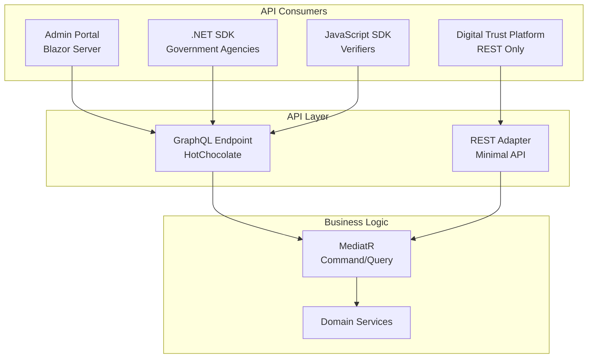

# GraphQL API Implementation
## Digital Wallet POA Phase

**Version:** 1.0  
**Last Updated:** 2025-01-09  
**.NET Version:** 9.0 with C# 13

---

## Table of Contents
1. [Overview](#overview)
2. [HotChocolate Setup](#hotchocolate-setup)
3. [Schema Design](#schema-design)
4. [Query Operations](#query-operations)
5. [Mutation Operations](#mutation-operations)
6. [Subscription Operations](#subscription-operations)
7. [Authentication & Authorization](#authentication--authorization)
8. [REST Adapter for DTP](#rest-adapter-for-dtp)
9. [Error Handling](#error-handling)
10. [Performance Optimization](#performance-optimization)

---

## Overview

The GraphQL API serves as the primary interface for all SDK clients and the admin portal, providing flexible query capabilities while maintaining backward compatibility through a REST adapter for the Digital Trust Platform (DTP).

### Architecture Decisions



---

## HotChocolate Setup

### Package Installation

```xml
<!-- API Project -->
<PackageReference Include="HotChocolate.AspNetCore" Version="13.9.0" />
<PackageReference Include="HotChocolate.AspNetCore.Authorization" Version="13.9.0" />
<PackageReference Include="HotChocolate.Data.EntityFramework" Version="13.9.0" />
<PackageReference Include="HotChocolate.Diagnostics" Version="13.9.0" />
```

### Program.cs Configuration

```csharp
using HotChocolate.AspNetCore;
using NumbatWallet.Api.GraphQL;

var builder = WebApplication.CreateBuilder(args);

// Add GraphQL services
builder.Services
    .AddGraphQLServer()
    .AddAuthorization()
    .AddQueryType<Query>()
    .AddMutationType<Mutation>()
    .AddSubscriptionType<Subscription>()
    .AddTypeExtension<WalletQueries>()
    .AddTypeExtension<CredentialQueries>()
    .AddTypeExtension<WalletMutations>()
    .AddTypeExtension<CredentialMutations>()
    .AddFiltering()
    .AddSorting()
    .AddProjections()
    .AddGlobalObjectIdentification()
    .AddMutationConventions()
    .AddInMemorySubscriptions()
    .AddDiagnosticEventListener<GraphQLTelemetryListener>()
    .ModifyRequestOptions(opt =>
    {
        opt.IncludeExceptionDetails = builder.Environment.IsDevelopment();
        opt.ExecutionTimeout = TimeSpan.FromSeconds(30);
    })
    .AddMaxExecutionDepthRule(15)
    .AddIntrospectionAllowedRule()
    .UsePersistedQueryPipeline()
    .UseAutomaticPersistedQueryPipeline();

var app = builder.Build();

app.UseAuthentication();
app.UseAuthorization();

app.MapGraphQL()
    .RequireAuthorization(); // Require auth for all GraphQL operations

app.MapBananaCakePop("/graphql-ui")
    .RequireAuthorization("AdminOnly")
    .WithOptions(new GraphQLToolOptions
    {
        Enable = app.Environment.IsDevelopment()
    });
```

---

## Schema Design

### Type Definitions

```csharp
namespace NumbatWallet.Api.GraphQL.Types;

public class WalletType : ObjectType<Wallet>
{
    protected override void Configure(IObjectTypeDescriptor<Wallet> descriptor)
    {
        descriptor
            .Name("Wallet")
            .Description("Digital wallet containing credentials");

        descriptor
            .Field(w => w.Id)
            .Type<NonNullType<IdType>>();

        descriptor
            .Field(w => w.Did)
            .Description("Decentralized Identifier");

        descriptor
            .Field(w => w.Credentials)
            .ResolveWith<WalletResolvers>(r => r.GetCredentials(default!, default!, default!))
            .UseFiltering<CredentialFilterType>()
            .UseSorting<CredentialSortType>()
            .UseProjection();

        descriptor
            .Field(w => w.Status)
            .Type<NonNullType<WalletStatusType>>();

        descriptor
            .Field("statistics")
            .ResolveWith<WalletResolvers>(r => r.GetStatistics(default!, default!))
            .Type<WalletStatisticsType>();
    }
}

public class CredentialType : ObjectType<Credential>
{
    protected override void Configure(IObjectTypeDescriptor<Credential> descriptor)
    {
        descriptor
            .Name("Credential")
            .Description("Verifiable credential");

        descriptor
            .ImplementsNode()
            .IdField(c => c.Id)
            .ResolveNode(async (ctx, id) =>
                await ctx.Service<ICredentialRepository>()
                    .GetByIdAsync(id, ctx.RequestAborted));

        descriptor
            .Field(c => c.Type)
            .Description("Credential type (e.g., DriverLicense, ProofOfAge)");

        descriptor
            .Field(c => c.Claims)
            .Description("Credential claims with selective disclosure")
            .Authorize("ViewClaims");

        descriptor
            .Field(c => c.Status)
            .Type<NonNullType<CredentialStatusType>>();

        descriptor
            .Field("revocationStatus")
            .ResolveWith<CredentialResolvers>(r => r.CheckRevocation(default!, default!))
            .Type<RevocationStatusType>();
    }
}

public enum WalletStatusType
{
    Active,
    Suspended,
    Locked,
    Archived
}

public enum CredentialStatusType
{
    Pending,
    Active,
    Suspended,
    Revoked,
    Expired
}
```

### Input Types

```csharp
public record CreateWalletInput(
    string UserId,
    string TenantId,
    DeviceInfo? Device
);

public record IssueCredentialInput(
    string WalletId,
    string CredentialType,
    Dictionary<string, object> Claims,
    DateTime? ExpiryDate
);

public record VerifyPresentationInput(
    string PresentationToken,
    string[] RequiredClaims,
    bool CheckRevocation = true
);

public class CredentialFilterType : FilterInputType<Credential>
{
    protected override void Configure(IFilterInputTypeDescriptor<Credential> descriptor)
    {
        descriptor.BindFieldsExplicitly();
        
        descriptor.Field(c => c.Type);
        descriptor.Field(c => c.Status);
        descriptor.Field(c => c.IssuedAt);
        descriptor.Field(c => c.ExpiresAt);
        descriptor.Field(c => c.IssuerDid);
    }
}
```

---

## Query Operations

### Root Query Type

```csharp
[ExtendObjectType(typeof(Query))]
public class WalletQueries
{
    [UseProjection]
    [UseFiltering]
    [UseSorting]
    [UsePaging]
    public IQueryable<Wallet> GetWallets(
        [Service] IWalletRepository repository,
        [GlobalState] string tenantId)
    {
        return repository.GetQueryable()
            .Where(w => w.TenantId == tenantId);
    }

    public async Task<Wallet?> GetWallet(
        string id,
        [Service] IWalletRepository repository,
        CancellationToken cancellationToken)
    {
        return await repository.GetByIdAsync(id, cancellationToken);
    }

    [Authorize(Policy = "AdminOnly")]
    public async Task<WalletStatistics> GetWalletStatistics(
        [Service] IStatisticsService statistics,
        [GlobalState] string tenantId,
        CancellationToken cancellationToken)
    {
        return await statistics.GetTenantStatisticsAsync(tenantId, cancellationToken);
    }
}

[ExtendObjectType(typeof(Query))]
public class CredentialQueries
{
    [UseProjection]
    [UseFiltering]
    [UseSorting]
    [UsePaging(MaxPageSize = 100)]
    public IQueryable<Credential> GetCredentials(
        [Service] ICredentialRepository repository,
        [GlobalState] string walletId)
    {
        return repository.GetQueryable()
            .Where(c => c.WalletId == walletId);
    }

    public async Task<Credential?> GetCredential(
        string id,
        [Service] ICredentialRepository repository,
        CancellationToken cancellationToken)
    {
        return await repository.GetByIdAsync(id, cancellationToken);
    }

    public async Task<RevocationStatus> CheckRevocationStatus(
        string credentialId,
        [Service] IRevocationService revocation,
        CancellationToken cancellationToken)
    {
        return await revocation.CheckStatusAsync(credentialId, cancellationToken);
    }
}
```

---

## Mutation Operations

### Wallet Mutations

```csharp
[ExtendObjectType(typeof(Mutation))]
public class WalletMutations
{
    [Error<ValidationException>]
    [Error<DuplicateWalletException>]
    public async Task<Wallet> CreateWallet(
        CreateWalletInput input,
        [Service] IMediator mediator,
        CancellationToken cancellationToken)
    {
        var command = new CreateWalletCommand(
            input.UserId,
            input.TenantId,
            input.Device);
        
        return await mediator.Send(command, cancellationToken);
    }

    [Authorize(Policy = "WalletOwner")]
    public async Task<Wallet> UpdateWalletStatus(
        string walletId,
        WalletStatusType status,
        [Service] IMediator mediator,
        CancellationToken cancellationToken)
    {
        var command = new UpdateWalletStatusCommand(walletId, status);
        return await mediator.Send(command, cancellationToken);
    }

    [Authorize(Policy = "AdminOnly")]
    public async Task<bool> DeleteWallet(
        string walletId,
        [Service] IMediator mediator,
        CancellationToken cancellationToken)
    {
        var command = new DeleteWalletCommand(walletId);
        await mediator.Send(command, cancellationToken);
        return true;
    }
}
```

### Credential Mutations

```csharp
[ExtendObjectType(typeof(Mutation))]
public class CredentialMutations
{
    [Error<ValidationException>]
    [Error<IssuanceException>]
    [Authorize(Policy = "IssuerOnly")]
    public async Task<Credential> IssueCredential(
        IssueCredentialInput input,
        [Service] IMediator mediator,
        [GlobalState] string issuerId,
        CancellationToken cancellationToken)
    {
        var command = new IssueCredentialCommand(
            input.WalletId,
            input.CredentialType,
            input.Claims,
            issuerId,
            input.ExpiryDate);
        
        return await mediator.Send(command, cancellationToken);
    }

    [Authorize(Policy = "IssuerOnly")]
    public async Task<Credential> RevokeCredential(
        string credentialId,
        string reason,
        [Service] IMediator mediator,
        CancellationToken cancellationToken)
    {
        var command = new RevokeCredentialCommand(credentialId, reason);
        return await mediator.Send(command, cancellationToken);
    }

    [Authorize(Policy = "VerifierOnly")]
    public async Task<VerificationResult> VerifyPresentation(
        VerifyPresentationInput input,
        [Service] IMediator mediator,
        CancellationToken cancellationToken)
    {
        var command = new VerifyPresentationCommand(
            input.PresentationToken,
            input.RequiredClaims,
            input.CheckRevocation);
        
        return await mediator.Send(command, cancellationToken);
    }
}
```

---

## Subscription Operations

### Real-time Updates

```csharp
[ExtendObjectType(typeof(Subscription))]
public class WalletSubscriptions
{
    [Subscribe]
    [Topic("{walletId}")]
    public ValueTask<ISourceStream<CredentialIssuedEvent>> OnCredentialIssued(
        string walletId,
        [EventMessage] CredentialIssuedEvent message,
        [Service] ITopicEventReceiver receiver)
    {
        return receiver.SubscribeAsync<CredentialIssuedEvent>($"credential-issued-{walletId}");
    }

    [Subscribe]
    [Topic("{walletId}")]
    public ValueTask<ISourceStream<CredentialStatusChangedEvent>> OnCredentialStatusChanged(
        string walletId,
        [EventMessage] CredentialStatusChangedEvent message,
        [Service] ITopicEventReceiver receiver)
    {
        return receiver.SubscribeAsync<CredentialStatusChangedEvent>($"credential-status-{walletId}");
    }

    [Authorize(Policy = "AdminOnly")]
    [Subscribe]
    public ValueTask<ISourceStream<SystemMetricsEvent>> OnSystemMetrics(
        [Service] ITopicEventReceiver receiver)
    {
        return receiver.SubscribeAsync<SystemMetricsEvent>("system-metrics");
    }
}

public record CredentialIssuedEvent(
    string CredentialId,
    string WalletId,
    string Type,
    DateTime IssuedAt);

public record CredentialStatusChangedEvent(
    string CredentialId,
    string WalletId,
    CredentialStatusType OldStatus,
    CredentialStatusType NewStatus,
    DateTime ChangedAt);
```

---

## Authentication & Authorization

### JWT Configuration

```csharp
public class GraphQLAuthorizationHandler : AuthorizationHandler<GraphQLAuthorizationRequirement>
{
    protected override Task HandleRequirementAsync(
        AuthorizationHandlerContext context,
        GraphQLAuthorizationRequirement requirement)
    {
        if (context.Resource is not IMiddlewareContext middlewareContext)
        {
            context.Fail();
            return Task.CompletedTask;
        }

        var user = middlewareContext.ContextData["User"] as ClaimsPrincipal;
        if (user?.Identity?.IsAuthenticated != true)
        {
            context.Fail();
            return Task.CompletedTask;
        }

        // Extract tenant from JWT
        var tenantClaim = user.FindFirst("tenant_id");
        if (tenantClaim != null)
        {
            middlewareContext.ContextData["TenantId"] = tenantClaim.Value;
        }

        // Check specific policies
        switch (requirement.Policy)
        {
            case "AdminOnly":
                if (user.IsInRole("Admin"))
                    context.Succeed(requirement);
                break;
            
            case "IssuerOnly":
                if (user.IsInRole("Issuer") || user.IsInRole("Admin"))
                    context.Succeed(requirement);
                break;
            
            case "VerifierOnly":
                if (user.IsInRole("Verifier") || user.IsInRole("Admin"))
                    context.Succeed(requirement);
                break;
            
            case "WalletOwner":
                var walletId = middlewareContext.ArgumentValue<string>("walletId");
                if (IsWalletOwner(user, walletId))
                    context.Succeed(requirement);
                break;
            
            default:
                context.Succeed(requirement);
                break;
        }

        return Task.CompletedTask;
    }

    private bool IsWalletOwner(ClaimsPrincipal user, string? walletId)
    {
        var userWalletId = user.FindFirst("wallet_id")?.Value;
        return userWalletId == walletId || user.IsInRole("Admin");
    }
}
```

### Global State Management

```csharp
public class TenantIdGlobalStateProvider : GlobalStateAttribute
{
    public override ValueTask<object?> ResolveAsync(IMiddlewareContext context)
    {
        if (context.ContextData.TryGetValue("TenantId", out var tenantId))
        {
            return new ValueTask<object?>(tenantId);
        }

        var user = context.GetUser();
        var tenantClaim = user?.FindFirst("tenant_id")?.Value;
        
        if (!string.IsNullOrEmpty(tenantClaim))
        {
            context.ContextData["TenantId"] = tenantClaim;
            return new ValueTask<object?>(tenantClaim);
        }

        throw new GraphQLException("Tenant ID not found in context");
    }
}
```

---

## REST Adapter for DTP

### Minimal API Endpoints

```csharp
public static class DtpRestEndpoints
{
    public static void MapDtpEndpoints(this WebApplication app)
    {
        var dtp = app.MapGroup("/api/v1/dtp")
            .RequireAuthorization("DtpOnly")
            .WithOpenApi();

        // Issue Credential (DTP specific)
        dtp.MapPost("/credentials/issue", async (
            IssueCredentialRequest request,
            IMediator mediator,
            CancellationToken ct) =>
        {
            var command = new IssueCredentialCommand(
                request.WalletId,
                request.CredentialType,
                request.Claims,
                "dtp_issuer",
                request.ExpiryDate);
            
            var result = await mediator.Send(command, ct);
            
            return Results.Ok(new IssueCredentialResponse
            {
                CredentialId = result.Id,
                Did = result.Did,
                IssuedAt = result.IssuedAt,
                ExpiresAt = result.ExpiresAt
            });
        })
        .WithName("IssueCredential")
        .Produces<IssueCredentialResponse>(200)
        .Produces<ProblemDetails>(400);

        // Revoke Credential (DTP specific)
        dtp.MapPost("/credentials/{id}/revoke", async (
            string id,
            RevokeCredentialRequest request,
            IMediator mediator,
            CancellationToken ct) =>
        {
            var command = new RevokeCredentialCommand(id, request.Reason);
            await mediator.Send(command, ct);
            
            return Results.NoContent();
        })
        .WithName("RevokeCredential")
        .Produces(204)
        .Produces<ProblemDetails>(404);

        // Check Credential Status (DTP specific)
        dtp.MapGet("/credentials/{id}/status", async (
            string id,
            IRevocationService revocation,
            CancellationToken ct) =>
        {
            var status = await revocation.CheckStatusAsync(id, ct);
            
            return Results.Ok(new CredentialStatusResponse
            {
                CredentialId = id,
                Status = status.Status.ToString(),
                RevokedAt = status.RevokedAt,
                Reason = status.Reason
            });
        })
        .WithName("CheckCredentialStatus")
        .Produces<CredentialStatusResponse>(200)
        .Produces<ProblemDetails>(404);

        // Get Issuer Profile (DTP specific)
        dtp.MapGet("/issuers/{id}", async (
            string id,
            IIssuerRepository repository,
            CancellationToken ct) =>
        {
            var issuer = await repository.GetByIdAsync(id, ct);
            
            if (issuer == null)
                return Results.NotFound();
            
            return Results.Ok(new IssuerProfileResponse
            {
                Id = issuer.Id,
                Name = issuer.Name,
                Did = issuer.Did,
                SupportedCredentialTypes = issuer.SupportedTypes
            });
        })
        .WithName("GetIssuerProfile")
        .Produces<IssuerProfileResponse>(200)
        .Produces<ProblemDetails>(404)
        .RequireRateLimiting("dtp");
    }
}

// Request/Response DTOs for DTP
public record IssueCredentialRequest(
    string WalletId,
    string CredentialType,
    Dictionary<string, object> Claims,
    DateTime? ExpiryDate);

public record IssueCredentialResponse(
    string CredentialId,
    string Did,
    DateTime IssuedAt,
    DateTime? ExpiresAt);

public record RevokeCredentialRequest(
    string Reason);

public record CredentialStatusResponse(
    string CredentialId,
    string Status,
    DateTime? RevokedAt,
    string? Reason);
```

---

## Error Handling

### Custom Error Types

```csharp
public class GraphQLErrorFilter : IErrorFilter
{
    public IError OnError(IError error)
    {
        return error.Exception switch
        {
            ValidationException validationEx => error
                .WithMessage(validationEx.Message)
                .WithCode("VALIDATION_ERROR")
                .RemoveException()
                .AddExtension("errors", validationEx.Errors),
            
            DomainException domainEx => error
                .WithMessage(domainEx.Message)
                .WithCode(domainEx.ErrorCode)
                .RemoveException(),
            
            UnauthorizedAccessException => error
                .WithMessage("Unauthorized access")
                .WithCode("UNAUTHORIZED")
                .RemoveException(),
            
            EntityNotFoundException notFoundEx => error
                .WithMessage(notFoundEx.Message)
                .WithCode("NOT_FOUND")
                .RemoveException(),
            
            _ => error
        };
    }
}

public class ValidationException : Exception
{
    public Dictionary<string, string[]> Errors { get; }
    
    public ValidationException(string message, Dictionary<string, string[]> errors) 
        : base(message)
    {
        Errors = errors;
    }
}
```

### Error Formatting

```csharp
builder.Services
    .AddGraphQLServer()
    .AddErrorFilter<GraphQLErrorFilter>()
    .ModifyRequestOptions(opt =>
    {
        opt.IncludeExceptionDetails = builder.Environment.IsDevelopment();
    })
    .OnSchemaError((ctx, error) =>
    {
        ctx.Log.LogError(error, "GraphQL schema error");
    });
```

---

## Performance Optimization

### DataLoader Pattern

```csharp
public class CredentialDataLoader : BatchDataLoader<string, Credential>
{
    private readonly ICredentialRepository _repository;

    public CredentialDataLoader(
        ICredentialRepository repository,
        IBatchScheduler batchScheduler,
        DataLoaderOptions? options = null)
        : base(batchScheduler, options)
    {
        _repository = repository;
    }

    protected override async Task<IReadOnlyDictionary<string, Credential>> LoadBatchAsync(
        IReadOnlyList<string> keys,
        CancellationToken cancellationToken)
    {
        var credentials = await _repository
            .GetByIdsAsync(keys, cancellationToken);
        
        return credentials.ToDictionary(c => c.Id);
    }
}

// Usage in resolver
public async Task<IEnumerable<Credential>> GetCredentials(
    [Parent] Wallet wallet,
    CredentialDataLoader dataLoader,
    CancellationToken cancellationToken)
{
    var tasks = wallet.CredentialIds
        .Select(id => dataLoader.LoadAsync(id, cancellationToken));
    
    return await Task.WhenAll(tasks);
}
```

### Query Complexity Analysis

```csharp
builder.Services
    .AddGraphQLServer()
    .AddMaxComplexityRule(250)
    .AddMaxExecutionDepthRule(15)
    .ConfigureSchema(sb =>
    {
        sb.AddDirectiveType<CostDirectiveType>();
    })
    .AddCostAnalyzer();

// Apply cost to expensive fields
descriptor
    .Field("credentials")
    .Cost(10) // Base cost
    .Cost(multipliers: new[] { "first", "last" }); // Multiply by pagination
```

### Persisted Queries

```csharp
builder.Services
    .AddGraphQLServer()
    .UsePersistedQueryPipeline()
    .AddRedisPersistedQueries(sp =>
    {
        var redis = sp.GetRequiredService<IConnectionMultiplexer>();
        return redis.GetDatabase();
    });

// Client sends hash instead of full query
// POST /graphql
// {
//   "extensions": {
//     "persistedQuery": {
//       "version": 1,
//       "sha256Hash": "ecf4edb46db40b5132295c0291d62fb65d6759a9eedfa4d5d612dd5ec54a6b38"
//     }
//   },
//   "variables": { "walletId": "123" }
// }
```

### Response Caching

```csharp
builder.Services
    .AddGraphQLServer()
    .UseQueryCachePipeline()
    .AddInMemoryQueryStorage()
    .AddQueryCaching();

// Mark cacheable queries
descriptor
    .Field("wallet")
    .CacheControl(maxAge: 60); // Cache for 60 seconds

descriptor
    .Field("credentials")
    .CacheControl(maxAge: 300, scope: CacheControlScope.Private);
```

---

## Monitoring & Telemetry

### Application Insights Integration

```csharp
public class GraphQLTelemetryListener : DiagnosticEventListener
{
    private readonly ITelemetryService _telemetry;

    public GraphQLTelemetryListener(ITelemetryService telemetry)
    {
        _telemetry = telemetry;
    }

    public override IActivityScope ExecuteRequest(IRequestContext context)
    {
        var activity = new Activity("GraphQL.ExecuteRequest");
        activity.SetTag("graphql.operation", context.Request.OperationName);
        activity.SetTag("graphql.query", context.Request.Query?.ToString());
        
        return new TelemetryScope(_telemetry, activity);
    }

    public override void RequestError(IRequestContext context, Exception exception)
    {
        _telemetry.TrackException(exception, new Dictionary<string, string>
        {
            ["Operation"] = context.Request.OperationName ?? "Unknown",
            ["Query"] = context.Request.Query?.ToString() ?? "Unknown"
        });
    }

    public override void ResolverError(IMiddlewareContext context, Exception exception)
    {
        _telemetry.TrackException(exception, new Dictionary<string, string>
        {
            ["Field"] = context.Field.Name,
            ["Type"] = context.Field.Type.ToString()
        });
    }
}
```

---

## Testing

### Integration Tests

```csharp
public class GraphQLIntegrationTests : IClassFixture<WebApplicationFactory<Program>>
{
    private readonly WebApplicationFactory<Program> _factory;

    public GraphQLIntegrationTests(WebApplicationFactory<Program> factory)
    {
        _factory = factory;
    }

    [Fact]
    public async Task CreateWallet_ShouldReturnNewWallet()
    {
        // Arrange
        var client = _factory.CreateClient();
        var query = @"
            mutation CreateWallet($input: CreateWalletInput!) {
                createWallet(input: $input) {
                    id
                    did
                    status
                }
            }";
        
        var request = new GraphQLRequest
        {
            Query = query,
            Variables = new
            {
                input = new
                {
                    userId = "test-user",
                    tenantId = "test-tenant"
                }
            }
        };

        // Act
        var response = await client.PostAsJsonAsync("/graphql", request);
        var result = await response.Content.ReadFromJsonAsync<GraphQLResponse<CreateWalletResponse>>();

        // Assert
        Assert.NotNull(result?.Data?.CreateWallet);
        Assert.Equal("Active", result.Data.CreateWallet.Status);
    }
}
```

---

## Migration to Production

### .NET 10 Considerations

```csharp
// When migrating to .NET 10 in December 2025:
// 1. Update HotChocolate to latest version supporting .NET 10
// 2. Leverage new C# 14 features:

// C# 14: Enhanced pattern matching
public IQueryable<Wallet> GetWallets(WalletFilter? filter) => filter switch
{
    { Status: var status, TenantId: var tenant } when status is not null =>
        _repository.GetQueryable().Where(w => w.Status == status && w.TenantId == tenant),
    
    { TenantId: var tenant } =>
        _repository.GetQueryable().Where(w => w.TenantId == tenant),
    
    _ => _repository.GetQueryable()
};

// C# 14: Improved collection expressions
public record WalletBatch(Wallet[] Wallets)
{
    public static WalletBatch From(params Wallet[] wallets) => new([.. wallets]);
}
```

---

## Summary

This GraphQL API implementation provides:

1. **Flexible querying** with HotChocolate for SDKs and admin portal
2. **REST adapter** for DTP compatibility  
3. **Real-time subscriptions** for live updates
4. **Strong typing** with code-first approach
5. **Performance optimization** through DataLoaders and caching
6. **Comprehensive security** with policy-based authorization
7. **Production-ready monitoring** with Application Insights
8. **Clear migration path** to .NET 10 and C# 14

The architecture maintains clean separation between GraphQL layer and business logic through MediatR, ensuring the API can evolve independently of domain implementation.