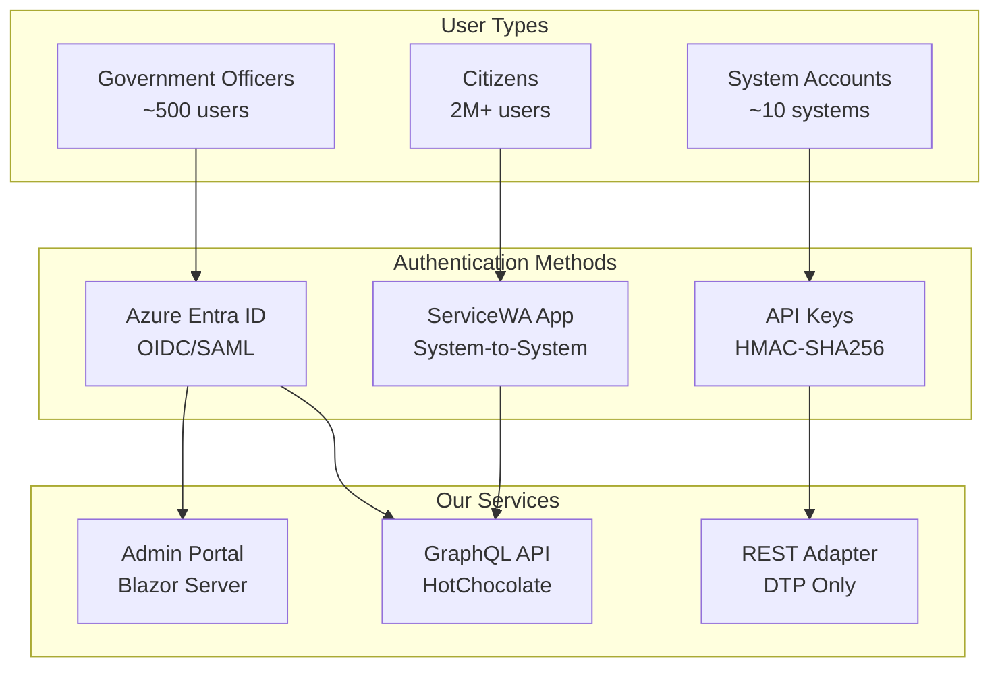
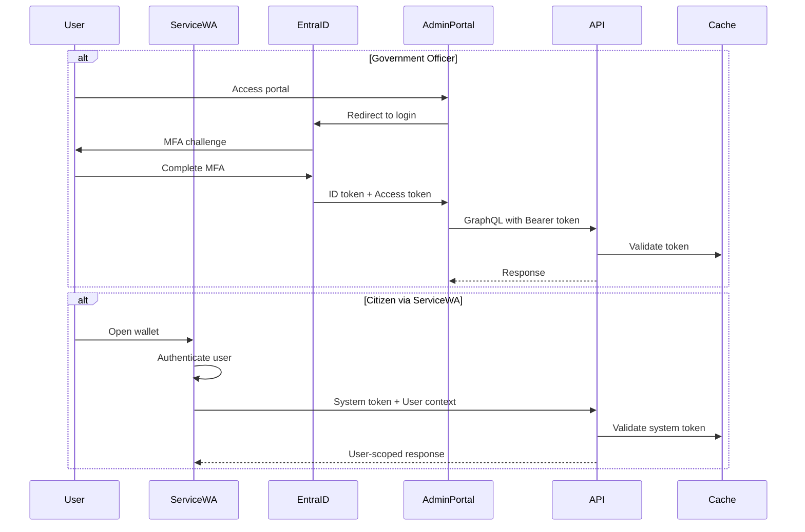
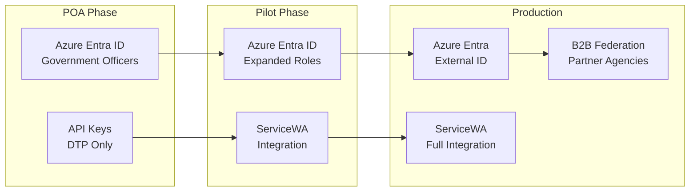

# Authentication Strategy
## Digital Wallet POA Phase

**Version:** 1.0  
**Last Updated:** 2025-01-09  
**Status:** Implementation Ready

---

## Table of Contents
1. [Overview](#overview)
2. [Authentication Architecture](#authentication-architecture)
3. [Azure Entra ID Configuration](#azure-entra-id-configuration)
4. [ServiceWA Integration](#servicewa-integration)
5. [API Authentication](#api-authentication)
6. [Token Management](#token-management)
7. [Multi-Factor Authentication](#multi-factor-authentication)
8. [Session Management](#session-management)
9. [Security Policies](#security-policies)
10. [Migration Path](#migration-path)

---

## Overview

### Authentication Landscape



### Key Decisions

| Decision | Choice | Rationale |
| --- | --- | --- |
| **Primary Auth Provider** | Azure Entra ID | Government standard, enterprise features |
| **Citizen Authentication** | Via ServiceWA | No direct citizen access to our systems |
| **API Authentication** | JWT Bearer tokens | Industry standard, stateless |
| **MFA Requirement** | Mandatory for officers | Security compliance |
| **Session Duration** | 30 minutes sliding | Balance security and usability |

---

## Authentication Architecture

### Component Interaction



---

## Azure Entra ID Configuration

### Tenant Setup

```powershell
# Create App Registration
$app = New-AzureADApplication -DisplayName "NumbatWallet-POA" `
    -IdentifierUris "https://wallet.wa.gov.au" `
    -ReplyUrls @(
        "https://admin-poa.wallet.wa.gov.au/signin-oidc",
        "https://localhost:5001/signin-oidc"
    )

# Configure API Permissions
Add-AzureADApplicationPermission -ObjectId $app.ObjectId `
    -ApiId "00000003-0000-0000-c000-000000000000" `
    -PermissionId "e1fe6dd8-ba31-4d61-89e7-88639da4683d" # User.Read

# Create Client Secret
$secret = New-AzureADApplicationPasswordCredential `
    -ObjectId $app.ObjectId `
    -EndDate (Get-Date).AddYears(1)

# Create App Roles
$roles = @(
    @{
        AllowedMemberTypes = @("User")
        Description = "System Administrator"
        DisplayName = "Admin"
        Id = [Guid]::NewGuid()
        IsEnabled = $true
        Value = "Admin"
    },
    @{
        AllowedMemberTypes = @("User")
        Description = "Credential Issuer"
        DisplayName = "Issuer"
        Id = [Guid]::NewGuid()
        IsEnabled = $true
        Value = "Issuer"
    },
    @{
        AllowedMemberTypes = @("User", "Application")
        Description = "Credential Verifier"
        DisplayName = "Verifier"
        Id = [Guid]::NewGuid()
        IsEnabled = $true
        Value = "Verifier"
    }
)

Set-AzureADApplication -ObjectId $app.ObjectId -AppRoles $roles
```

### Application Configuration

```json
{
  "AzureAd": {
    "Instance": "https://login.microsoftonline.com/",
    "TenantId": "wa-gov-tenant-id",
    "ClientId": "numbat-wallet-client-id",
    "ClientSecret": "vault://secrets/azure-ad-client-secret",
    "Domain": "wa.gov.au",
    "CallbackPath": "/signin-oidc",
    "SignedOutCallbackPath": "/signout-callback-oidc",
    "Scopes": ["User.Read", "profile", "email"],
    "TokenValidationParameters": {
      "ValidateIssuer": true,
      "ValidIssuers": ["https://login.microsoftonline.com/wa-gov-tenant-id/v2.0"],
      "ValidateAudience": true,
      "ValidAudiences": ["numbat-wallet-client-id"],
      "ValidateLifetime": true,
      "ClockSkew": "00:05:00"
    }
  }
}
```

### .NET Integration

```csharp
// Program.cs
builder.Services.AddAuthentication(OpenIdConnectDefaults.AuthenticationScheme)
    .AddMicrosoftIdentityWebApp(options =>
    {
        builder.Configuration.Bind("AzureAd", options);
        options.Events = new OpenIdConnectEvents
        {
            OnTokenValidated = async context =>
            {
                var userId = context.Principal?.FindFirst(ClaimTypes.NameIdentifier)?.Value;
                var tenantService = context.HttpContext.RequestServices
                    .GetRequiredService<ITenantService>();
                
                // Resolve user's tenant
                var tenant = await tenantService.GetUserTenantAsync(userId);
                
                // Add tenant claim
                var claims = new List<Claim>
                {
                    new("tenant_id", tenant.Id),
                    new("tenant_name", tenant.Name)
                };
                
                var claimsIdentity = new ClaimsIdentity(claims);
                context.Principal?.AddIdentity(claimsIdentity);
            },
            OnRedirectToIdentityProviderForSignOut = context =>
            {
                // Clear local session
                context.HttpContext.Session.Clear();
                return Task.CompletedTask;
            }
        };
    })
    .AddMicrosoftIdentityWebApi(options =>
    {
        builder.Configuration.Bind("AzureAd", options);
    }, 
    options =>
    {
        builder.Configuration.Bind("AzureAd", options);
    });

// Authorization policies
builder.Services.AddAuthorization(options =>
{
    options.AddPolicy("AdminOnly", policy =>
        policy.RequireRole("Admin"));
    
    options.AddPolicy("IssuerOnly", policy =>
        policy.RequireRole("Issuer", "Admin"));
    
    options.AddPolicy("VerifierOnly", policy =>
        policy.RequireRole("Verifier", "Admin"));
    
    options.AddPolicy("AuthenticatedUser", policy =>
        policy.RequireAuthenticatedUser());
});
```

---

## ServiceWA Integration

### System-to-System Authentication

```csharp
public class ServiceWAAuthenticationHandler : AuthenticationHandler<ServiceWAAuthOptions>
{
    private readonly ISystemTokenValidator _tokenValidator;
    private readonly IUserContextResolver _userResolver;

    public ServiceWAAuthenticationHandler(
        IOptionsMonitor<ServiceWAAuthOptions> options,
        ILoggerFactory logger,
        UrlEncoder encoder,
        ISystemTokenValidator tokenValidator,
        IUserContextResolver userResolver)
        : base(options, logger, encoder)
    {
        _tokenValidator = tokenValidator;
        _userResolver = userResolver;
    }

    protected override async Task<AuthenticateResult> HandleAuthenticateAsync()
    {
        // Extract system token
        if (!Request.Headers.TryGetValue("X-System-Token", out var systemToken))
        {
            return AuthenticateResult.Fail("Missing system token");
        }

        // Validate system token
        var validation = await _tokenValidator.ValidateAsync(systemToken);
        if (!validation.IsValid)
        {
            return AuthenticateResult.Fail("Invalid system token");
        }

        // Extract user context
        if (!Request.Headers.TryGetValue("X-User-Context", out var userContext))
        {
            return AuthenticateResult.Fail("Missing user context");
        }

        // Resolve user from ServiceWA context
        var user = await _userResolver.ResolveAsync(userContext);
        if (user == null)
        {
            return AuthenticateResult.Fail("Invalid user context");
        }

        // Create claims
        var claims = new[]
        {
            new Claim(ClaimTypes.NameIdentifier, user.Id),
            new Claim(ClaimTypes.Name, user.Name),
            new Claim("system", "ServiceWA"),
            new Claim("wallet_id", user.WalletId),
            new Claim("tenant_id", "wa_government")
        };

        var identity = new ClaimsIdentity(claims, Scheme.Name);
        var principal = new ClaimsPrincipal(identity);
        var ticket = new AuthenticationTicket(principal, Scheme.Name);

        return AuthenticateResult.Success(ticket);
    }
}

// Registration
builder.Services.AddAuthentication()
    .AddScheme<ServiceWAAuthOptions, ServiceWAAuthenticationHandler>(
        "ServiceWA", options =>
        {
            options.SharedSecret = configuration["ServiceWA:SharedSecret"];
            options.TokenLifetime = TimeSpan.FromMinutes(5);
        });
```

### Token Generation for ServiceWA

```csharp
public class SystemTokenService : ISystemTokenService
{
    private readonly string _sharedSecret;
    private readonly ILogger<SystemTokenService> _logger;

    public SystemTokenService(
        IConfiguration configuration,
        ILogger<SystemTokenService> logger)
    {
        _sharedSecret = configuration["ServiceWA:SharedSecret"] 
            ?? throw new InvalidOperationException("ServiceWA shared secret not configured");
        _logger = logger;
    }

    public string GenerateSystemToken(string systemId, string nonce)
    {
        var timestamp = DateTimeOffset.UtcNow.ToUnixTimeSeconds();
        var payload = $"{systemId}:{nonce}:{timestamp}";
        
        using var hmac = new HMACSHA256(Encoding.UTF8.GetBytes(_sharedSecret));
        var hash = hmac.ComputeHash(Encoding.UTF8.GetBytes(payload));
        var signature = Convert.ToBase64String(hash);
        
        var token = $"{payload}:{signature}";
        
        _logger.LogDebug("Generated system token for {SystemId}", systemId);
        
        return Convert.ToBase64String(Encoding.UTF8.GetBytes(token));
    }

    public async Task<TokenValidationResult> ValidateSystemTokenAsync(string token)
    {
        try
        {
            var decoded = Encoding.UTF8.GetString(Convert.FromBase64String(token));
            var parts = decoded.Split(':');
            
            if (parts.Length != 4)
            {
                return TokenValidationResult.Failed("Invalid token format");
            }

            var systemId = parts[0];
            var nonce = parts[1];
            var timestamp = long.Parse(parts[2]);
            var signature = parts[3];

            // Check timestamp (5 minute window)
            var tokenTime = DateTimeOffset.FromUnixTimeSeconds(timestamp);
            if (Math.Abs((DateTimeOffset.UtcNow - tokenTime).TotalMinutes) > 5)
            {
                return TokenValidationResult.Failed("Token expired");
            }

            // Validate signature
            var payload = $"{systemId}:{nonce}:{timestamp}";
            using var hmac = new HMACSHA256(Encoding.UTF8.GetBytes(_sharedSecret));
            var expectedHash = hmac.ComputeHash(Encoding.UTF8.GetBytes(payload));
            var expectedSignature = Convert.ToBase64String(expectedHash);

            if (signature != expectedSignature)
            {
                return TokenValidationResult.Failed("Invalid signature");
            }

            // Check nonce hasn't been used
            var cacheKey = $"nonce:{nonce}";
            if (await _cache.ExistsAsync(cacheKey))
            {
                return TokenValidationResult.Failed("Nonce already used");
            }

            // Store nonce for 10 minutes
            await _cache.SetAsync(cacheKey, true, TimeSpan.FromMinutes(10));

            return TokenValidationResult.Success(systemId);
        }
        catch (Exception ex)
        {
            _logger.LogError(ex, "Token validation failed");
            return TokenValidationResult.Failed("Validation error");
        }
    }
}
```

---

## API Authentication

### JWT Bearer Configuration

```csharp
public class JwtConfiguration
{
    public static void ConfigureJwtBearer(
        WebApplicationBuilder builder,
        JwtBearerOptions options)
    {
        var azureAdConfig = builder.Configuration.GetSection("AzureAd");
        
        options.Authority = $"{azureAdConfig["Instance"]}{azureAdConfig["TenantId"]}/v2.0";
        options.Audience = azureAdConfig["ClientId"];
        options.TokenValidationParameters = new TokenValidationParameters
        {
            ValidateIssuer = true,
            ValidIssuers = new[]
            {
                $"{azureAdConfig["Instance"]}{azureAdConfig["TenantId"]}/v2.0",
                $"https://sts.windows.net/{azureAdConfig["TenantId"]}/"
            },
            ValidateAudience = true,
            ValidAudiences = new[] { azureAdConfig["ClientId"] },
            ValidateLifetime = true,
            ClockSkew = TimeSpan.FromMinutes(5),
            RequireExpirationTime = true,
            RequireSignedTokens = true
        };

        options.Events = new JwtBearerEvents
        {
            OnTokenValidated = async context =>
            {
                var tokenService = context.HttpContext.RequestServices
                    .GetRequiredService<ITokenCacheService>();
                
                // Check if token is blacklisted
                var jti = context.Principal?.FindFirst("jti")?.Value;
                if (!string.IsNullOrEmpty(jti) && await tokenService.IsBlacklistedAsync(jti))
                {
                    context.Fail("Token has been revoked");
                    return;
                }

                // Enhance claims
                var claimsService = context.HttpContext.RequestServices
                    .GetRequiredService<IClaimsEnhancementService>();
                
                await claimsService.EnhanceClaimsAsync(context.Principal);
            },
            OnAuthenticationFailed = context =>
            {
                var logger = context.HttpContext.RequestServices
                    .GetRequiredService<ILogger<Program>>();
                
                logger.LogWarning("Authentication failed: {Error}", 
                    context.Exception.Message);
                
                return Task.CompletedTask;
            },
            OnChallenge = context =>
            {
                context.Response.Headers["WWW-Authenticate"] = 
                    $"Bearer realm=\"{azureAdConfig["Domain"]}\", error=\"invalid_token\"";
                
                return Task.CompletedTask;
            }
        };
    }
}
```

### API Key Authentication (DTP Only)

```csharp
public class ApiKeyAuthenticationHandler : AuthenticationHandler<ApiKeyAuthOptions>
{
    private readonly IApiKeyService _apiKeyService;

    protected override async Task<AuthenticateResult> HandleAuthenticateAsync()
    {
        // Extract API key from header
        if (!Request.Headers.TryGetValue("X-API-Key", out var apiKeyHeader))
        {
            return AuthenticateResult.Fail("Missing API key");
        }

        var apiKey = apiKeyHeader.ToString();
        
        // Validate API key
        var validation = await _apiKeyService.ValidateAsync(apiKey);
        if (!validation.IsValid)
        {
            return AuthenticateResult.Fail("Invalid API key");
        }

        // Create claims for DTP
        var claims = new[]
        {
            new Claim(ClaimTypes.NameIdentifier, "dtp_system"),
            new Claim(ClaimTypes.Name, "Digital Trust Platform"),
            new Claim(ClaimTypes.Role, "System"),
            new Claim("system_id", "dtp"),
            new Claim("permissions", "credential.issue,credential.revoke")
        };

        var identity = new ClaimsIdentity(claims, Scheme.Name);
        var principal = new ClaimsPrincipal(identity);
        var ticket = new AuthenticationTicket(principal, Scheme.Name);

        // Log API usage
        await _apiKeyService.LogUsageAsync(apiKey, Request.Path);

        return AuthenticateResult.Success(ticket);
    }
}

public class ApiKeyService : IApiKeyService
{
    private readonly IConfiguration _configuration;
    private readonly IDistributedCache _cache;

    public async Task<ApiKeyValidationResult> ValidateAsync(string apiKey)
    {
        // Check cache first
        var cacheKey = $"apikey:{apiKey}";
        var cached = await _cache.GetStringAsync(cacheKey);
        
        if (cached == "invalid")
        {
            return ApiKeyValidationResult.Invalid();
        }

        // Validate format (UUID v4)
        if (!Guid.TryParse(apiKey, out var keyGuid))
        {
            await _cache.SetStringAsync(cacheKey, "invalid", 
                new DistributedCacheEntryOptions
                {
                    AbsoluteExpirationRelativeToNow = TimeSpan.FromMinutes(5)
                });
            return ApiKeyValidationResult.Invalid();
        }

        // Check against configured keys
        var validKeys = _configuration.GetSection("ApiKeys:Dtp").Get<string[]>();
        if (!validKeys?.Contains(apiKey) ?? true)
        {
            await _cache.SetStringAsync(cacheKey, "invalid",
                new DistributedCacheEntryOptions
                {
                    AbsoluteExpirationRelativeToNow = TimeSpan.FromMinutes(5)
                });
            return ApiKeyValidationResult.Invalid();
        }

        // Cache valid result
        await _cache.SetStringAsync(cacheKey, "valid",
            new DistributedCacheEntryOptions
            {
                AbsoluteExpirationRelativeToNow = TimeSpan.FromHours(1)
            });

        return ApiKeyValidationResult.Valid("dtp");
    }
}
```

---

## Token Management

### Token Service Implementation

```csharp
public class TokenManagementService : ITokenManagementService
{
    private readonly IDistributedCache _cache;
    private readonly ILogger<TokenManagementService> _logger;

    public async Task<TokenInfo> IssueTokenAsync(ClaimsPrincipal user, TokenType type)
    {
        var tokenId = Guid.NewGuid().ToString();
        var issuedAt = DateTimeOffset.UtcNow;
        var expiresAt = type switch
        {
            TokenType.Access => issuedAt.AddMinutes(60),
            TokenType.Refresh => issuedAt.AddDays(7),
            TokenType.Session => issuedAt.AddMinutes(30),
            _ => issuedAt.AddMinutes(15)
        };

        var token = new TokenInfo
        {
            Id = tokenId,
            Type = type,
            UserId = user.FindFirst(ClaimTypes.NameIdentifier)?.Value!,
            IssuedAt = issuedAt,
            ExpiresAt = expiresAt,
            Claims = user.Claims.ToDictionary(c => c.Type, c => c.Value)
        };

        // Store token metadata
        var cacheKey = $"token:{tokenId}";
        await _cache.SetAsync(cacheKey, JsonSerializer.SerializeToUtf8Bytes(token),
            new DistributedCacheEntryOptions
            {
                AbsoluteExpiration = expiresAt
            });

        _logger.LogInformation("Issued {Type} token {TokenId} for user {UserId}",
            type, tokenId, token.UserId);

        return token;
    }

    public async Task RevokeTokenAsync(string tokenId, string reason)
    {
        // Add to blacklist
        var blacklistKey = $"blacklist:{tokenId}";
        await _cache.SetStringAsync(blacklistKey, reason,
            new DistributedCacheEntryOptions
            {
                AbsoluteExpirationRelativeToNow = TimeSpan.FromDays(8) // Beyond refresh token lifetime
            });

        // Remove token metadata
        var tokenKey = $"token:{tokenId}";
        await _cache.RemoveAsync(tokenKey);

        _logger.LogInformation("Revoked token {TokenId}: {Reason}", tokenId, reason);
    }

    public async Task<bool> ValidateTokenAsync(string tokenId)
    {
        // Check blacklist
        var blacklistKey = $"blacklist:{tokenId}";
        if (await _cache.GetStringAsync(blacklistKey) != null)
        {
            return false;
        }

        // Check token exists and not expired
        var tokenKey = $"token:{tokenId}";
        var tokenData = await _cache.GetAsync(tokenKey);
        
        if (tokenData == null)
        {
            return false;
        }

        var token = JsonSerializer.Deserialize<TokenInfo>(tokenData);
        return token?.ExpiresAt > DateTimeOffset.UtcNow;
    }

    public async Task<TokenInfo?> RefreshTokenAsync(string refreshToken)
    {
        // Validate refresh token
        if (!await ValidateTokenAsync(refreshToken))
        {
            return null;
        }

        // Get original token
        var tokenKey = $"token:{refreshToken}";
        var tokenData = await _cache.GetAsync(tokenKey);
        var originalToken = JsonSerializer.Deserialize<TokenInfo>(tokenData);

        if (originalToken?.Type != TokenType.Refresh)
        {
            return null;
        }

        // Issue new access token
        var claims = originalToken.Claims.Select(kv => new Claim(kv.Key, kv.Value));
        var identity = new ClaimsIdentity(claims, "RefreshToken");
        var principal = new ClaimsPrincipal(identity);

        var newToken = await IssueTokenAsync(principal, TokenType.Access);

        // Rotate refresh token
        await RevokeTokenAsync(refreshToken, "Rotated");
        var newRefreshToken = await IssueTokenAsync(principal, TokenType.Refresh);

        return newToken;
    }
}
```

---

## Multi-Factor Authentication

### MFA Configuration

```csharp
public class MfaService : IMfaService
{
    private readonly IDistributedCache _cache;
    private readonly ISmsService _smsService;
    private readonly IEmailService _emailService;

    public async Task<MfaChallenge> InitiateMfaAsync(string userId, MfaMethod method)
    {
        var challenge = new MfaChallenge
        {
            Id = Guid.NewGuid().ToString(),
            UserId = userId,
            Method = method,
            Code = GenerateCode(),
            CreatedAt = DateTimeOffset.UtcNow,
            ExpiresAt = DateTimeOffset.UtcNow.AddMinutes(5),
            Attempts = 0
        };

        // Send code
        switch (method)
        {
            case MfaMethod.Sms:
                await _smsService.SendCodeAsync(userId, challenge.Code);
                break;
            case MfaMethod.Email:
                await _emailService.SendCodeAsync(userId, challenge.Code);
                break;
            case MfaMethod.Authenticator:
                // Code generated by authenticator app
                challenge.Code = null;
                break;
        }

        // Store challenge
        var cacheKey = $"mfa:{challenge.Id}";
        await _cache.SetAsync(cacheKey, JsonSerializer.SerializeToUtf8Bytes(challenge),
            new DistributedCacheEntryOptions
            {
                AbsoluteExpiration = challenge.ExpiresAt
            });

        return challenge;
    }

    public async Task<MfaValidationResult> ValidateMfaAsync(string challengeId, string code)
    {
        var cacheKey = $"mfa:{challengeId}";
        var challengeData = await _cache.GetAsync(cacheKey);
        
        if (challengeData == null)
        {
            return MfaValidationResult.Failed("Challenge expired or not found");
        }

        var challenge = JsonSerializer.Deserialize<MfaChallenge>(challengeData);
        
        // Check expiry
        if (challenge.ExpiresAt < DateTimeOffset.UtcNow)
        {
            await _cache.RemoveAsync(cacheKey);
            return MfaValidationResult.Failed("Challenge expired");
        }

        // Check attempts
        challenge.Attempts++;
        if (challenge.Attempts > 3)
        {
            await _cache.RemoveAsync(cacheKey);
            return MfaValidationResult.Failed("Too many attempts");
        }

        // Validate code
        bool isValid = challenge.Method switch
        {
            MfaMethod.Authenticator => await ValidateAuthenticatorCodeAsync(
                challenge.UserId, code),
            _ => challenge.Code == code
        };

        if (!isValid)
        {
            // Update attempts
            await _cache.SetAsync(cacheKey, JsonSerializer.SerializeToUtf8Bytes(challenge),
                new DistributedCacheEntryOptions
                {
                    AbsoluteExpiration = challenge.ExpiresAt
                });
            return MfaValidationResult.Failed("Invalid code");
        }

        // Success - remove challenge
        await _cache.RemoveAsync(cacheKey);
        return MfaValidationResult.Success();
    }

    private string GenerateCode()
    {
        using var rng = RandomNumberGenerator.Create();
        var bytes = new byte[4];
        rng.GetBytes(bytes);
        var code = BitConverter.ToUInt32(bytes, 0) % 1000000;
        return code.ToString("D6");
    }
}
```

---

## Session Management

### Session Configuration

```csharp
public class SessionConfiguration
{
    public static void ConfigureSession(WebApplicationBuilder builder)
    {
        builder.Services.AddStackExchangeRedisCache(options =>
        {
            options.Configuration = builder.Configuration.GetConnectionString("Redis");
            options.InstanceName = "NumbatWallet:Sessions:";
        });

        builder.Services.AddSession(options =>
        {
            options.IdleTimeout = TimeSpan.FromMinutes(30);
            options.Cookie.Name = ".NumbatWallet.Session";
            options.Cookie.HttpOnly = true;
            options.Cookie.IsEssential = true;
            options.Cookie.SecurePolicy = CookieSecurePolicy.Always;
            options.Cookie.SameSite = SameSiteMode.Strict;
        });

        builder.Services.AddSingleton<ISessionManager, RedisSessionManager>();
    }
}

public class RedisSessionManager : ISessionManager
{
    private readonly IDistributedCache _cache;
    private readonly ILogger<RedisSessionManager> _logger;

    public async Task<Session> CreateSessionAsync(ClaimsPrincipal user)
    {
        var session = new Session
        {
            Id = Guid.NewGuid().ToString(),
            UserId = user.FindFirst(ClaimTypes.NameIdentifier)?.Value!,
            CreatedAt = DateTimeOffset.UtcNow,
            LastActivity = DateTimeOffset.UtcNow,
            ExpiresAt = DateTimeOffset.UtcNow.AddMinutes(30),
            IpAddress = GetClientIpAddress(),
            UserAgent = GetUserAgent(),
            Claims = user.Claims.Select(c => new SessionClaim
            {
                Type = c.Type,
                Value = c.Value
            }).ToList()
        };

        await StoreSessionAsync(session);
        
        _logger.LogInformation("Created session {SessionId} for user {UserId}",
            session.Id, session.UserId);

        return session;
    }

    public async Task<Session?> GetSessionAsync(string sessionId)
    {
        var cacheKey = $"session:{sessionId}";
        var sessionData = await _cache.GetAsync(cacheKey);
        
        if (sessionData == null)
        {
            return null;
        }

        var session = JsonSerializer.Deserialize<Session>(sessionData);
        
        // Check expiry
        if (session?.ExpiresAt < DateTimeOffset.UtcNow)
        {
            await _cache.RemoveAsync(cacheKey);
            return null;
        }

        // Update last activity (sliding expiration)
        session.LastActivity = DateTimeOffset.UtcNow;
        session.ExpiresAt = DateTimeOffset.UtcNow.AddMinutes(30);
        
        await StoreSessionAsync(session);

        return session;
    }

    public async Task InvalidateSessionAsync(string sessionId)
    {
        var cacheKey = $"session:{sessionId}";
        await _cache.RemoveAsync(cacheKey);
        
        _logger.LogInformation("Invalidated session {SessionId}", sessionId);
    }

    public async Task InvalidateUserSessionsAsync(string userId)
    {
        // This requires maintaining a user->sessions index
        var indexKey = $"user:sessions:{userId}";
        var sessionIds = await _cache.GetStringAsync(indexKey);
        
        if (!string.IsNullOrEmpty(sessionIds))
        {
            var ids = sessionIds.Split(',');
            foreach (var sessionId in ids)
            {
                await InvalidateSessionAsync(sessionId);
            }
            
            await _cache.RemoveAsync(indexKey);
        }
        
        _logger.LogInformation("Invalidated all sessions for user {UserId}", userId);
    }

    private async Task StoreSessionAsync(Session session)
    {
        var cacheKey = $"session:{session.Id}";
        await _cache.SetAsync(cacheKey, JsonSerializer.SerializeToUtf8Bytes(session),
            new DistributedCacheEntryOptions
            {
                AbsoluteExpiration = session.ExpiresAt
            });

        // Update user->sessions index
        var indexKey = $"user:sessions:{session.UserId}";
        var existingSessions = await _cache.GetStringAsync(indexKey) ?? "";
        var sessionIds = existingSessions.Split(',').ToList();
        
        if (!sessionIds.Contains(session.Id))
        {
            sessionIds.Add(session.Id);
            await _cache.SetStringAsync(indexKey, string.Join(',', sessionIds),
                new DistributedCacheEntryOptions
                {
                    SlidingExpiration = TimeSpan.FromHours(24)
                });
        }
    }
}
```

---

## Security Policies

### Rate Limiting

```csharp
builder.Services.AddRateLimiter(options =>
{
    // Default policy
    options.GlobalLimiter = PartitionedRateLimiter.Create<HttpContext, string>(
        httpContext => RateLimitPartition.GetFixedWindowLimiter(
            partitionKey: httpContext.User.Identity?.Name ?? httpContext.Connection.RemoteIpAddress?.ToString() ?? "anonymous",
            factory: partition => new FixedWindowRateLimiterOptions
            {
                AutoReplenishment = true,
                PermitLimit = 100,
                Window = TimeSpan.FromMinutes(1)
            }));

    // DTP API policy
    options.AddPolicy("dtp", httpContext =>
        RateLimitPartition.GetFixedWindowLimiter(
            partitionKey: "dtp",
            factory: partition => new FixedWindowRateLimiterOptions
            {
                AutoReplenishment = true,
                PermitLimit = 1000,
                Window = TimeSpan.FromMinutes(1)
            }));

    // Admin portal policy
    options.AddPolicy("admin", httpContext =>
        RateLimitPartition.GetSlidingWindowLimiter(
            partitionKey: httpContext.User.Identity?.Name ?? "anonymous",
            factory: partition => new SlidingWindowRateLimiterOptions
            {
                AutoReplenishment = true,
                PermitLimit = 50,
                Window = TimeSpan.FromMinutes(1),
                SegmentsPerWindow = 6
            }));
});
```

### CORS Configuration

```csharp
builder.Services.AddCors(options =>
{
    options.AddPolicy("ServiceWA", policy =>
    {
        policy.WithOrigins(
                "https://servicewa.wa.gov.au",
                "https://test.servicewa.wa.gov.au")
            .AllowAnyHeader()
            .AllowAnyMethod()
            .AllowCredentials()
            .SetPreflightMaxAge(TimeSpan.FromHours(24));
    });

    options.AddPolicy("AdminPortal", policy =>
    {
        policy.WithOrigins(
                "https://admin.wallet.wa.gov.au",
                "https://admin-poa.wallet.wa.gov.au")
            .AllowAnyHeader()
            .AllowAnyMethod()
            .AllowCredentials();
    });
});
```

---

## Migration Path

### From POA to Production



### Future Considerations

1. **Azure Entra External ID** (Post May 2025)
   - Migration from Azure AD B2C
   - Support for external identities
   - Enhanced B2B collaboration

2. **Passwordless Authentication**
   - Windows Hello for Business
   - FIDO2 security keys
   - Microsoft Authenticator

3. **Zero Trust Architecture**
   - Continuous verification
   - Conditional access policies
   - Risk-based authentication

---

## Summary

This authentication strategy provides:

1. **Government-standard authentication** via Azure Entra ID
2. **System-to-system integration** for ServiceWA
3. **API key support** for DTP compatibility
4. **Comprehensive token management** with Redis caching
5. **MFA enforcement** for security compliance
6. **Session management** with sliding expiration
7. **Clear migration path** to production scale

The architecture ensures secure, scalable authentication while maintaining compatibility with existing WA government infrastructure.