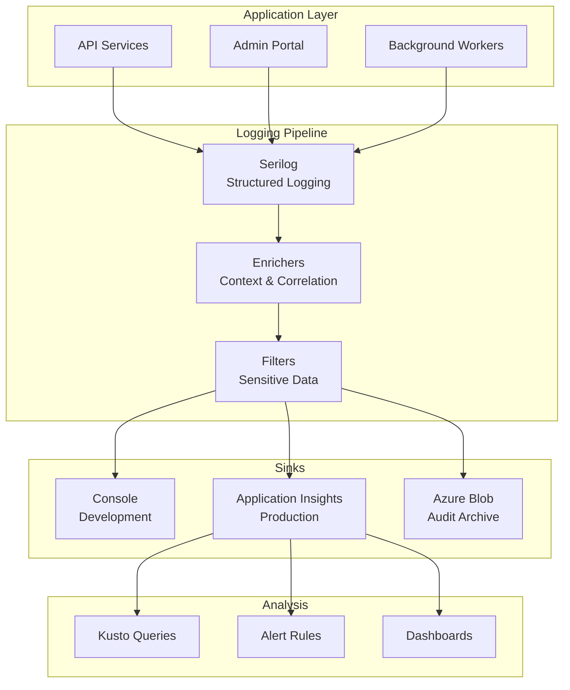

# Logging and Observability Strategy
## Digital Wallet POA Phase

**Version:** 1.0  
**Last Updated:** 2025-01-09  
**.NET Version:** 9.0 with C# 13

---

## Table of Contents
1. [Overview](#overview)
2. [Serilog Configuration](#serilog-configuration)
3. [Application Insights Integration](#application-insights-integration)
4. [Structured Logging](#structured-logging)
5. [Correlation and Tracing](#correlation-and-tracing)
6. [Log Levels and Categories](#log-levels-and-categories)
7. [Audit Logging](#audit-logging)
8. [Performance Monitoring](#performance-monitoring)
9. [Alerting and Dashboards](#alerting-and-dashboards)
10. [Log Retention and Compliance](#log-retention-and-compliance)

---

## Overview

### Logging Architecture



### Key Principles

| Principle | Implementation |
| --- | --- |
| **Structured Logging** | All logs use structured format with semantic properties |
| **Correlation** | Every request has unique correlation ID across services |
| **Security** | PII and sensitive data automatically redacted |
| **Performance** | Async logging with batching to minimize impact |
| **Compliance** | Audit logs immutable and retained for 7 years |
| **Queryability** | Logs searchable via Application Insights API |

---

## Serilog Configuration

### Package Installation

```xml
<!-- Logging packages -->
<PackageReference Include="Serilog.AspNetCore" Version="8.0.1" />
<PackageReference Include="Serilog.Sinks.Console" Version="5.0.1" />
<PackageReference Include="Serilog.Sinks.ApplicationInsights" Version="4.0.0" />
<PackageReference Include="Serilog.Sinks.AzureBlobStorage" Version="3.2.0" />
<PackageReference Include="Serilog.Enrichers.Environment" Version="2.3.0" />
<PackageReference Include="Serilog.Enrichers.Thread" Version="3.2.0" />
<PackageReference Include="Serilog.Enrichers.Process" Version="2.0.2" />
<PackageReference Include="Serilog.Enrichers.Span" Version="3.1.0" />
<PackageReference Include="Serilog.Exceptions" Version="8.4.0" />
<PackageReference Include="Serilog.Settings.Configuration" Version="8.0.0" />
```

### Program.cs Setup

```csharp
using Serilog;
using Serilog.Events;

// Configure Serilog early
Log.Logger = new LoggerConfiguration()
    .MinimumLevel.Override("Microsoft", LogEventLevel.Information)
    .Enrich.FromLogContext()
    .WriteTo.Console()
    .CreateBootstrapLogger();

try
{
    var builder = WebApplication.CreateBuilder(args);
    
    // Configure Serilog from appsettings
    builder.Host.UseSerilog((context, services, configuration) => 
    {
        configuration
            .ReadFrom.Configuration(context.Configuration)
            .ReadFrom.Services(services)
            .Enrich.FromLogContext()
            .Enrich.WithMachineName()
            .Enrich.WithProcessId()
            .Enrich.WithThreadId()
            .Enrich.WithEnvironmentName()
            .Enrich.WithExceptionDetails()
            .Enrich.WithSpan()
            .Enrich.WithProperty("Application", "NumbatWallet")
            .Enrich.WithProperty("Version", Assembly.GetExecutingAssembly()
                .GetCustomAttribute<AssemblyInformationalVersionAttribute>()?.InformationalVersion ?? "Unknown")
            .Enrich.With<TenantEnricher>()
            .Enrich.With<UserEnricher>()
            .Enrich.With<CorrelationIdEnricher>()
            .Filter.With<SensitiveDataFilter>();

        // Environment-specific sinks
        if (context.HostingEnvironment.IsDevelopment())
        {
            configuration.WriteTo.Console(
                outputTemplate: "[{Timestamp:HH:mm:ss} {Level:u3}] {SourceContext} {Message:lj} {Properties:j}{NewLine}{Exception}");
        }
        else
        {
            // Application Insights
            var telemetryConfig = services.GetRequiredService<TelemetryConfiguration>();
            configuration.WriteTo.ApplicationInsights(
                telemetryConfig,
                TelemetryConverter.Traces,
                restrictedToMinimumLevel: LogEventLevel.Information);

            // Audit logs to blob storage
            configuration.WriteTo.AzureBlobStorage(
                connectionString: context.Configuration.GetConnectionString("AuditStorage"),
                storageContainerName: "audit-logs",
                storageFileName: "{yyyy}/{MM}/{dd}/audit-{Hour}.json",
                restrictedToMinimumLevel: LogEventLevel.Warning,
                writeInBatches: true,
                period: TimeSpan.FromSeconds(15),
                batchPostingLimit: 100);
        }
    });

    // Build application
    var app = builder.Build();
    
    // Add Serilog request logging
    app.UseSerilogRequestLogging(options =>
    {
        options.MessageTemplate = "HTTP {RequestMethod} {RequestPath} responded {StatusCode} in {Elapsed:0.0000}ms";
        options.GetLevel = (httpContext, elapsed, ex) => ex != null 
            ? LogEventLevel.Error 
            : httpContext.Response.StatusCode > 499 
                ? LogEventLevel.Error 
                : LogEventLevel.Information;
        options.EnrichDiagnosticContext = (diagnosticContext, httpContext) =>
        {
            diagnosticContext.Set("RequestHost", httpContext.Request.Host.Value);
            diagnosticContext.Set("RequestScheme", httpContext.Request.Scheme);
            diagnosticContext.Set("UserAgent", httpContext.Request.Headers["User-Agent"].ToString());
            diagnosticContext.Set("RemoteIP", httpContext.Connection.RemoteIpAddress?.ToString());
            diagnosticContext.Set("CorrelationId", httpContext.TraceIdentifier);
        };
    });
    
    app.Run();
}
catch (Exception ex)
{
    Log.Fatal(ex, "Application terminated unexpectedly");
}
finally
{
    Log.CloseAndFlush();
}
```

### appsettings.json Configuration

```json
{
  "Serilog": {
    "MinimumLevel": {
      "Default": "Information",
      "Override": {
        "Microsoft": "Warning",
        "Microsoft.Hosting.Lifetime": "Information",
        "Microsoft.EntityFrameworkCore": "Warning",
        "System": "Warning",
        "HotChocolate": "Information"
      }
    },
    "WriteTo": [
      {
        "Name": "ApplicationInsights",
        "Args": {
          "restrictedToMinimumLevel": "Information",
          "telemetryConverter": "Serilog.Sinks.ApplicationInsights.TelemetryConverters.TraceTelemetryConverter, Serilog.Sinks.ApplicationInsights"
        }
      }
    ],
    "Properties": {
      "Application": "NumbatWallet"
    }
  }
}
```

---

## Application Insights Integration

### Telemetry Configuration

```csharp
public static class ApplicationInsightsConfiguration
{
    public static void ConfigureApplicationInsights(
        WebApplicationBuilder builder)
    {
        builder.Services.AddApplicationInsightsTelemetry(options =>
        {
            options.ConnectionString = builder.Configuration["ApplicationInsights:ConnectionString"];
            options.EnableAdaptiveSampling = true;
            options.EnableQuickPulseMetricStream = true;
            options.EnableDependencyTrackingTelemetryModule = true;
            options.EnablePerformanceCounterCollectionModule = true;
            options.EnableEventCounterCollectionModule = true;
            options.EnableRequestTrackingTelemetryModule = true;
            options.EnableAppServicesHeartbeatTelemetryModule = true;
            options.EnableAzureInstanceMetadataTelemetryModule = true;
        });

        // Custom telemetry initializers
        builder.Services.AddSingleton<ITelemetryInitializer, CloudRoleInitializer>();
        builder.Services.AddSingleton<ITelemetryInitializer, TenantTelemetryInitializer>();
        builder.Services.AddSingleton<ITelemetryInitializer, UserTelemetryInitializer>();

        // Custom telemetry processors
        builder.Services.AddApplicationInsightsTelemetryProcessor<SensitiveDataProcessor>();
        builder.Services.AddApplicationInsightsTelemetryProcessor<HealthCheckFilter>();

        // Configure sampling
        builder.Services.Configure<TelemetryConfiguration>(config =>
        {
            var adaptiveSamplingProcessor = config.DefaultTelemetrySink.TelemetryProcessors
                .OfType<AdaptiveSamplingTelemetryProcessor>()
                .FirstOrDefault();

            if (adaptiveSamplingProcessor != null)
            {
                adaptiveSamplingProcessor.MaxTelemetryItemsPerSecond = 100;
                adaptiveSamplingProcessor.InitialSamplingPercentage = 25;
                adaptiveSamplingProcessor.MinSamplingPercentage = 0.1;
                adaptiveSamplingProcessor.MaxSamplingPercentage = 100;
            }
        });
    }
}

public class CloudRoleInitializer : ITelemetryInitializer
{
    private readonly string _roleName;
    private readonly string _roleInstance;

    public CloudRoleInitializer(IConfiguration configuration)
    {
        _roleName = configuration["ApplicationInsights:CloudRoleName"] ?? "NumbatWallet";
        _roleInstance = Environment.MachineName;
    }

    public void Initialize(ITelemetry telemetry)
    {
        telemetry.Context.Cloud.RoleName = _roleName;
        telemetry.Context.Cloud.RoleInstance = _roleInstance;
    }
}

public class TenantTelemetryInitializer : ITelemetryInitializer
{
    private readonly IHttpContextAccessor _httpContextAccessor;

    public TenantTelemetryInitializer(IHttpContextAccessor httpContextAccessor)
    {
        _httpContextAccessor = httpContextAccessor;
    }

    public void Initialize(ITelemetry telemetry)
    {
        var httpContext = _httpContextAccessor.HttpContext;
        if (httpContext != null)
        {
            var tenantId = httpContext.User?.FindFirst("tenant_id")?.Value;
            if (!string.IsNullOrEmpty(tenantId))
            {
                telemetry.Context.GlobalProperties["TenantId"] = tenantId;
            }
        }
    }
}
```

### Custom Metrics

```csharp
public class MetricsService : IMetricsService
{
    private readonly TelemetryClient _telemetryClient;
    private readonly ILogger<MetricsService> _logger;

    public MetricsService(
        TelemetryClient telemetryClient,
        ILogger<MetricsService> logger)
    {
        _telemetryClient = telemetryClient;
        _logger = logger;
    }

    public void TrackCredentialIssued(string credentialType, string issuerId, TimeSpan duration)
    {
        _telemetryClient.TrackMetric("CredentialIssued", 1, new Dictionary<string, string>
        {
            ["Type"] = credentialType,
            ["IssuerId"] = issuerId
        });

        _telemetryClient.TrackMetric("CredentialIssuanceDuration", duration.TotalMilliseconds,
            new Dictionary<string, string>
            {
                ["Type"] = credentialType
            });

        _telemetryClient.TrackEvent("CredentialIssuance", new Dictionary<string, string>
        {
            ["Type"] = credentialType,
            ["IssuerId"] = issuerId,
            ["Duration"] = duration.TotalMilliseconds.ToString()
        });
    }

    public void TrackVerification(string credentialType, bool success, TimeSpan duration)
    {
        _telemetryClient.TrackMetric("CredentialVerification", 1, new Dictionary<string, string>
        {
            ["Type"] = credentialType,
            ["Success"] = success.ToString()
        });

        _telemetryClient.TrackMetric("VerificationDuration", duration.TotalMilliseconds);

        if (!success)
        {
            _telemetryClient.TrackEvent("VerificationFailed", new Dictionary<string, string>
            {
                ["Type"] = credentialType
            });
        }
    }

    public void TrackApiCall(string endpoint, string method, int statusCode, TimeSpan duration)
    {
        _telemetryClient.TrackDependency("API", endpoint, method, 
            DateTimeOffset.UtcNow.Subtract(duration), duration, statusCode < 400);

        if (statusCode >= 500)
        {
            _telemetryClient.TrackEvent("ApiError", new Dictionary<string, string>
            {
                ["Endpoint"] = endpoint,
                ["Method"] = method,
                ["StatusCode"] = statusCode.ToString()
            });
        }
    }
}
```

---

## Structured Logging

### Log Message Templates

```csharp
public static class LogMessages
{
    // Credential operations
    public const string CredentialIssued = "Credential {CredentialType} issued to wallet {WalletId} by issuer {IssuerId}";
    public const string CredentialRevoked = "Credential {CredentialId} revoked by {RevokedBy} with reason: {Reason}";
    public const string CredentialVerified = "Credential {CredentialId} verified by {VerifierId} - Result: {VerificationResult}";
    
    // Wallet operations
    public const string WalletCreated = "Wallet created for user {UserId} in tenant {TenantId} with DID {Did}";
    public const string WalletSuspended = "Wallet {WalletId} suspended by {SuspendedBy} - Reason: {Reason}";
    
    // Authentication
    public const string UserAuthenticated = "User {UserId} authenticated via {AuthMethod} from IP {IpAddress}";
    public const string AuthenticationFailed = "Authentication failed for {UserId} - Reason: {FailureReason}";
    public const string MfaChallengeIssued = "MFA challenge issued to {UserId} via {MfaMethod}";
    
    // API operations
    public const string ApiRequestReceived = "API request {Method} {Path} from {ClientId}";
    public const string ApiResponseSent = "API response {StatusCode} for {RequestId} in {ElapsedMs}ms";
    
    // Errors
    public const string UnhandledException = "Unhandled exception in {Context}";
    public const string ValidationFailed = "Validation failed for {Entity}: {ValidationErrors}";
}

// Usage example
public class WalletService
{
    private readonly ILogger<WalletService> _logger;

    public async Task<Wallet> CreateWalletAsync(CreateWalletCommand command)
    {
        using var activity = Activity.StartActivity("CreateWallet");
        
        try
        {
            var wallet = new Wallet(/* ... */);
            
            _logger.LogInformation(LogMessages.WalletCreated,
                command.UserId,
                command.TenantId,
                wallet.Did);
            
            // Track metric
            _telemetryClient.TrackMetric("WalletsCreated", 1);
            
            return wallet;
        }
        catch (Exception ex)
        {
            _logger.LogError(ex, LogMessages.UnhandledException, nameof(CreateWalletAsync));
            throw;
        }
    }
}
```

### Custom Enrichers

```csharp
public class CorrelationIdEnricher : ILogEventEnricher
{
    private readonly IHttpContextAccessor _httpContextAccessor;

    public CorrelationIdEnricher(IHttpContextAccessor httpContextAccessor)
    {
        _httpContextAccessor = httpContextAccessor;
    }

    public void Enrich(LogEvent logEvent, ILogEventPropertyFactory propertyFactory)
    {
        var httpContext = _httpContextAccessor.HttpContext;
        if (httpContext != null)
        {
            var correlationId = httpContext.TraceIdentifier;
            var property = propertyFactory.CreateProperty("CorrelationId", correlationId);
            logEvent.AddPropertyIfAbsent(property);
        }
    }
}

public class UserEnricher : ILogEventEnricher
{
    private readonly IHttpContextAccessor _httpContextAccessor;

    public void Enrich(LogEvent logEvent, ILogEventPropertyFactory propertyFactory)
    {
        var httpContext = _httpContextAccessor.HttpContext;
        var user = httpContext?.User;
        
        if (user?.Identity?.IsAuthenticated == true)
        {
            logEvent.AddPropertyIfAbsent(propertyFactory.CreateProperty(
                "UserId", user.FindFirst(ClaimTypes.NameIdentifier)?.Value ?? "Unknown"));
            
            logEvent.AddPropertyIfAbsent(propertyFactory.CreateProperty(
                "UserName", user.Identity.Name ?? "Unknown"));
        }
    }
}

public class TenantEnricher : ILogEventEnricher
{
    private readonly IHttpContextAccessor _httpContextAccessor;

    public void Enrich(LogEvent logEvent, ILogEventPropertyFactory propertyFactory)
    {
        var httpContext = _httpContextAccessor.HttpContext;
        var tenantId = httpContext?.User?.FindFirst("tenant_id")?.Value;
        
        if (!string.IsNullOrEmpty(tenantId))
        {
            logEvent.AddPropertyIfAbsent(propertyFactory.CreateProperty("TenantId", tenantId));
        }
    }
}
```

### Sensitive Data Filter

```csharp
public class SensitiveDataFilter : ILogEventFilter
{
    private static readonly Regex[] SensitivePatterns = 
    {
        new(@"\b\d{3}-\d{2}-\d{4}\b", RegexOptions.Compiled), // SSN
        new(@"\b\d{16}\b", RegexOptions.Compiled), // Credit card
        new(@"\b[A-Za-z0-9._%+-]+@[A-Za-z0-9.-]+\.[A-Z|a-z]{2,}\b", RegexOptions.Compiled), // Email
        new(@"""password""\s*:\s*""[^""]+""", RegexOptions.Compiled | RegexOptions.IgnoreCase), // Password in JSON
        new(@"""apikey""\s*:\s*""[^""]+""", RegexOptions.Compiled | RegexOptions.IgnoreCase), // API key
    };

    public bool IsEnabled(LogEvent logEvent)
    {
        // Always log, but sanitize the message
        if (logEvent.MessageTemplate.Text.Contains("password", StringComparison.OrdinalIgnoreCase) ||
            logEvent.MessageTemplate.Text.Contains("secret", StringComparison.OrdinalIgnoreCase) ||
            logEvent.MessageTemplate.Text.Contains("key", StringComparison.OrdinalIgnoreCase))
        {
            SanitizeProperties(logEvent);
        }

        return true;
    }

    private void SanitizeProperties(LogEvent logEvent)
    {
        foreach (var property in logEvent.Properties.ToList())
        {
            if (property.Value is ScalarValue scalarValue && 
                scalarValue.Value is string stringValue)
            {
                foreach (var pattern in SensitivePatterns)
                {
                    if (pattern.IsMatch(stringValue))
                    {
                        logEvent.RemovePropertyIfPresent(property.Key);
                        logEvent.AddPropertyIfAbsent(new LogEventProperty(
                            property.Key, 
                            new ScalarValue("[REDACTED]")));
                        break;
                    }
                }
            }
        }
    }
}
```

---

## Correlation and Tracing

### Distributed Tracing

```csharp
public class TracingConfiguration
{
    public static void ConfigureTracing(WebApplicationBuilder builder)
    {
        builder.Services.AddSingleton(TracerProvider.Default.GetTracer("NumbatWallet"));
        
        builder.Services.Configure<AspNetCoreInstrumentationOptions>(options =>
        {
            options.RecordException = true;
            options.Filter = (httpContext) =>
            {
                // Don't trace health checks
                return !httpContext.Request.Path.StartsWithSegments("/health");
            };
        });

        // Add activity source
        var activitySource = new ActivitySource("NumbatWallet");
        builder.Services.AddSingleton(activitySource);
    }
}

public class CorrelationMiddleware
{
    private readonly RequestDelegate _next;
    private readonly ILogger<CorrelationMiddleware> _logger;

    public CorrelationMiddleware(
        RequestDelegate next,
        ILogger<CorrelationMiddleware> logger)
    {
        _next = next;
        _logger = logger;
    }

    public async Task InvokeAsync(HttpContext context)
    {
        // Get or create correlation ID
        var correlationId = context.Request.Headers["X-Correlation-ID"].FirstOrDefault()
            ?? context.TraceIdentifier
            ?? Guid.NewGuid().ToString();

        // Set on context
        context.TraceIdentifier = correlationId;
        
        // Add to response headers
        context.Response.Headers["X-Correlation-ID"] = correlationId;

        // Add to log context
        using (LogContext.PushProperty("CorrelationId", correlationId))
        {
            _logger.LogInformation("Request started with correlation ID: {CorrelationId}", correlationId);
            
            await _next(context);
            
            _logger.LogInformation("Request completed with correlation ID: {CorrelationId}", correlationId);
        }
    }
}

// Usage in services
public class CredentialService
{
    private readonly ILogger<CredentialService> _logger;
    private readonly ActivitySource _activitySource;

    public async Task<Credential> IssueCredentialAsync(IssueCredentialCommand command)
    {
        using var activity = _activitySource.StartActivity("IssueCredential");
        activity?.SetTag("credential.type", command.CredentialType);
        activity?.SetTag("wallet.id", command.WalletId);

        try
        {
            _logger.LogInformation("Issuing credential {CredentialType} to wallet {WalletId}",
                command.CredentialType, command.WalletId);

            // Issue credential...
            
            activity?.SetStatus(ActivityStatusCode.Ok);
            return credential;
        }
        catch (Exception ex)
        {
            activity?.SetStatus(ActivityStatusCode.Error, ex.Message);
            _logger.LogError(ex, "Failed to issue credential");
            throw;
        }
    }
}
```

---

## Log Levels and Categories

### Log Level Guidelines

| Level | Usage | Examples |
| --- | --- | --- |
| **Trace** | Detailed diagnostics | Method entry/exit, variable values |
| **Debug** | Development info | SQL queries, cache operations |
| **Information** | Normal operations | User actions, business events |
| **Warning** | Recoverable issues | Retry attempts, degraded performance |
| **Error** | Failures requiring attention | Exceptions, failed operations |
| **Fatal** | Application crashes | Startup failures, unrecoverable errors |

### Category Configuration

```json
{
  "Serilog": {
    "MinimumLevel": {
      "Default": "Information",
      "Override": {
        "NumbatWallet.Domain": "Debug",
        "NumbatWallet.Application": "Information",
        "NumbatWallet.Infrastructure": "Information",
        "NumbatWallet.Api": "Information",
        "Microsoft.EntityFrameworkCore.Database.Command": "Warning",
        "Microsoft.EntityFrameworkCore.Infrastructure": "Warning",
        "Microsoft.AspNetCore.Hosting": "Information",
        "Microsoft.AspNetCore.Mvc": "Warning",
        "Microsoft.AspNetCore.Authorization": "Information",
        "Microsoft.AspNetCore.Authentication": "Information",
        "HotChocolate.Execution": "Information",
        "Azure": "Warning"
      }
    }
  }
}
```

---

## Audit Logging

### Audit Log Service

```csharp
public interface IAuditLogService
{
    Task LogAsync(AuditEntry entry);
    Task<IEnumerable<AuditEntry>> QueryAsync(AuditQuery query);
}

public class AuditLogService : IAuditLogService
{
    private readonly ILogger<AuditLogService> _logger;
    private readonly TelemetryClient _telemetryClient;
    private readonly CloudBlobClient _blobClient;

    public async Task LogAsync(AuditEntry entry)
    {
        // Add metadata
        entry.Id = Guid.NewGuid();
        entry.Timestamp = DateTimeOffset.UtcNow;
        entry.ServerName = Environment.MachineName;
        
        // Log to Application Insights
        _telemetryClient.TrackEvent("AuditLog", new Dictionary<string, string>
        {
            ["Id"] = entry.Id.ToString(),
            ["Action"] = entry.Action,
            ["Entity"] = entry.EntityType,
            ["EntityId"] = entry.EntityId,
            ["UserId"] = entry.UserId,
            ["TenantId"] = entry.TenantId,
            ["Result"] = entry.Success ? "Success" : "Failure"
        });

        // Log to Serilog (will go to blob storage)
        _logger.LogInformation("AUDIT: {Action} on {EntityType}:{EntityId} by {UserId}",
            entry.Action, entry.EntityType, entry.EntityId, entry.UserId);

        // Store in immutable blob
        await StoreAuditLogAsync(entry);
    }

    private async Task StoreAuditLogAsync(AuditEntry entry)
    {
        var container = _blobClient.GetContainerReference("audit-logs");
        var blobName = $"{entry.Timestamp:yyyy/MM/dd}/{entry.Id}.json";
        var blob = container.GetBlockBlobReference(blobName);
        
        // Set blob to immutable
        blob.Properties.StandardBlobTier = StandardBlobTier.Archive;
        
        var json = JsonSerializer.Serialize(entry);
        await blob.UploadTextAsync(json);
        
        // Set legal hold
        await blob.SetMetadataAsync(new Dictionary<string, string>
        {
            ["LegalHold"] = "true",
            ["RetentionYears"] = "7"
        });
    }

    public async Task<IEnumerable<AuditEntry>> QueryAsync(AuditQuery query)
    {
        // Query from Application Insights
        var client = new QueryClient(
            new Uri($"https://api.applicationinsights.io/v1/apps/{_appInsightsAppId}/query"),
            new AzureKeyCredential(_appInsightsApiKey));

        var kustoQuery = BuildKustoQuery(query);
        var response = await client.QueryAsync(kustoQuery);
        
        return ParseQueryResponse(response);
    }

    private string BuildKustoQuery(AuditQuery query)
    {
        var kusto = new StringBuilder();
        kusto.AppendLine("customEvents");
        kusto.AppendLine("| where name == 'AuditLog'");
        
        if (!string.IsNullOrEmpty(query.UserId))
            kusto.AppendLine($"| where customDimensions.UserId == '{query.UserId}'");
        
        if (!string.IsNullOrEmpty(query.EntityType))
            kusto.AppendLine($"| where customDimensions.Entity == '{query.EntityType}'");
        
        if (query.StartDate.HasValue)
            kusto.AppendLine($"| where timestamp >= datetime({query.StartDate:yyyy-MM-dd})");
        
        if (query.EndDate.HasValue)
            kusto.AppendLine($"| where timestamp <= datetime({query.EndDate:yyyy-MM-dd})");
        
        kusto.AppendLine("| order by timestamp desc");
        kusto.AppendLine($"| take {query.PageSize}");
        
        return kusto.ToString();
    }
}

public class AuditEntry
{
    public Guid Id { get; set; }
    public DateTimeOffset Timestamp { get; set; }
    public string Action { get; set; } // Create, Update, Delete, View, etc.
    public string EntityType { get; set; }
    public string EntityId { get; set; }
    public string UserId { get; set; }
    public string TenantId { get; set; }
    public string IpAddress { get; set; }
    public string UserAgent { get; set; }
    public Dictionary<string, object> Changes { get; set; }
    public bool Success { get; set; }
    public string? FailureReason { get; set; }
    public string ServerName { get; set; }
}
```

### Audit Attribute

```csharp
[AttributeUsage(AttributeTargets.Method)]
public class AuditAttribute : ActionFilterAttribute
{
    private readonly string _action;

    public AuditAttribute(string action)
    {
        _action = action;
    }

    public override async Task OnActionExecutionAsync(
        ActionExecutingContext context,
        ActionExecutionDelegate next)
    {
        var auditService = context.HttpContext.RequestServices
            .GetRequiredService<IAuditLogService>();
        
        var entry = new AuditEntry
        {
            Action = _action,
            EntityType = context.Controller.GetType().Name.Replace("Controller", ""),
            UserId = context.HttpContext.User?.FindFirst(ClaimTypes.NameIdentifier)?.Value ?? "Anonymous",
            TenantId = context.HttpContext.User?.FindFirst("tenant_id")?.Value ?? "Unknown",
            IpAddress = context.HttpContext.Connection.RemoteIpAddress?.ToString(),
            UserAgent = context.HttpContext.Request.Headers["User-Agent"].ToString()
        };

        // Extract entity ID from route
        if (context.RouteData.Values.TryGetValue("id", out var id))
        {
            entry.EntityId = id?.ToString() ?? "Unknown";
        }

        // Execute action
        var result = await next();

        // Log result
        entry.Success = result.Exception == null;
        entry.FailureReason = result.Exception?.Message;

        await auditService.LogAsync(entry);
    }
}

// Usage
[HttpPost]
[Audit("IssueCredential")]
public async Task<IActionResult> IssueCredential(IssueCredentialRequest request)
{
    // Action will be audited automatically
}
```

---

## Performance Monitoring

### Performance Metrics

```csharp
public class PerformanceMonitor : IPerformanceMonitor
{
    private readonly TelemetryClient _telemetryClient;
    private readonly ILogger<PerformanceMonitor> _logger;

    public IDisposable TrackOperation(string operationName, Dictionary<string, string>? properties = null)
    {
        var operation = _telemetryClient.StartOperation<DependencyTelemetry>(operationName);
        
        if (properties != null)
        {
            foreach (var prop in properties)
            {
                operation.Telemetry.Properties[prop.Key] = prop.Value;
            }
        }

        return new OperationHolder(operation, _logger);
    }

    private class OperationHolder : IDisposable
    {
        private readonly IOperationHolder<DependencyTelemetry> _operation;
        private readonly ILogger _logger;
        private readonly Stopwatch _stopwatch;

        public OperationHolder(
            IOperationHolder<DependencyTelemetry> operation,
            ILogger logger)
        {
            _operation = operation;
            _logger = logger;
            _stopwatch = Stopwatch.StartNew();
        }

        public void Dispose()
        {
            _stopwatch.Stop();
            _operation.Telemetry.Duration = _stopwatch.Elapsed;
            _operation.Telemetry.Success = true;
            
            if (_stopwatch.ElapsedMilliseconds > 1000)
            {
                _logger.LogWarning("Slow operation {OperationName} took {Duration}ms",
                    _operation.Telemetry.Name,
                    _stopwatch.ElapsedMilliseconds);
            }
            
            _operation.Dispose();
        }
    }
}

// Usage
public async Task<Credential> IssueCredentialAsync(IssueCredentialCommand command)
{
    using var monitor = _performanceMonitor.TrackOperation("IssueCredential",
        new Dictionary<string, string>
        {
            ["CredentialType"] = command.CredentialType,
            ["TenantId"] = command.TenantId
        });

    // Perform operation
    return await _credentialService.IssueAsync(command);
}
```

---

## Alerting and Dashboards

### Alert Rules Configuration

```csharp
public class AlertConfiguration
{
    public static async Task ConfigureAlertsAsync(
        IConfiguration configuration,
        IServiceProvider services)
    {
        var alertService = services.GetRequiredService<IAlertService>();
        
        // Critical alerts
        await alertService.CreateAlertAsync(new AlertRule
        {
            Name = "High Error Rate",
            Query = @"
                exceptions
                | where timestamp > ago(5m)
                | summarize ErrorCount = count() by bin(timestamp, 1m)
                | where ErrorCount > 10",
            Severity = AlertSeverity.Critical,
            Frequency = TimeSpan.FromMinutes(5),
            ActionGroup = "CriticalAlerts"
        });

        await alertService.CreateAlertAsync(new AlertRule
        {
            Name = "API Response Time",
            Query = @"
                requests
                | where timestamp > ago(5m)
                | summarize percentile(duration, 95) by bin(timestamp, 1m)
                | where percentile_duration_95 > 1000",
            Severity = AlertSeverity.Warning,
            Frequency = TimeSpan.FromMinutes(5),
            ActionGroup = "PerformanceAlerts"
        });

        await alertService.CreateAlertAsync(new AlertRule
        {
            Name = "Failed Authentications",
            Query = @"
                customEvents
                | where name == 'AuthenticationFailed'
                | where timestamp > ago(10m)
                | summarize FailureCount = count() by bin(timestamp, 5m)
                | where FailureCount > 50",
            Severity = AlertSeverity.Warning,
            Frequency = TimeSpan.FromMinutes(10),
            ActionGroup = "SecurityAlerts"
        });

        await alertService.CreateAlertAsync(new AlertRule
        {
            Name = "Credential Issuance Failures",
            Query = @"
                customEvents
                | where name contains 'Credential' and name contains 'Failed'
                | where timestamp > ago(15m)
                | summarize count() by bin(timestamp, 5m)
                | where count_ > 5",
            Severity = AlertSeverity.Warning,
            Frequency = TimeSpan.FromMinutes(15),
            ActionGroup = "OperationalAlerts"
        });
    }
}
```

### Dashboard Queries

```kusto
// Operational Dashboard Queries

// Request overview
requests
| where timestamp > ago(1h)
| summarize 
    TotalRequests = count(),
    SuccessRate = countif(success == true) * 100.0 / count(),
    AvgDuration = avg(duration),
    P95Duration = percentile(duration, 95)
| extend SuccessRate = round(SuccessRate, 2)

// Top endpoints by volume
requests
| where timestamp > ago(1h)
| summarize RequestCount = count() by name
| order by RequestCount desc
| take 10

// Error distribution
exceptions
| where timestamp > ago(1h)
| summarize ErrorCount = count() by type, outerMessage
| order by ErrorCount desc
| take 10

// Credential operations
customEvents
| where timestamp > ago(1h)
| where name in ("CredentialIssued", "CredentialVerified", "CredentialRevoked")
| summarize count() by name, bin(timestamp, 5m)
| render timechart

// User activity
customEvents
| where timestamp > ago(1h)
| where name == "UserAuthenticated"
| summarize UniqueUsers = dcount(tostring(customDimensions.UserId))

// Performance trends
requests
| where timestamp > ago(24h)
| summarize 
    P50 = percentile(duration, 50),
    P95 = percentile(duration, 95),
    P99 = percentile(duration, 99)
    by bin(timestamp, 15m)
| render timechart
```

---

## Log Retention and Compliance

### Retention Policies

| Log Type | Retention Period | Storage | Compliance |
| --- | --- | --- | --- |
| **Audit Logs** | 7 years | Immutable blob | Legal hold |
| **Security Events** | 3 years | Application Insights | Encrypted |
| **Operational Logs** | 90 days | Application Insights | Standard |
| **Debug Logs** | 30 days | Application Insights | Development only |
| **Performance Metrics** | 180 days | Application Insights | Aggregated |

### Compliance Configuration

```csharp
public class ComplianceConfiguration
{
    public static void ConfigureLogCompliance(WebApplicationBuilder builder)
    {
        // Configure data retention
        builder.Services.Configure<ApplicationInsightsServiceOptions>(options =>
        {
            options.EnableAuthenticationTrackingJavaScript = false; // GDPR
            options.EnableQuickPulseMetricStream = true;
        });

        // Configure PII handling
        builder.Services.AddSingleton<ITelemetryInitializer, RemovePiiTelemetryInitializer>();
        
        // Configure audit log retention
        builder.Services.Configure<AuditLogOptions>(options =>
        {
            options.RetentionDays = 2555; // 7 years
            options.ImmutableStorage = true;
            options.LegalHold = true;
            options.EncryptionEnabled = true;
        });
    }
}

public class RemovePiiTelemetryInitializer : ITelemetryInitializer
{
    private static readonly string[] PiiProperties = 
    {
        "email", "phone", "ssn", "address", "name", "birthdate"
    };

    public void Initialize(ITelemetry telemetry)
    {
        if (telemetry is ISupportProperties propertyTelemetry)
        {
            foreach (var key in propertyTelemetry.Properties.Keys.ToList())
            {
                if (PiiProperties.Any(pii => key.Contains(pii, StringComparison.OrdinalIgnoreCase)))
                {
                    propertyTelemetry.Properties[key] = "[REDACTED]";
                }
            }
        }
    }
}
```

---

## Summary

This logging and observability strategy provides:

1. **Structured logging** with Serilog and semantic properties
2. **Application Insights integration** for centralized monitoring
3. **Correlation tracking** across distributed operations
4. **Audit logging** with immutable storage for compliance
5. **Performance monitoring** with custom metrics
6. **Automated alerting** for critical issues
7. **PII protection** through automatic redaction
8. **Compliance-ready** retention and storage policies

The implementation ensures comprehensive observability while maintaining security and compliance requirements for the POA phase.