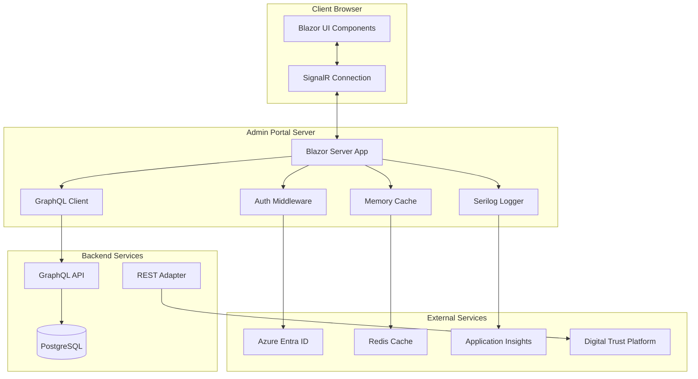

# Admin Portal Architecture

**Version:** 1.0  
**Date:** September 10, 2025  
**Phase:** Proof-of-Operation (POA)  
**Technology:** Blazor Server (.NET 9) with MudBlazor

## Table of Contents
- [Overview](#overview)
- [Architecture Decision](#architecture-decision)
- [System Architecture](#system-architecture)
- [Component Structure](#component-structure)
- [Authentication Flow](#authentication-flow)
- [Data Flow](#data-flow)
- [Security Considerations](#security-considerations)
- [Deployment Architecture](#deployment-architecture)
- [Performance Optimization](#performance-optimization)

## Overview

The NumbatWallet Admin Portal is a web-based management interface for government officers to manage digital credentials, view audit logs, and administer the multi-tenant wallet platform. Built with Blazor Server for rapid development and real-time capabilities.

### Key Requirements
- **Users**: Government officers (credential issuers, administrators, auditors)
- **Authentication**: Azure Entra ID (formerly Azure AD)
- **API**: GraphQL primary, REST adapter for DTP
- **Features**: Credential management, audit logs, tenant administration
- **Performance**: <500ms response time, real-time updates
- **Security**: Role-based access, audit trail, secure by default

### Why Blazor Server?
- **Rapid Development**: Full-stack C# development
- **Real-time Updates**: SignalR-based push notifications
- **Thin Client**: No client-side API keys or sensitive data
- **Server Security**: All processing server-side
- **Cost Effective**: Minimal frontend complexity for POA

## Architecture Decision

### Technology Stack
```yaml
Frontend:
  Framework: Blazor Server (.NET 9)
  UI Library: MudBlazor v6
  CSS Framework: MudBlazor + Custom SCSS
  Real-time: SignalR (built-in)
  
Backend:
  Runtime: .NET 9 (POA) → .NET 10 (Production)
  Language: C# 13 (POA) → C# 14 (Production)
  API Client: GraphQL (HotChocolate.Client)
  Authentication: Azure Entra ID
  
Infrastructure:
  Hosting: Azure Container Apps
  Session: Azure Redis Cache
  Logging: Serilog → Application Insights
  Monitoring: Azure Monitor
```

### Component Architecture



## System Architecture

### Layered Architecture

```
Admin Portal Solution
├── NumbatWallet.Admin.Web/           # Blazor Server Project
│   ├── Program.cs                    # Application entry point
│   ├── App.razor                     # Root component
│   ├── _Imports.razor                # Global imports
│   ├── wwwroot/                      # Static assets
│   │   ├── css/
│   │   ├── js/
│   │   └── images/
│   ├── Pages/                        # Razor pages
│   │   ├── Index.razor               # Dashboard
│   │   ├── Credentials/
│   │   │   ├── Issue.razor          # Issue credential
│   │   │   ├── List.razor           # List credentials
│   │   │   └── Details.razor        # Credential details
│   │   ├── Audit/
│   │   │   └── Logs.razor           # Audit log viewer
│   │   └── Tenants/
│   │       └── Manage.razor         # Tenant management
│   ├── Components/                   # Reusable components
│   │   ├── Layout/
│   │   │   ├── MainLayout.razor
│   │   │   ├── NavMenu.razor
│   │   │   └── UserProfile.razor
│   │   ├── Credentials/
│   │   │   ├── CredentialCard.razor
│   │   │   ├── IssueForm.razor
│   │   │   └── RevokeDialog.razor
│   │   └── Shared/
│   │       ├── ConfirmDialog.razor
│   │       ├── LoadingSpinner.razor
│   │       └── ErrorBoundary.razor
│   ├── Services/                     # Business logic
│   │   ├── GraphQLService.cs        # GraphQL client
│   │   ├── CredentialService.cs     # Credential operations
│   │   ├── AuditService.cs          # Audit log queries
│   │   ├── TenantService.cs         # Tenant management
│   │   └── NotificationService.cs   # Real-time notifications
│   ├── Models/                       # Data models
│   │   ├── ViewModels/
│   │   ├── DTOs/
│   │   └── Enums/
│   └── Authentication/               # Auth handlers
│       ├── CustomAuthStateProvider.cs
│       └── Policies/
│
├── NumbatWallet.Admin.Core/          # Shared library
│   ├── Models/
│   ├── Interfaces/
│   └── Extensions/
│
└── NumbatWallet.Admin.Tests/         # Unit tests
    ├── Pages/
    ├── Components/
    └── Services/
```

## Component Structure

### Page Components

```csharp
// Pages/Credentials/Issue.razor
@page "/credentials/issue"
@attribute [Authorize(Roles = "CredentialIssuer,Administrator")]
@inject ICredentialService CredentialService
@inject ISnackbar Snackbar
@inject NavigationManager Navigation

<PageTitle>Issue Credential</PageTitle>

<MudContainer MaxWidth="MaxWidth.Large" Class="py-8">
    <MudText Typo="Typo.h4" Class="mb-4">Issue New Credential</MudText>
    
    <MudPaper Class="pa-4">
        <EditForm Model="@model" OnValidSubmit="HandleSubmit">
            <DataAnnotationsValidator />
            
            <MudGrid>
                <MudItem xs="12" md="6">
                    <MudTextField @bind-Value="model.WalletId" 
                                  Label="Wallet ID" 
                                  Required="true"
                                  Validation="@(() => ValidateWalletId(model.WalletId))" />
                </MudItem>
                
                <MudItem xs="12" md="6">
                    <MudSelect @bind-Value="model.CredentialType" 
                               Label="Credential Type" 
                               Required="true">
                        @foreach (var type in credentialTypes)
                        {
                            <MudSelectItem Value="@type">@type.DisplayName</MudSelectItem>
                        }
                    </MudSelect>
                </MudItem>
                
                <!-- Dynamic claim fields based on credential type -->
                @if (model.CredentialType != null)
                {
                    <DynamicClaimFields CredentialType="@model.CredentialType" 
                                        @bind-Claims="model.Claims" />
                }
                
                <MudItem xs="12" Class="d-flex justify-end gap-2 mt-4">
                    <MudButton Variant="Variant.Text" 
                               OnClick="Cancel">Cancel</MudButton>
                    <MudButton Variant="Variant.Filled" 
                               Color="Color.Primary" 
                               ButtonType="ButtonType.Submit"
                               Disabled="@isProcessing">
                        @if (isProcessing)
                        {
                            <MudProgressCircular Size="Size.Small" Indeterminate="true" />
                            <span class="ml-2">Issuing...</span>
                        }
                        else
                        {
                            <span>Issue Credential</span>
                        }
                    </MudButton>
                </MudItem>
            </MudGrid>
        </EditForm>
    </MudPaper>
</MudContainer>

@code {
    private IssueCredentialModel model = new();
    private bool isProcessing = false;
    private List<CredentialTypeInfo> credentialTypes = new();
    
    protected override async Task OnInitializedAsync()
    {
        credentialTypes = await CredentialService.GetCredentialTypesAsync();
    }
    
    private async Task HandleSubmit()
    {
        isProcessing = true;
        
        try
        {
            var result = await CredentialService.IssueCredentialAsync(model);
            
            Snackbar.Add($"Credential {result.Id} issued successfully", Severity.Success);
            Navigation.NavigateTo($"/credentials/{result.Id}");
        }
        catch (Exception ex)
        {
            Snackbar.Add($"Failed to issue credential: {ex.Message}", Severity.Error);
        }
        finally
        {
            isProcessing = false;
        }
    }
}
```

### Service Layer

```csharp
// Services/GraphQLService.cs
using HotChocolate.Client;

public class GraphQLService
{
    private readonly IGraphQLClient _client;
    private readonly ILogger<GraphQLService> _logger;
    private readonly ITenantContext _tenantContext;
    
    public GraphQLService(
        IGraphQLClient client,
        ILogger<GraphQLService> logger,
        ITenantContext tenantContext)
    {
        _client = client;
        _logger = logger;
        _tenantContext = tenantContext;
    }
    
    public async Task<T> QueryAsync<T>(string query, object? variables = null)
    {
        try
        {
            var request = new GraphQLRequest
            {
                Query = query,
                Variables = variables,
                Extensions = new Dictionary<string, object>
                {
                    ["tenantId"] = _tenantContext.TenantId
                }
            };
            
            var response = await _client.SendQueryAsync<T>(request);
            
            if (response.Errors?.Any() == true)
            {
                var errors = string.Join(", ", response.Errors.Select(e => e.Message));
                throw new GraphQLException($"GraphQL errors: {errors}");
            }
            
            return response.Data;
        }
        catch (Exception ex)
        {
            _logger.LogError(ex, "GraphQL query failed");
            throw;
        }
    }
    
    public async Task<T> MutateAsync<T>(string mutation, object variables)
    {
        var request = new GraphQLRequest
        {
            Query = mutation,
            Variables = variables,
            Extensions = new Dictionary<string, object>
            {
                ["tenantId"] = _tenantContext.TenantId
            }
        };
        
        var response = await _client.SendMutationAsync<T>(request);
        
        if (response.Errors?.Any() == true)
        {
            throw new GraphQLException(response.Errors);
        }
        
        return response.Data;
    }
}
```

## Authentication Flow

### Azure Entra ID Integration

```csharp
// Program.cs
var builder = WebApplication.CreateBuilder(args);

// Add authentication
builder.Services.AddAuthentication(OpenIdConnectDefaults.AuthenticationScheme)
    .AddMicrosoftIdentityWebApp(options =>
    {
        builder.Configuration.Bind("AzureAd", options);
        options.Events.OnTokenValidated = async context =>
        {
            // Extract tenant from claims
            var tenantClaim = context.Principal?.FindFirst("extension_TenantId");
            if (tenantClaim != null)
            {
                context.HttpContext.Items["TenantId"] = tenantClaim.Value;
            }
        };
    });

// Add authorization policies
builder.Services.AddAuthorization(options =>
{
    options.AddPolicy("CredentialIssuer", policy =>
        policy.RequireRole("CredentialIssuer", "Administrator"));
    
    options.AddPolicy("Auditor", policy =>
        policy.RequireRole("Auditor", "Administrator"));
    
    options.AddPolicy("Administrator", policy =>
        policy.RequireRole("Administrator"));
});

// Add Blazor services
builder.Services.AddRazorPages();
builder.Services.AddServerSideBlazor();

// Add MudBlazor
builder.Services.AddMudServices(config =>
{
    config.SnackbarConfiguration.PositionClass = Defaults.Classes.Position.TopRight;
    config.SnackbarConfiguration.PreventDuplicates = true;
    config.SnackbarConfiguration.NewestOnTop = true;
});
```

### Custom Authentication State Provider

```csharp
public class CustomAuthStateProvider : AuthenticationStateProvider
{
    private readonly IHttpContextAccessor _httpContextAccessor;
    private readonly ITenantContext _tenantContext;
    
    public override Task<AuthenticationState> GetAuthenticationStateAsync()
    {
        var user = _httpContextAccessor.HttpContext?.User;
        
        if (user?.Identity?.IsAuthenticated == true)
        {
            // Set tenant context from claims
            var tenantId = user.FindFirst("extension_TenantId")?.Value;
            if (!string.IsNullOrEmpty(tenantId))
            {
                _tenantContext.SetTenant(tenantId);
            }
            
            // Add custom claims if needed
            var identity = new ClaimsIdentity(user.Claims, "AzureAD");
            var principal = new ClaimsPrincipal(identity);
            
            return Task.FromResult(new AuthenticationState(principal));
        }
        
        return Task.FromResult(new AuthenticationState(new ClaimsPrincipal()));
    }
}
```

## Data Flow

### GraphQL Queries

```graphql
# Get credentials for dashboard
query GetDashboardData($tenantId: ID!) {
  tenant(id: $tenantId) {
    statistics {
      totalCredentials
      activeCredentials
      revokedCredentials
      issuedToday
      issuedThisWeek
      issuedThisMonth
    }
    recentActivity {
      id
      action
      user
      timestamp
      details
    }
  }
}

# Issue credential mutation
mutation IssueCredential($input: IssueCredentialInput!) {
  issueCredential(input: $input) {
    id
    type
    status
    issuedAt
    wallet {
      id
      holder {
        name
        email
      }
    }
  }
}

# Query audit logs
query GetAuditLogs($filter: AuditLogFilter!) {
  auditLogs(filter: $filter) {
    edges {
      node {
        id
        action
        user
        tenantId
        timestamp
        ipAddress
        userAgent
        success
        details
      }
    }
    pageInfo {
      hasNextPage
      endCursor
    }
  }
}
```

### Real-time Updates with SignalR

```csharp
// Services/NotificationService.cs
public class NotificationService : IAsyncDisposable
{
    private readonly HubConnection _hubConnection;
    private readonly ILogger<NotificationService> _logger;
    
    public event Action<CredentialNotification>? OnCredentialIssued;
    public event Action<CredentialNotification>? OnCredentialRevoked;
    
    public NotificationService(NavigationManager navigation, ILogger<NotificationService> logger)
    {
        _logger = logger;
        
        _hubConnection = new HubConnectionBuilder()
            .WithUrl(navigation.ToAbsoluteUri("/notificationHub"))
            .WithAutomaticReconnect()
            .Build();
        
        _hubConnection.On<CredentialNotification>("CredentialIssued", notification =>
        {
            OnCredentialIssued?.Invoke(notification);
        });
        
        _hubConnection.On<CredentialNotification>("CredentialRevoked", notification =>
        {
            OnCredentialRevoked?.Invoke(notification);
        });
    }
    
    public async Task StartAsync()
    {
        await _hubConnection.StartAsync();
        _logger.LogInformation("SignalR connection established");
    }
    
    public async ValueTask DisposeAsync()
    {
        await _hubConnection.DisposeAsync();
    }
}
```

## Security Considerations

### Security Headers

```csharp
// Middleware/SecurityHeadersMiddleware.cs
public class SecurityHeadersMiddleware
{
    private readonly RequestDelegate _next;
    
    public async Task InvokeAsync(HttpContext context)
    {
        context.Response.Headers.Add("X-Content-Type-Options", "nosniff");
        context.Response.Headers.Add("X-Frame-Options", "DENY");
        context.Response.Headers.Add("X-XSS-Protection", "1; mode=block");
        context.Response.Headers.Add("Referrer-Policy", "strict-origin-when-cross-origin");
        context.Response.Headers.Add("Content-Security-Policy", 
            "default-src 'self'; " +
            "script-src 'self' 'unsafe-inline' 'unsafe-eval'; " +
            "style-src 'self' 'unsafe-inline'; " +
            "img-src 'self' data: https:; " +
            "connect-src 'self' wss: https:");
        
        await _next(context);
    }
}
```

### Input Validation

```csharp
public class IssueCredentialModel : IValidatableObject
{
    [Required]
    [RegularExpression(@"^wallet_[a-zA-Z0-9]{16}$")]
    public string WalletId { get; set; } = string.Empty;
    
    [Required]
    public CredentialType? CredentialType { get; set; }
    
    [Required]
    [MinLength(1)]
    public Dictionary<string, object> Claims { get; set; } = new();
    
    public DateTime? ExpiresAt { get; set; }
    
    public IEnumerable<ValidationResult> Validate(ValidationContext validationContext)
    {
        if (ExpiresAt.HasValue && ExpiresAt.Value <= DateTime.UtcNow)
        {
            yield return new ValidationResult(
                "Expiry date must be in the future",
                new[] { nameof(ExpiresAt) });
        }
        
        // Validate claims based on credential type
        if (CredentialType != null)
        {
            var requiredClaims = GetRequiredClaimsForType(CredentialType.Value);
            foreach (var claim in requiredClaims)
            {
                if (!Claims.ContainsKey(claim))
                {
                    yield return new ValidationResult(
                        $"Required claim '{claim}' is missing",
                        new[] { nameof(Claims) });
                }
            }
        }
    }
}
```

## Deployment Architecture

### Container Configuration

```dockerfile
# Dockerfile
FROM mcr.microsoft.com/dotnet/aspnet:9.0 AS base
WORKDIR /app
EXPOSE 80
EXPOSE 443

FROM mcr.microsoft.com/dotnet/sdk:9.0 AS build
WORKDIR /src
COPY ["NumbatWallet.Admin.Web/NumbatWallet.Admin.Web.csproj", "NumbatWallet.Admin.Web/"]
RUN dotnet restore "NumbatWallet.Admin.Web/NumbatWallet.Admin.Web.csproj"
COPY . .
WORKDIR "/src/NumbatWallet.Admin.Web"
RUN dotnet build "NumbatWallet.Admin.Web.csproj" -c Release -o /app/build

FROM build AS publish
RUN dotnet publish "NumbatWallet.Admin.Web.csproj" -c Release -o /app/publish

FROM base AS final
WORKDIR /app
COPY --from=publish /app/publish .
ENTRYPOINT ["dotnet", "NumbatWallet.Admin.Web.dll"]
```

### Azure Container Apps Configuration

```yaml
configuration:
  ingress:
    external: true
    targetPort: 80
    transport: http
    allowInsecure: false
    traffic:
      - weight: 100
        latestRevision: true
  secrets:
    - name: connection-string
      keyVaultUrl: ${KEY_VAULT_URI}/secrets/RedisConnectionString
    - name: app-insights-key
      keyVaultUrl: ${KEY_VAULT_URI}/secrets/ApplicationInsightsKey
  registries:
    - server: ${ACR_NAME}.azurecr.io
      identity: system
      
template:
  containers:
    - name: admin-portal
      image: ${ACR_NAME}.azurecr.io/admin-portal:latest
      resources:
        cpu: 0.5
        memory: 1Gi
      env:
        - name: ASPNETCORE_ENVIRONMENT
          value: Production
        - name: ConnectionStrings__Redis
          secretRef: connection-string
        - name: ApplicationInsights__InstrumentationKey
          secretRef: app-insights-key
  scale:
    minReplicas: 2
    maxReplicas: 10
    rules:
      - name: http-rule
        http:
          metadata:
            concurrentRequests: "20"
```

## Performance Optimization

### Caching Strategy

```csharp
// Services/CacheService.cs
public class CacheService
{
    private readonly IMemoryCache _memoryCache;
    private readonly IDistributedCache _distributedCache;
    
    public async Task<T?> GetOrSetAsync<T>(
        string key,
        Func<Task<T>> factory,
        TimeSpan? expiration = null)
    {
        // L1 Cache - Memory
        if (_memoryCache.TryGetValue(key, out T? cached))
        {
            return cached;
        }
        
        // L2 Cache - Redis
        var distributed = await _distributedCache.GetAsync(key);
        if (distributed != null)
        {
            var deserialized = JsonSerializer.Deserialize<T>(distributed);
            _memoryCache.Set(key, deserialized, TimeSpan.FromMinutes(5));
            return deserialized;
        }
        
        // Fetch from source
        var value = await factory();
        
        // Cache in both layers
        var serialized = JsonSerializer.SerializeToUtf8Bytes(value);
        await _distributedCache.SetAsync(key, serialized, new DistributedCacheEntryOptions
        {
            AbsoluteExpirationRelativeToNow = expiration ?? TimeSpan.FromMinutes(15)
        });
        
        _memoryCache.Set(key, value, TimeSpan.FromMinutes(5));
        
        return value;
    }
}
```

### Component Virtualization

```razor
@* For large lists, use virtualization *@
<MudTable Items="@credentials" 
          Virtualize="true"
          Height="400px"
          FixedHeader="true"
          Hover="true"
          Dense="true">
    <HeaderContent>
        <MudTh>ID</MudTh>
        <MudTh>Type</MudTh>
        <MudTh>Status</MudTh>
        <MudTh>Issued</MudTh>
        <MudTh>Actions</MudTh>
    </HeaderContent>
    <RowTemplate>
        <MudTd>@context.Id</MudTd>
        <MudTd>@context.Type</MudTd>
        <MudTd>
            <MudChip Color="@GetStatusColor(context.Status)">
                @context.Status
            </MudChip>
        </MudTd>
        <MudTd>@context.IssuedAt.ToLocalTime()</MudTd>
        <MudTd>
            <MudIconButton Icon="@Icons.Material.Filled.Info" 
                           OnClick="@(() => ViewDetails(context))" />
            <MudIconButton Icon="@Icons.Material.Filled.Block" 
                           OnClick="@(() => RevokeCredential(context))"
                           Disabled="@(context.Status != CredentialStatus.Active)" />
        </MudTd>
    </RowTemplate>
</MudTable>
```

## Summary

The Admin Portal architecture provides:
1. **Rapid Development** with Blazor Server and MudBlazor
2. **Enterprise Authentication** via Azure Entra ID
3. **Real-time Updates** through SignalR
4. **GraphQL Integration** for flexible querying
5. **Comprehensive Logging** with Application Insights
6. **Security by Default** with proper headers and validation
7. **Scalable Deployment** on Azure Container Apps

This architecture ensures the POA admin portal can be developed quickly while maintaining production-ready quality and security standards.