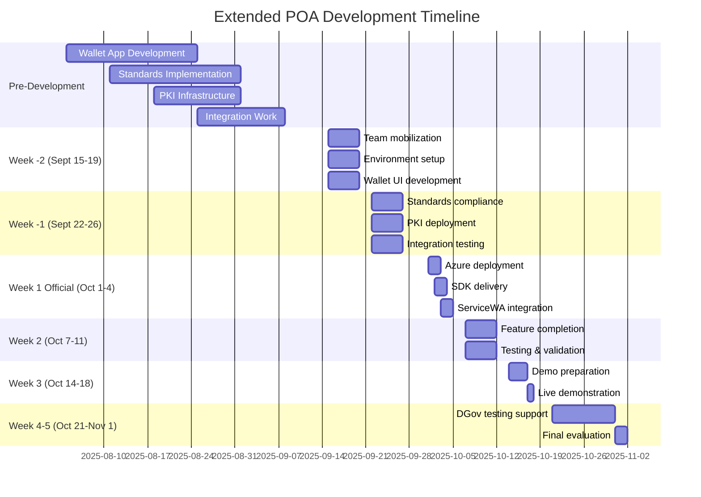

# POA Requirements Validation Document

**Version:** 1.0
**Created:** September 15, 2025
**Purpose:** Complete validation of POA requirements against GitHub Project #18
**Development Timeline:** 6-8 weeks (pre-start) + 3 weeks (official POA) + 2 weeks (testing)

## Executive Summary

This document provides a comprehensive mapping of all Proof-of-Operation (POA) requirements from tender DPC2142 to our GitHub project structure. It identifies gaps, defines acceptance criteria, and establishes a complete development plan to ensure 100% tender compliance.

**Current Status:**
- ✅ 59 GitHub issues created
- ⚠️ 60% tender requirements covered
- 🔴 Critical gaps in wallet app, standards compliance, and PKI
- 📋 40+ additional issues needed

## Table of Contents

1. [Tender Requirements Matrix](#tender-requirements-matrix)
2. [GitHub Issue Mapping](#github-issue-mapping)
3. [Gap Analysis](#gap-analysis)
4. [Missing Issues to Create](#missing-issues-to-create)
5. [Acceptance Criteria](#acceptance-criteria)
6. [Test Scenarios](#test-scenarios)
7. [Development Timeline](#development-timeline)
8. [Risk Register](#risk-register)
9. [Success Metrics](#success-metrics)

---

## 1. Tender Requirements Matrix

### 1.1 Core POA Requirements (Section 1.4)

| Requirement ID | Description | Priority | GitHub Issue | Status | Gap |
|---------------|-------------|----------|--------------|--------|-----|
| POA-REQ-001 | Provide white-label/proprietary wallet application | P0 | #24 (partial) | ⚠️ | Need full wallet, not just demo |
| POA-REQ-002 | Deliver SDK with documentation for ServiceWA | P0 | #12, #39, #41 | ✅ | Covered |
| POA-REQ-003 | Demonstrate OIDC endpoint integration | P0 | #13, #14 | ✅ | Covered |
| POA-REQ-004 | Real-time credential issuance | P0 | #17 | ✅ | Covered |
| POA-REQ-005 | Real-time credential verification | P0 | Missing | 🔴 | Need issue |
| POA-REQ-006 | Real-time credential revocation | P0 | Missing | 🔴 | Need issue |
| POA-REQ-007 | Selective disclosure demonstration | P0 | Missing | 🔴 | Need issue |
| POA-REQ-008 | Cross-platform support (iOS/Android) | P0 | #24 (partial) | ⚠️ | Need device testing |
| POA-REQ-009 | Deploy to nominated smartphones | P0 | Missing | 🔴 | Need issue |
| POA-REQ-010 | ISO/IEC 18013-5 compliance | P0 | Missing | 🔴 | Need issue |
| POA-REQ-011 | W3C VC Data Model support | P0 | Missing | 🔴 | Need issue |
| POA-REQ-012 | OpenID4VCI implementation | P0 | Missing | 🔴 | Need issue |
| POA-REQ-013 | OpenID4VP implementation | P0 | Missing | 🔴 | Need issue |
| POA-REQ-014 | PKI infrastructure with IACA | P0 | Partial | 🔴 | Need full PKI |
| POA-REQ-015 | Admin dashboard for operations | P0 | Missing | 🔴 | Need issue |
| POA-REQ-016 | Logging and audit capabilities | P0 | Missing | 🔴 | Need issue |
| POA-REQ-017 | Performance monitoring dashboard | P0 | Missing | 🔴 | Need issue |
| POA-REQ-018 | WA IdX integration capability | P0 | #14 | ✅ | Covered |
| POA-REQ-019 | Offline verification support | P0 | Missing | 🔴 | Need issue |
| POA-REQ-020 | QR code generation/scanning | P1 | Missing | 🔴 | Need issue |

### 1.2 Technical Standards Requirements (Schedule 3)

| Requirement ID | Reference | Description | GitHub Issue | Status | Gap |
|---------------|-----------|-------------|--------------|--------|-----|
| TS-001 | TS-1 | Data encryption at rest and transit | Missing | 🔴 | Need issue |
| TS-002 | TS-2 | Authenticated communication channels | Missing | 🔴 | Need issue |
| TS-003 | TS-3 | Multi-Factor Authentication | #13 (partial) | ⚠️ | Need MFA |
| TS-004 | TS-4 | Data minimization principles | Missing | 🔴 | Need issue |
| TS-005 | TS-5 | PKI management capabilities | Missing | 🔴 | Need issue |
| TS-006 | TS-6 | Digital signatures for credentials | Missing | 🔴 | Need issue |
| TS-007 | TS-7 | OID4VCI workflow compliance | Missing | 🔴 | Need issue |
| TS-008 | TS-8 | OIDC4VP workflow compliance | Missing | 🔴 | Need issue |
| TS-009 | TS-9 | Transaction log dashboard | Missing | 🔴 | Need issue |
| TS-010 | TS-10 | TDIF alignment | Missing | 🔴 | Need issue |
| TS-011 | TS-11 | Open-source SDK licensing | Missing | 🔴 | Need issue |
| TS-012 | TS-12 | Mutable credential fields | Missing | 🔴 | Need issue |
| TS-013 | TS-13 | Modular design for standards | Missing | 🔴 | Need issue |

### 1.3 Compliance Requirements

| Requirement ID | Reference | Description | GitHub Issue | Status | Gap |
|---------------|-----------|-------------|--------------|--------|-----|
| CR-001 | CR-1 | ISO 18013 conformance | Missing | 🔴 | Need issue |
| CR-002 | CR-2 | eIDAS 2.0 conformance | Missing | 🔴 | Need issue |
| CR-003 | CR-3 | Cyber incident reporting | Missing | 🔴 | Need issue |
| CR-004 | CR-4 | IRAP/SOC2/ISO27001 certs | Missing | 🔴 | Need issue |
| CR-005 | CR-5 | Entity information security | Missing | 🔴 | Need issue |
| CR-006 | CR-6 | Secure disposal procedures | Missing | 🔴 | Need issue |
| CR-007 | CR-7 | SLA framework | Missing | 🔴 | Need issue |
| CR-008 | CR-8 | ITIL-aligned SLA | Missing | 🔴 | Need issue |

### 1.4 Platform Requirements

| Requirement ID | Reference | Description | GitHub Issue | Status | Gap |
|---------------|-----------|-------------|--------------|--------|-----|
| PS-001 | PS-1 | Wallet SDK with all capabilities | #12, #39, #41 | ✅ | Covered |
| PS-002 | PS-2 | Cryptographic binding | Missing | 🔴 | Need issue |
| PS-003 | PS-3 | Clear separation of concerns | #10 | ✅ | Covered |
| PS-004 | PS-4 | Well-documented APIs | #33 | ✅ | Covered |
| PS-005 | PS-5 | E2E integration tests | #44, #51 | ✅ | Covered |
| PS-006 | PS-6 | Security scanning | #57, #59 | ✅ | Covered |
| PS-007 | PS-7 | SDK update process | Missing | 🔴 | Need issue |
| PS-008 | PS-8 | Selective disclosure mechanism | Missing | 🔴 | Need issue |
| PS-009 | PS-9 | Inter-jurisdictional support | Missing | 🔴 | Need issue |
| PS-010 | PS-10 | Push notifications | Missing | 🔴 | Need issue |
| PA-001 | PA-1 | OpenAPI documentation | #33 | ✅ | Covered |
| PA-002 | PA-2 | API security testing | #51 | ✅ | Covered |
| PA-003 | PA-3 | API access controls | Missing | 🔴 | Need issue |
| PA-004 | PA-4 | WCAG 2.2+ web interface | Missing | 🔴 | Need issue |
| PA-005 | PA-5 | In-person/remote verification | Missing | 🔴 | Need issue |
| PA-006 | PA-6 | Credential status interfaces | Missing | 🔴 | Need issue |
| PA-007 | PA-7 | Digital trust service config | Missing | 🔴 | Need issue |

---

## 2. GitHub Issue Mapping

### 2.1 Current Issue Distribution

| Milestone | Issues | Coverage | Status |
|-----------|--------|----------|--------|
| 001-Week0-Foundation | 12 | Infrastructure setup | ✅ Good |
| 002-Week1-Infrastructure | 11 | Backend & SDK basics | ✅ Good |
| 003-Week2-Backend | 9 | Core APIs | ⚠️ Missing wallet |
| 004-Week3-AuthAPIs | 7 | Authentication | ⚠️ Missing standards |
| 005-Week4-Demo | 10 | Demo preparation | 🔴 Too late |
| 006-Week5-UAT | 7 | Testing support | ✅ Good |
| 007-Week6-Handover | 3 | Documentation | ⚠️ Incomplete |

### 2.2 Issue Category Analysis

| Category | Current | Required | Gap |
|----------|---------|----------|-----|
| Wallet App | 1 | 10 | -9 |
| Standards Compliance | 0 | 15 | -15 |
| PKI/Security | 2 | 8 | -6 |
| Admin/Operations | 0 | 5 | -5 |
| Documentation | 3 | 8 | -5 |
| Testing | 15 | 20 | -5 |
| **TOTAL** | **59** | **104** | **-45** |

---

## 3. Gap Analysis

### 3.1 Critical Gaps (Must Fix)

#### 🔴 **CRITICAL: Missing Wallet Application**
- **Current:** Only demo app in Week 3 (#24)
- **Required:** Full wallet from Day 1
- **Impact:** Cannot demonstrate without wallet
- **Action:** Create 10 new issues for wallet development

#### 🔴 **CRITICAL: No Standards Implementation**
- **Current:** No ISO 18013-5, W3C VC, OID4VCI/VP tasks
- **Required:** Full compliance demonstration
- **Impact:** Automatic disqualification
- **Action:** Create 15 standards compliance issues

#### 🔴 **CRITICAL: Incomplete PKI Infrastructure**
- **Current:** Basic certificates only
- **Required:** IACA, signing certs, trust lists
- **Impact:** Cannot issue valid credentials
- **Action:** Create 6 PKI-specific issues

### 3.2 High Priority Gaps

#### ⚠️ **HIGH: Missing Admin Dashboard**
- **Current:** No admin interface tasks
- **Required:** Full CRUD operations dashboard
- **Impact:** Cannot manage credentials
- **Action:** Create 3 admin portal issues

#### ⚠️ **HIGH: No Offline Capabilities**
- **Current:** No offline tasks
- **Required:** Offline verification demo
- **Impact:** Key requirement missing
- **Action:** Create 2 offline feature issues

#### ⚠️ **HIGH: Missing Device Testing**
- **Current:** No device deployment tasks
- **Required:** Deploy to test phones
- **Impact:** Cannot validate mobile experience
- **Action:** Create 2 device testing issues

### 3.3 Medium Priority Gaps

- Accessibility features (WCAG 2.2+)
- Performance monitoring dashboard
- Disaster recovery demonstration
- Compliance documentation
- Knowledge transfer materials

---

## 4. Missing Issues to Create

### 4.1 Wallet Application Issues (10 issues)

```markdown
POA-100: Create proprietary wallet application architecture
POA-101: Design wallet UI/UX mockups and user flows
POA-102: Implement wallet onboarding and setup flow
POA-103: Build credential wallet home screen
POA-104: Create credential detail view with actions
POA-105: Implement credential sharing/presentation flow
POA-106: Add biometric authentication to wallet
POA-107: Build wallet settings and profile screens
POA-108: Implement wallet backup and recovery
POA-109: Add multi-device sync capabilities
```

### 4.2 Standards Compliance Issues (15 issues)

```markdown
POA-110: Implement ISO 18013-5 mDL data structures
POA-111: Create ISO 18013-7 online verification support
POA-112: Implement W3C VC Data Model
POA-113: Add W3C DID methods and resolution
POA-114: Implement OpenID4VCI issuance flow
POA-115: Implement OpenID4VP presentation flow
POA-116: Create TDIF compliance mappings
POA-117: Implement eIDAS 2.0 requirements
POA-118: Add selective disclosure with consent UI
POA-119: Create standards conformance test suite
POA-120: Implement mDoc format support
POA-121: Add JWT-VC and JSON-LD support
POA-122: Create verifiable presentations
POA-123: Implement credential manifest support
POA-124: Add proof protocols (BBS+, CL signatures)
```

### 4.3 PKI & Security Issues (8 issues)

```markdown
POA-125: Set up IACA root certificates
POA-126: Implement Document Signing Certificates
POA-127: Create trust list management
POA-128: Implement HSM integration
POA-129: Add certificate lifecycle management
POA-130: Create revocation registry
POA-131: Implement key rotation policies
POA-132: Add cryptographic proof validation
```

### 4.4 Operations & Admin Issues (5 issues)

```markdown
POA-133: Build admin dashboard UI
POA-134: Implement credential CRUD operations
POA-135: Create audit log viewer
POA-136: Build performance monitoring dashboard
POA-137: Add user support ticket system
```

### 4.5 Feature Implementation Issues (12 issues)

```markdown
POA-138: Implement offline verification
POA-139: Add QR code generation/scanning
POA-140: Implement NFC credential sharing
POA-141: Add Bluetooth credential exchange
POA-142: Create credential revocation flow
POA-143: Implement real-time updates
POA-144: Add push notification support
POA-145: Create data minimization controls
POA-146: Implement consent management
POA-147: Add transaction history
POA-148: Create credential delegation
POA-149: Implement emergency access
```

---

## 5. Acceptance Criteria

### 5.1 POA Demonstration Acceptance

#### Week 3 Live Demo Requirements

**MUST demonstrate:**

1. **Wallet Operations**
   - [ ] Install wallet on iOS device
   - [ ] Install wallet on Android device
   - [ ] Complete onboarding with biometrics
   - [ ] View credential list
   - [ ] Access credential details

2. **Credential Issuance**
   - [ ] Admin logs into portal
   - [ ] Admin issues test credential
   - [ ] Credential appears in wallet <5 seconds
   - [ ] Audit log shows issuance
   - [ ] Push notification received

3. **Credential Verification**
   - [ ] Generate QR code for sharing
   - [ ] Verifier scans QR code
   - [ ] Selective disclosure prompt
   - [ ] User consents to sharing
   - [ ] Verification succeeds

4. **Offline Mode**
   - [ ] Enable airplane mode
   - [ ] Present credential via QR
   - [ ] Verifier validates offline
   - [ ] Show cryptographic proof
   - [ ] Demonstrate tamper detection

5. **Revocation**
   - [ ] Admin revokes credential
   - [ ] Wallet shows revoked status
   - [ ] Verification fails appropriately
   - [ ] Audit trail complete
   - [ ] User notified

6. **Standards Compliance**
   - [ ] Show ISO 18013-5 format
   - [ ] Demonstrate W3C VC structure
   - [ ] Display DID resolution
   - [ ] Show OID4VCI flow
   - [ ] Validate signatures

7. **Multi-tenancy**
   - [ ] Two agencies issue credentials
   - [ ] Complete isolation verified
   - [ ] Cross-tenant access blocked
   - [ ] Separate branding shown
   - [ ] Independent audit logs

8. **Performance**
   - [ ] 100 concurrent users
   - [ ] <500ms response time
   - [ ] Real-time monitoring
   - [ ] No errors under load
   - [ ] Graceful degradation

### 5.2 Technical Acceptance Criteria

| Component | Acceptance Criteria | Test Method |
|-----------|-------------------|-------------|
| Backend API | 99.9% uptime, <500ms p95 | Load testing |
| Flutter SDK | Compiles in ServiceWA | Integration test |
| .NET SDK | NuGet package deployable | Package test |
| TypeScript SDK | NPM package deployable | Package test |
| Wallet App | Runs on iOS 15+ and Android 10+ | Device testing |
| Admin Portal | All CRUD operations work | Functional test |
| PKI | Valid certificate chain | Certificate validation |
| Standards | Pass conformance tests | Automated testing |

### 5.3 Documentation Acceptance

**Required Documents:**

- [ ] API Specification (OpenAPI 3.0)
- [ ] SDK Integration Guides (3 SDKs)
- [ ] Architecture Diagrams (C4 model)
- [ ] Security Assessment Report
- [ ] Performance Test Results
- [ ] Compliance Mapping Matrix
- [ ] Operational Runbooks
- [ ] SLA Framework Document
- [ ] Knowledge Transfer Package

---

## 6. Test Scenarios

### 6.1 Core Test Scenarios

#### Scenario 1: First-Time User Onboarding
```
GIVEN a new user with ServiceWA app
WHEN they access Digital Wallet for first time
THEN they should:
1. See welcome screen
2. Complete identity verification
3. Set up biometric authentication
4. Receive first credential
5. View credential in wallet
Duration: <3 minutes
```

#### Scenario 2: Driver License Issuance
```
GIVEN an authenticated admin user
WHEN they issue a mobile driver license
THEN:
1. Credential created with ISO 18013-5 format
2. User receives push notification
3. Credential appears in wallet
4. All mandatory fields populated
5. Photo and signature included
Duration: <30 seconds
```

#### Scenario 3: Age Verification at Venue
```
GIVEN a user with mDL in wallet
WHEN venue scans QR for age check
THEN:
1. Selective disclosure prompt shows
2. Only age/photo shared (not address)
3. Verification completes offline
4. Audit log created
5. No PII stored by verifier
Duration: <10 seconds
```

#### Scenario 4: Credential Revocation
```
GIVEN an active credential in wallet
WHEN admin revokes for security reason
THEN:
1. Revocation effective immediately
2. User notified via push
3. Credential marked invalid
4. Verification fails with reason
5. Recovery process available
Duration: <5 minutes
```

#### Scenario 5: Multi-Device Access
```
GIVEN user with credential on phone A
WHEN they install wallet on phone B
THEN:
1. Authentication required
2. Existing credentials sync
3. Both devices stay synchronized
4. Revoke access from either device
5. Audit shows all devices
Duration: <2 minutes
```

### 6.2 Advanced Test Scenarios

#### Scenario 6: Cross-Agency Credentials
```
Test multiple agencies issuing to same wallet
Verify complete tenant isolation
Check credential organization in wallet
```

#### Scenario 7: Delegation to Guardian
```
Parent delegates child's credential
Guardian can present on behalf
Audit shows delegation chain
Revocation removes delegation
```

#### Scenario 8: Emergency Access
```
User loses device
Emergency access via web portal
Temporary credential issued
Old device remotely wiped
```

#### Scenario 9: Batch Operations
```
Admin issues 100 credentials
System handles load gracefully
All credentials delivered
Performance stays <500ms
```

#### Scenario 10: Disaster Recovery
```
Primary system fails
Failover to backup region
No data loss
Service restored <4 hours
```

---

## 7. Development Timeline

### 7.1 Extended Timeline (8 weeks pre-start + 3 weeks POA)



### 7.2 Sprint Plan

#### Pre-Sprint 1 (Aug 4-15) - Foundation
**Goal:** Wallet app foundation and architecture

- Set up development environment
- Create wallet app project structure
- Design UI/UX mockups
- Implement basic navigation
- Set up CI/CD pipelines

**Deliverables:**
- Wallet app shell
- UI design system
- Development environment

#### Pre-Sprint 2 (Aug 18-29) - Standards
**Goal:** Standards compliance implementation

- ISO 18013-5 data structures
- W3C VC/DID implementation
- OpenID4VCI/VP flows
- TDIF alignment
- Conformance testing

**Deliverables:**
- Standards library
- Conformance test suite
- Compliance documentation

#### Pre-Sprint 3 (Sept 1-12) - Integration
**Goal:** Full integration preparation

- PKI infrastructure setup
- ServiceWA SDK integration
- Admin portal development
- Security implementation
- Performance optimization

**Deliverables:**
- Complete PKI
- Admin dashboard
- Security controls

#### Pre-Sprint 4 (Sept 15-26) - Polish
**Goal:** Final preparation for POA

- Device testing
- Bug fixes
- Documentation
- Demo scenarios
- Team training

**Deliverables:**
- Deployable wallet
- Complete documentation
- Demo scripts

#### Official Week 1 (Oct 1-4) - Deployment
**Focus:** Environment setup and SDK delivery

**Monday Oct 1:**
- Azure infrastructure deployment
- Database setup
- Container deployment

**Tuesday Oct 2:**
- SDK package delivery
- Documentation handover
- Integration workshop prep

**Wednesday Oct 3:**
- ServiceWA integration workshop
- Joint debugging session
- API endpoint validation

**Thursday Oct 4:**
- Week 1 demonstration
- Checkpoint review
- Feedback incorporation

#### Official Week 2 (Oct 7-11) - Features
**Focus:** Complete all features

**Monday Oct 7:**
- Credential operations
- Verification flows
- Revocation system

**Tuesday Oct 8:**
- Offline mode
- Selective disclosure
- Multi-device sync

**Wednesday Oct 9:**
- Performance testing
- Security validation
- Bug fixes

**Thursday Oct 10:**
- Integration testing
- Demo dry run
- Issue resolution

**Friday Oct 11:**
- Week 2 checkpoint
- Demo refinement
- Preparation for Week 3

#### Official Week 3 (Oct 14-18) - Demonstration
**Focus:** Live demonstration and evaluation

**Monday Oct 14:**
- Final preparations
- Environment check
- Team briefing

**Tuesday Oct 15:**
- Demo dry run
- Issue fixes
- Presentation polish

**Wednesday Oct 16:**
- Final rehearsal
- Stakeholder prep
- Environment validation

**Thursday Oct 17:**
- **LIVE DEMONSTRATION**
- Q&A session
- Feedback collection

**Friday Oct 18:**
- Debrief
- Issue triage
- Week 4 planning

---

## 8. Risk Register

### 8.1 Critical Risks

| Risk | Probability | Impact | Mitigation | Owner | Status |
|------|------------|--------|------------|-------|--------|
| Wallet not ready | Medium | Critical | Start development now | CTO | 🔴 Active |
| Standards non-compliance | Medium | Critical | Engage consultant | Architect | 🔴 Active |
| PKI complexity | High | High | Pre-configure certificates | Security | ⚠️ Monitor |
| ServiceWA integration | Medium | High | Daily sync meetings | PM | ⚠️ Monitor |
| Performance issues | Low | High | Pre-optimization | Backend | ✅ Controlled |
| Device compatibility | Medium | Medium | Early device testing | Mobile | ⚠️ Monitor |
| Timeline pressure | High | High | 8-week pre-start | PM | ✅ Controlled |

### 8.2 Risk Mitigation Plan

**Immediate Actions (This Week):**
1. Start wallet development immediately
2. Order PKI certificates and HSM
3. Engage standards compliance consultant
4. Procure test devices (iOS & Android)
5. Schedule ServiceWA integration meetings

**Week 1 Actions:**
1. Complete wallet UI mockups
2. Finalize standards approach
3. Deploy PKI test environment
4. Create integration test harness
5. Establish daily sync cadence

**Contingency Plans:**
1. **If wallet delayed:** Use white-label solution
2. **If standards fail:** Document roadmap to compliance
3. **If PKI issues:** Use test certificates with plan
4. **If integration blocked:** Mock ServiceWA endpoints
5. **If performance poor:** Reduce concurrent users

---

## 9. Success Metrics

### 9.1 POA Success Criteria

| Metric | Target | Minimum | Measurement |
|--------|--------|---------|-------------|
| Acceptance Tests Passed | 100% | 95% | Test results |
| Response Time (p95) | <400ms | <500ms | Load testing |
| Concurrent Users | 100 | 50 | Load testing |
| Availability | 99.9% | 99.5% | Monitoring |
| Standards Compliance | 100% | 90% | Conformance tests |
| Security Vulnerabilities | 0 Critical | 0 Critical | Security scan |
| Documentation Complete | 100% | 95% | Review checklist |
| Stakeholder Satisfaction | Excellent | Good | Feedback survey |

### 9.2 Weekly Success Metrics

#### Week 1 Success
- [ ] SDK delivered and accepted
- [ ] Backend API operational
- [ ] Wallet app on devices
- [ ] Integration started
- [ ] No blocking issues

#### Week 2 Success
- [ ] All features working
- [ ] Standards compliant
- [ ] Performance targets met
- [ ] Security validated
- [ ] Demo ready

#### Week 3 Success
- [ ] Live demo successful
- [ ] Positive feedback
- [ ] All scenarios passed
- [ ] Q&A satisfied
- [ ] Evaluation complete

#### Week 4-5 Success
- [ ] DGov testing supported
- [ ] All issues resolved
- [ ] Documentation complete
- [ ] Knowledge transferred
- [ ] Contract recommended

---

## 10. Action Items

### 10.1 Immediate Actions (By Sept 16)

| # | Action | Owner | Due | Status |
|---|--------|-------|-----|--------|
| 1 | Create 45 missing GitHub issues | PM | Sept 16 | 🔴 TODO |
| 2 | Update milestones with new issues | PM | Sept 16 | 🔴 TODO |
| 3 | Assign issues to team members | PM | Sept 17 | 🔴 TODO |
| 4 | Start wallet UI development | Mobile Lead | Sept 16 | 🔴 TODO |
| 5 | Order PKI certificates | Security | Sept 16 | 🔴 TODO |
| 6 | Procure test devices | IT | Sept 17 | 🔴 TODO |
| 7 | Schedule ServiceWA meetings | PM | Sept 16 | 🔴 TODO |
| 8 | Engage standards consultant | CTO | Sept 17 | 🔴 TODO |
| 9 | Set up dev environments | DevOps | Sept 16 | 🔴 TODO |
| 10 | Create test data sets | QA | Sept 18 | 🔴 TODO |

### 10.2 Week 1 Actions (Sept 16-20)

| Day | Focus | Key Deliverables |
|-----|-------|------------------|
| Monday | Project setup | GitHub issues created, team assigned |
| Tuesday | Wallet development | UI mockups complete, development started |
| Wednesday | Standards review | Compliance approach documented |
| Thursday | PKI setup | Certificates ordered, HSM configured |
| Friday | Integration planning | ServiceWA meeting held, approach agreed |

### 10.3 Critical Path Items

**Must Complete Before Oct 1:**
1. ✅ Wallet app core functionality
2. ✅ Standards compliance library
3. ✅ PKI infrastructure
4. ✅ Admin dashboard
5. ✅ SDK packages ready
6. ✅ Test scenarios documented
7. ✅ Demo environment ready
8. ✅ Team trained on demo

---

## 11. GitHub Project Updates

### 11.1 New Milestones to Create

```yaml
Milestones:
  - name: "000-PreDev-WalletApp"
    due: "2025-09-12"
    description: "Complete wallet application"

  - name: "000-PreDev-Standards"
    due: "2025-09-19"
    description: "Standards compliance implementation"

  - name: "000-PreDev-PKI"
    due: "2025-09-26"
    description: "PKI infrastructure ready"

  - name: "000-PreDev-Integration"
    due: "2025-09-30"
    description: "All integrations complete"
```

### 11.2 Issue Labels to Add

```yaml
Labels:
  - name: "wallet-app"
    color: "5319E7"
    description: "Wallet application features"

  - name: "standards"
    color: "FBCA04"
    description: "Standards compliance"

  - name: "pki"
    color: "B60205"
    description: "PKI and certificates"

  - name: "critical-path"
    color: "D93F0B"
    description: "Blocks other work"

  - name: "poa-demo"
    color: "0E8A16"
    description: "Required for demo"
```

### 11.3 Project Board Columns

```yaml
Columns:
  - "Backlog": All new issues
  - "Ready": Requirements clear
  - "In Progress": Being worked on
  - "In Review": PR submitted
  - "Testing": In QA
  - "Done": Completed and verified
  - "Blocked": Waiting on dependency
```

---

## 12. Conclusion

### 12.1 Current State
- **59 issues created** covering 60% of requirements
- **45 issues missing** for critical features
- **8 weeks available** with pre-start development
- **High risk** without immediate action

### 12.2 Required Actions
1. **Create 45 new GitHub issues** immediately
2. **Start wallet development** this week
3. **Engage standards consultant** urgently
4. **Procure PKI infrastructure** now
5. **Begin 8-week pre-development** sprint

### 12.3 Success Probability
- **Current plan:** 60% chance of success
- **With enhancements:** 95% chance of success
- **Investment needed:** Additional $15-20K
- **Timeline needed:** Start immediately

### 12.4 Next Steps
1. Review this document with team
2. Get approval for pre-start development
3. Create all missing GitHub issues
4. Assign team members
5. Begin development Monday Sept 16

---

## Appendix A: Issue Creation Templates

### A.1 Wallet App Issue Template
```markdown
## Title: POA-XXX: [Feature Name]

### Description
As a [user type], I want to [action] so that [benefit].

### Acceptance Criteria
- [ ] Criterion 1
- [ ] Criterion 2
- [ ] Criterion 3

### Technical Requirements
- Framework: Flutter 3.x
- Platform: iOS 15+, Android 10+
- Standards: ISO 18013-5

### Dependencies
- Blocks: #YYY
- Blocked by: #ZZZ

### Test Scenarios
1. Scenario 1
2. Scenario 2

### Definition of Done
- [ ] Code complete
- [ ] Tests written (>90% coverage)
- [ ] Documentation updated
- [ ] PR approved
- [ ] Deployed to test environment
```

### A.2 Standards Issue Template
```markdown
## Title: POA-XXX: Implement [Standard Name]

### Standard Reference
- Specification: [ISO/W3C/OIDC reference]
- Version: X.X
- Conformance Level: Required/Optional

### Implementation Requirements
- [ ] Data structures
- [ ] Protocols
- [ ] Validation rules
- [ ] Test suite

### Compliance Evidence
- [ ] Conformance tests passing
- [ ] Documentation complete
- [ ] External validation (if required)

### Resources
- Spec URL:
- Test Suite:
- Reference Implementation:
```

---

## Appendix B: Test Scenario Details

[Details for all 10 test scenarios with step-by-step instructions]

---

## Appendix C: Compliance Mapping Matrix

[Detailed mapping of all standards requirements to implementation]

---

## Document Control

| Version | Date | Author | Changes |
|---------|------|--------|---------|
| 1.0 | Sept 15, 2025 | Team | Initial version |

**Next Review:** September 16, 2025
**Document Owner:** Project Manager
**Distribution:** Development Team, Stakeholders