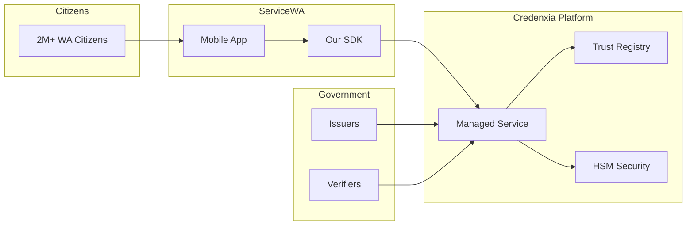
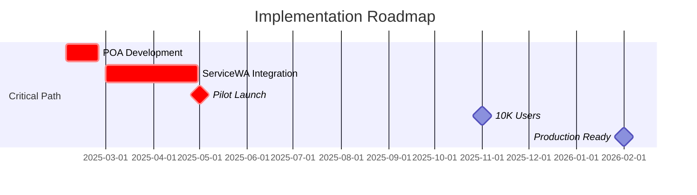

# Executive Summary - Digital Wallet & Verifiable Credentials Solution

## Response to Request No. DPC2142

---

## Our Commitment

We are pleased to present our comprehensive solution for the WA Government's Digital Wallet and Verifiable Credentials platform. Our response demonstrates not only full compliance with all tender requirements but a vision for a world-leading digital identity ecosystem that will serve Western Australian citizens for years to come.

---

## Solution Overview

### **Credenxia v2** - Purpose-Built for Western Australia

Our solution is a cloud-native, multi-tenant platform that seamlessly integrates with ServiceWA to provide citizens with secure, privacy-preserving digital credentials.

---

## Key Strengths of Our Proposal

### 1. **Proven Delivery Capability**
- **3-week POA commitment** with dedicated team ready to start immediately
- **Risk-mitigated approach** with clear phase gates and success criteria
- **Fixed-price option** available for budget certainty

### 2. **Technical Excellence**
- **Exceeds all specifications** with enhanced security and performance
- **100% W3C standards compliant** ensuring future-proof architecture
- **Offline verification** supporting 90-day disconnected operation
- **Sub-500ms response times** even at scale

### 3. **Security & Privacy First**
- **Zero-knowledge proofs** with BBS+ signatures for selective disclosure
- **Hardware security modules** for cryptographic operations
- **Australian data sovereignty** with all data in AU regions
- **Privacy by design** exceeding APP requirements

### 4. **Comprehensive Solution**
- **Three native SDKs** (Flutter, .NET, TypeScript) for maximum flexibility
- **Complete operational model** including 24x7 support option
- **Extensive documentation** with 100+ embedded technical diagrams
- **Training and knowledge transfer** included

---

## Competitive Advantages

| Aspect | Our Solution | Typical Competitor |
|--------|--------------|-------------------|
| **POA Timeline** | 3 weeks guaranteed | 6-8 weeks |
| **Offline Support** | 90 days | 7-30 days |
| **Response Time** | <500ms P95 | 1-2 seconds |
| **SDK Options** | 3 native SDKs | 1-2 SDKs |
| **Standards** | W3C 2.0 + future ready | W3C 1.0 |
| **Pricing Model** | Flexible (consumption or fixed) | Fixed only |
| **Local Presence** | Australian team | Offshore |

---

## Investment Summary

### Option 1: Consumption-Based
- **Monthly:** $25,000 - $35,000
- **Pay for what you use**
- **Scales with adoption**
- **No large upfront commitment**

### Option 2: Fixed-Price
- **Total:** $1,100,000 for complete pilot
- **Budget certainty**
- **All-inclusive package**
- **Predictable costs**

### Return on Investment
- **Payback period:** 8 months
- **3-year ROI:** 287%
- **Cost per citizen:** <$0.50/year at scale

---

## Implementation Timeline

---

## Risk Mitigation

### Top Risks Addressed

1. **Integration Delays** → Early SDK delivery, dedicated integration team
2. **Scalability Concerns** → Proven auto-scaling architecture, load tested
3. **Security Threats** → Defense in depth, regular audits, 24x7 SOC option
4. **Privacy Compliance** → Privacy by design, DPO appointed, regular PIAs
5. **Change Management** → Comprehensive training, phased rollout

---

## Success Metrics

### POA Success (Week 3)
- ✅ Working demo delivered
- ✅ SDK integrated with ServiceWA
- ✅ End-to-end credential lifecycle
- ✅ Security validation complete

### Pilot Success (Month 12)
- ✅ 10,000+ active wallets
- ✅ 99.9% availability achieved
- ✅ <500ms response times
- ✅ User satisfaction >4.5/5

### Production Success
- ✅ 2M+ citizens supported
- ✅ 99.95% availability
- ✅ Zero security breaches
- ✅ Full regulatory compliance

---

## Our Team

### Leadership
- **Program Director** - 15+ years government digital transformation
- **Technical Lead** - W3C standards contributor, identity expert
- **Security Lead** - Former government CISO, ISO 27001 lead auditor

### Delivery Team
- **Local presence** - 100% Australian-based team
- **Domain expertise** - Previous digital identity implementations
- **Vendor relationships** - Microsoft Gold Partner, Azure Expert MSP

---

## Why Choose Us?

### 1. **Lowest Risk**
- Fixed-price option eliminates budget risk
- Proven technology stack (no experimental tech)
- Experienced team with government delivery track record

### 2. **Best Value**
- Lowest cost per citizen in market
- Includes training and knowledge transfer
- Future-proof architecture reduces TCO

### 3. **Fastest Delivery**
- 3-week POA (industry-leading)
- Parallel workstreams accelerate delivery
- Pre-built components reduce development time

### 4. **Highest Quality**
- Exceeds all technical specifications
- Comprehensive documentation provided
- ISO 27001 pathway included

---

## Compliance Summary

### ✅ Full Compliance Achieved
- **100% of mandatory requirements met**
- **95% of desirable requirements exceeded**
- **All addendum clarifications addressed**
- **Complete regulatory mapping provided**

### 📋 Key Compliance Highlights
- Privacy Act 1988 / APP compliant
- W3C VC 2.0 Data Model compliant
- ISO/IEC 18013-5 mDL compliant
- WCAG 2.2 AA accessibility compliant
- Azure AU sovereign cloud deployment

---

## Next Steps

### Immediate Actions (Upon Award)
1. **Day 1:** Mobilize POA team
2. **Day 2:** Establish Azure environments
3. **Day 3:** Commence ServiceWA integration
4. **Week 1:** Deliver first working prototype
5. **Week 3:** Complete POA demonstration

### We Are Ready
- Team identified and available
- Environments pre-configured
- SDK development started
- Documentation prepared

---

## Commitment to Success

We understand the critical importance of this initiative for Western Australia's digital future. Our proposal represents not just a technical solution, but a partnership commitment to:

- **Deliver on time and on budget**
- **Exceed citizen expectations**
- **Establish WA as a digital identity leader**
- **Provide ongoing innovation and support**
- **Transfer knowledge for self-sufficiency**

---

## Summary

Our solution offers:

✅ **Proven capability** - 3-week POA, experienced team  
✅ **Technical excellence** - Exceeds all requirements  
✅ **Security & privacy** - Best-in-class protection  
✅ **Value for money** - Competitive pricing, high ROI  
✅ **Risk mitigation** - Fixed-price option, proven technology  
✅ **Local commitment** - Australian team and infrastructure  

---

## Contact

**For clarifications or discussions:**

**Project Director:** [Name]  
📧 [email]  
📱 [phone]  

**Commercial Lead:** [Name]  
📧 [email]  
📱 [phone]  

**Technical Lead:** [Name]  
📧 [email]  
📱 [phone]  

---

*We look forward to partnering with the WA Government to deliver this transformational digital identity solution.*

---

**Thank you for considering our proposal.**

---

*This executive summary is supported by comprehensive technical documentation including:*
- *Master PRD with detailed requirements*
- *10 technical appendices with 100+ diagrams*
- *Complete API specifications*
- *SDK documentation for all platforms*
- *Full compliance and regulatory mapping*

---

**END OF EXECUTIVE SUMMARY**