# Appendix: APIs and SDKs
## Digital Wallet and Verifiable Credentials Solution

**Document Version:** 1.0  
**Parent Document:** [Master PRD](./PRD_Master.md)  
**Last Updated:** December 2024

---

## 1. API Architecture Overview

### 1.1 API Gateway Architecture

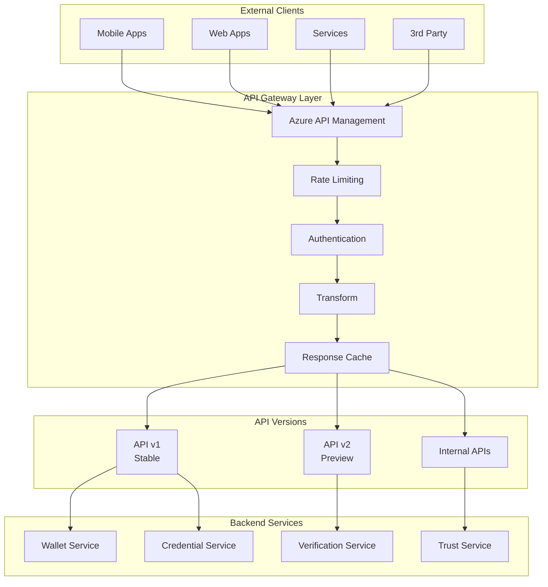
```mermaid
graph TB
    subgraph "External Clients"
        MOBILE[Mobile Apps]
        WEB[Web Apps]
        SERVICE[Services]
        THIRD[3rd Party]
    end
    
    subgraph "API Gateway Layer"
        APIM[Azure API Management]
        RATE[Rate Limiting]
        AUTH_GW[Authentication]
        TRANSFORM[Transform]
        CACHE_GW[Response Cache]
    end
    
    subgraph "API Versions"
        V1[API v1<br/>Stable]
        V2[API v2<br/>Preview]
        INTERNAL[Internal APIs]
    end
    
    subgraph "Backend Services"
        WALLET_SVC[Wallet Service]
        CRED_SVC[Credential Service]
        VERIFY_SVC[Verification Service]
        TRUST_SVC[Trust Service]
    end
    
    MOBILE --> APIM
    WEB --> APIM
    SERVICE --> APIM
    THIRD --> APIM
    
    APIM --> RATE
    RATE --> AUTH_GW
    AUTH_GW --> TRANSFORM
    TRANSFORM --> CACHE_GW
    
    CACHE_GW --> V1
    CACHE_GW --> V2
    CACHE_GW --> INTERNAL
    
    V1 --> WALLET_SVC
    V1 --> CRED_SVC
    V2 --> VERIFY_SVC
    INTERNAL --> TRUST_SVC
```

### 1.2 API Protocol Stack

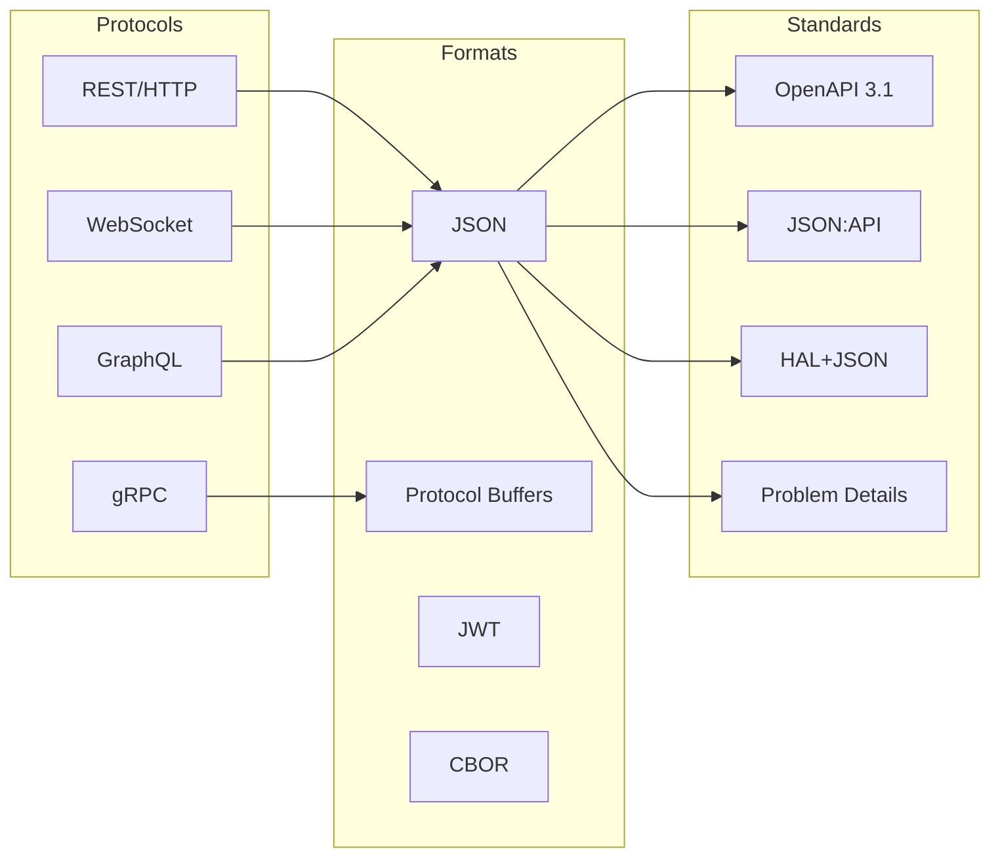
```mermaid
graph LR
    subgraph "Protocols"
        REST[REST/HTTP]
        GRPC[gRPC]
        WEBSOCKET[WebSocket]
        GRAPHQL[GraphQL]
    end
    
    subgraph "Formats"
        JSON[JSON]
        PROTOBUF[Protocol Buffers]
        JWT[JWT]
        CBOR[CBOR]
    end
    
    subgraph "Standards"
        OPENAPI[OpenAPI 3.1]
        JSONAPI[JSON:API]
        HAL[HAL+JSON]
        PROBLEM[Problem Details]
    end
    
    REST --> JSON
    GRPC --> PROTOBUF
    WEBSOCKET --> JSON
    GRAPHQL --> JSON
    
    JSON --> OPENAPI
    JSON --> JSONAPI
    JSON --> HAL
    JSON --> PROBLEM
```

---

## 2. REST API Specification

### 2.1 Core API Endpoints

```mermaid
graph TD
    subgraph "Wallet Management"
        W1[POST /wallets<br/>Create wallet]
        W2[GET /wallets/{id}<br/>Get wallet]
        W3[PUT /wallets/{id}<br/>Update wallet]
        W4[DELETE /wallets/{id}<br/>Delete wallet]
        W5[POST /wallets/{id}/backup<br/>Backup wallet]
        W6[POST /wallets/{id}/restore<br/>Restore wallet]
    end
    
    subgraph "Credential Operations"
        C1[POST /credentials/issue<br/>Issue credential]
        C2[GET /credentials/{id}<br/>Get credential]
        C3[GET /credentials<br/>List credentials]
        C4[POST /credentials/{id}/revoke<br/>Revoke credential]
        C5[GET /credentials/{id}/status<br/>Check status]
    end
    
    subgraph "Verification"
        V1[POST /presentations/requests<br/>Create request]
        V2[POST /presentations/submit<br/>Submit presentation]
        V3[POST /presentations/verify<br/>Verify presentation]
        V4[GET /presentations/{id}/result<br/>Get result]
    end
    
    subgraph "Trust Registry"
        T1[GET /trust/issuers<br/>List issuers]
        T2[GET /trust/schemas<br/>List schemas]
        T3[GET /trust/verify/{did}<br/>Verify DID]
    end
```

### 2.2 API Authentication Flow

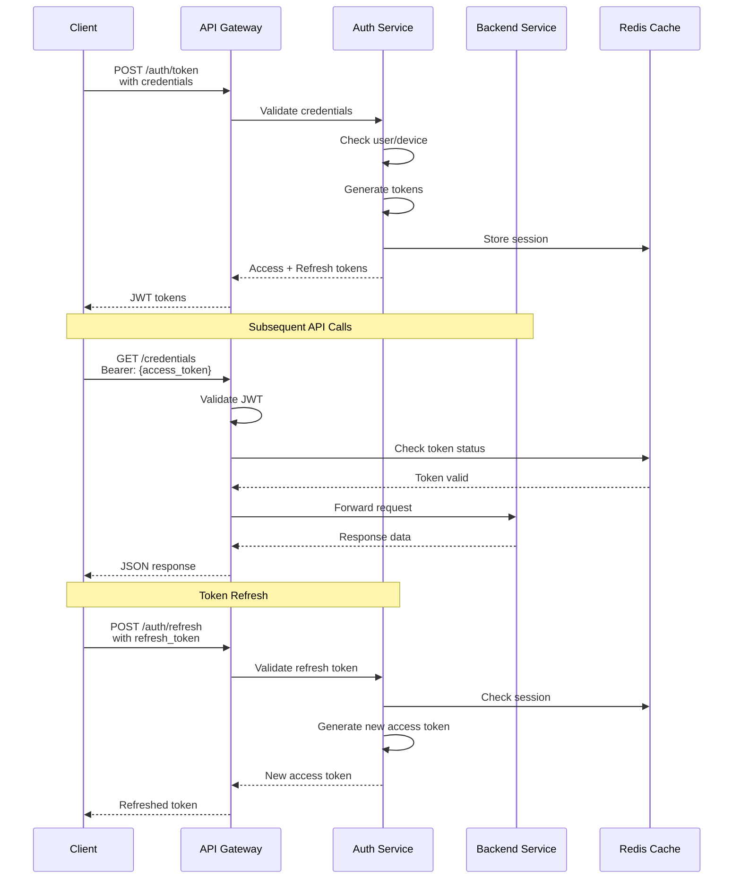
```mermaid
sequenceDiagram
    participant Client
    participant API as API Gateway
    participant Auth as Auth Service
    participant Service as Backend Service
    participant Cache as Redis Cache
    
    Client->>API: POST /auth/token<br/>with credentials
    API->>Auth: Validate credentials
    Auth->>Auth: Check user/device
    Auth->>Auth: Generate tokens
    Auth->>Cache: Store session
    Auth-->>API: Access + Refresh tokens
    API-->>Client: JWT tokens
    
    Note over Client,Service: Subsequent API Calls
    
    Client->>API: GET /credentials<br/>Bearer: {access_token}
    API->>API: Validate JWT
    API->>Cache: Check token status
    Cache-->>API: Token valid
    API->>Service: Forward request
    Service-->>API: Response data
    API-->>Client: JSON response
    
    Note over Client,Auth: Token Refresh
    
    Client->>API: POST /auth/refresh<br/>with refresh_token
    API->>Auth: Validate refresh token
    Auth->>Cache: Check session
    Auth->>Auth: Generate new access token
    Auth-->>API: New access token
    API-->>Client: Refreshed token
```

### 2.3 API Error Handling

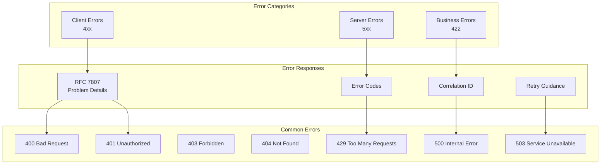
```mermaid
graph TD
    subgraph "Error Categories"
        CLIENT[Client Errors<br/>4xx]
        SERVER[Server Errors<br/>5xx]
        BUSINESS[Business Errors<br/>422]
    end
    
    subgraph "Error Responses"
        PROBLEM_DETAIL[RFC 7807<br/>Problem Details]
        ERROR_CODE[Error Codes]
        CORRELATION[Correlation ID]
        RETRY[Retry Guidance]
    end
    
    subgraph "Common Errors"
        E400[400 Bad Request]
        E401[401 Unauthorized]
        E403[403 Forbidden]
        E404[404 Not Found]
        E429[429 Too Many Requests]
        E500[500 Internal Error]
        E503[503 Service Unavailable]
    end
    
    CLIENT --> PROBLEM_DETAIL
    SERVER --> ERROR_CODE
    BUSINESS --> CORRELATION
    
    PROBLEM_DETAIL --> E400
    PROBLEM_DETAIL --> E401
    ERROR_CODE --> E429
    CORRELATION --> E500
    RETRY --> E503
```

---

## 3. SDK Architecture

### 3.1 SDK Layer Design


```mermaid
graph TB
    subgraph "Flutter SDK"
        F_CORE[Core Module]
        F_WALLET[Wallet Module]
        F_CRED[Credential Module]
        F_CRYPTO[Crypto Module]
        F_STORAGE[Secure Storage]
        F_UI[UI Components]
    end
    
    subgraph ".NET SDK"
        N_CORE[Core Library]
        N_CLIENT[HTTP Client]
        N_AUTH[Auth Handler]
        N_MODELS[Data Models]
        N_UTILS[Utilities]
    end
    
    subgraph "TypeScript SDK"
        T_CORE[Core Package]
        T_API[API Client]
        T_TYPES[Type Definitions]
        T_CRYPTO[WebCrypto]
        T_REACT[React Hooks]
    end
    
    subgraph "Shared"
        PROTO[Protocol Definitions]
        SCHEMA[JSON Schemas]
        SPEC[OpenAPI Spec]
    end
    
    F_CORE --> PROTO
    N_CORE --> SPEC
    T_CORE --> SCHEMA
```

### 3.2 Flutter SDK Architecture

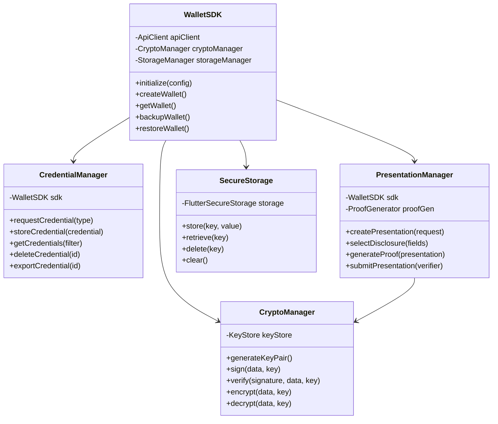
```mermaid
classDiagram
    class WalletSDK {
        -ApiClient apiClient
        -CryptoManager cryptoManager
        -StorageManager storageManager
        +initialize(config)
        +createWallet()
        +getWallet()
        +backupWallet()
        +restoreWallet()
    }
    
    class CredentialManager {
        -WalletSDK sdk
        +requestCredential(type)
        +storeCredential(credential)
        +getCredentials(filter)
        +deleteCredential(id)
        +exportCredential(id)
    }
    
    class PresentationManager {
        -WalletSDK sdk
        -ProofGenerator proofGen
        +createPresentation(request)
        +selectDisclosure(fields)
        +generateProof(presentation)
        +submitPresentation(verifier)
    }
    
    class CryptoManager {
        -KeyStore keyStore
        +generateKeyPair()
        +sign(data, key)
        +verify(signature, data, key)
        +encrypt(data, key)
        +decrypt(data, key)
    }
    
    class SecureStorage {
        -FlutterSecureStorage storage
        +store(key, value)
        +retrieve(key)
        +delete(key)
        +clear()
    }
    
    WalletSDK --> CredentialManager
    WalletSDK --> PresentationManager
    WalletSDK --> CryptoManager
    WalletSDK --> SecureStorage
    PresentationManager --> CryptoManager
```

### 3.3 SDK Integration Flow

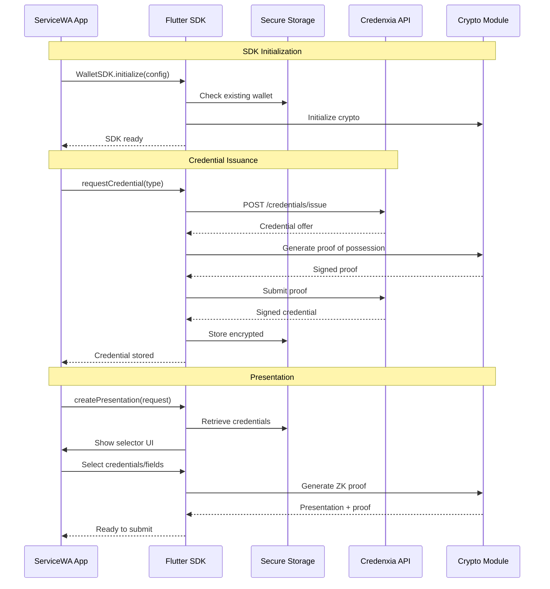
```mermaid
sequenceDiagram
    participant App as ServiceWA App
    participant SDK as Flutter SDK
    participant Storage as Secure Storage
    participant API as Credenxia API
    participant Crypto as Crypto Module
    
    Note over App,Crypto: SDK Initialization
    App->>SDK: WalletSDK.initialize(config)
    SDK->>Storage: Check existing wallet
    SDK->>Crypto: Initialize crypto
    SDK-->>App: SDK ready
    
    Note over App,API: Credential Issuance
    App->>SDK: requestCredential(type)
    SDK->>API: POST /credentials/issue
    API-->>SDK: Credential offer
    SDK->>Crypto: Generate proof of possession
    Crypto-->>SDK: Signed proof
    SDK->>API: Submit proof
    API-->>SDK: Signed credential
    SDK->>Storage: Store encrypted
    SDK-->>App: Credential stored
    
    Note over App,Crypto: Presentation
    App->>SDK: createPresentation(request)
    SDK->>Storage: Retrieve credentials
    SDK->>App: Show selector UI
    App->>SDK: Select credentials/fields
    SDK->>Crypto: Generate ZK proof
    Crypto-->>SDK: Presentation + proof
    SDK-->>App: Ready to submit
```

---

## 4. API Security

### 4.1 API Security Layers

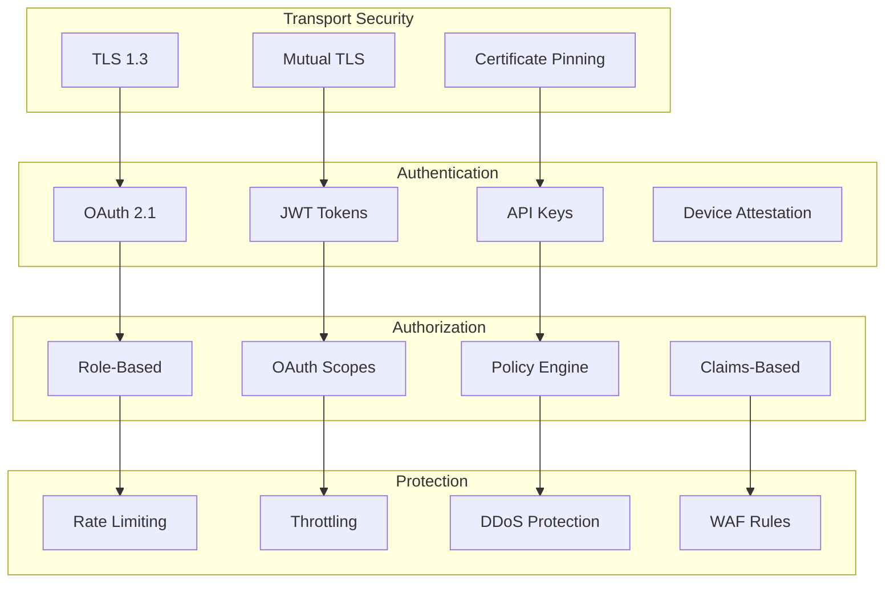
```mermaid
graph TD
    subgraph "Transport Security"
        TLS[TLS 1.3]
        MTLS[Mutual TLS]
        CERT_PIN[Certificate Pinning]
    end
    
    subgraph "Authentication"
        OAUTH[OAuth 2.1]
        JWT_AUTH[JWT Tokens]
        API_KEY[API Keys]
        DEVICE[Device Attestation]
    end
    
    subgraph "Authorization"
        RBAC_API[Role-Based]
        SCOPE[OAuth Scopes]
        POLICY[Policy Engine]
        CLAIMS_API[Claims-Based]
    end
    
    subgraph "Protection"
        RATE_LIMIT[Rate Limiting]
        THROTTLE[Throttling]
        DDOS_PROT[DDoS Protection]
        WAF_API[WAF Rules]
    end
    
    TLS --> OAUTH
    MTLS --> JWT_AUTH
    CERT_PIN --> API_KEY
    
    OAUTH --> RBAC_API
    JWT_AUTH --> SCOPE
    API_KEY --> POLICY
    
    RBAC_API --> RATE_LIMIT
    SCOPE --> THROTTLE
    POLICY --> DDOS_PROT
    CLAIMS_API --> WAF_API
```

### 4.2 OAuth 2.1 Flow with PKCE

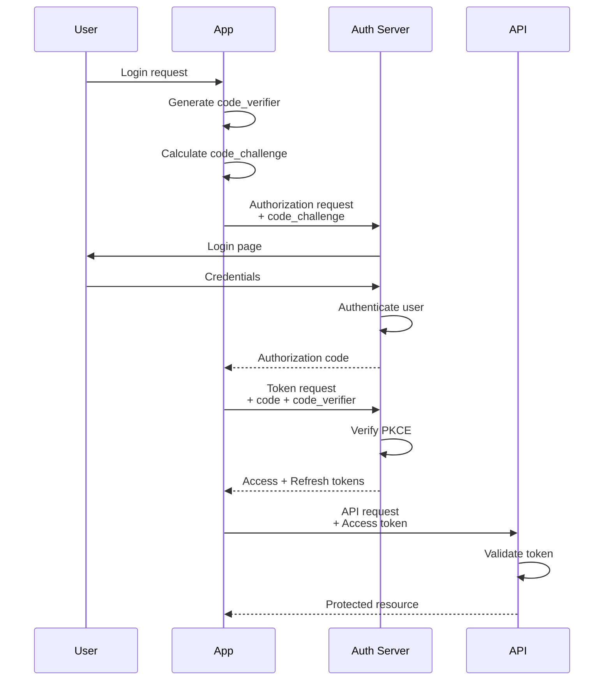
```mermaid
sequenceDiagram
    participant User
    participant App
    participant Auth as Auth Server
    participant API
    
    User->>App: Login request
    App->>App: Generate code_verifier
    App->>App: Calculate code_challenge
    App->>Auth: Authorization request<br/>+ code_challenge
    Auth->>User: Login page
    User->>Auth: Credentials
    Auth->>Auth: Authenticate user
    Auth-->>App: Authorization code
    App->>Auth: Token request<br/>+ code + code_verifier
    Auth->>Auth: Verify PKCE
    Auth-->>App: Access + Refresh tokens
    App->>API: API request<br/>+ Access token
    API->>API: Validate token
    API-->>App: Protected resource
```

---

## 5. API Versioning and Lifecycle

### 5.1 Versioning Strategy

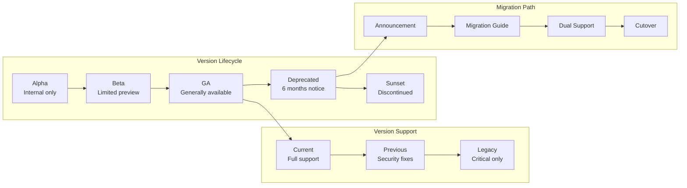
```mermaid
graph LR
    subgraph "Version Lifecycle"
        ALPHA[Alpha<br/>Internal only]
        BETA[Beta<br/>Limited preview]
        GA[GA<br/>Generally available]
        DEPRECATED[Deprecated<br/>6 months notice]
        SUNSET[Sunset<br/>Discontinued]
    end
    
    subgraph "Version Support"
        CURRENT[Current<br/>Full support]
        PREVIOUS[Previous<br/>Security fixes]
        LEGACY[Legacy<br/>Critical only]
    end
    
    subgraph "Migration Path"
        ANNOUNCE[Announcement]
        DOCUMENT[Migration Guide]
        DUAL[Dual Support]
        CUTOVER[Cutover]
    end
    
    ALPHA --> BETA
    BETA --> GA
    GA --> DEPRECATED
    DEPRECATED --> SUNSET
    
    GA --> CURRENT
    CURRENT --> PREVIOUS
    PREVIOUS --> LEGACY
    
    DEPRECATED --> ANNOUNCE
    ANNOUNCE --> DOCUMENT
    DOCUMENT --> DUAL
    DUAL --> CUTOVER
```

### 5.2 API Version Headers

```yaml
# Request Headers
GET /api/v1/credentials HTTP/1.1
Host: api.credenxia.gov.au
Accept: application/json
X-API-Version: 1.0
X-Client-Version: ServiceWA/2.1.0
Authorization: Bearer {token}

# Response Headers
HTTP/1.1 200 OK
Content-Type: application/json
X-API-Version: 1.0
X-Deprecation-Date: 2025-12-31
X-Sunset-Date: 2026-06-30
X-Rate-Limit-Remaining: 99
X-Correlation-ID: 550e8400-e29b-41d4-a716
```

---

## 6. SDK Features by Platform

### 6.1 Feature Matrix

| Feature | Flutter SDK | .NET SDK | TypeScript SDK |
|---------|------------|----------|----------------|
| **Wallet Management** | ✓ | ✓ | ✓ |
| **Credential Storage** | ✓ | ✓ | ✓ |
| **Biometric Auth** | ✓ | ✗ | Partial |
| **Offline Verification** | ✓ | ✓ | ✗ |
| **ZK Proofs** | ✓ | ✓ | ✓ |
| **Hardware Security** | ✓ | Partial | ✗ |
| **Background Sync** | ✓ | ✓ | ✗ |
| **Push Notifications** | ✓ | ✗ | ✗ |
| **QR Code Scanning** | ✓ | ✗ | ✓ |
| **NFC Support** | ✓ | ✗ | ✗ |

### 6.2 Platform-Specific Implementation


```mermaid
graph TD
    subgraph "Flutter/Mobile"
        BIO[Biometric Auth]
        SECURE_ENCLAVE[Secure Enclave]
        PLATFORM_KEYS[Platform Keys]
        LOCAL_DB[SQLite]
    end
    
    subgraph ".NET/Backend"
        ASPNET[ASP.NET Core]
        EF[Entity Framework]
        AZURE_ID[Azure Identity]
        KEY_VAULT[Key Vault]
    end
    
    subgraph "TypeScript/Web"
        WEB_CRYPTO[WebCrypto API]
        INDEXED_DB[IndexedDB]
        WEB_AUTHN[WebAuthn]
        SERVICE_WORKER[Service Worker]
    end
    
    BIO --> SECURE_ENCLAVE
    SECURE_ENCLAVE --> PLATFORM_KEYS
    PLATFORM_KEYS --> LOCAL_DB
    
    ASPNET --> EF
    EF --> AZURE_ID
    AZURE_ID --> KEY_VAULT
    
    WEB_CRYPTO --> INDEXED_DB
    INDEXED_DB --> WEB_AUTHN
    WEB_AUTHN --> SERVICE_WORKER
```

---

## 7. API Rate Limiting and Quotas

### 7.1 Rate Limit Tiers

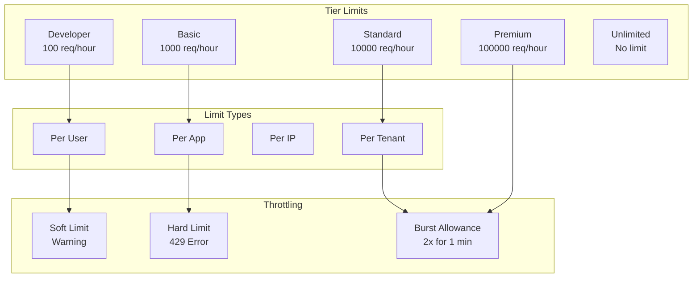
```mermaid
graph TD
    subgraph "Tier Limits"
        DEV[Developer<br/>100 req/hour]
        BASIC[Basic<br/>1000 req/hour]
        STANDARD[Standard<br/>10000 req/hour]
        PREMIUM[Premium<br/>100000 req/hour]
        UNLIMITED[Unlimited<br/>No limit]
    end
    
    subgraph "Limit Types"
        USER_LIMIT[Per User]
        APP_LIMIT[Per App]
        IP_LIMIT[Per IP]
        TENANT_LIMIT[Per Tenant]
    end
    
    subgraph "Throttling"
        SOFT[Soft Limit<br/>Warning]
        HARD[Hard Limit<br/>429 Error]
        BURST[Burst Allowance<br/>2x for 1 min]
    end
    
    DEV --> USER_LIMIT
    BASIC --> APP_LIMIT
    STANDARD --> TENANT_LIMIT
    PREMIUM --> BURST
    
    USER_LIMIT --> SOFT
    APP_LIMIT --> HARD
    TENANT_LIMIT --> BURST
```

### 7.2 Rate Limit Implementation

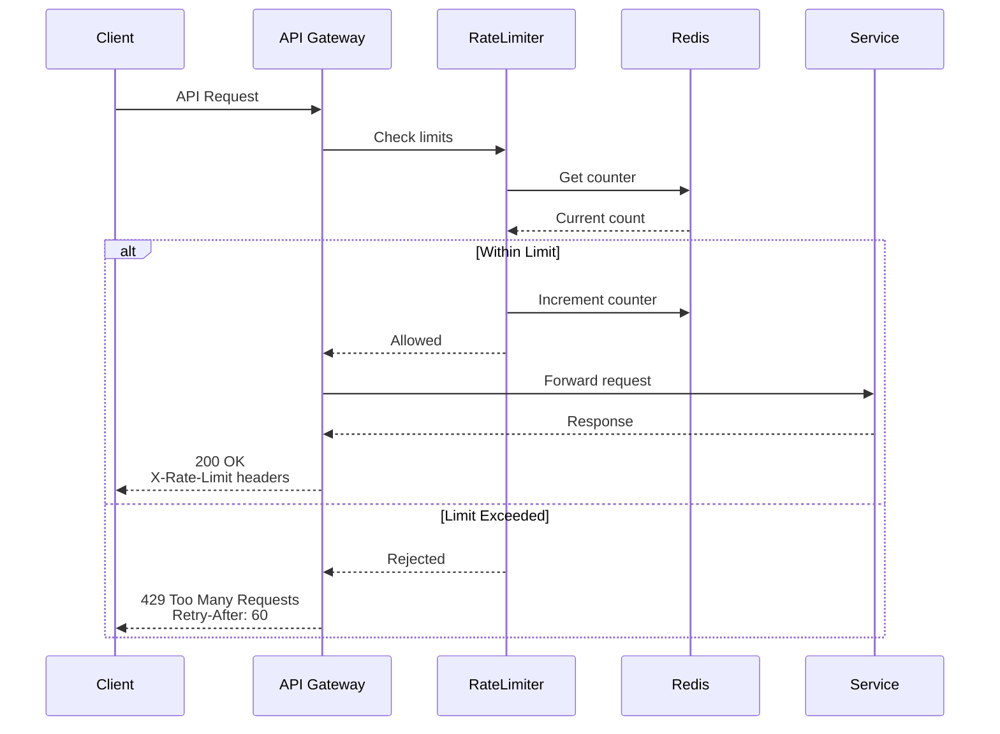
```mermaid
sequenceDiagram
    participant Client
    participant Gateway as API Gateway
    participant RateLimiter
    participant Cache as Redis
    participant Service
    
    Client->>Gateway: API Request
    Gateway->>RateLimiter: Check limits
    RateLimiter->>Cache: Get counter
    Cache-->>RateLimiter: Current count
    
    alt Within Limit
        RateLimiter->>Cache: Increment counter
        RateLimiter-->>Gateway: Allowed
        Gateway->>Service: Forward request
        Service-->>Gateway: Response
        Gateway-->>Client: 200 OK<br/>X-Rate-Limit headers
    else Limit Exceeded
        RateLimiter-->>Gateway: Rejected
        Gateway-->>Client: 429 Too Many Requests<br/>Retry-After: 60
    end
```

---

## 8. API Monitoring and Analytics

### 8.1 API Metrics

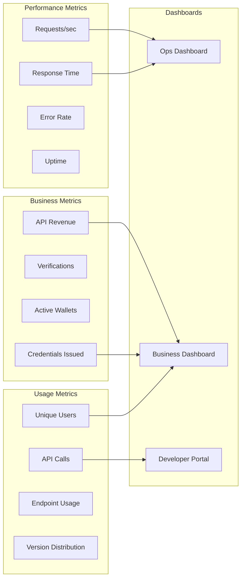
```mermaid
graph LR
    subgraph "Performance Metrics"
        LATENCY[Response Time]
        THROUGHPUT[Requests/sec]
        ERROR_RATE[Error Rate]
        AVAILABILITY[Uptime]
    end
    
    subgraph "Usage Metrics"
        CALLS[API Calls]
        UNIQUE[Unique Users]
        ENDPOINTS[Endpoint Usage]
        VERSIONS[Version Distribution]
    end
    
    subgraph "Business Metrics"
        CREDENTIALS[Credentials Issued]
        VERIFICATIONS[Verifications]
        WALLETS[Active Wallets]
        REVENUE[API Revenue]
    end
    
    subgraph "Dashboards"
        OPERATIONAL[Ops Dashboard]
        BUSINESS_DASH[Business Dashboard]
        DEVELOPER[Developer Portal]
    end
    
    LATENCY --> OPERATIONAL
    THROUGHPUT --> OPERATIONAL
    CALLS --> DEVELOPER
    UNIQUE --> BUSINESS_DASH
    CREDENTIALS --> BUSINESS_DASH
    REVENUE --> BUSINESS_DASH
```

### 8.2 API Observability Stack

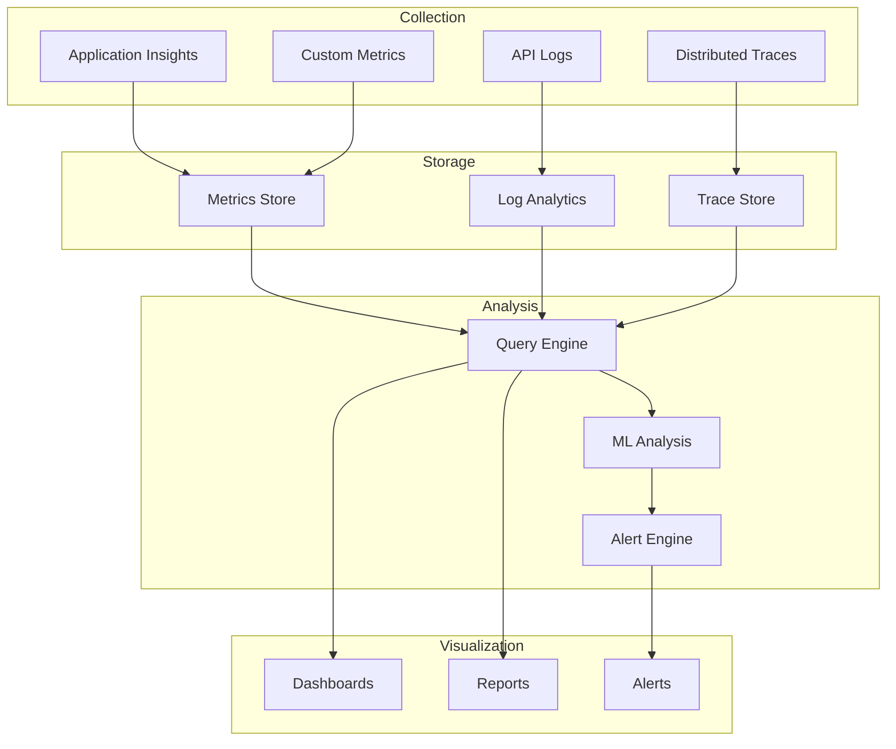
```mermaid
graph TD
    subgraph "Collection"
        APP_INSIGHTS[Application Insights]
        CUSTOM_METRICS[Custom Metrics]
        LOGS_API[API Logs]
        TRACES_API[Distributed Traces]
    end
    
    subgraph "Storage"
        METRICS_STORE[Metrics Store]
        LOG_STORE[Log Analytics]
        TRACE_STORE[Trace Store]
    end
    
    subgraph "Analysis"
        QUERY[Query Engine]
        ALERT_ENGINE[Alert Engine]
        ML_ANALYSIS[ML Analysis]
    end
    
    subgraph "Visualization"
        DASHBOARDS[Dashboards]
        REPORTS[Reports]
        ALERTS_VIS[Alerts]
    end
    
    APP_INSIGHTS --> METRICS_STORE
    CUSTOM_METRICS --> METRICS_STORE
    LOGS_API --> LOG_STORE
    TRACES_API --> TRACE_STORE
    
    METRICS_STORE --> QUERY
    LOG_STORE --> QUERY
    TRACE_STORE --> QUERY
    
    QUERY --> ML_ANALYSIS
    ML_ANALYSIS --> ALERT_ENGINE
    ALERT_ENGINE --> ALERTS_VIS
    QUERY --> DASHBOARDS
    QUERY --> REPORTS
```

---

## 9. SDK Development Guidelines

### 9.1 SDK Design Principles

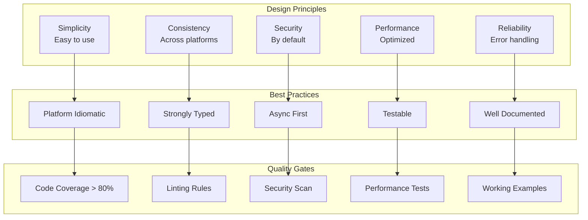
```mermaid
graph TD
    subgraph "Design Principles"
        SIMPLE[Simplicity<br/>Easy to use]
        CONSISTENT[Consistency<br/>Across platforms]
        SECURE[Security<br/>By default]
        PERF[Performance<br/>Optimized]
        RELIABLE[Reliability<br/>Error handling]
    end
    
    subgraph "Best Practices"
        IDIOMATIC[Platform Idiomatic]
        TYPED[Strongly Typed]
        ASYNC[Async First]
        TESTABLE[Testable]
        DOCUMENTED[Well Documented]
    end
    
    subgraph "Quality Gates"
        COVERAGE[Code Coverage > 80%]
        LINTING[Linting Rules]
        SECURITY_SCAN[Security Scan]
        PERF_TEST[Performance Tests]
        EXAMPLES[Working Examples]
    end
    
    SIMPLE --> IDIOMATIC
    CONSISTENT --> TYPED
    SECURE --> ASYNC
    PERF --> TESTABLE
    RELIABLE --> DOCUMENTED
    
    IDIOMATIC --> COVERAGE
    TYPED --> LINTING
    ASYNC --> SECURITY_SCAN
    TESTABLE --> PERF_TEST
    DOCUMENTED --> EXAMPLES
```

### 9.2 SDK Release Process

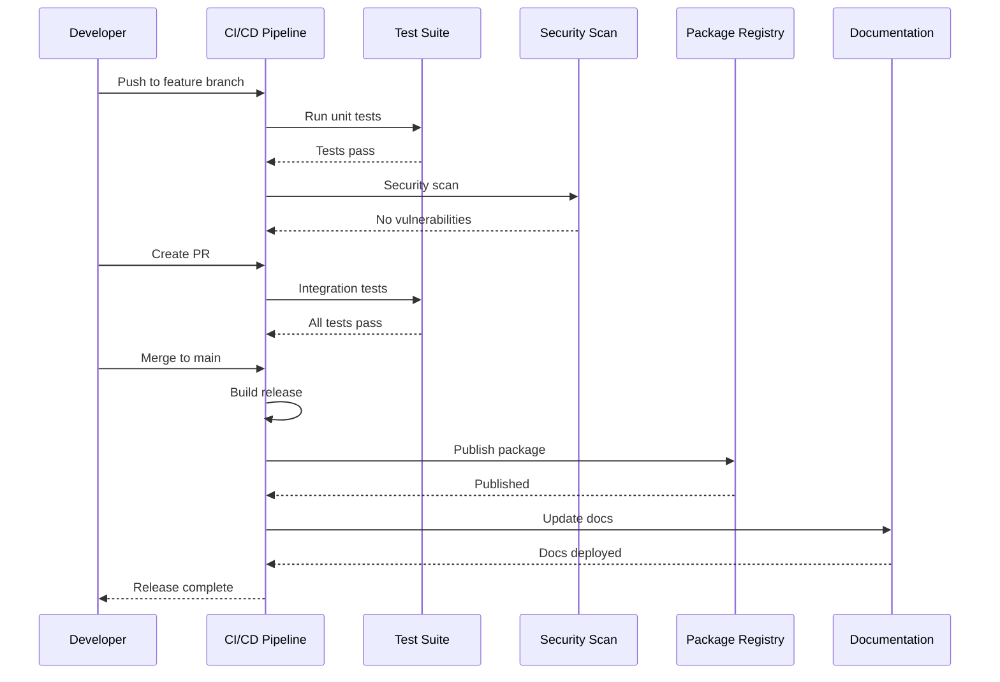
```mermaid
sequenceDiagram
    participant Dev as Developer
    participant CI as CI/CD Pipeline
    participant Test as Test Suite
    participant Security as Security Scan
    participant Package as Package Registry
    participant Docs as Documentation
    
    Dev->>CI: Push to feature branch
    CI->>Test: Run unit tests
    Test-->>CI: Tests pass
    CI->>Security: Security scan
    Security-->>CI: No vulnerabilities
    
    Dev->>CI: Create PR
    CI->>Test: Integration tests
    Test-->>CI: All tests pass
    
    Dev->>CI: Merge to main
    CI->>CI: Build release
    CI->>Package: Publish package
    Package-->>CI: Published
    CI->>Docs: Update docs
    Docs-->>CI: Docs deployed
    CI-->>Dev: Release complete
```

---

## 10. API Testing Strategy

### 10.1 Testing Pyramid

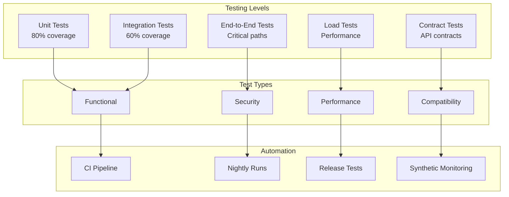
```mermaid
graph TD
    subgraph "Testing Levels"
        UNIT[Unit Tests<br/>80% coverage]
        INTEGRATION[Integration Tests<br/>60% coverage]
        CONTRACT[Contract Tests<br/>API contracts]
        E2E[End-to-End Tests<br/>Critical paths]
        LOAD[Load Tests<br/>Performance]
    end
    
    subgraph "Test Types"
        FUNCTIONAL[Functional]
        SECURITY_TEST[Security]
        PERFORMANCE[Performance]
        COMPATIBILITY[Compatibility]
    end
    
    subgraph "Automation"
        CI_TEST[CI Pipeline]
        NIGHTLY[Nightly Runs]
        RELEASE[Release Tests]
        MONITORING[Synthetic Monitoring]
    end
    
    UNIT --> FUNCTIONAL
    INTEGRATION --> FUNCTIONAL
    CONTRACT --> COMPATIBILITY
    E2E --> SECURITY_TEST
    LOAD --> PERFORMANCE
    
    FUNCTIONAL --> CI_TEST
    SECURITY_TEST --> NIGHTLY
    PERFORMANCE --> RELEASE
    COMPATIBILITY --> MONITORING
```

### 10.2 API Test Scenarios

| Test Category | Scenarios | Tools | Frequency |
|--------------|-----------|-------|-----------|
| **Functional** | CRUD operations, business logic | Jest, xUnit | Every commit |
| **Security** | Auth, injection, XSS | OWASP ZAP | Daily |
| **Performance** | Load, stress, spike | K6, JMeter | Weekly |
| **Contract** | Schema validation | Pact, Postman | Per release |
| **Integration** | Service communication | TestContainers | Per PR |
| **Compatibility** | Version compatibility | Custom suite | Per release |

---

## 11. Developer Experience

### 11.1 Developer Portal

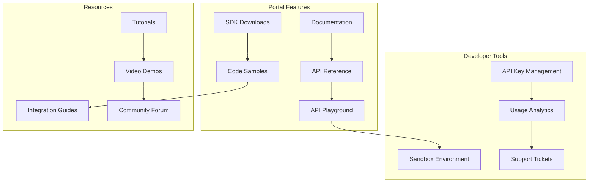
```mermaid
graph TD
    subgraph "Portal Features"
        DOCS_PORTAL[Documentation]
        API_REF[API Reference]
        PLAYGROUND[API Playground]
        SDK_PORTAL[SDK Downloads]
        SAMPLES[Code Samples]
    end
    
    subgraph "Developer Tools"
        SANDBOX[Sandbox Environment]
        API_KEYS_PORTAL[API Key Management]
        ANALYTICS_PORTAL[Usage Analytics]
        SUPPORT[Support Tickets]
    end
    
    subgraph "Resources"
        GUIDES[Integration Guides]
        TUTORIALS[Tutorials]
        VIDEOS[Video Demos]
        FORUM[Community Forum]
    end
    
    DOCS_PORTAL --> API_REF
    API_REF --> PLAYGROUND
    PLAYGROUND --> SANDBOX
    
    SDK_PORTAL --> SAMPLES
    SAMPLES --> GUIDES
    
    API_KEYS_PORTAL --> ANALYTICS_PORTAL
    ANALYTICS_PORTAL --> SUPPORT
    
    TUTORIALS --> VIDEOS
    VIDEOS --> FORUM
```

### 11.2 Getting Started Flow

```mermaid
sequenceDiagram
    participant Dev as Developer
    participant Portal as Dev Portal
    participant Sandbox
    participant SDK
    participant Support
    
    Dev->>Portal: Register account
    Portal-->>Dev: Welcome email
    
    Dev->>Portal: Access documentation
    Portal-->>Dev: Getting started guide
    
    Dev->>Portal: Generate API key
    Portal-->>Dev: Sandbox credentials
    
    Dev->>SDK: Download SDK
    SDK-->>Dev: SDK package
    
    Dev->>Sandbox: Test API calls
    Sandbox-->>Dev: Sample responses
    
    Dev->>Portal: View examples
    Portal-->>Dev: Code samples
    
    alt Need Help
        Dev->>Support: Create ticket
        Support-->>Dev: Response within 24h
    end
    
    Dev->>Sandbox: Build integration
    Sandbox-->>Dev: Working integration
```

---

## 12. API/SDK Roadmap

### 12.1 Release Schedule

```mermaid
gantt
    title API/SDK Release Roadmap
    dateFormat YYYY-MM-DD
    
    section API v1
    Core Endpoints       :done, 2025-01-01, 2025-02-01
    SDK Alpha           :done, 2025-01-15, 2025-02-15
    SDK Beta            :active, 2025-02-15, 2025-03-15
    GA Release          :2025-03-15, 2025-04-01
    
    section API v2
    New Features        :2025-04-01, 2025-05-01
    GraphQL Support     :2025-05-01, 2025-06-01
    Advanced Features   :2025-06-01, 2025-07-01
    
    section SDK Updates
    Flutter 2.0         :2025-04-01, 2025-05-01
    .NET 2.0           :2025-04-15, 2025-05-15
    TypeScript 2.0      :2025-05-01, 2025-06-01
    
    section Deprecations
    v1 Deprecation Notice :2025-10-01, 2025-10-15
    v1 Sunset           :2026-04-01, 2026-04-15
```

### 12.2 Feature Roadmap

| Quarter | API Features | SDK Features | Breaking Changes |
|---------|-------------|--------------|------------------|
| **Q1 2025** | Core CRUD, Auth, Basic verification | Basic wallet operations | None |
| **Q2 2025** | Advanced queries, Batch operations | Offline support, Biometrics | None |
| **Q3 2025** | GraphQL, Webhooks | Hardware security, BBS+ | Minor in v2 |
| **Q4 2025** | Analytics API, Admin APIs | Performance optimizations | v1 deprecation |
| **Q1 2026** | AI/ML features | Post-quantum crypto | v1 sunset |

---

## API Standards Compliance

### OpenAPI Specification
- Version: 3.1.0
- Format: YAML
- Validation: Spectral linting
- Documentation: Auto-generated

### JSON Standards
- JSON Schema: Draft 2020-12
- JSON:API: 1.1
- JSON-LD: W3C contexts
- Problem Details: RFC 7807

### Security Standards
- OAuth 2.1: Draft specification
- OpenID Connect: 1.0
- JWT: RFC 7519
- JWS/JWE: RFC 7515/7516

---

**END OF APIs AND SDKs APPENDIX**