# Appendix: Data Model
## Digital Wallet and Verifiable Credentials Solution

**Document Version:** 1.0  
**Parent Document:** [Master PRD](./PRD_Master.md)  
**Last Updated:** December 2024

---

## 1. Data Architecture Overview

### 1.1 High-Level Data Architecture

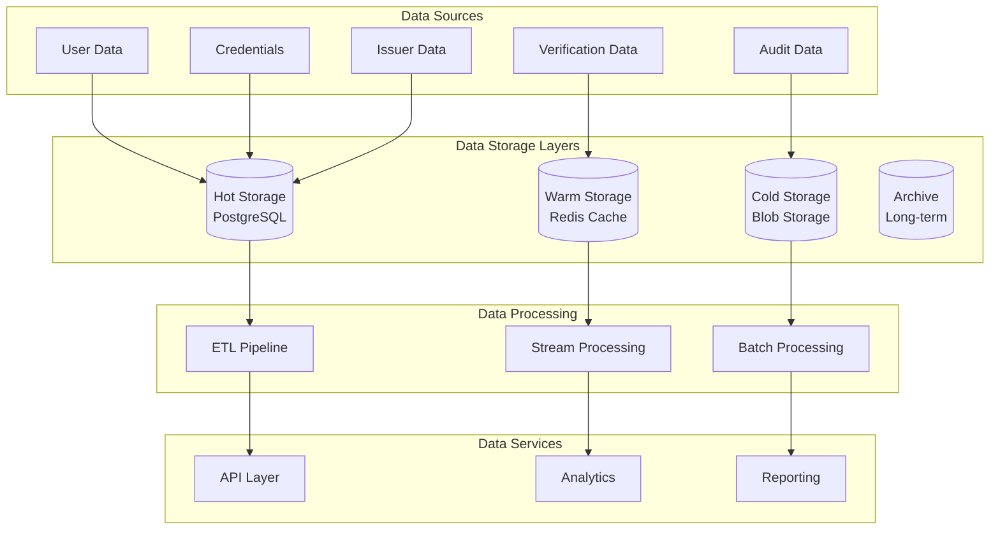

### 1.2 Multi-Tenant Data Isolation

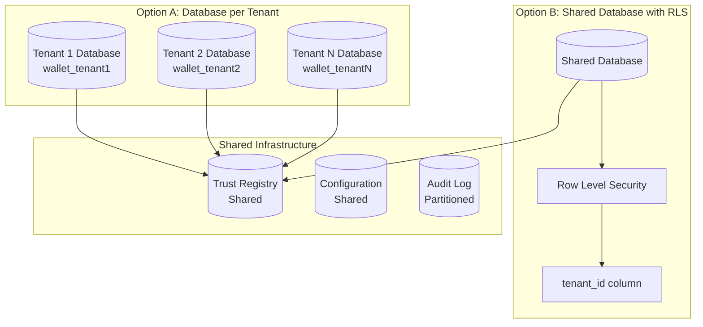

---

## 2. Core Data Models

### 2.1 Entity Relationship Diagram

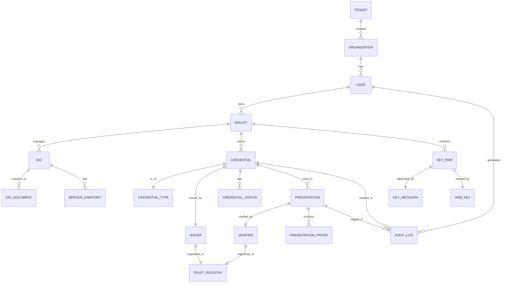

### 2.2 Tenant Model

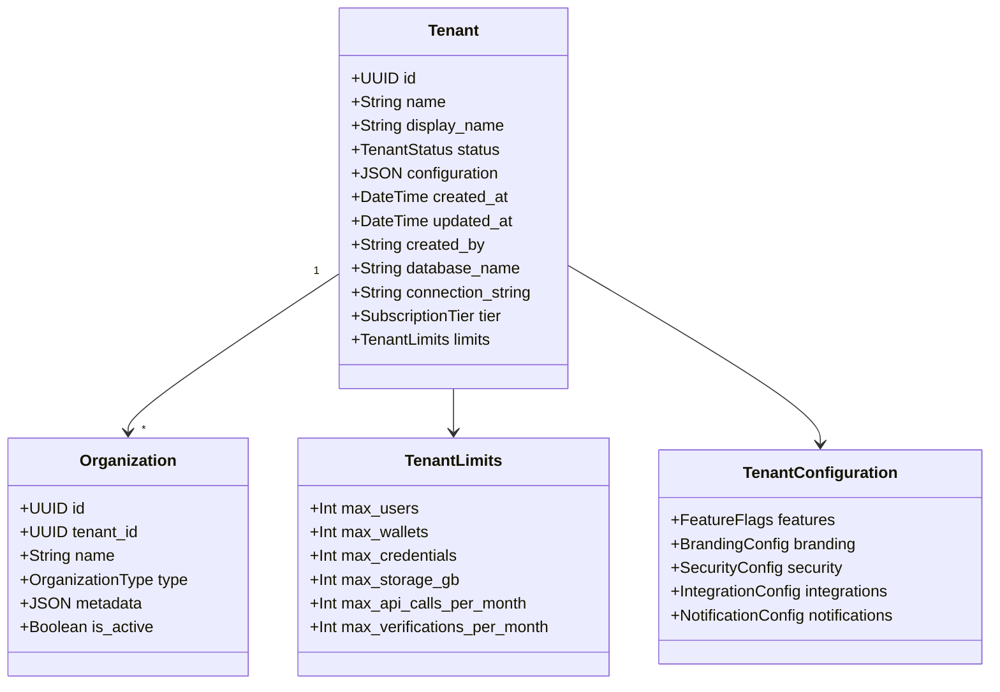

### 2.3 User and Wallet Model

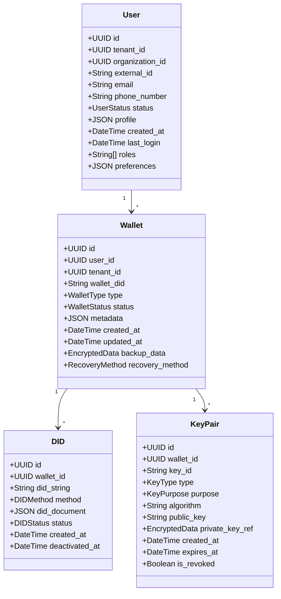

---

## 3. Credential Data Model

### 3.1 Credential Structure

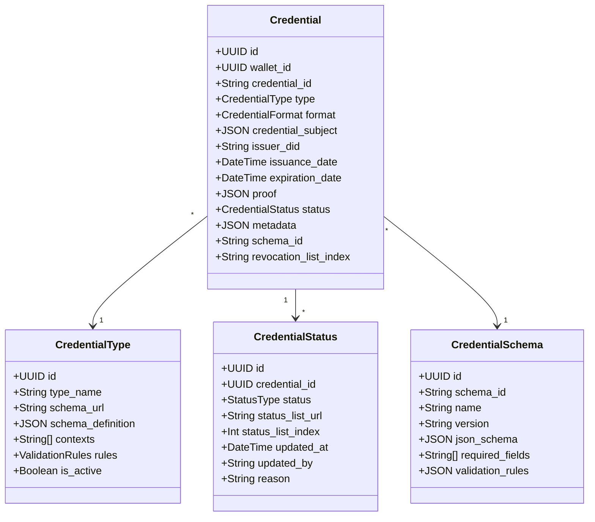

### 3.2 Presentation and Verification Model

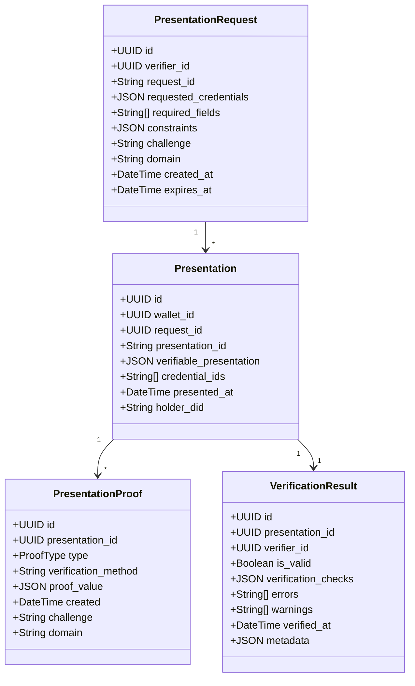

---

## 4. Trust Registry Model

### 4.1 Trust Registry Structure

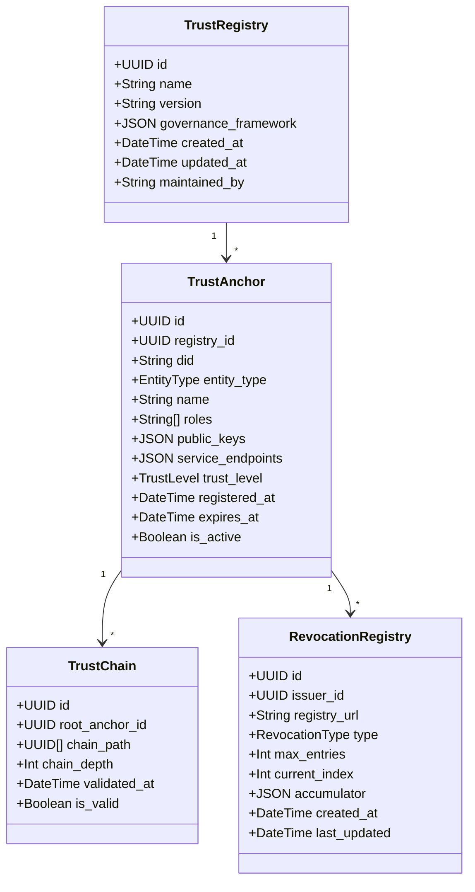

### 4.2 Issuer and Verifier Model

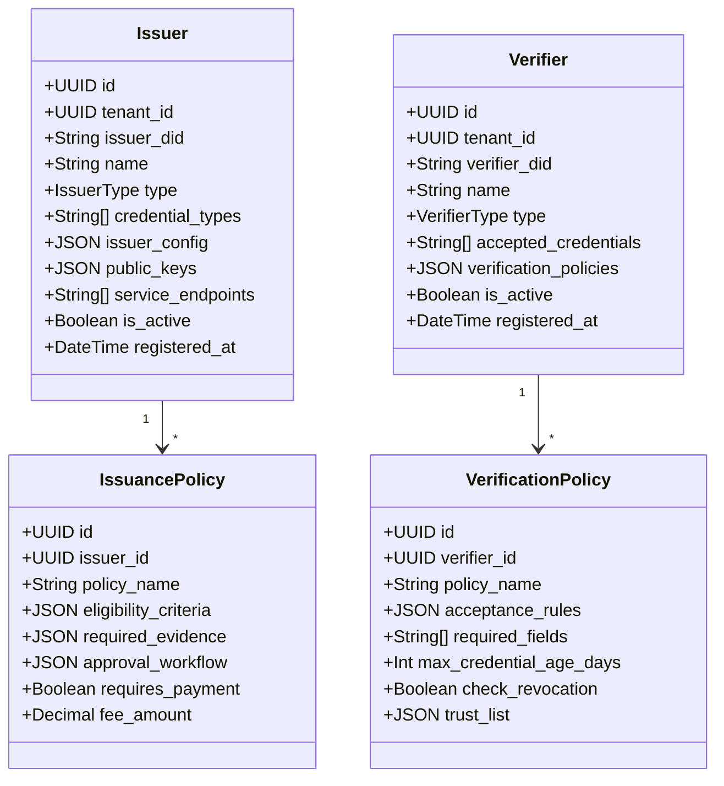

---

## 5. Audit and Compliance Model

### 5.1 Audit Log Structure

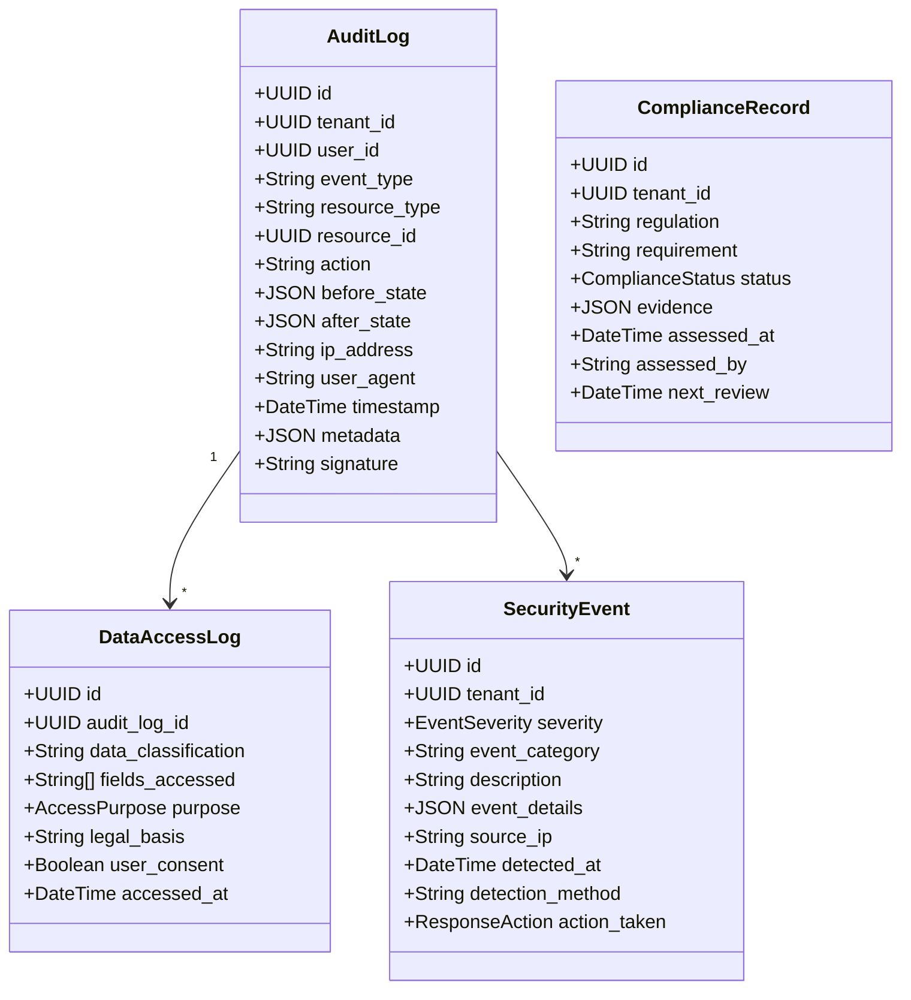

---

## 6. Database Schema Design

### 6.1 Core Tables (PostgreSQL)

```sql
-- Tenant Management
CREATE TABLE tenants (
    id UUID PRIMARY KEY DEFAULT gen_random_uuid(),
    name VARCHAR(100) UNIQUE NOT NULL,
    display_name VARCHAR(200) NOT NULL,
    status VARCHAR(20) NOT NULL CHECK (status IN ('active', 'suspended', 'disabled')),
    configuration JSONB NOT NULL DEFAULT '{}',
    database_name VARCHAR(63) UNIQUE NOT NULL,
    connection_string TEXT ENCRYPTED,
    subscription_tier VARCHAR(20) NOT NULL,
    limits JSONB NOT NULL,
    created_at TIMESTAMPTZ DEFAULT NOW(),
    updated_at TIMESTAMPTZ DEFAULT NOW(),
    created_by VARCHAR(200)
);

-- Users
CREATE TABLE users (
    id UUID PRIMARY KEY DEFAULT gen_random_uuid(),
    tenant_id UUID NOT NULL REFERENCES tenants(id),
    organization_id UUID,
    external_id VARCHAR(200),
    email VARCHAR(320) ENCRYPTED,
    phone_number VARCHAR(50) ENCRYPTED,
    status VARCHAR(20) NOT NULL,
    profile JSONB ENCRYPTED,
    created_at TIMESTAMPTZ DEFAULT NOW(),
    last_login TIMESTAMPTZ,
    roles TEXT[],
    preferences JSONB,
    UNIQUE(tenant_id, email),
    INDEX idx_users_tenant (tenant_id),
    INDEX idx_users_external (external_id)
);

-- Wallets
CREATE TABLE wallets (
    id UUID PRIMARY KEY DEFAULT gen_random_uuid(),
    user_id UUID NOT NULL REFERENCES users(id),
    tenant_id UUID NOT NULL REFERENCES tenants(id),
    wallet_did VARCHAR(500) UNIQUE,
    type VARCHAR(20) NOT NULL,
    status VARCHAR(20) NOT NULL,
    metadata JSONB,
    created_at TIMESTAMPTZ DEFAULT NOW(),
    updated_at TIMESTAMPTZ DEFAULT NOW(),
    backup_data BYTEA ENCRYPTED,
    recovery_method VARCHAR(50),
    INDEX idx_wallets_user (user_id),
    INDEX idx_wallets_did (wallet_did)
);

-- Credentials
CREATE TABLE credentials (
    id UUID PRIMARY KEY DEFAULT gen_random_uuid(),
    wallet_id UUID NOT NULL REFERENCES wallets(id),
    credential_id VARCHAR(500) UNIQUE NOT NULL,
    type VARCHAR(100) NOT NULL,
    format VARCHAR(20) NOT NULL,
    credential_subject JSONB ENCRYPTED NOT NULL,
    issuer_did VARCHAR(500) NOT NULL,
    issuance_date TIMESTAMPTZ NOT NULL,
    expiration_date TIMESTAMPTZ,
    proof JSONB NOT NULL,
    status VARCHAR(20) NOT NULL,
    metadata JSONB,
    schema_id VARCHAR(200),
    revocation_list_index INTEGER,
    created_at TIMESTAMPTZ DEFAULT NOW(),
    INDEX idx_credentials_wallet (wallet_id),
    INDEX idx_credentials_type (type),
    INDEX idx_credentials_issuer (issuer_did),
    INDEX idx_credentials_status (status)
);
```

### 6.2 Audit and Security Tables

```sql
-- Audit Logs (Append-only)
CREATE TABLE audit_logs (
    id UUID PRIMARY KEY DEFAULT gen_random_uuid(),
    tenant_id UUID NOT NULL,
    user_id UUID,
    event_type VARCHAR(50) NOT NULL,
    resource_type VARCHAR(50) NOT NULL,
    resource_id UUID,
    action VARCHAR(50) NOT NULL,
    before_state JSONB,
    after_state JSONB,
    ip_address INET,
    user_agent TEXT,
    timestamp TIMESTAMPTZ DEFAULT NOW() NOT NULL,
    metadata JSONB,
    signature TEXT NOT NULL,
    INDEX idx_audit_tenant_time (tenant_id, timestamp DESC),
    INDEX idx_audit_user (user_id),
    INDEX idx_audit_resource (resource_type, resource_id)
) PARTITION BY RANGE (timestamp);

-- Create monthly partitions
CREATE TABLE audit_logs_2025_01 PARTITION OF audit_logs
    FOR VALUES FROM ('2025-01-01') TO ('2025-02-01');

-- Key Management
CREATE TABLE key_pairs (
    id UUID PRIMARY KEY DEFAULT gen_random_uuid(),
    wallet_id UUID NOT NULL REFERENCES wallets(id),
    key_id VARCHAR(200) UNIQUE NOT NULL,
    type VARCHAR(20) NOT NULL,
    purpose VARCHAR(50) NOT NULL,
    algorithm VARCHAR(50) NOT NULL,
    public_key TEXT NOT NULL,
    private_key_ref VARCHAR(500) ENCRYPTED NOT NULL,
    created_at TIMESTAMPTZ DEFAULT NOW(),
    expires_at TIMESTAMPTZ,
    is_revoked BOOLEAN DEFAULT FALSE,
    revoked_at TIMESTAMPTZ,
    INDEX idx_keys_wallet (wallet_id),
    INDEX idx_keys_expiry (expires_at)
);

-- Session Management
CREATE TABLE sessions (
    id UUID PRIMARY KEY DEFAULT gen_random_uuid(),
    user_id UUID NOT NULL REFERENCES users(id),
    token_hash VARCHAR(64) UNIQUE NOT NULL,
    device_id VARCHAR(200),
    ip_address INET,
    user_agent TEXT,
    created_at TIMESTAMPTZ DEFAULT NOW(),
    expires_at TIMESTAMPTZ NOT NULL,
    last_activity TIMESTAMPTZ DEFAULT NOW(),
    is_active BOOLEAN DEFAULT TRUE,
    INDEX idx_sessions_user (user_id),
    INDEX idx_sessions_token (token_hash),
    INDEX idx_sessions_expiry (expires_at)
);
```

---

## 7. Data Access Patterns

### 7.1 Query Optimization Strategy

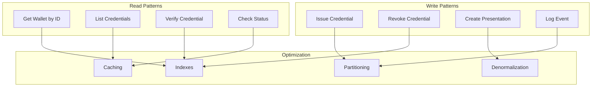

### 7.2 Caching Strategy

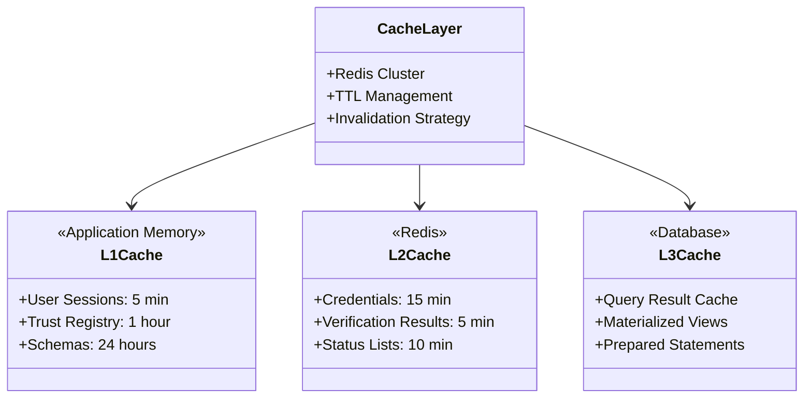

---

## 8. Data Migration Strategy

### 8.1 Migration Path: Per-Tenant to Shared DB

```mermaid
graph LR
    subgraph "Phase 1: Analysis"
        ANALYZE[Analyze Data]
        SIZE[Size Assessment]
        DEPS[Dependencies]
    end
    
    subgraph "Phase 2: Preparation"
        SCHEMA[Schema Design]
        RLS_DESIGN[RLS Rules]
        SCRIPT[Migration Scripts]
    end
    
    subgraph "Phase 3: Migration"
        PILOT_MIG[Pilot Migration]
        VALIDATE_MIG[Validation]
        PROD_MIG[Production Migration]
    end
    
    subgraph "Phase 4: Cutover"
        DUAL_WRITE[Dual Write]
        VERIFY_DATA[Verify Data]
        SWITCH[Switch Over]
    end
    
    ANALYZE --> SIZE
    SIZE --> DEPS
    DEPS --> SCHEMA
    SCHEMA --> RLS_DESIGN
    RLS_DESIGN --> SCRIPT
    SCRIPT --> PILOT_MIG
    PILOT_MIG --> VALIDATE_MIG
    VALIDATE_MIG --> PROD_MIG
    PROD_MIG --> DUAL_WRITE
    DUAL_WRITE --> VERIFY_DATA
    VERIFY_DATA --> SWITCH
```

### 8.2 Row-Level Security Implementation

```sql
-- Enable RLS on shared tables
ALTER TABLE credentials ENABLE ROW LEVEL SECURITY;

-- Create tenant isolation policy
CREATE POLICY tenant_isolation ON credentials
    FOR ALL
    TO application_role
    USING (tenant_id = current_setting('app.current_tenant')::UUID);

-- Create read policy for verifiers
CREATE POLICY verifier_read ON credentials
    FOR SELECT
    TO verifier_role
    USING (
        status = 'active' 
        AND issuer_did IN (
            SELECT did FROM trust_registry 
            WHERE is_active = true
        )
    );

-- Function to set current tenant
CREATE FUNCTION set_current_tenant(tenant UUID)
RETURNS void AS $$
BEGIN
    PERFORM set_config('app.current_tenant', tenant::text, false);
END;
$$ LANGUAGE plpgsql SECURITY DEFINER;
```

---

## 9. Data Lifecycle Management

### 9.1 Data Retention Policies

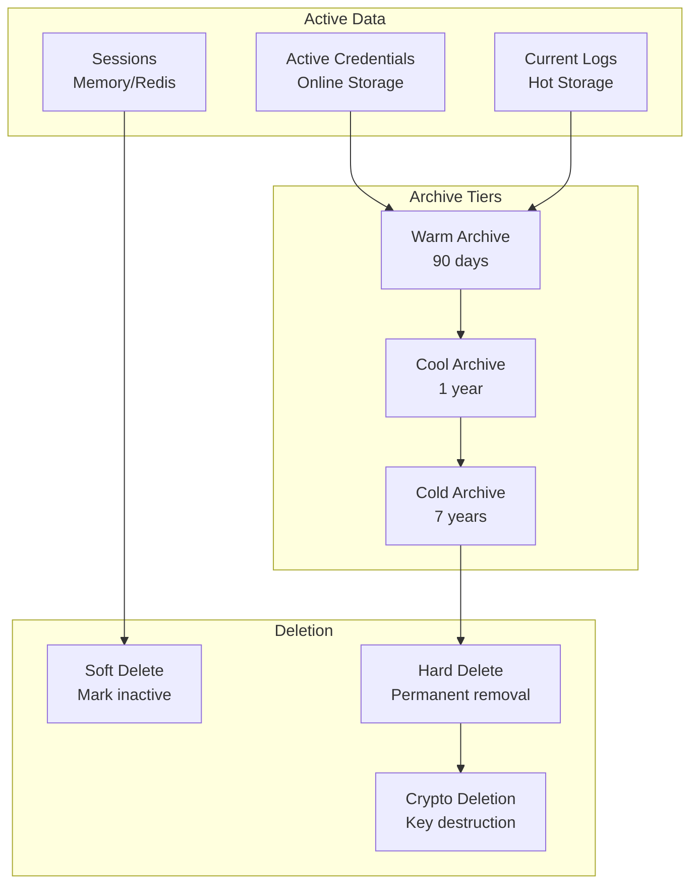

### 9.2 Data Classification

| Classification | Description | Retention | Encryption | Access Control |
|---------------|-------------|-----------|------------|----------------|
| **Restricted** | Cryptographic keys, PII | Until revoked | HSM + AES-256 | Need-to-know |
| **Sensitive** | Credentials, personal data | 7 years | AES-256 | Role-based |
| **Internal** | Audit logs, metadata | 3 years | AES-256 | Authenticated |
| **Public** | Schemas, public keys | Indefinite | TLS only | Public read |

---

## 10. Performance Considerations

### 10.1 Index Strategy

```sql
-- Primary lookup indexes
CREATE INDEX idx_credentials_wallet_type 
    ON credentials(wallet_id, type) 
    WHERE status = 'active';

CREATE INDEX idx_credentials_issuer_date 
    ON credentials(issuer_did, issuance_date DESC);

-- Partial indexes for common queries
CREATE INDEX idx_active_credentials 
    ON credentials(wallet_id) 
    WHERE status = 'active' AND expiration_date > NOW();

-- JSONB indexes
CREATE INDEX idx_credential_subject 
    ON credentials USING GIN (credential_subject);

CREATE INDEX idx_metadata_search 
    ON credentials USING GIN (metadata);

-- Full-text search
CREATE INDEX idx_audit_search 
    ON audit_logs USING GIN (
        to_tsvector('english', 
            event_type || ' ' || 
            resource_type || ' ' || 
            action)
    );
```

### 10.2 Query Performance Patterns

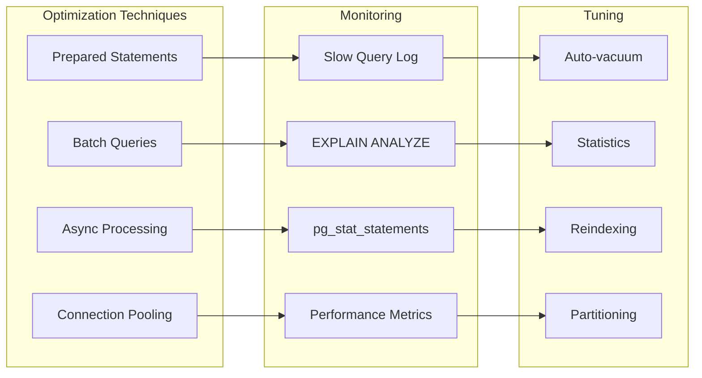

---

## 11. Backup and Recovery

### 11.1 Backup Strategy

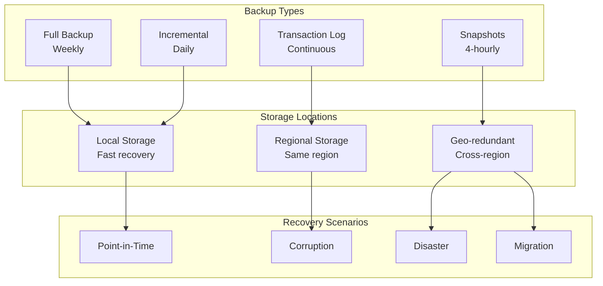

### 11.2 Recovery Procedures

| Scenario | RTO | RPO | Method | Steps |
|----------|-----|-----|--------|-------|
| Data corruption | 1 hour | 15 min | Point-in-time restore | 1. Identify corruption time<br/>2. Restore from snapshot<br/>3. Apply transaction logs<br/>4. Validate data |
| Database failure | 30 min | 5 min | Failover to replica | 1. Detect failure<br/>2. Promote read replica<br/>3. Update connection strings<br/>4. Verify operations |
| Region failure | 2 hours | 30 min | Cross-region failover | 1. Activate DR site<br/>2. Restore from geo-backup<br/>3. Update DNS<br/>4. Full validation |
| Complete loss | 24 hours | 1 hour | Full restore | 1. Provision infrastructure<br/>2. Restore from backup<br/>3. Rebuild indexes<br/>4. Full testing |

---

## 12. Data Governance

### 12.1 Data Quality Framework

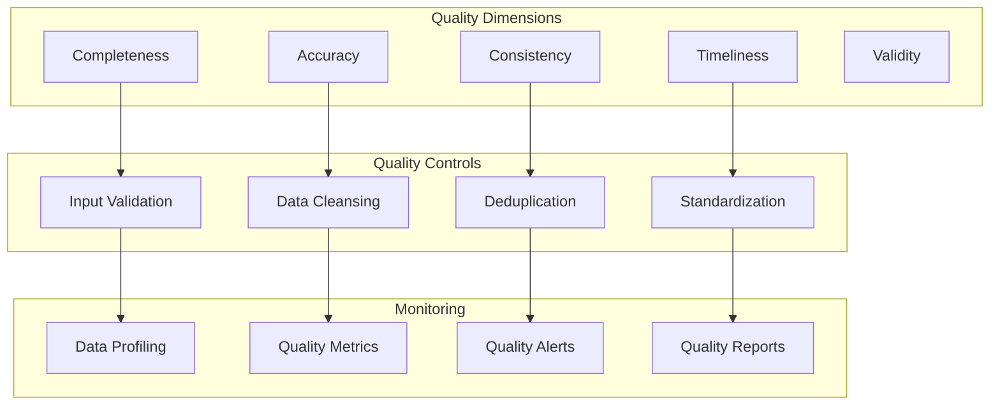

### 12.2 Data Stewardship

| Role | Responsibilities | Scope |
|------|-----------------|--------|
| **Data Owner** | Policy, access approval | Business data |
| **Data Steward** | Quality, compliance | Domain data |
| **Data Custodian** | Technical implementation | All data |
| **Data Architect** | Design, standards | Data models |
| **Privacy Officer** | Privacy compliance | Personal data |

---

## Database Maintenance

### Maintenance Schedule

| Task | Frequency | Impact | Duration |
|------|-----------|--------|----------|
| Auto-vacuum | Continuous | None | Ongoing |
| Statistics update | Daily | Minimal | 5 min |
| Index rebuild | Weekly | Low | 30 min |
| Full backup | Weekly | Low | 2 hours |
| Partition maintenance | Monthly | Low | 1 hour |
| Major version upgrade | Yearly | High | 4 hours |

### Performance Tuning Parameters

```sql
-- PostgreSQL configuration
shared_buffers = '8GB'
effective_cache_size = '24GB'
work_mem = '64MB'
maintenance_work_mem = '2GB'
max_connections = 200
max_parallel_workers = 8
wal_buffers = '16MB'
checkpoint_completion_target = 0.9
random_page_cost = 1.1  -- SSD storage
```

---

**END OF DATA MODEL APPENDIX**