# Appendix: Operations, SRE & Disaster Recovery
## Digital Wallet and Verifiable Credentials Solution

**Document Version:** 1.0  
**Parent Document:** [Master PRD](./PRD_Master.md)  
**Last Updated:** December 2024

---

## 1. Operations Framework

### 1.1 Operational Architecture

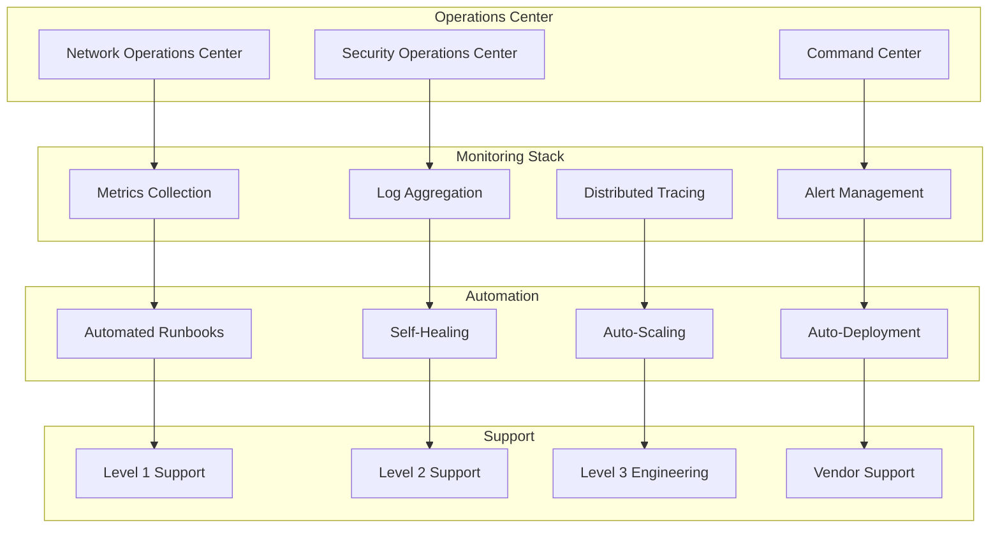

### 1.2 24x7 Operations Model

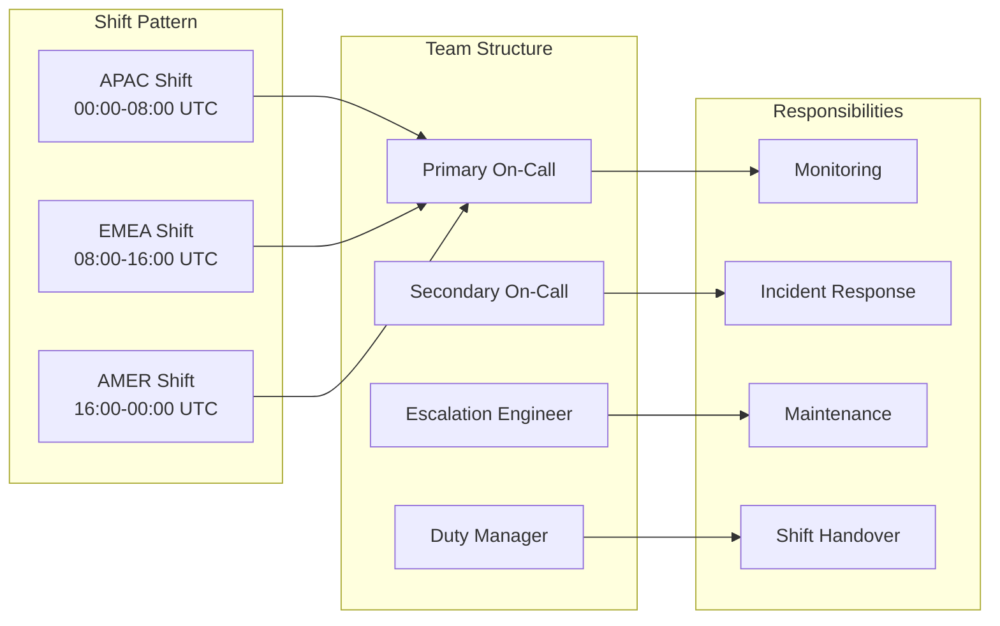

---

## 2. Site Reliability Engineering (SRE)

### 2.1 SRE Principles

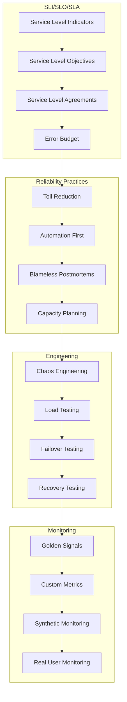

### 2.2 Error Budget Policy

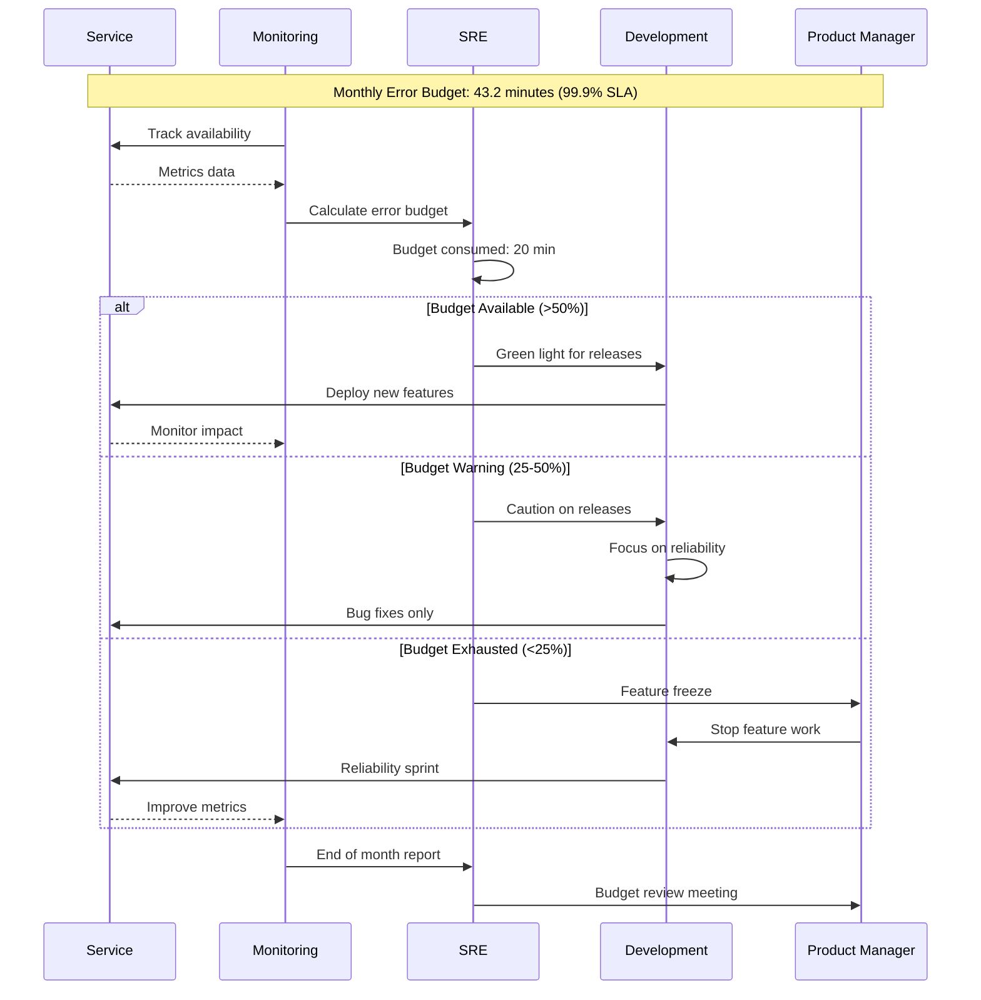

---

## 3. Monitoring and Observability

### 3.1 Observability Stack

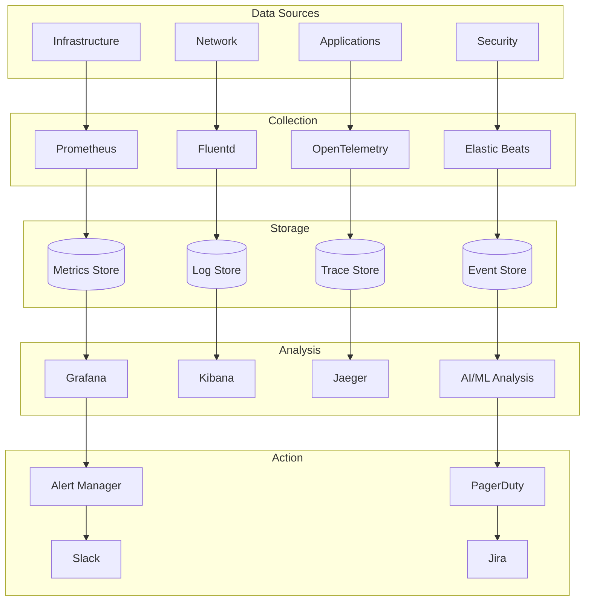

### 3.2 Golden Signals Monitoring

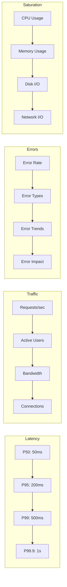

---

## 4. Incident Management

### 4.1 Incident Response Process

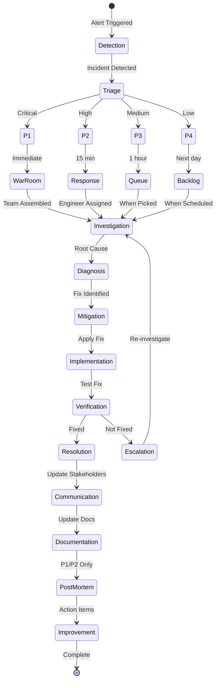

### 4.2 Incident Severity Matrix

| Severity | Impact | Response Time | Escalation | Communication |
|----------|--------|---------------|------------|---------------|
| **P1 - Critical** | Complete service outage | Immediate | Automatic to all levels | Every 30 min |
| **P2 - High** | Major feature unavailable | 15 minutes | L2 + Management | Every hour |
| **P3 - Medium** | Minor feature degraded | 1 hour | L2 only | Every 4 hours |
| **P4 - Low** | Cosmetic issues | Next business day | L1 only | On resolution |

### 4.3 On-Call Rotation

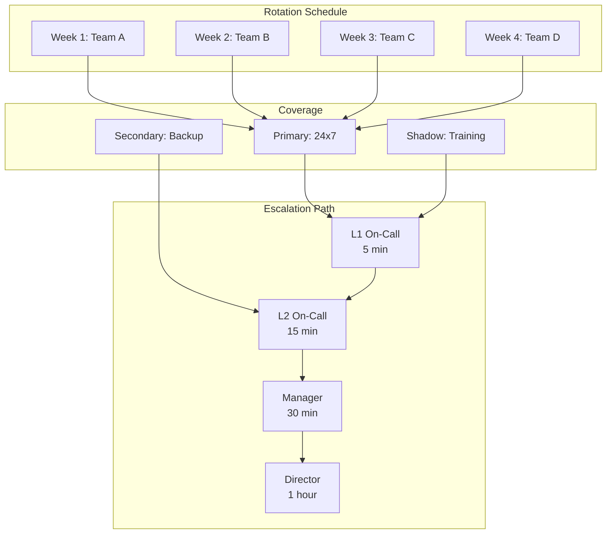

---

## 5. Disaster Recovery

### 5.1 DR Architecture

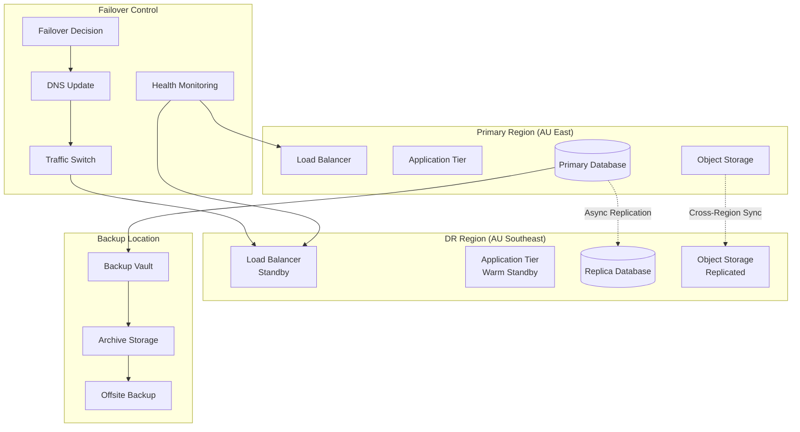

### 5.2 DR Scenarios and Procedures

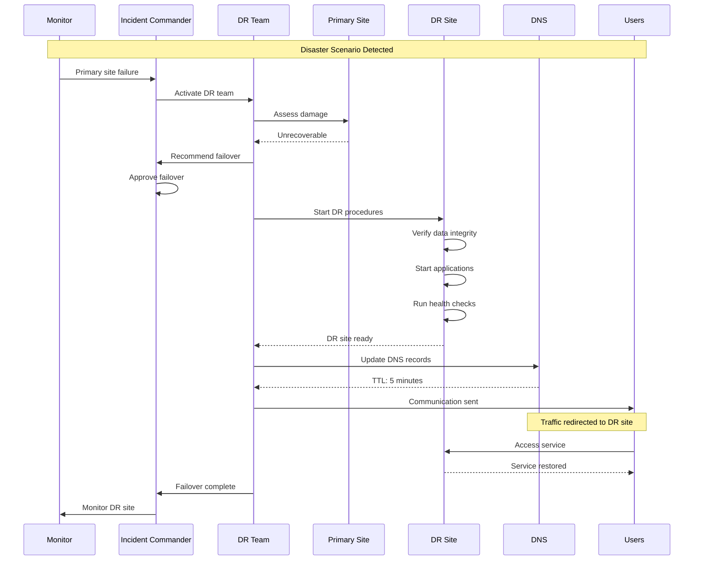

### 5.3 Recovery Targets

| Metric | Target | Achieved By | Test Frequency |
|--------|--------|-------------|----------------|
| **RTO (Recovery Time Objective)** | 1 hour | Automated failover | Quarterly |
| **RPO (Recovery Point Objective)** | 15 minutes | Async replication | Monthly |
| **MTTR (Mean Time to Recover)** | 45 minutes | Runbook automation | Quarterly |
| **Data Loss Tolerance** | <15 min transactions | Point-in-time recovery | Bi-annual |
| **Service Degradation** | <20% capacity | Warm standby | Quarterly |

---

## 6. Backup and Recovery

### 6.1 Backup Strategy

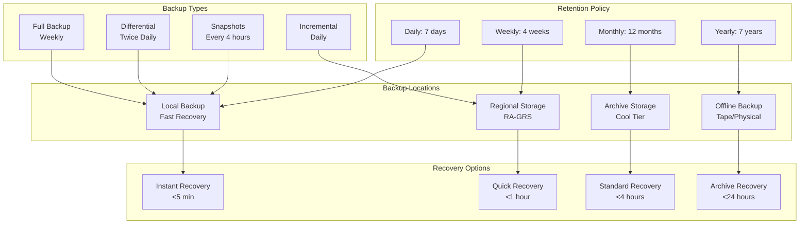

### 6.2 Recovery Procedures

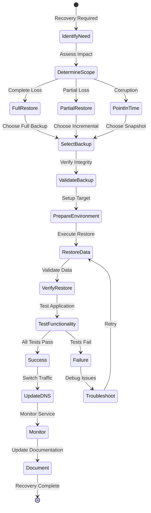

---

## 7. Capacity Planning

### 7.1 Capacity Management Process

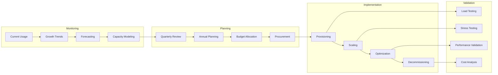

### 7.2 Resource Scaling Triggers

| Resource | Current | Warning (75%) | Critical (90%) | Action |
|----------|---------|---------------|----------------|--------|
| **CPU** | 45% | Scale at 75% | Alert at 90% | Add 2 nodes |
| **Memory** | 60% | Scale at 75% | Alert at 90% | Increase by 50% |
| **Storage** | 55% | Expand at 75% | Alert at 90% | Add 1TB |
| **Network** | 40% | Monitor at 75% | Upgrade at 90% | Increase bandwidth |
| **Database Connections** | 200/500 | Scale at 375 | Alert at 450 | Add read replicas |

---

## 8. Performance Management

### 8.1 Performance Monitoring

```mermaid
graph TB
    subgraph "Application Performance"
        APM[APM Tools]
        CODE_PROFILE[Code Profiling]
        DB_PERF[Database Performance]
        API_PERF[API Performance]
    end
    
    subgraph "Infrastructure Performance"
        SERVER_PERF[Server Metrics]
        NETWORK_PERF[Network Metrics]
        STORAGE_PERF[Storage Metrics]
        CONTAINER_PERF[Container Metrics]
    end
    
    subgraph "User Experience"
        REAL_USER[Real User Monitoring]
        SYNTHETIC_MON[Synthetic Monitoring]
        LOAD_TIME[Page Load Time]
        ERROR_TRACKING[Error Tracking]
    end
    
    subgraph "Optimization"
        BOTTLENECK[Bottleneck Analysis]
        TUNING[Performance Tuning]
        CACHING[Cache Optimization]
        CDN_OPT[CDN Optimization]
    end
    
    APM --> BOTTLENECK
    CODE_PROFILE --> TUNING
    DB_PERF --> CACHING
    API_PERF --> CDN_OPT
    
    SERVER_PERF --> BOTTLENECK
    NETWORK_PERF --> CDN_OPT
    STORAGE_PERF --> CACHING
    CONTAINER_PERF --> TUNING
    
    REAL_USER --> BOTTLENECK
    SYNTHETIC_MON --> TUNING
    LOAD_TIME --> CDN_OPT
    ERROR_TRACKING --> BOTTLENECK
```

### 8.2 Performance SLIs/SLOs

| Service | SLI | SLO | Current | Status |
|---------|-----|-----|---------|--------|
| **API Gateway** | P95 Latency | <100ms | 85ms | ✅ Meeting |
| **Wallet Service** | P99 Latency | <500ms | 420ms | ✅ Meeting |
| **Verification** | Success Rate | >99.9% | 99.95% | ✅ Meeting |
| **Database** | Query Time | <50ms | 45ms | ✅ Meeting |
| **Cache** | Hit Rate | >90% | 92% | ✅ Meeting |
| **CDN** | Cache Hit | >85% | 88% | ✅ Meeting |

---

## 9. Operational Procedures

### 9.1 Daily Operations Checklist

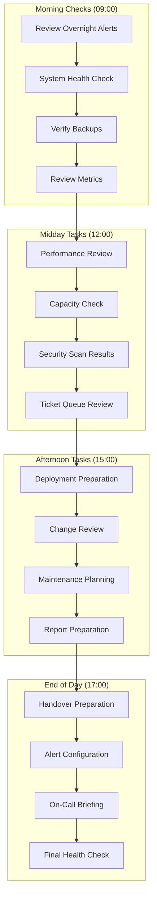

### 9.2 Runbook Automation

| Runbook | Trigger | Automation Level | Success Rate | Avg Time |
|---------|---------|------------------|--------------|----------|
| **Service Restart** | Health check failure | Fully automated | 98% | 2 min |
| **Scale Out** | High load | Fully automated | 99% | 5 min |
| **Cache Clear** | Cache corruption | Semi-automated | 95% | 3 min |
| **Database Failover** | Primary failure | Semi-automated | 97% | 10 min |
| **Certificate Renewal** | 30 days to expiry | Fully automated | 100% | 1 min |
| **Log Rotation** | Size threshold | Fully automated | 100% | 30 sec |

---

## 10. Change Management

### 10.1 Change Process

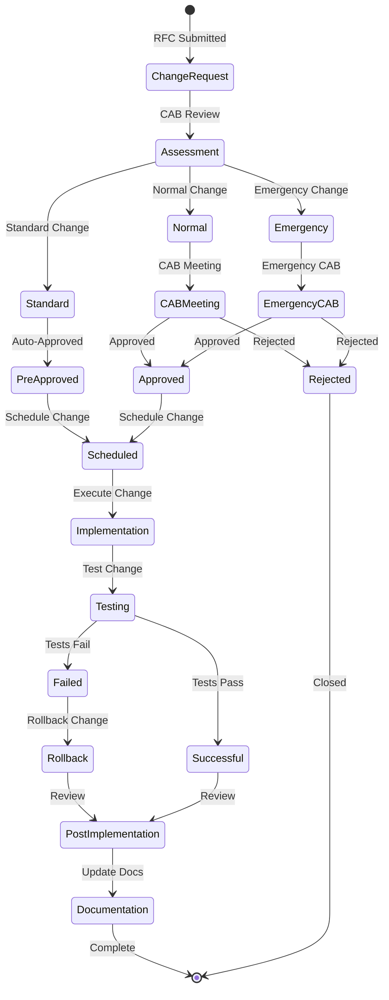

### 10.2 Change Windows

| Type | Window | Duration | Frequency | Notification |
|------|--------|----------|-----------|--------------|
| **Standard** | Automated | <5 min | As needed | Post-change |
| **Normal** | Tue/Thu 02:00-04:00 AEST | 2 hours | Twice weekly | 48 hours |
| **Major** | Sunday 00:00-06:00 AEST | 6 hours | Monthly | 1 week |
| **Emergency** | Any time | As needed | As required | Immediate |

---

## 11. Security Operations

### 11.1 Security Operations Center (SOC)

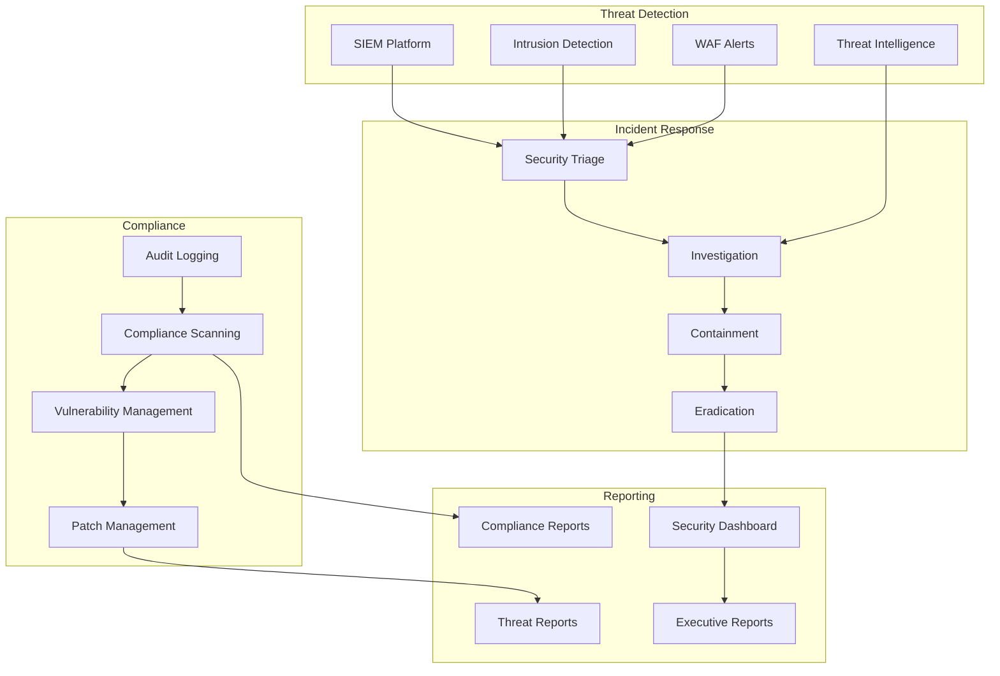

### 11.2 Security Metrics

| Metric | Target | Current | Trend | Action |
|--------|--------|---------|-------|--------|
| **Mean Time to Detect** | <15 min | 12 min | ↓ | Maintain |
| **Mean Time to Respond** | <30 min | 25 min | ↓ | Maintain |
| **Vulnerabilities (Critical)** | 0 | 0 | → | Monitor |
| **Patch Compliance** | >99% | 99.5% | ↑ | Continue |
| **Security Incidents** | <5/month | 3 | ↓ | Monitor |
| **False Positives** | <10% | 8% | ↓ | Tune rules |

---

## 12. Operational Metrics and KPIs

### 12.1 Operational Dashboard

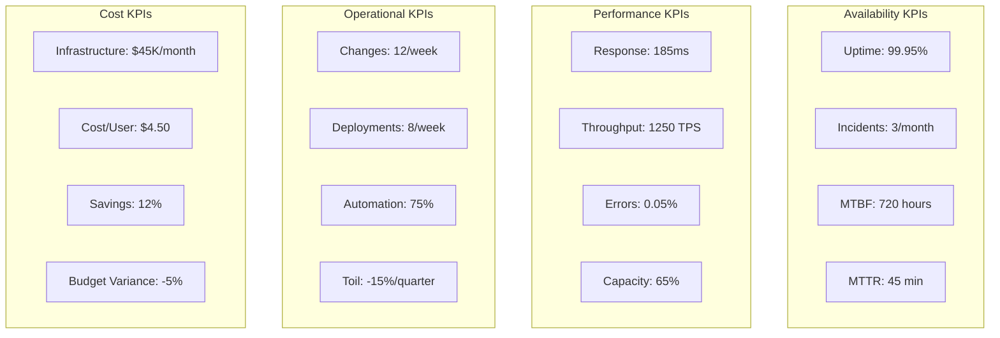

### 12.2 Operational Excellence Maturity

| Domain | Current Level | Target | Gap | Actions |
|--------|--------------|--------|-----|---------|
| **Monitoring** | Level 4 - Proactive | Level 5 | 1 | AI/ML implementation |
| **Automation** | Level 3 - Partial | Level 4 | 1 | Expand runbooks |
| **Documentation** | Level 4 - Complete | Level 4 | 0 | Maintain |
| **Process** | Level 3 - Defined | Level 4 | 1 | Process optimization |
| **Tools** | Level 4 - Integrated | Level 5 | 1 | Tool consolidation |
| **Culture** | Level 3 - Collaborative | Level 4 | 1 | DevOps practices |

---

## Operational Tools and Technologies

### Infrastructure and Monitoring Tools

| Category | Tool | Purpose | Integration |
|----------|------|---------|-------------|
| **Monitoring** | Azure Monitor | Infrastructure monitoring | Native |
| **APM** | Application Insights | Application performance | Native |
| **Logging** | Log Analytics | Centralized logging | Native |
| **Alerting** | PagerDuty | Incident alerting | API |
| **Automation** | Azure Automation | Runbook automation | Native |
| **Orchestration** | Kubernetes | Container orchestration | AKS |
| **IaC** | Terraform | Infrastructure as Code | CLI |
| **CI/CD** | Azure DevOps | Deployment pipeline | Native |

---

**END OF OPERATIONS, SRE & DISASTER RECOVERY APPENDIX**