# Appendix: Pricing and Assumptions
## Digital Wallet and Verifiable Credentials Solution

**Document Version:** 1.0  
**Parent Document:** [Master PRD](./PRD_Master.md)  
**Last Updated:** December 2024

---

## 1. Pricing Models Overview

### 1.1 Pricing Strategy Framework

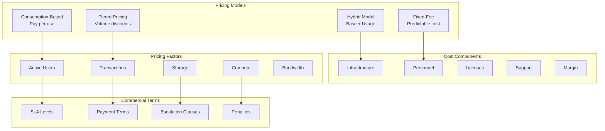

### 1.2 Pilot Pricing Comparison

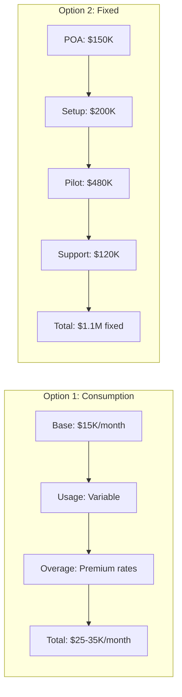

---

## 2. Option 1: Consumption-Based Pricing

### 2.1 Detailed Pricing Structure

| Component | Unit Price (AUD) | Included Volume | Overage Rate | Notes |
|-----------|-----------------|-----------------|--------------|-------|
| **Base Platform Fee** | $15,000/month | - | - | Includes basic infrastructure |
| **Active Wallets** | $0.50/wallet/month | 10,000 | $0.75 | Unique active users |
| **Credential Issuance** | $0.10/credential | 50,000/month | $0.15 | All credential types |
| **Verifications** | $0.01/verification | 500,000/month | $0.02 | Online and offline |
| **API Calls** | $1.00/million | 10M/month | $1.50/million | All API endpoints |
| **Storage** | $5/GB/month | 100 GB | $8/GB | Encrypted storage |
| **Bandwidth** | $0.10/GB | 1 TB/month | $0.15/GB | Data transfer |
| **Support** | $5,000/month | Business hours | 24x7: +$10K | L2 support included |

### 2.2 Consumption Pricing Calculator

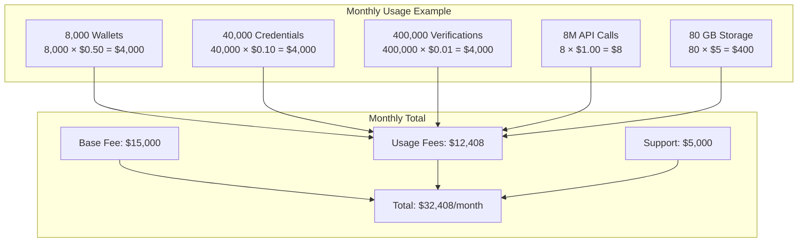

### 2.3 Tiered Volume Discounts

| Volume Tier | Wallets | Discount | Effective Rate |
|-------------|---------|----------|----------------|
| **Tier 1** | 0-10,000 | 0% | $0.50/wallet |
| **Tier 2** | 10,001-25,000 | 10% | $0.45/wallet |
| **Tier 3** | 25,001-50,000 | 20% | $0.40/wallet |
| **Tier 4** | 50,001-100,000 | 30% | $0.35/wallet |
| **Tier 5** | 100,001+ | 40% | $0.30/wallet |

---

## 3. Option 2: Fixed-Fee Pricing

### 3.1 Fixed Price Breakdown

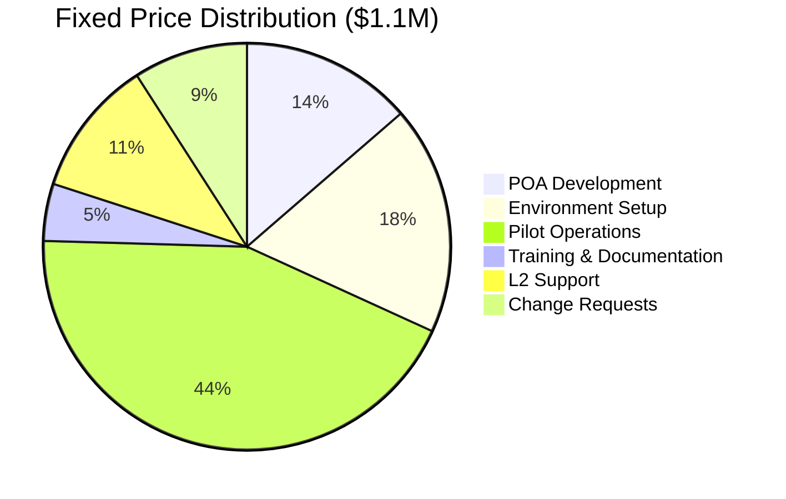

### 3.2 Detailed Fixed Pricing Components

| Phase | Deliverables | Cost (AUD) | Timeline | Payment |
|-------|--------------|------------|----------|---------|
| **POA Development** | Working demo, SDK integration | $150,000 | 3 weeks | On completion |
| **Environment Setup** | Production environment, security | $200,000 | 2 months | Monthly |
| **Pilot Operations** | 12-month pilot, maintenance | $480,000 | 12 months | Monthly |
| **Training** | User training, documentation | $50,000 | 2 months | On delivery |
| **L2 Support** | Business hours support | $120,000 | 12 months | Quarterly |
| **Change Budget** | Minor changes, enhancements | $100,000 | As needed | On approval |
| **Total** | Complete pilot solution | **$1,100,000** | 15 months | Staged |

### 3.3 Payment Schedule

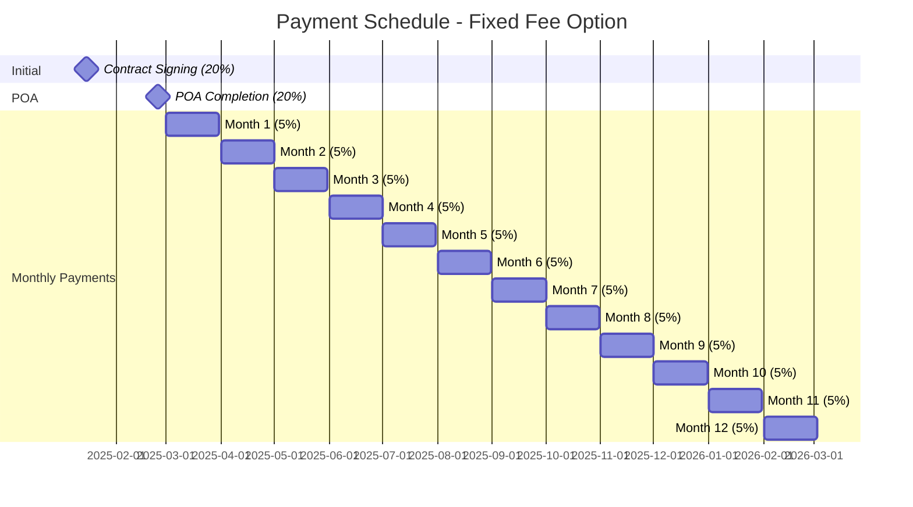

---

## 4. Production Pricing Model

### 4.1 Production Pricing Structure

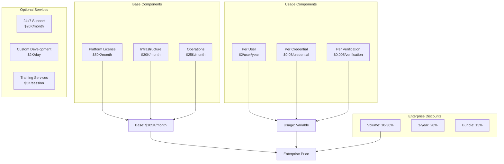

### 4.2 Production Scaling Scenarios

| Scale | Users | Monthly Cost | Annual Cost | Per User |
|-------|-------|--------------|-------------|----------|
| **Small** | 100,000 | $120,000 | $1,440,000 | $14.40 |
| **Medium** | 500,000 | $200,000 | $2,400,000 | $4.80 |
| **Large** | 1,000,000 | $350,000 | $4,200,000 | $4.20 |
| **Enterprise** | 2,000,000+ | $600,000 | $7,200,000 | $3.60 |

---

## 5. Cost Structure Analysis

### 5.1 Cost Breakdown

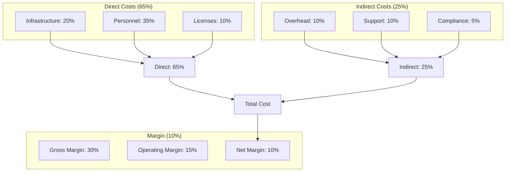

### 5.2 Infrastructure Costs

| Component | Monthly Cost | Annual Cost | Notes |
|-----------|--------------|-------------|-------|
| **Azure Kubernetes Service** | $8,000 | $96,000 | 3 clusters |
| **PostgreSQL Flexible Server** | $6,000 | $72,000 | HA configuration |
| **Storage (Blob + Disk)** | $3,000 | $36,000 | 10TB total |
| **Networking (VNet, LB, WAF)** | $2,500 | $30,000 | Multi-region |
| **Key Vault / HSM** | $4,000 | $48,000 | Dedicated HSM |
| **Monitoring & Logging** | $2,000 | $24,000 | Full observability |
| **Backup & DR** | $2,500 | $30,000 | Geo-redundant |
| **Total Infrastructure** | **$28,000** | **$336,000** | |

---

## 6. Key Assumptions

### 6.1 Technical Assumptions

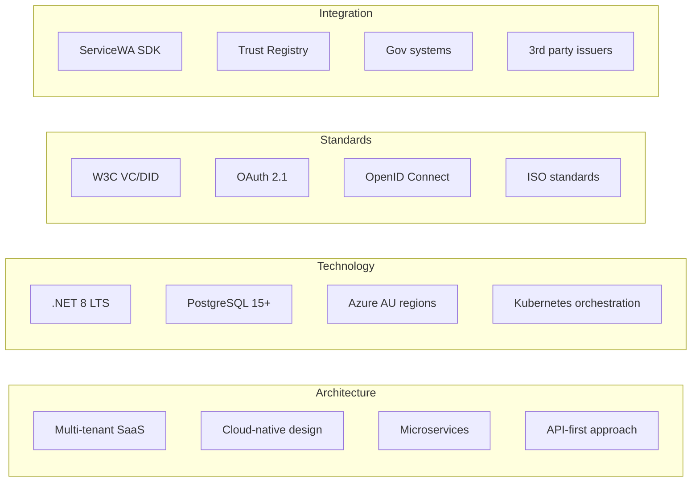

### 6.2 Business Assumptions

| Category | Assumption | Impact | Validation |
|----------|------------|--------|------------|
| **User Adoption** | 80% adoption within target group | High | Pilot metrics |
| **Transaction Volume** | 10 verifications per user/month | Medium | Usage analytics |
| **Support Load** | <5% users need support | Medium | Support tickets |
| **Performance** | Linear scaling with load | High | Load testing |
| **Availability** | 99.9% achievable | High | Monitoring |
| **Security** | No major breaches | Critical | Security audits |

### 6.3 Commercial Assumptions

- **Contract Duration:** Minimum 12 months for pilot
- **Payment Terms:** Net 30 days
- **Currency:** All prices in AUD
- **Taxes:** GST exclusive
- **Escalation:** Annual CPI adjustment
- **Termination:** 90 days notice
- **Liability:** Limited to contract value
- **IP Rights:** Client owns data, we retain platform IP

---

## 7. Risk-Adjusted Pricing

### 7.1 Risk Factors

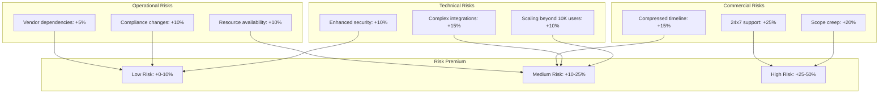

### 7.2 Contingency Planning

| Risk Category | Probability | Impact | Contingency | Cost Impact |
|--------------|-------------|--------|-------------|-------------|
| **Technical Complexity** | Medium | High | Additional resources | +15% |
| **Integration Delays** | Medium | Medium | Buffer time | +10% |
| **Scope Changes** | High | Medium | Change control | +20% |
| **Performance Issues** | Low | High | Infrastructure scaling | +10% |
| **Security Requirements** | Low | High | Security experts | +10% |
| **Total Contingency** | - | - | - | **+15% weighted** |

---

## 8. Value Proposition

### 8.1 ROI Analysis

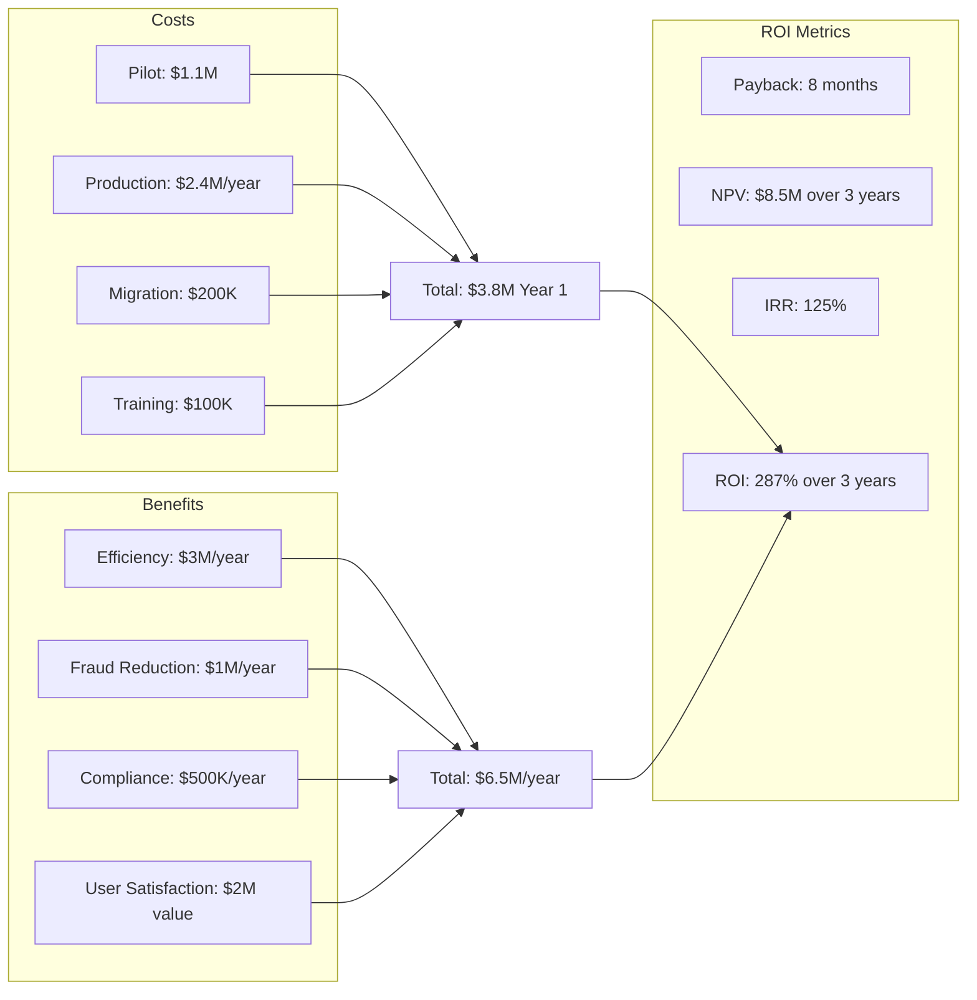

### 8.2 Cost Comparison

| Solution | Year 1 | Year 2 | Year 3 | 3-Year Total | Per User (2M) |
|----------|--------|--------|--------|--------------|---------------|
| **Our Solution** | $3.8M | $2.4M | $2.4M | $8.6M | $4.30 |
| **Competitor A** | $5.0M | $3.0M | $3.0M | $11.0M | $5.50 |
| **Competitor B** | $4.5M | $3.5M | $3.5M | $11.5M | $5.75 |
| **In-House Build** | $8.0M | $2.0M | $2.0M | $12.0M | $6.00 |

---

## 9. Service Level Agreements

### 9.1 SLA Tiers

```mermaid
graph TD
    subgraph "Standard SLA"
        STD_AVAIL[Availability: 99.5%]
        STD_RESPONSE[Response: <2s]
        STD_SUPPORT[Support: Business hours]
        STD_CREDIT[Credits: 10% max]
    end
    
    subgraph "Premium SLA"
        PREM_AVAIL[Availability: 99.9%]
        PREM_RESPONSE[Response: <500ms]
        PREM_SUPPORT[Support: 24x7]
        PREM_CREDIT[Credits: 25% max]
    end
    
    subgraph "Enterprise SLA"
        ENT_AVAIL[Availability: 99.95%]
        ENT_RESPONSE[Response: <200ms]
        ENT_SUPPORT[Support: Dedicated team]
        ENT_CREDIT[Credits: 50% max]
    end
    
    STD_AVAIL --> STD_PRICE[+$0/month]
    PREM_AVAIL --> PREM_PRICE[+$10K/month]
    ENT_AVAIL --> ENT_PRICE[+$25K/month]
```

### 9.2 SLA Credits

| Availability | Credit | Calculation | Cap |
|--------------|--------|-------------|-----|
| **99.5% - 99.9%** | 10% | Monthly fee × 10% | 10% |
| **99.0% - 99.5%** | 15% | Monthly fee × 15% | 25% |
| **98.0% - 99.0%** | 25% | Monthly fee × 25% | 50% |
| **< 98.0%** | 50% | Monthly fee × 50% | 100% |

---

## 10. Consumption Reporting

### 10.1 Reporting Framework

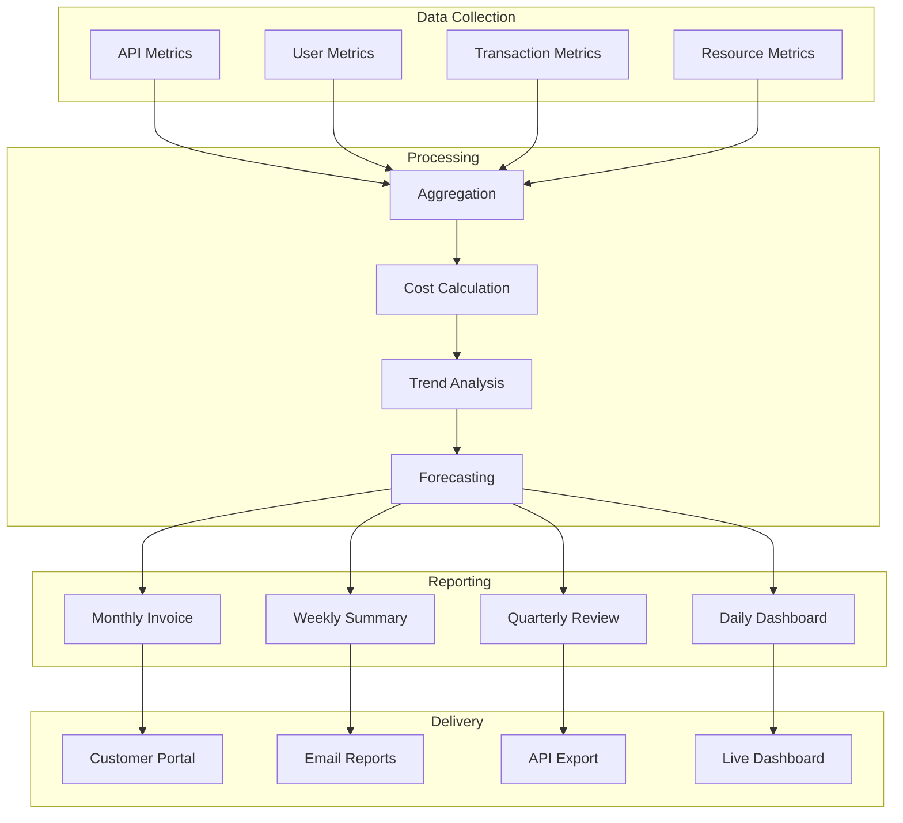

### 10.2 Consumption Metrics

| Metric | Frequency | Format | Distribution | Retention |
|--------|-----------|--------|--------------|-----------|
| **Real-time Usage** | Continuous | Dashboard | Portal | 30 days |
| **Daily Summary** | Daily | JSON/CSV | API/Email | 90 days |
| **Weekly Report** | Weekly | PDF | Email | 1 year |
| **Monthly Invoice** | Monthly | PDF | Portal/Email | 7 years |
| **Quarterly Analysis** | Quarterly | Excel | Email | 3 years |

---

## 11. Contract Terms

### 11.1 Key Commercial Terms

| Term | Pilot | Production | Notes |
|------|-------|------------|-------|
| **Minimum Term** | 12 months | 36 months | Auto-renewal |
| **Payment Terms** | Net 30 | Net 30 | Monthly invoicing |
| **Termination Notice** | 30 days | 90 days | Written notice |
| **Price Protection** | Fixed | CPI + 3% max | Annual adjustment |
| **Volume Commitment** | None | 80% of forecast | Quarterly true-up |
| **Liability Cap** | Contract value | Annual fees | Excludes data breach |
| **Warranty** | 90 days | 90 days | Defect remediation |
| **Indemnification** | Mutual | Mutual | IP and data |

### 11.2 Penalties and Incentives

```mermaid
graph TD
    subgraph "Penalties"
        LATE_DELIVERY[Late Delivery: 5%/week]
        SLA_BREACH[SLA Breach: Credits]
        SECURITY_INCIDENT[Security: 10% annual]
        DATA_BREACH[Data Breach: Uncapped]
    end
    
    subgraph "Incentives"
        EARLY_DELIVERY[Early: 5% bonus]
        EXCEED_SLA[Exceed SLA: 2% bonus]
        USER_SATISFACTION[High NPS: 3% bonus]
        INNOVATION[Innovation: 5% bonus]
    end
    
    subgraph "Adjustments"
        SCOPE_CHANGE[Scope: Renegotiate]
        VOLUME_CHANGE[Volume: Tier adjustment]
        EMERGENCY[Emergency: Time & materials]
        REGULATORY[Regulatory: Pass through]
    end
    
    LATE_DELIVERY --> CONTRACT_ADJUSTMENT
    SLA_BREACH --> CONTRACT_ADJUSTMENT
    EARLY_DELIVERY --> CONTRACT_ADJUSTMENT
    EXCEED_SLA --> CONTRACT_ADJUSTMENT
    SCOPE_CHANGE --> CONTRACT_ADJUSTMENT
    VOLUME_CHANGE --> CONTRACT_ADJUSTMENT
```

---

## 12. Financial Projections

### 12.1 3-Year Financial Model

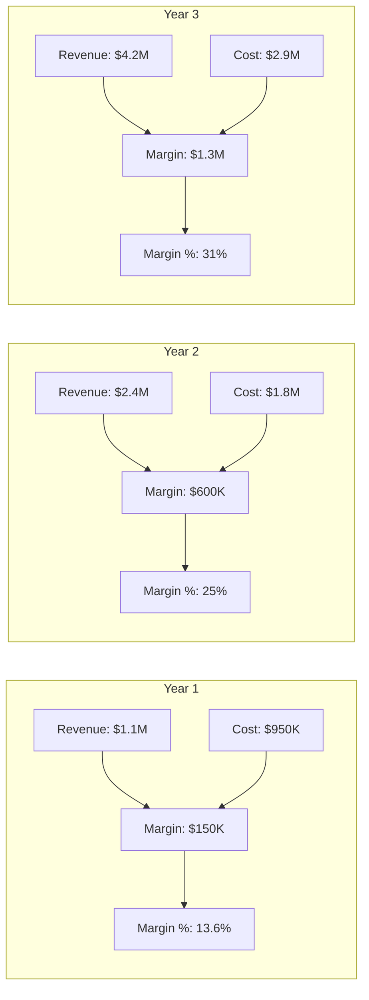

### 12.2 Break-Even Analysis

| Metric | Value | Timeline | Assumptions |
|--------|-------|----------|-------------|
| **Break-even Volume** | 5,000 users | Month 6 | At current pricing |
| **Break-even Revenue** | $65K/month | Month 6 | Covers all costs |
| **Payback Period** | 8 months | From go-live | Including setup costs |
| **Cash Flow Positive** | Month 9 | From contract | With payment terms |
| **Target Margin** | 25% | Year 2 | Operational efficiency |

---

## Pricing Approval Matrix

### Decision Authority

| Amount | Discount | Approval Level | Documentation |
|--------|----------|----------------|---------------|
| **< $100K** | < 10% | Sales Manager | Quote |
| **$100K - $500K** | 10-20% | Sales Director | Business case |
| **$500K - $1M** | 20-30% | VP Sales | Executive review |
| **> $1M** | > 30% | CEO | Board approval |

### Price Exceptions

- **Strategic Accounts:** Up to 40% discount with CEO approval
- **Volume Commitments:** Additional 10% for 3-year contracts
- **Reference Customers:** Special pricing with marketing commitment
- **Government:** Standard government rates apply

---

**END OF PRICING AND ASSUMPTIONS APPENDIX**