# Appendix: Project Plan, Team & Effort
## Digital Wallet and Verifiable Credentials Solution

**Document Version:** 1.0  
**Parent Document:** [Master PRD](./PRD_Master.md)  
**Last Updated:** December 2024

---

## 1. Project Overview

### 1.1 Project Structure

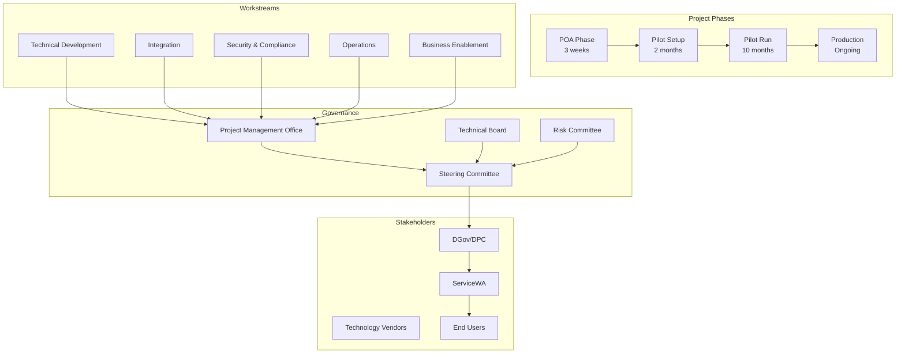

### 1.2 Project Timeline

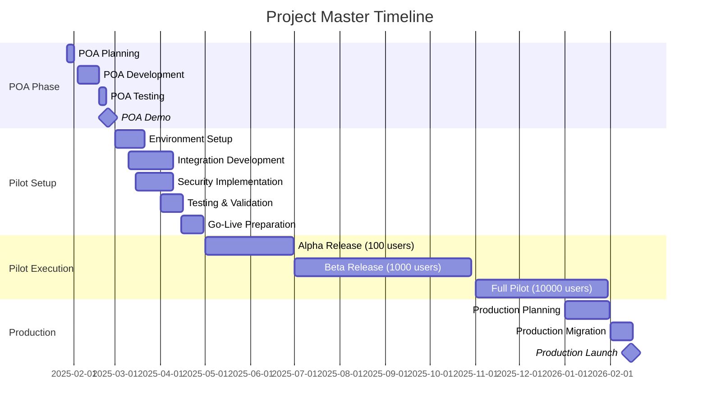

---

## 2. Team Structure

### 2.1 Organizational Chart

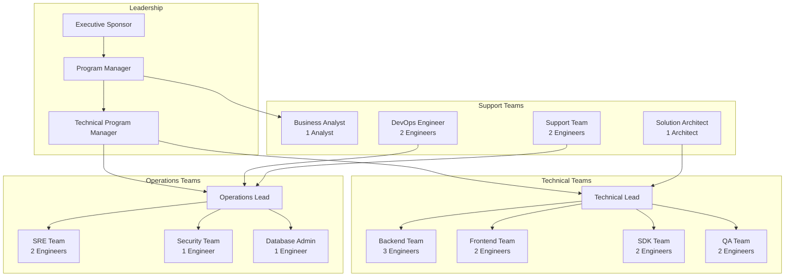

### 2.2 RACI Matrix

| Activity | PM | Tech Lead | Dev Team | QA | SRE | Security | BA | DGov |
|----------|----|-----------|---------|----|-----|----------|----|----|
| **Requirements** | A | C | I | C | I | C | R | A |
| **Architecture** | I | R | C | I | C | C | I | A |
| **Development** | I | A | R | C | I | C | I | I |
| **Testing** | I | C | C | R | I | C | A | I |
| **Security Review** | C | C | I | C | C | R | I | A |
| **Deployment** | A | C | C | I | R | C | I | I |
| **Operations** | C | I | I | I | R | C | I | A |
| **Support** | A | C | C | C | R | I | C | I |

**R** = Responsible, **A** = Accountable, **C** = Consulted, **I** = Informed

---

## 3. Resource Planning

### 3.1 Team Scaling by Phase

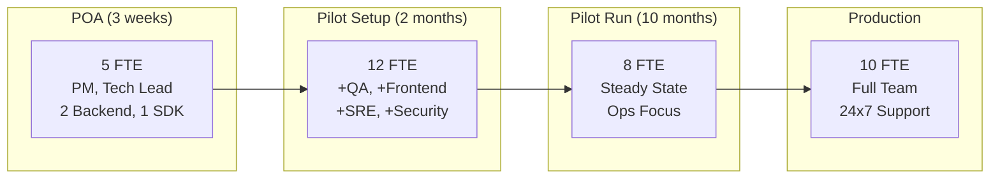

### 3.2 Detailed Resource Allocation

| Role | POA | Setup | Pilot | Production | Total Person-Months |
|------|-----|-------|-------|------------|-------------------|
| **Program Manager** | 1.0 | 1.0 | 0.5 | 0.5 | 18 |
| **Technical Lead** | 1.0 | 1.0 | 1.0 | 1.0 | 15 |
| **Backend Engineers** | 2.0 | 3.0 | 2.0 | 3.0 | 34 |
| **Frontend Engineers** | 0 | 2.0 | 1.0 | 1.0 | 14 |
| **SDK Engineers** | 1.0 | 2.0 | 1.0 | 1.0 | 17 |
| **QA Engineers** | 0 | 2.0 | 1.0 | 1.5 | 15.5 |
| **SRE Engineers** | 0 | 2.0 | 1.5 | 2.0 | 19 |
| **Security Engineer** | 0 | 1.0 | 0.5 | 1.0 | 8 |
| **Business Analyst** | 0 | 1.0 | 0.5 | 0.5 | 7 |
| **DevOps Engineers** | 0 | 1.0 | 0.5 | 1.0 | 8 |
| **Support Engineers** | 0 | 0 | 0.5 | 1.5 | 5 |
| **Total FTE** | **5.0** | **16.0** | **10.0** | **14.0** | **160.5** |

---

## 4. Work Breakdown Structure (WBS)

### 4.1 POA Phase WBS

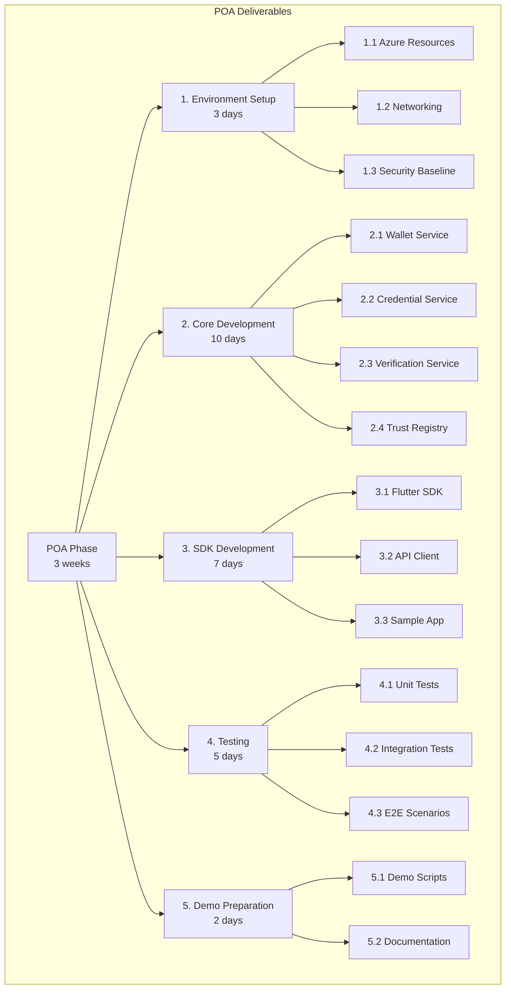

### 4.2 Pilot Phase WBS

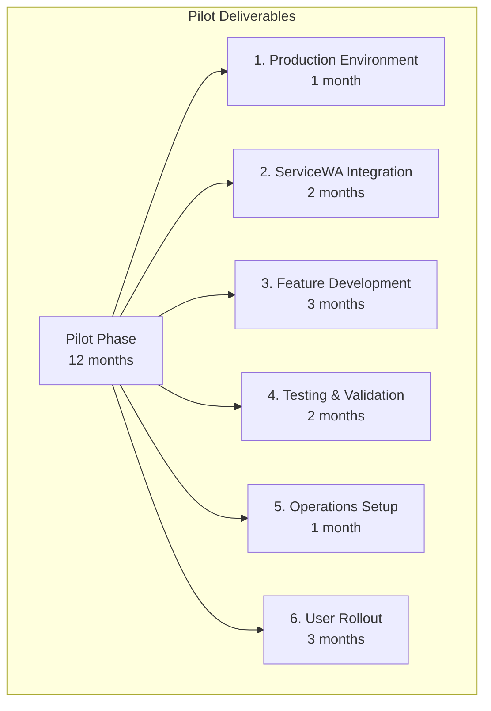

---

## 5. Sprint Planning

### 5.1 Sprint Structure

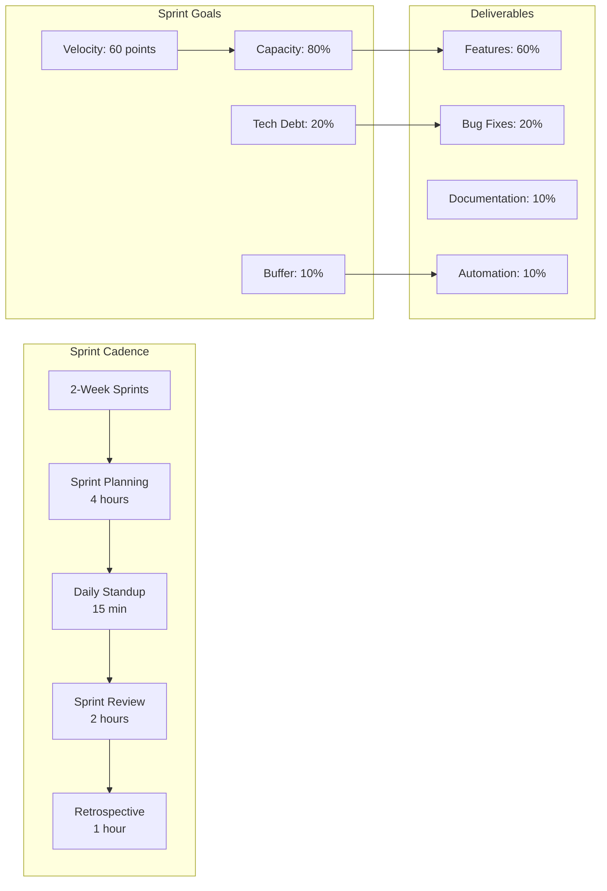

### 5.2 POA Sprint Plan

| Sprint | Dates | Goals | Key Deliverables |
|--------|-------|-------|------------------|
| **Sprint 0** | Jan 27-31 | Setup & Planning | Environment, CI/CD, Project setup |
| **Sprint 1** | Feb 3-14 | Core Services | Wallet, Credential, Auth services |
| **Sprint 2** | Feb 10-21 | Integration & Testing | SDK integration, E2E flows |
| **Sprint 3** | Feb 17-24 | Demo & Handover | Demo prep, documentation, testing |

---

## 6. Risk Management

### 6.1 Risk Register

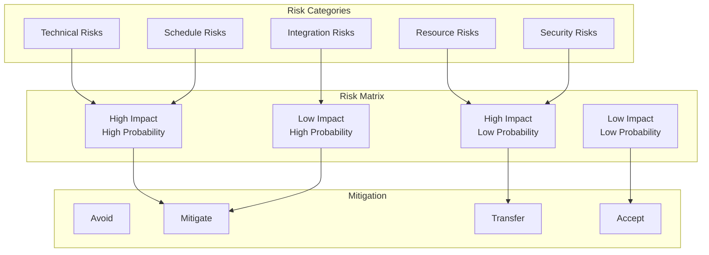

### 6.2 Top Risks and Mitigations

| Risk | Impact | Probability | Mitigation | Owner |
|------|--------|-------------|------------|-------|
| **ServiceWA integration delays** | High | Medium | Early SDK delivery, dedicated support | Tech Lead |
| **Resource availability** | High | Low | Backup resources identified | PM |
| **Security vulnerabilities** | High | Low | Regular security audits, penetration testing | Security Lead |
| **Performance at scale** | Medium | Medium | Load testing, auto-scaling design | SRE Lead |
| **Regulatory changes** | Medium | Low | Flexible architecture, regular compliance reviews | BA |
| **Third-party dependencies** | Medium | Medium | Vendor SLAs, fallback options | Tech Lead |

---

## 7. Communication Plan

### 7.1 Communication Matrix

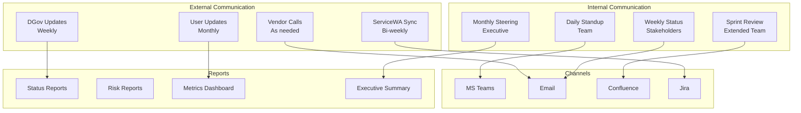

### 7.2 Stakeholder Communication Plan

| Stakeholder | Frequency | Method | Content | Owner |
|-------------|-----------|--------|---------|-------|
| **DGov/DPC** | Weekly | Status Report | Progress, risks, issues | PM |
| **ServiceWA** | Bi-weekly | Video Call | Integration status, blockers | Tech Lead |
| **Steering Committee** | Monthly | Presentation | Executive summary, decisions | PM |
| **Development Team** | Daily | Standup | Tasks, blockers, updates | Scrum Master |
| **End Users** | Monthly | Newsletter | Features, timeline, feedback | BA |

---

## 8. Quality Management

### 8.1 Quality Framework

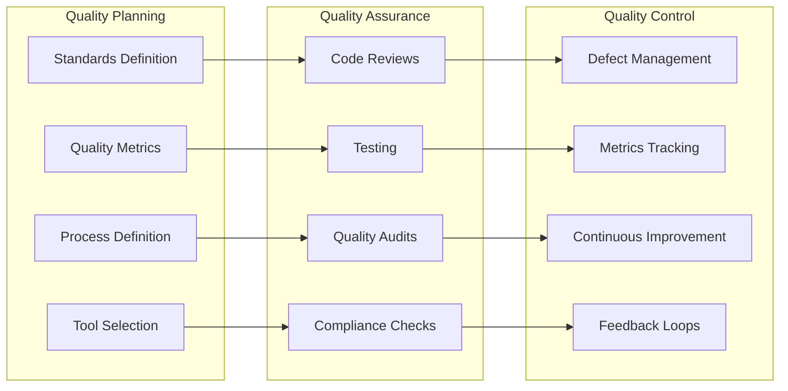

### 8.2 Quality Gates

| Gate | Criteria | Approval | Consequence |
|------|----------|----------|-------------|
| **Code Commit** | Tests pass, lint clean | Automated | Block merge |
| **Sprint End** | Sprint goals met, no P1 bugs | Tech Lead | Carry over work |
| **Release** | All tests pass, security scan clean | PM + Tech Lead | Delay release |
| **Pilot Entry** | POA complete, environment ready | Steering Committee | Delay pilot |
| **Production** | Pilot success criteria met | Executive Sponsor | Stay in pilot |

---

## 9. Dependency Management

### 9.1 Dependency Map

```mermaid
graph TD
    subgraph "External Dependencies"
        SERVICEWA_DEP[ServiceWA Team]
        AZURE_DEP[Azure Services]
        VENDORS_DEP[Third-party Vendors]
        DGOV_DEP[DGov Approvals]
    end
    
    subgraph "Internal Dependencies"
        INFRA_DEP[Infrastructure Team]
        SECURITY_DEP[Security Team]
        NETWORK_DEP[Network Team]
        DATA_DEP[Data Team]
    end
    
    subgraph "Technical Dependencies"
        API_DEP[API Availability]
        SDK_DEP[SDK Readiness]
        ENV_DEP[Environment Access]
        TOOLS_DEP[Tool Licenses]
    end
    
    subgraph "Project Impact"
        CRITICAL_PATH[Critical Path Items]
        BLOCKER[Potential Blockers]
        RISK_ITEMS[Risk Items]
        WATCH_LIST[Watch List]
    end
    
    SERVICEWA_DEP --> CRITICAL_PATH
    AZURE_DEP --> CRITICAL_PATH
    DGOV_DEP --> BLOCKER
    
    INFRA_DEP --> CRITICAL_PATH
    SECURITY_DEP --> RISK_ITEMS
    
    API_DEP --> BLOCKER
    SDK_DEP --> CRITICAL_PATH
    ENV_DEP --> BLOCKER
```

### 9.2 Dependency Tracking

| Dependency | Owner | Required By | Status | Risk | Mitigation |
|------------|-------|-------------|--------|------|------------|
| **ServiceWA API Access** | ServiceWA | Week 2 | In Progress | Medium | Early engagement |
| **Azure Environment** | Infrastructure | Week 1 | Complete | Low | None needed |
| **Security Certificates** | Security Team | Week 3 | Pending | High | Expedite request |
| **Vendor SDK License** | Procurement | Week 2 | Complete | Low | None needed |
| **Test Data** | DGov | Week 3 | Pending | Medium | Create synthetic data |

---

## 10. Budget and Cost Management

### 10.1 Budget Allocation

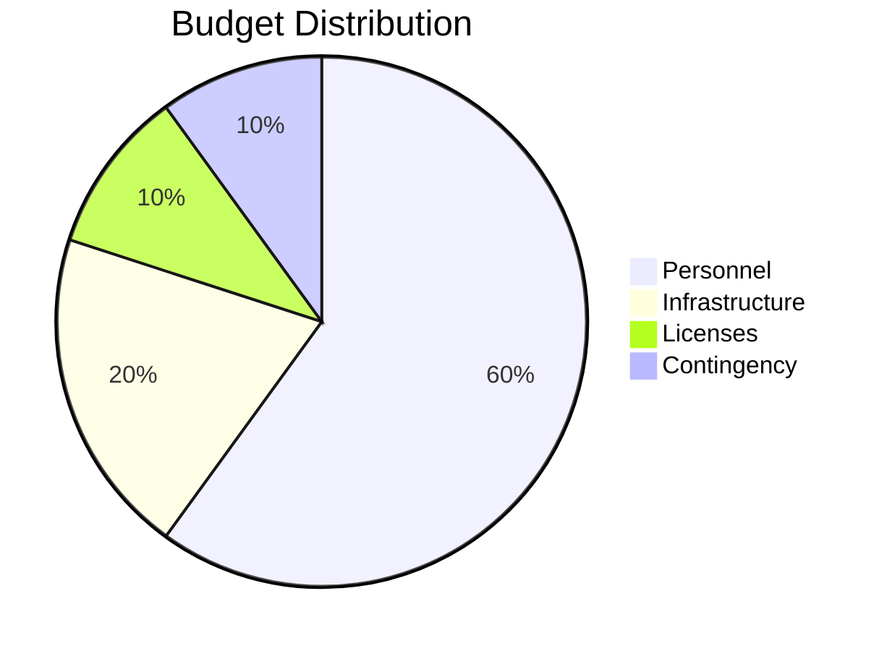

### 10.2 Cost Breakdown

| Category | POA | Pilot Setup | Pilot Run | Total | Notes |
|----------|-----|-------------|-----------|-------|-------|
| **Personnel** | $75K | $320K | $600K | $995K | Based on FTE rates |
| **Infrastructure** | $5K | $40K | $240K | $285K | Azure consumption |
| **Licenses** | $2K | $15K | $60K | $77K | Software, tools |
| **Security/Compliance** | $0 | $25K | $50K | $75K | Audits, testing |
| **Training** | $0 | $10K | $20K | $30K | Staff, users |
| **Contingency** | $8K | $40K | $90K | $138K | 10% buffer |
| **Total** | **$90K** | **$450K** | **$1,060K** | **$1,600K** | |

---

## 11. Success Criteria and Metrics

### 11.1 Project Success Metrics

```mermaid
graph TD
    subgraph "Schedule Metrics"
        ON_TIME[On-Time Delivery]
        MILESTONE[Milestone Achievement]
        VELOCITY_METRIC[Sprint Velocity]
    end
    
    subgraph "Quality Metrics"
        DEFECT_RATE[Defect Rate]
        TEST_COVERAGE[Test Coverage]
        CODE_QUALITY[Code Quality]
    end
    
    subgraph "Business Metrics"
        USER_ADOPTION[User Adoption]
        SATISFACTION[Satisfaction Score]
        ROI[Return on Investment]
    end
    
    subgraph "Technical Metrics"
        PERFORMANCE_MET[Performance Targets]
        AVAILABILITY_MET[Availability SLA]
        SECURITY_MET[Security Compliance]
    end
    
    ON_TIME --> MILESTONE
    MILESTONE --> VELOCITY_METRIC
    
    DEFECT_RATE --> TEST_COVERAGE
    TEST_COVERAGE --> CODE_QUALITY
    
    USER_ADOPTION --> SATISFACTION
    SATISFACTION --> ROI
    
    PERFORMANCE_MET --> AVAILABILITY_MET
    AVAILABILITY_MET --> SECURITY_MET
```

### 11.2 Success Criteria by Phase

| Phase | Success Criteria | Measurement | Target |
|-------|------------------|-------------|--------|
| **POA** | Working demo delivered | Demo acceptance | 100% features |
| **POA** | Integration validated | SDK test | Successful |
| **Pilot Setup** | Environment ready | Infrastructure tests | All pass |
| **Pilot Setup** | Security validated | Security audit | No critical issues |
| **Pilot Run** | User adoption | Active users | >8,000 |
| **Pilot Run** | System reliability | Availability | >99.9% |
| **Pilot Run** | Performance met | Response time | <500ms P95 |
| **Production** | Full rollout | Total users | >50,000 |

---

## 12. Knowledge Management

### 12.1 Documentation Strategy

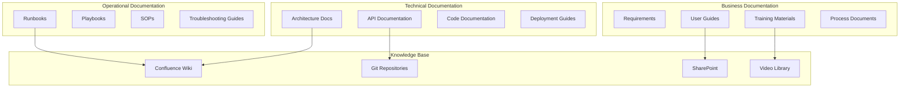

### 12.2 Knowledge Transfer Plan

| Phase | Activities | Deliverables | Audience |
|-------|------------|--------------|----------|
| **POA** | Technical walkthrough | Demo video, code repos | DGov team |
| **Pilot Setup** | Operations training | Runbooks, procedures | Ops team |
| **Pilot Run** | User training | User guides, videos | End users |
| **Handover** | Complete transfer | All documentation | Support team |

---

## Project Governance

### Steering Committee

- **Frequency:** Monthly
- **Attendees:** Executive sponsors, PM, key stakeholders
- **Decisions:** Go/No-go, budget, major changes
- **Deliverables:** Status reports, risk register, decisions log

### Technical Review Board

- **Frequency:** Bi-weekly
- **Attendees:** Tech lead, architects, senior engineers
- **Decisions:** Technical approaches, architecture changes
- **Deliverables:** Technical decisions, ADRs

### Change Advisory Board

- **Frequency:** Weekly
- **Attendees:** PM, tech lead, operations
- **Decisions:** Change approvals, release planning
- **Deliverables:** Change log, release notes

---

**END OF PROJECT PLAN, TEAM & EFFORT APPENDIX**