# Appendix: Regulatory Mapping
## Digital Wallet and Verifiable Credentials Solution

**Document Version:** 1.0  
**Parent Document:** [Master PRD](./PRD_Master.md)  
**Last Updated:** December 2024

---

## 1. Tender Requirements Traceability

### 1.1 Requirements Mapping Overview

### 1.2 Schedule 2 - Statement of Requirements Mapping

| Req ID | Requirement | Our Response | Status | Reference |
|--------|-------------|--------------|--------|-----------|
| **SOR-001** | Digital wallet solution | Full wallet implementation with SDK | ✅ Compliant | PRD Section 3 |
| **SOR-002** | Verifiable credentials support | W3C VC 2.0 compliant | ✅ Exceeds | Architecture 2.1 |
| **SOR-003** | ServiceWA integration | Native SDK provided | ✅ Compliant | APIs & SDKs 3.2 |
| **SOR-004** | Multi-credential support | Extensible credential framework | ✅ Exceeds | Data Model 3.1 |
| **SOR-005** | Offline verification | Full offline capability | ✅ Compliant | Workflows 2.2 |
| **SOR-006** | Privacy preserving | ZKP with BBS+ signatures | ✅ Exceeds | Security 4.2 |
| **SOR-007** | Scalability 2M+ users | Auto-scaling architecture | ✅ Compliant | Architecture 7.2 |
| **SOR-008** | 99.9% availability | Multi-region HA design | ✅ Compliant | Operations 5.3 |
| **SOR-009** | Data sovereignty | AU regions only | ✅ Compliant | Architecture 3.1 |
| **SOR-010** | Security compliance | ISO 27001 aligned | ✅ Compliant | Security 7.1 |

---

## 2. Schedule 3 - Specifications Compliance

### 2.1 Technical Specifications Mapping

### 2.2 Detailed Specifications Compliance

| Spec Category | Requirement | Our Implementation | Compliance | Evidence |
|--------------|-------------|-------------------|------------|----------|
| **Wallet Management** | Create, backup, restore | Full lifecycle management | ✅ 100% | PRD 3.1 |
| **Credential Types** | Driver's license, WWC, Age | All types + extensible | ✅ 110% | Data Model 3 |
| **Cryptography** | Industry standard | FIPS compliant + post-quantum ready | ✅ 120% | Security 2.3 |
| **Standards** | W3C, ISO | Full compliance + additional | ✅ 100% | PRD 5.1 |
| **API** | RESTful | REST + GraphQL + gRPC | ✅ 130% | APIs 2.1 |
| **SDK** | Mobile SDK | Flutter + .NET + TypeScript | ✅ 150% | APIs 6.1 |
| **Performance** | <2s response | <500ms P95 | ✅ 400% | Testing 4.3 |
| **Availability** | 99.9% | 99.95% design | ✅ 105% | Operations 2.2 |
| **Security** | Best practices | Zero-trust architecture | ✅ 120% | Security 4.2 |
| **Privacy** | APP compliance | Privacy by design | ✅ 100% | Security 4.3 |

---

## 3. Australian Privacy Principles (APP) Compliance

### 3.1 APP Compliance Matrix

```mermaid
graph TD
    subgraph "Collection Principles"
        APP1[APP 1: Open & Transparent]
        APP2[APP 2: Anonymity]
        APP3[APP 3: Collection]
        APP4[APP 4: Unsolicited]
        APP5[APP 5: Notification]
    end
    
    subgraph "Use & Disclosure"
        APP6[APP 6: Use/Disclosure]
        APP7[APP 7: Direct Marketing]
        APP8[APP 8: Cross-border]
        APP9[APP 9: Gov Identifiers]
    end
    
    subgraph "Data Quality & Security"
        APP10[APP 10: Quality]
        APP11[APP 11: Security]
    end
    
    subgraph "Access & Correction"
        APP12[APP 12: Access]
        APP13[APP 13: Correction]
    end
    
    APP1 --> IMPLEMENTED[✅ Implemented]
    APP2 --> IMPLEMENTED
    APP3 --> IMPLEMENTED
    APP11 --> ENHANCED[⭐ Enhanced]
    APP12 --> IMPLEMENTED
```

### 3.2 APP Implementation Details

| APP # | Principle | Implementation | Controls | Validation |
|-------|-----------|----------------|----------|------------|
| **APP 1** | Open and transparent | Published privacy policy, clear notices | UI/UX design | Legal review |
| **APP 2** | Anonymity option | Anonymous credentials supported | Technical design | Testing |
| **APP 3** | Collection of solicited info | Consent management system | Workflow engine | Audit logs |
| **APP 4** | Unsolicited info | Auto-deletion procedures | Automated process | Compliance check |
| **APP 5** | Notification | In-app notifications, emails | Notification service | User testing |
| **APP 6** | Use or disclosure | Purpose limitation engine | Access controls | Audit trail |
| **APP 7** | Direct marketing | Opt-out mechanisms | Preference center | Testing |
| **APP 8** | Cross-border disclosure | Data residency controls | Infrastructure | Monitoring |
| **APP 9** | Government identifiers | Separate encrypted storage | Data model | Security audit |
| **APP 10** | Quality of information | Validation rules, user corrections | Data quality engine | Metrics |
| **APP 11** | Security of information | Multi-layer security | Security architecture | Penetration testing |
| **APP 12** | Access to information | Self-service portal | User portal | Functional testing |
| **APP 13** | Correction of information | Update APIs, audit trail | API endpoints | Testing |

---

## 4. Regulatory Compliance Framework

### 4.1 Compliance Architecture

### 4.2 Regulatory Requirements Mapping

| Regulation | Key Requirements | Our Implementation | Gap Analysis | Action Items |
|------------|-----------------|-------------------|--------------|--------------|
| **Privacy Act 1988** | APP compliance, breach notification | Full implementation | None | Maintain |
| **State Records Act** | Record retention, disposal authority | 7-year retention policy | None | Implement schedule |
| **Spam Act 2003** | Consent for electronic messages | Opt-in system | None | Maintain |
| **Archives Act** | Commonwealth records management | Archival system | Review needed | Q2 2025 review |
| **Notifiable Breaches** | 72-hour notification | Incident response plan | None | Test quarterly |

---

## 5. Security Standards Compliance

### 5.1 ISO 27001 Controls Mapping

### 5.2 Security Controls Implementation

| Control Category | ISO 27001 Ref | Implementation | Maturity | Evidence |
|-----------------|---------------|----------------|----------|----------|
| **Access Control** | A.8 | RBAC, MFA, Zero Trust | Level 4 | Audit logs |
| **Cryptography** | A.9 | HSM, key management | Level 5 | Crypto assessment |
| **Operations Security** | A.10 | SOC, monitoring | Level 3 | SOC reports |
| **Communications** | A.11 | TLS 1.3, mTLS | Level 4 | Network scans |
| **Development** | A.12 | Secure SDLC | Level 3 | Code reviews |
| **Incident Management** | A.14 | IR plan, team | Level 3 | IR tests |

---

## 6. Technical Standards Compliance

### 6.1 W3C Standards Implementation

### 6.2 Standards Compliance Matrix

| Standard | Version | Compliance Level | Testing | Certification |
|----------|---------|-----------------|---------|---------------|
| **W3C VC Data Model** | 2.0 | 100% Core + Extended | ✅ Pass | Pending |
| **W3C DID Core** | 1.0 | 100% Core | ✅ Pass | Pending |
| **OpenID Connect** | 1.0 | 100% | ✅ Pass | ✅ Certified |
| **OAuth 2.1** | Draft | 100% Current draft | ✅ Pass | N/A |
| **ISO/IEC 18013-5** | 2021 | 100% mDL | ✅ Pass | In progress |
| **FIDO2/WebAuthn** | Level 2 | 100% | ✅ Pass | ✅ Certified |

---

## 7. Tender Addendum Responses

### 7.1 Q&A Compliance Tracking

### 7.2 Key Addendum Clarifications

| Item # | Topic | Clarification | Our Response | Impact |
|--------|-------|---------------|--------------|--------|
| **Add-001** | POA Timeline | 3 weeks firm | Confirmed achievable | None |
| **Add-023** | Data Residency | AU only, no exceptions | Fully compliant | None |
| **Add-045** | SDK Languages | Flutter priority | Flutter + .NET + JS | Enhanced |
| **Add-067** | Offline Period | 30 days minimum | 90 days supported | Exceeds |
| **Add-089** | Biometrics | Required for mobile | Full support | Compliant |
| **Add-112** | Backup | User-controlled | Encrypted backup/restore | Compliant |
| **Add-134** | Support Hours | Business hours minimum | 24x7 available | Exceeds |
| **Add-156** | Training | Included in price | Comprehensive program | Compliant |
| **Add-178** | IP Rights | Client owns data | Confirmed | Compliant |

---

## 8. Compliance Monitoring and Reporting

### 8.1 Compliance Dashboard

### 8.2 Compliance Reporting Schedule

| Report Type | Frequency | Audience | Content | Format |
|------------|-----------|----------|---------|--------|
| **Compliance Status** | Monthly | DGov | Overall compliance % | Dashboard |
| **Privacy Report** | Quarterly | DPO, DGov | APP compliance, breaches | PDF |
| **Security Report** | Monthly | CISO, DGov | Security posture, incidents | Dashboard |
| **Audit Report** | Annual | Board, DGov | Full compliance audit | Formal report |
| **Certification Status** | Quarterly | All stakeholders | Certification progress | Summary |

---

## 9. Compliance Gaps and Remediation

### 9.1 Gap Analysis

### 9.2 Remediation Plan

| Gap | Priority | Target Date | Actions | Owner | Status |
|-----|----------|-------------|---------|-------|--------|
| **ISO 27001** | Medium | Q3 2025 | Gap assessment, implementation | Security Lead | In Progress |
| **SOC 2 Type II** | Low | Q4 2025 | Audit preparation | Compliance | Not Started |
| **WCAG 2.2 AA** | High | Q1 2025 | Accessibility audit, fixes | UX Team | In Progress |
| **Carbon Neutral** | Low | 2026 | Sustainability plan | Operations | Planning |

---

## 10. Compliance Assurance Program

### 10.1 Assurance Activities

### 10.2 Compliance Responsibilities

| Role | Responsibilities | Reporting | Frequency |
|------|-----------------|-----------|-----------|
| **Compliance Officer** | Overall compliance program | Board, DGov | Monthly |
| **Privacy Officer** | Privacy compliance, DPO duties | Compliance Officer | Weekly |
| **Security Officer** | Security compliance | CISO | Daily |
| **Legal Counsel** | Regulatory interpretation | Compliance Officer | As needed |
| **Internal Audit** | Compliance validation | Board | Quarterly |

---

## 11. Continuous Compliance

### 11.1 Compliance Automation

### 11.2 Compliance Metrics and KPIs

| Metric | Target | Current | Trend | Action |
|--------|--------|---------|-------|--------|
| **Overall Compliance** | 100% | 97% | ↑ | Continue improvement |
| **Privacy Compliance** | 100% | 100% | → | Maintain |
| **Security Compliance** | 98% | 97% | ↑ | Focus on gaps |
| **Audit Findings** | <5 | 3 | ↓ | Good progress |
| **Remediation Time** | <30 days | 25 days | ↓ | Maintain |
| **Training Completion** | 100% | 92% | ↑ | Push completion |

---

## 12. Compliance Documentation

### 12.1 Required Documentation

| Document | Purpose | Owner | Review Cycle | Status |
|----------|---------|-------|--------------|--------|
| **Privacy Policy** | Public disclosure | Privacy Officer | Annual | ✅ Complete |
| **Security Policy** | Security standards | Security Officer | Annual | ✅ Complete |
| **Data Retention Policy** | Retention rules | Compliance | Annual | ✅ Complete |
| **Incident Response Plan** | IR procedures | Security | Quarterly | ✅ Complete |
| **Business Continuity Plan** | BCP/DR | Operations | Annual | ✅ Complete |
| **Compliance Manual** | All compliance | Compliance | Quarterly | 🔄 In Progress |
| **Audit Reports** | Audit evidence | Internal Audit | Per audit | ✅ Current |
| **Risk Register** | Risk tracking | Risk Manager | Monthly | ✅ Current |

### 12.2 Evidence Collection

---

## Compliance Certification Roadmap

### Certification Timeline

### Investment Required

| Certification | Cost (AUD) | Timeline | ROI |
|--------------|------------|----------|-----|
| **ISO 27001** | $150,000 | 12 months | High |
| **SOC 2 Type II** | $100,000 | 18 months | High |
| **ISO 27701** | $75,000 | 6 months | Medium |
| **WCAG 2.2** | $25,000 | 3 months | High |

---

**END OF REGULATORY MAPPING APPENDIX**