# Appendix: Security, Privacy & Compliance
## Digital Wallet and Verifiable Credentials Solution

**Document Version:** 1.0  
**Parent Document:** [Master PRD](./PRD_Master.md)  
**Last Updated:** December 2024

---

## 1. Security Framework Overview

### 1.1 Security Architecture Layers

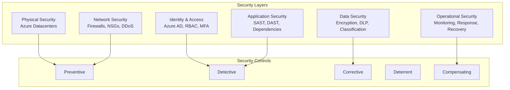
```mermaid
graph TB
    subgraph "Security Layers"
        L1[Physical Security<br/>Azure Datacenters]
        L2[Network Security<br/>Firewalls, NSGs, DDoS]
        L3[Identity & Access<br/>Azure AD, RBAC, MFA]
        L4[Application Security<br/>SAST, DAST, Dependencies]
        L5[Data Security<br/>Encryption, DLP, Classification]
        L6[Operational Security<br/>Monitoring, Response, Recovery]
    end
    
    subgraph "Security Controls"
        PREVENT[Preventive]
        DETECT[Detective]
        CORRECT[Corrective]
        DETER[Deterrent]
        COMP[Compensating]
    end
    
    L1 --> PREVENT
    L2 --> PREVENT
    L3 --> DETECT
    L4 --> DETECT
    L5 --> CORRECT
    L6 --> COMP
```

### 1.2 Threat Model (STRIDE)

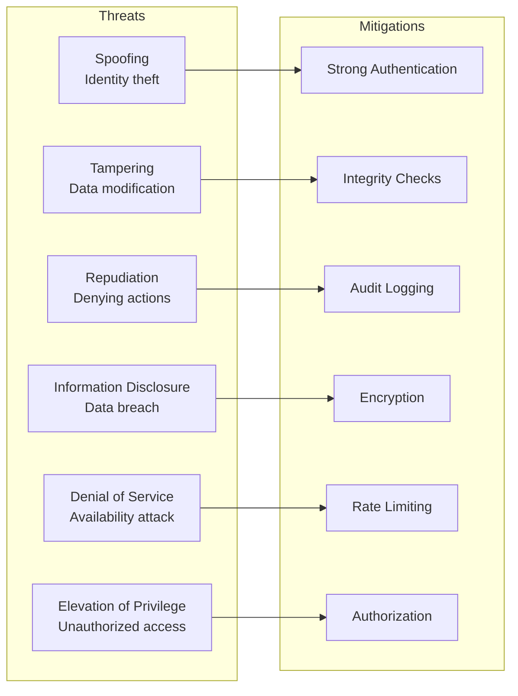
```mermaid
graph LR
    subgraph "Threats"
        S[Spoofing<br/>Identity theft]
        T[Tampering<br/>Data modification]
        R[Repudiation<br/>Denying actions]
        I[Information Disclosure<br/>Data breach]
        D[Denial of Service<br/>Availability attack]
        E[Elevation of Privilege<br/>Unauthorized access]
    end
    
    subgraph "Mitigations"
        AUTH[Strong Authentication]
        INTEGRITY[Integrity Checks]
        AUDIT[Audit Logging]
        ENCRYPT[Encryption]
        THROTTLE[Rate Limiting]
        AUTHZ[Authorization]
    end
    
    S --> AUTH
    T --> INTEGRITY
    R --> AUDIT
    I --> ENCRYPT
    D --> THROTTLE
    E --> AUTHZ
```

---

## 2. Cryptographic Architecture

### 2.1 Key Management Hierarchy

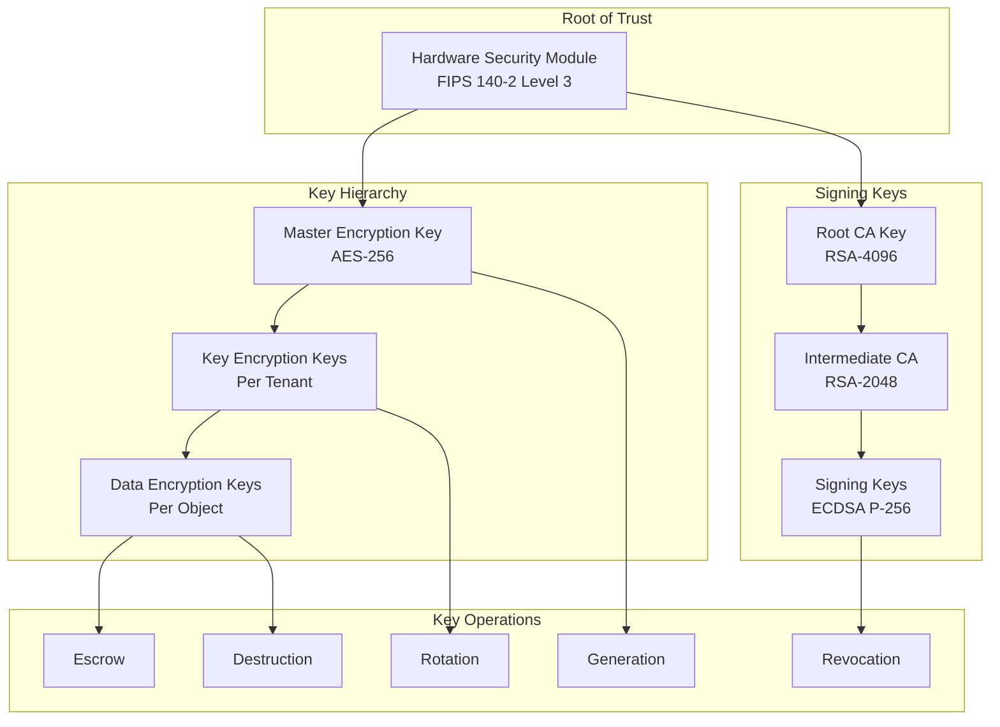
```mermaid
graph TD
    subgraph "Root of Trust"
        HSM[Hardware Security Module<br/>FIPS 140-2 Level 3]
    end
    
    subgraph "Key Hierarchy"
        MEK[Master Encryption Key<br/>AES-256]
        KEK[Key Encryption Keys<br/>Per Tenant]
        DEK[Data Encryption Keys<br/>Per Object]
    end
    
    subgraph "Signing Keys"
        ROOT_CA[Root CA Key<br/>RSA-4096]
        INT_CA[Intermediate CA<br/>RSA-2048]
        SIGN[Signing Keys<br/>ECDSA P-256]
    end
    
    subgraph "Key Operations"
        GEN[Generation]
        ROT[Rotation]
        REV[Revocation]
        ESC[Escrow]
        DESTROY[Destruction]
    end
    
    HSM --> MEK
    MEK --> KEK
    KEK --> DEK
    HSM --> ROOT_CA
    ROOT_CA --> INT_CA
    INT_CA --> SIGN
    
    MEK --> GEN
    KEK --> ROT
    SIGN --> REV
    DEK --> ESC
    DEK --> DESTROY
```

### 2.2 Cryptographic Operations Flow

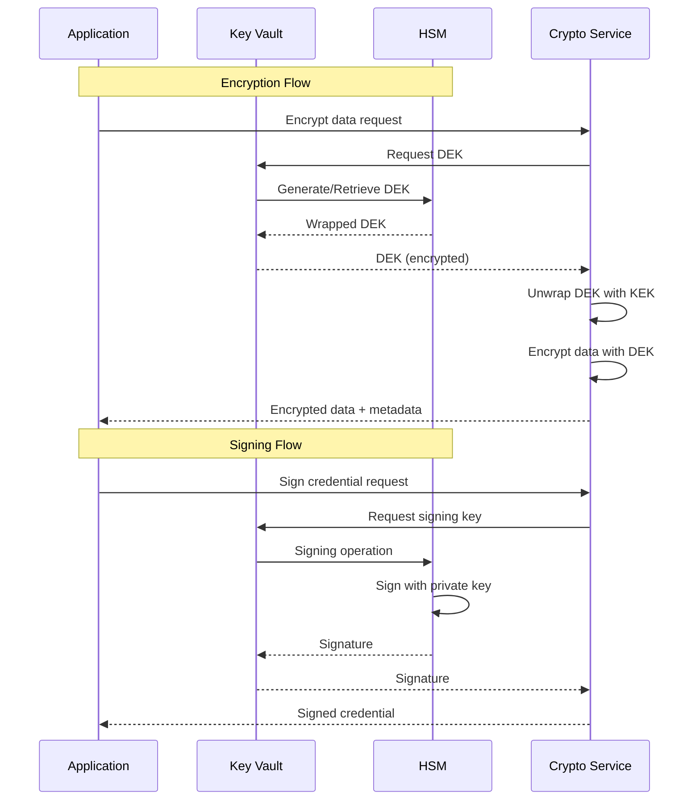
```mermaid
sequenceDiagram
    participant App as Application
    participant KV as Key Vault
    participant HSM as HSM
    participant Crypto as Crypto Service
    
    Note over App,HSM: Encryption Flow
    App->>Crypto: Encrypt data request
    Crypto->>KV: Request DEK
    KV->>HSM: Generate/Retrieve DEK
    HSM-->>KV: Wrapped DEK
    KV-->>Crypto: DEK (encrypted)
    Crypto->>Crypto: Unwrap DEK with KEK
    Crypto->>Crypto: Encrypt data with DEK
    Crypto-->>App: Encrypted data + metadata
    
    Note over App,HSM: Signing Flow
    App->>Crypto: Sign credential request
    Crypto->>KV: Request signing key
    KV->>HSM: Signing operation
    HSM->>HSM: Sign with private key
    HSM-->>KV: Signature
    KV-->>Crypto: Signature
    Crypto-->>App: Signed credential
```

### 2.3 Cryptographic Standards

| Operation | Algorithm | Key Size | Standard | Use Case |
|-----------|-----------|----------|----------|----------|
| Symmetric Encryption | AES-GCM | 256-bit | FIPS 197 | Data at rest |
| Asymmetric Encryption | RSA-OAEP | 2048-bit | PKCS#1 | Key wrapping |
| Digital Signatures | ECDSA | P-256 | FIPS 186-4 | Credential signing |
| Key Exchange | ECDH | P-256 | SP 800-56A | TLS, key agreement |
| Hashing | SHA-256 | - | FIPS 180-4 | Integrity verification |
| Key Derivation | PBKDF2 | - | SP 800-132 | Password-based keys |
| Random Generation | DRBG | - | SP 800-90A | Nonce, IV generation |

---

## 3. Identity and Access Management

### 3.1 Authentication Architecture

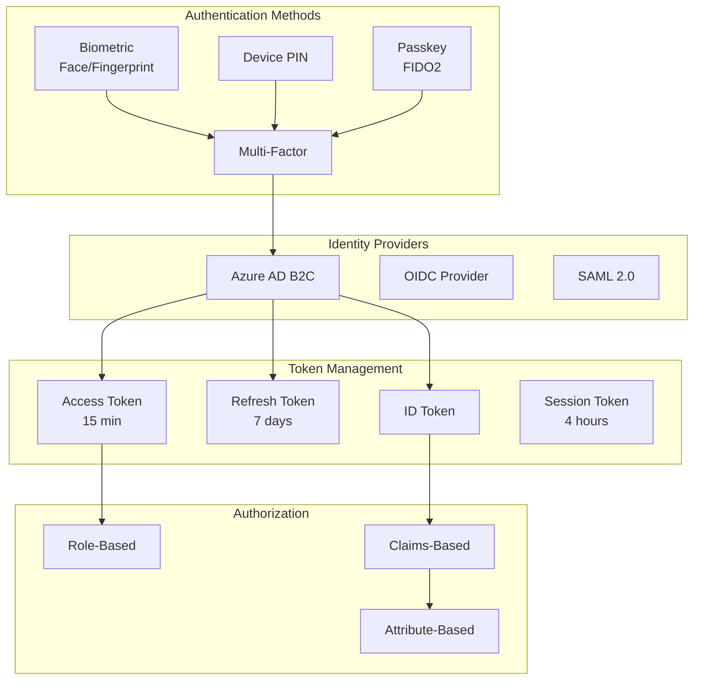
```mermaid
graph TD
    subgraph "Authentication Methods"
        BIO[Biometric<br/>Face/Fingerprint]
        PIN[Device PIN]
        PASS[Passkey<br/>FIDO2]
        MFA[Multi-Factor]
    end
    
    subgraph "Identity Providers"
        AZURE_AD[Azure AD B2C]
        OIDC_IDP[OIDC Provider]
        SAML[SAML 2.0]
    end
    
    subgraph "Token Management"
        ACCESS[Access Token<br/>15 min]
        REFRESH[Refresh Token<br/>7 days]
        ID[ID Token]
        SESSION[Session Token<br/>4 hours]
    end
    
    subgraph "Authorization"
        RBAC[Role-Based]
        ABAC[Attribute-Based]
        CLAIMS[Claims-Based]
    end
    
    BIO --> MFA
    PIN --> MFA
    PASS --> MFA
    MFA --> AZURE_AD
    AZURE_AD --> ACCESS
    AZURE_AD --> REFRESH
    AZURE_AD --> ID
    ACCESS --> RBAC
    ID --> CLAIMS
    CLAIMS --> ABAC
```

### 3.2 Authorization Flow

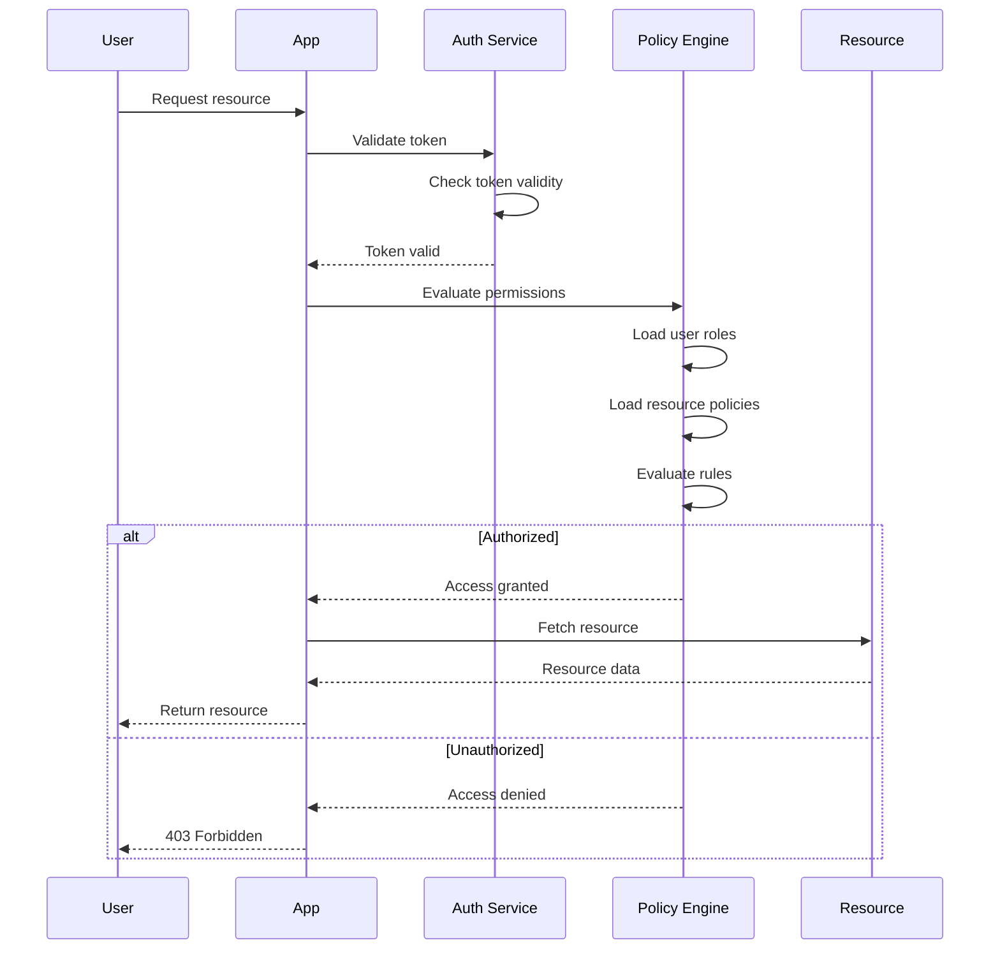
```mermaid
sequenceDiagram
    participant User
    participant App
    participant Auth as Auth Service
    participant Policy as Policy Engine
    participant Resource
    
    User->>App: Request resource
    App->>Auth: Validate token
    Auth->>Auth: Check token validity
    Auth-->>App: Token valid
    
    App->>Policy: Evaluate permissions
    Policy->>Policy: Load user roles
    Policy->>Policy: Load resource policies
    Policy->>Policy: Evaluate rules
    
    alt Authorized
        Policy-->>App: Access granted
        App->>Resource: Fetch resource
        Resource-->>App: Resource data
        App-->>User: Return resource
    else Unauthorized
        Policy-->>App: Access denied
        App-->>User: 403 Forbidden
    end
```

---

## 4. Data Protection and Privacy

### 4.1 Data Classification and Handling

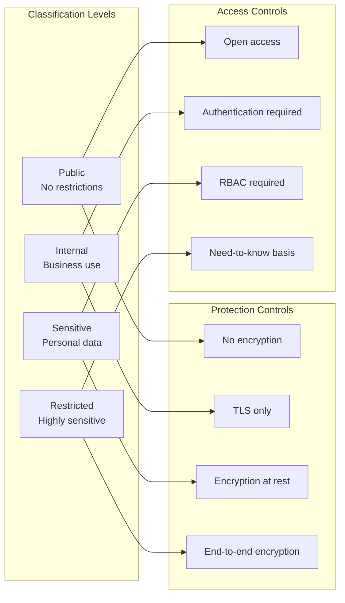
```mermaid
graph LR
    subgraph "Classification Levels"
        PUBLIC[Public<br/>No restrictions]
        INTERNAL[Internal<br/>Business use]
        SENSITIVE[Sensitive<br/>Personal data]
        RESTRICTED[Restricted<br/>Highly sensitive]
    end
    
    subgraph "Protection Controls"
        NONE[No encryption]
        TLS_ONLY[TLS only]
        AT_REST[Encryption at rest]
        E2E[End-to-end encryption]
    end
    
    subgraph "Access Controls"
        OPEN[Open access]
        AUTH_ONLY[Authentication required]
        RBAC_REQ[RBAC required]
        NEED_TO_KNOW[Need-to-know basis]
    end
    
    PUBLIC --> NONE
    PUBLIC --> OPEN
    INTERNAL --> TLS_ONLY
    INTERNAL --> AUTH_ONLY
    SENSITIVE --> AT_REST
    SENSITIVE --> RBAC_REQ
    RESTRICTED --> E2E
    RESTRICTED --> NEED_TO_KNOW
```

### 4.2 Privacy-Preserving Technologies

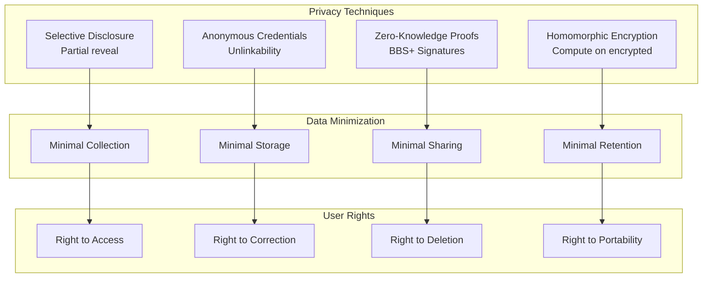
```mermaid
graph TD
    subgraph "Privacy Techniques"
        ZKP[Zero-Knowledge Proofs<br/>BBS+ Signatures]
        SD[Selective Disclosure<br/>Partial reveal]
        ANON[Anonymous Credentials<br/>Unlinkability]
        HOMO[Homomorphic Encryption<br/>Compute on encrypted]
    end
    
    subgraph "Data Minimization"
        COLLECT[Minimal Collection]
        STORE[Minimal Storage]
        SHARE[Minimal Sharing]
        RETAIN[Minimal Retention]
    end
    
    subgraph "User Rights"
        ACCESS_RIGHT[Right to Access]
        CORRECT_RIGHT[Right to Correction]
        DELETE_RIGHT[Right to Deletion]
        PORT[Right to Portability]
    end
    
    ZKP --> SHARE
    SD --> COLLECT
    ANON --> STORE
    HOMO --> RETAIN
    
    COLLECT --> ACCESS_RIGHT
    STORE --> CORRECT_RIGHT
    SHARE --> DELETE_RIGHT
    RETAIN --> PORT
```

### 4.3 PII Data Flow and Protection

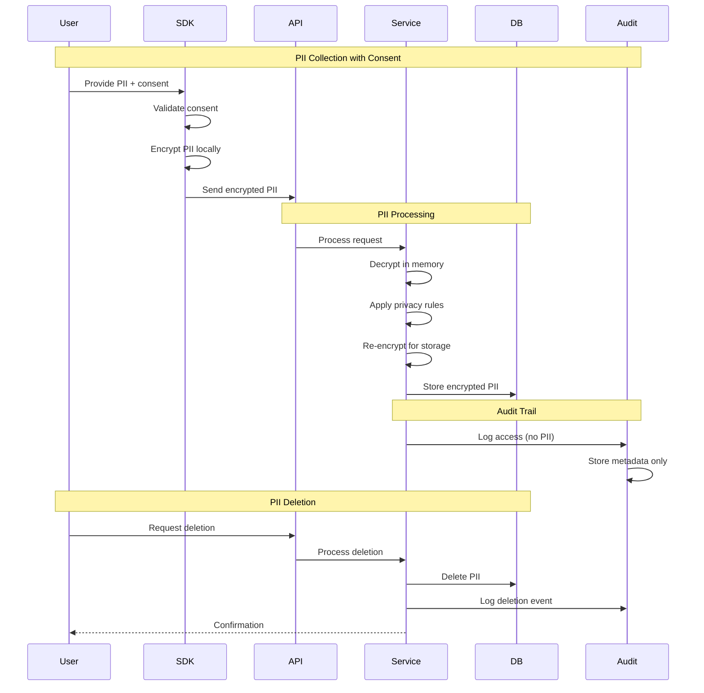
```mermaid
sequenceDiagram
    participant User
    participant SDK
    participant API
    participant Service
    participant DB
    participant Audit
    
    Note over User,Audit: PII Collection with Consent
    User->>SDK: Provide PII + consent
    SDK->>SDK: Validate consent
    SDK->>SDK: Encrypt PII locally
    SDK->>API: Send encrypted PII
    
    Note over API,DB: PII Processing
    API->>Service: Process request
    Service->>Service: Decrypt in memory
    Service->>Service: Apply privacy rules
    Service->>Service: Re-encrypt for storage
    Service->>DB: Store encrypted PII
    
    Note over Service,Audit: Audit Trail
    Service->>Audit: Log access (no PII)
    Audit->>Audit: Store metadata only
    
    Note over User,DB: PII Deletion
    User->>API: Request deletion
    API->>Service: Process deletion
    Service->>DB: Delete PII
    Service->>Audit: Log deletion event
    Service-->>User: Confirmation
```

---

## 5. Network Security

### 5.1 Network Architecture

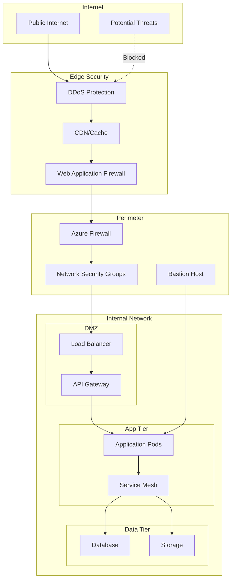
```mermaid
graph TB
    subgraph "Internet"
        INTERNET[Public Internet]
        ATTACKER[Potential Threats]
    end
    
    subgraph "Edge Security"
        DDOS[DDoS Protection]
        CDN[CDN/Cache]
        WAF[Web Application Firewall]
    end
    
    subgraph "Perimeter"
        FW[Azure Firewall]
        NSG[Network Security Groups]
        BASTION[Bastion Host]
    end
    
    subgraph "Internal Network"
        subgraph "DMZ"
            LB[Load Balancer]
            APIGW[API Gateway]
        end
        
        subgraph "App Tier"
            APP[Application Pods]
            MESH[Service Mesh]
        end
        
        subgraph "Data Tier"
            DB[Database]
            STORAGE[Storage]
        end
    end
    
    INTERNET --> DDOS
    ATTACKER -.->|Blocked| DDOS
    DDOS --> CDN
    CDN --> WAF
    WAF --> FW
    FW --> NSG
    NSG --> LB
    LB --> APIGW
    APIGW --> APP
    APP --> MESH
    MESH --> DB
    MESH --> STORAGE
    BASTION --> APP
```

### 5.2 Zero Trust Network

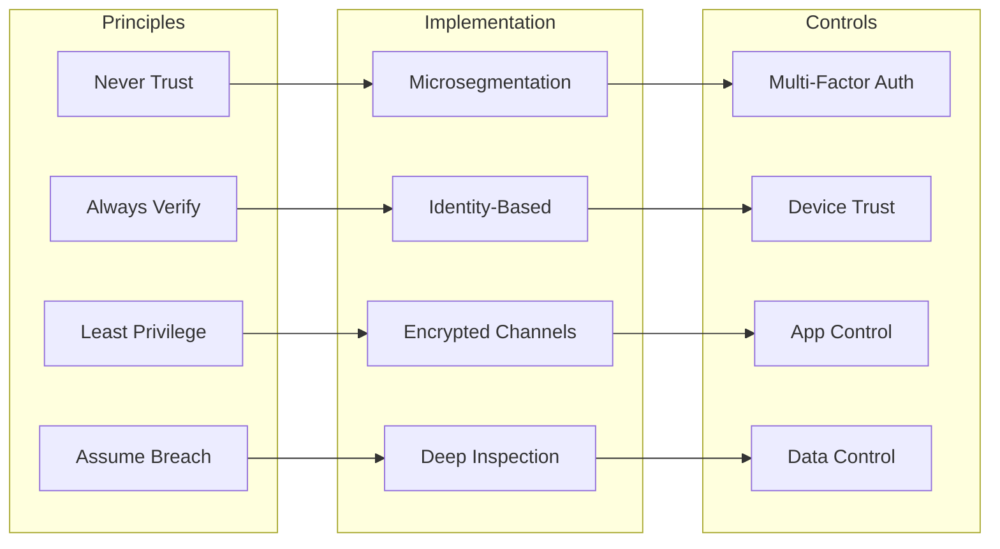
```mermaid
graph LR
    subgraph "Principles"
        NEVER[Never Trust]
        ALWAYS[Always Verify]
        LEAST[Least Privilege]
        ASSUME[Assume Breach]
    end
    
    subgraph "Implementation"
        MICROSEG[Microsegmentation]
        IDENTITY[Identity-Based]
        ENCRYPT_NET[Encrypted Channels]
        INSPECT[Deep Inspection]
    end
    
    subgraph "Controls"
        MFA_NET[Multi-Factor Auth]
        DEVICE[Device Trust]
        APP_CTRL[App Control]
        DATA_CTRL[Data Control]
    end
    
    NEVER --> MICROSEG
    ALWAYS --> IDENTITY
    LEAST --> ENCRYPT_NET
    ASSUME --> INSPECT
    
    MICROSEG --> MFA_NET
    IDENTITY --> DEVICE
    ENCRYPT_NET --> APP_CTRL
    INSPECT --> DATA_CTRL
```

---

## 6. Application Security

### 6.1 Secure Development Lifecycle

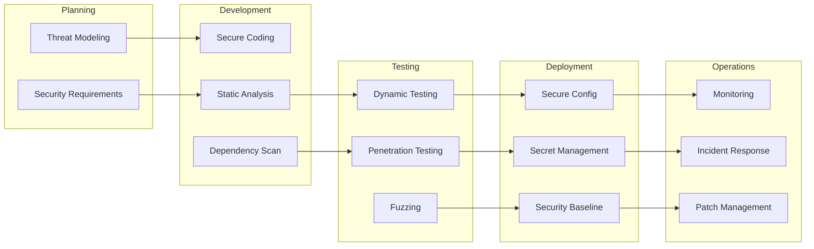
```mermaid
graph LR
    subgraph "Planning"
        THREAT_MODEL[Threat Modeling]
        SEC_REQ[Security Requirements]
    end
    
    subgraph "Development"
        SECURE_CODE[Secure Coding]
        SAST[Static Analysis]
        DEPS[Dependency Scan]
    end
    
    subgraph "Testing"
        DAST[Dynamic Testing]
        PENTEST[Penetration Testing]
        FUZZ[Fuzzing]
    end
    
    subgraph "Deployment"
        CONFIG[Secure Config]
        SECRETS[Secret Management]
        BASELINE[Security Baseline]
    end
    
    subgraph "Operations"
        MONITOR[Monitoring]
        INCIDENT[Incident Response]
        PATCH[Patch Management]
    end
    
    THREAT_MODEL --> SECURE_CODE
    SEC_REQ --> SAST
    SAST --> DAST
    DEPS --> PENTEST
    DAST --> CONFIG
    PENTEST --> SECRETS
    FUZZ --> BASELINE
    CONFIG --> MONITOR
    SECRETS --> INCIDENT
    BASELINE --> PATCH
```

### 6.2 API Security

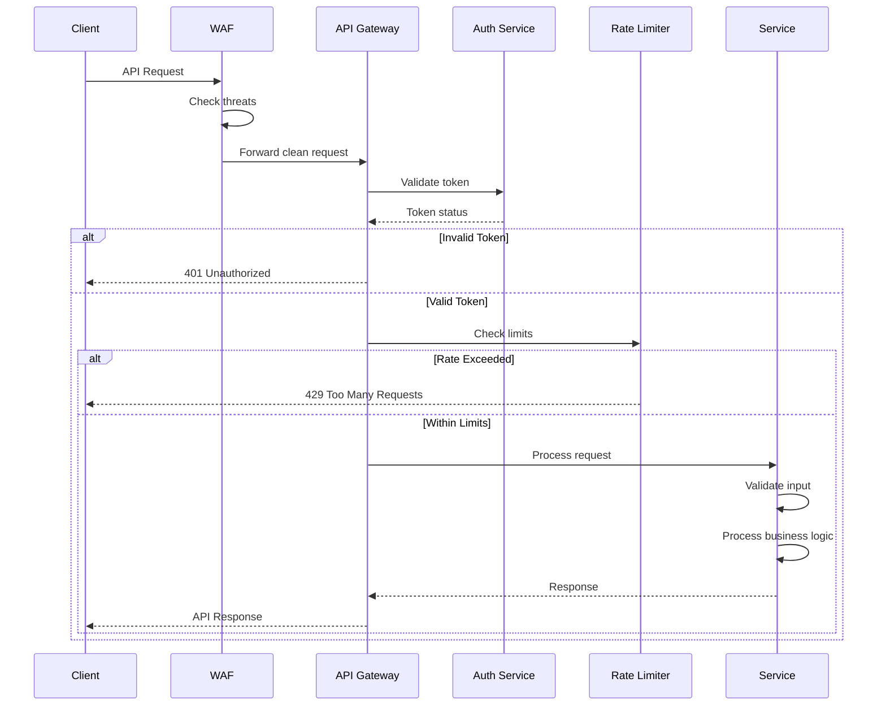
```mermaid
sequenceDiagram
    participant Client
    participant WAF
    participant Gateway as API Gateway
    participant Auth as Auth Service
    participant RateLimit as Rate Limiter
    participant Service
    
    Client->>WAF: API Request
    WAF->>WAF: Check threats
    WAF->>Gateway: Forward clean request
    
    Gateway->>Auth: Validate token
    Auth-->>Gateway: Token status
    
    alt Invalid Token
        Gateway-->>Client: 401 Unauthorized
    else Valid Token
        Gateway->>RateLimit: Check limits
        
        alt Rate Exceeded
            RateLimit-->>Client: 429 Too Many Requests
        else Within Limits
            Gateway->>Service: Process request
            Service->>Service: Validate input
            Service->>Service: Process business logic
            Service-->>Gateway: Response
            Gateway-->>Client: API Response
        end
    end
```

---

## 7. Compliance Framework

### 7.1 Regulatory Compliance Map

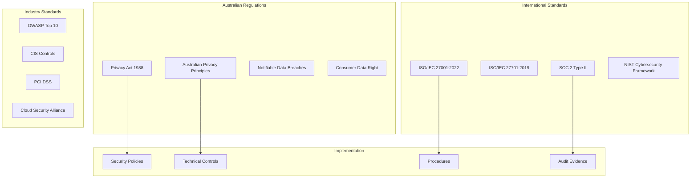
```mermaid
graph TD
    subgraph "Australian Regulations"
        PRIVACY_ACT[Privacy Act 1988]
        APPs[Australian Privacy Principles]
        NOTIFIABLE[Notifiable Data Breaches]
        CDR[Consumer Data Right]
    end
    
    subgraph "International Standards"
        ISO27001[ISO/IEC 27001:2022]
        ISO27701[ISO/IEC 27701:2019]
        SOC2[SOC 2 Type II]
        NIST[NIST Cybersecurity Framework]
    end
    
    subgraph "Industry Standards"
        OWASP[OWASP Top 10]
        CIS[CIS Controls]
        PCI[PCI DSS]
        CLOUD[Cloud Security Alliance]
    end
    
    subgraph "Implementation"
        POLICIES[Security Policies]
        CONTROLS[Technical Controls]
        PROCEDURES[Procedures]
        EVIDENCE[Audit Evidence]
    end
    
    PRIVACY_ACT --> POLICIES
    APPs --> CONTROLS
    ISO27001 --> PROCEDURES
    SOC2 --> EVIDENCE
```

### 7.2 Privacy Principles Implementation

| APP # | Principle | Implementation | Evidence |
|-------|-----------|----------------|----------|
| APP 1 | Open and transparent | Privacy policy published | Public website |
| APP 2 | Anonymity option | Anonymous credential support | Technical design |
| APP 3 | Collection of solicited info | Consent management system | Audit logs |
| APP 4 | Unsolicited info handling | Auto-deletion procedures | Process docs |
| APP 5 | Notification of collection | In-app notifications | UI screenshots |
| APP 6 | Use or disclosure | Purpose limitation engine | Access controls |
| APP 7 | Direct marketing | Opt-out mechanisms | User preferences |
| APP 8 | Cross-border disclosure | Data residency controls | Infrastructure |
| APP 9 | Government identifiers | Separate storage | Data model |
| APP 10 | Quality of information | Validation rules | Data quality reports |
| APP 11 | Security of information | Encryption, access controls | Security audit |
| APP 12 | Access to information | User portal | Self-service UI |
| APP 13 | Correction of information | Update APIs | API documentation |

---

## 8. Security Operations

### 8.1 Security Monitoring Architecture

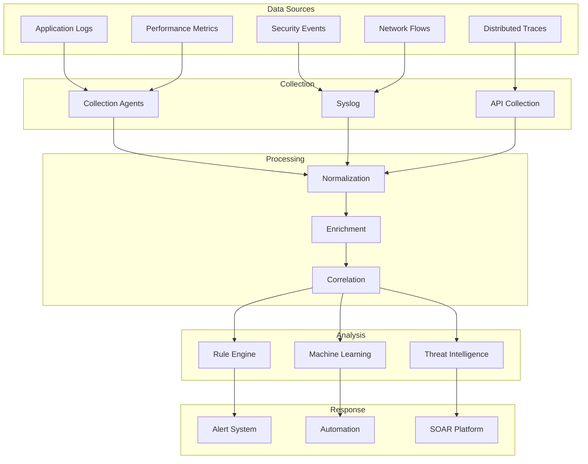
```mermaid
graph TB
    subgraph "Data Sources"
        LOGS[Application Logs]
        METRICS[Performance Metrics]
        TRACES[Distributed Traces]
        EVENTS[Security Events]
        FLOWS[Network Flows]
    end
    
    subgraph "Collection"
        AGENT[Collection Agents]
        SYSLOG[Syslog]
        API_COLL[API Collection]
    end
    
    subgraph "Processing"
        NORMALIZE[Normalization]
        ENRICH[Enrichment]
        CORRELATE[Correlation]
    end
    
    subgraph "Analysis"
        RULES[Rule Engine]
        ML[Machine Learning]
        THREAT_INTEL[Threat Intelligence]
    end
    
    subgraph "Response"
        ALERT_SYS[Alert System]
        AUTO[Automation]
        SOAR[SOAR Platform]
    end
    
    LOGS --> AGENT
    METRICS --> AGENT
    TRACES --> API_COLL
    EVENTS --> SYSLOG
    FLOWS --> SYSLOG
    
    AGENT --> NORMALIZE
    SYSLOG --> NORMALIZE
    API_COLL --> NORMALIZE
    
    NORMALIZE --> ENRICH
    ENRICH --> CORRELATE
    
    CORRELATE --> RULES
    CORRELATE --> ML
    CORRELATE --> THREAT_INTEL
    
    RULES --> ALERT_SYS
    ML --> AUTO
    THREAT_INTEL --> SOAR
```

### 8.2 Incident Response Process

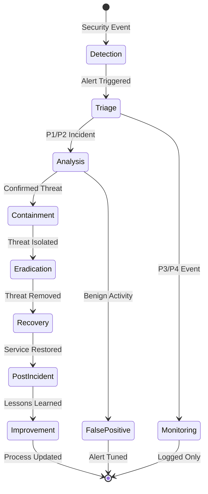
```mermaid
stateDiagram-v2
    [*] --> Detection: Security Event
    Detection --> Triage: Alert Triggered
    Triage --> Analysis: P1/P2 Incident
    Triage --> Monitoring: P3/P4 Event
    Analysis --> Containment: Confirmed Threat
    Analysis --> FalsePositive: Benign Activity
    Containment --> Eradication: Threat Isolated
    Eradication --> Recovery: Threat Removed
    Recovery --> PostIncident: Service Restored
    PostIncident --> Improvement: Lessons Learned
    Improvement --> [*]: Process Updated
    FalsePositive --> [*]: Alert Tuned
    Monitoring --> [*]: Logged Only
```

### 8.3 Security Metrics and KPIs

| Metric | Target | Measurement | Frequency |
|--------|--------|-------------|-----------|
| Mean Time to Detect (MTTD) | <15 min | Alert generation time | Real-time |
| Mean Time to Respond (MTTR) | <1 hour | Incident closure time | Daily |
| Vulnerability Remediation | <30 days | Time to patch | Weekly |
| Security Training Completion | >95% | Staff trained | Quarterly |
| Phishing Test Failure Rate | <5% | Failed tests | Monthly |
| Security Incidents | <5/month | Confirmed incidents | Monthly |
| False Positive Rate | <10% | False alerts | Weekly |
| Audit Finding Closure | <60 days | Findings resolved | Quarterly |

---

## 9. Vulnerability Management

### 9.1 Vulnerability Lifecycle

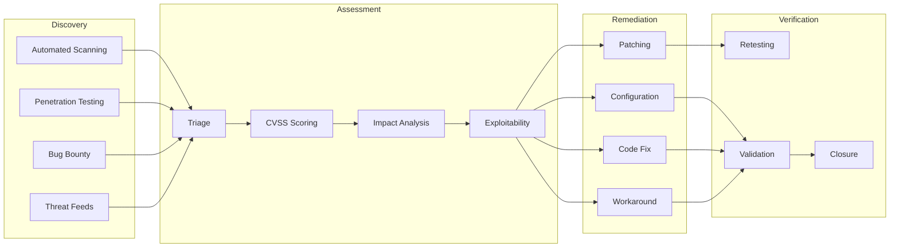
```mermaid
graph LR
    subgraph "Discovery"
        SCAN[Automated Scanning]
        PENTEST2[Penetration Testing]
        BUGBOUNTY[Bug Bounty]
        THREAT_FEED[Threat Feeds]
    end
    
    subgraph "Assessment"
        TRIAGE2[Triage]
        CVSS[CVSS Scoring]
        IMPACT[Impact Analysis]
        EXPLOIT[Exploitability]
    end
    
    subgraph "Remediation"
        PATCH2[Patching]
        CONFIG2[Configuration]
        CODE[Code Fix]
        WORKAROUND[Workaround]
    end
    
    subgraph "Verification"
        RETEST[Retesting]
        VALIDATE2[Validation]
        CLOSE[Closure]
    end
    
    SCAN --> TRIAGE2
    PENTEST2 --> TRIAGE2
    BUGBOUNTY --> TRIAGE2
    THREAT_FEED --> TRIAGE2
    
    TRIAGE2 --> CVSS
    CVSS --> IMPACT
    IMPACT --> EXPLOIT
    
    EXPLOIT --> PATCH2
    EXPLOIT --> CONFIG2
    EXPLOIT --> CODE
    EXPLOIT --> WORKAROUND
    
    PATCH2 --> RETEST
    CONFIG2 --> VALIDATE2
    CODE --> VALIDATE2
    WORKAROUND --> VALIDATE2
    VALIDATE2 --> CLOSE
```

### 9.2 Patch Management Process

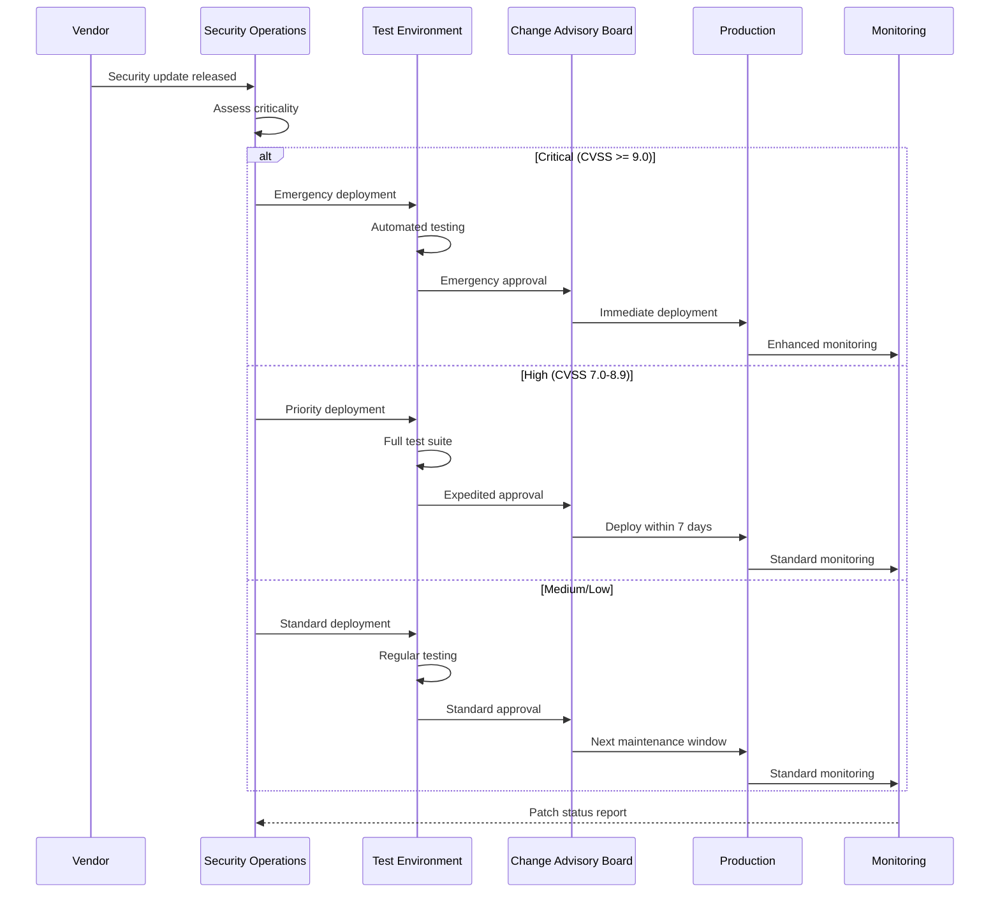
```mermaid
sequenceDiagram
    participant Vendor
    participant SecOps as Security Operations
    participant Testing as Test Environment
    participant CAB as Change Advisory Board
    participant Prod as Production
    participant Monitor as Monitoring
    
    Vendor->>SecOps: Security update released
    SecOps->>SecOps: Assess criticality
    
    alt Critical (CVSS >= 9.0)
        SecOps->>Testing: Emergency deployment
        Testing->>Testing: Automated testing
        Testing->>CAB: Emergency approval
        CAB->>Prod: Immediate deployment
        Prod->>Monitor: Enhanced monitoring
    else High (CVSS 7.0-8.9)
        SecOps->>Testing: Priority deployment
        Testing->>Testing: Full test suite
        Testing->>CAB: Expedited approval
        CAB->>Prod: Deploy within 7 days
        Prod->>Monitor: Standard monitoring
    else Medium/Low
        SecOps->>Testing: Standard deployment
        Testing->>Testing: Regular testing
        Testing->>CAB: Standard approval
        CAB->>Prod: Next maintenance window
        Prod->>Monitor: Standard monitoring
    end
    
    Monitor-->>SecOps: Patch status report
```

---

## 10. Business Continuity and Disaster Recovery

### 10.1 BCP/DR Strategy

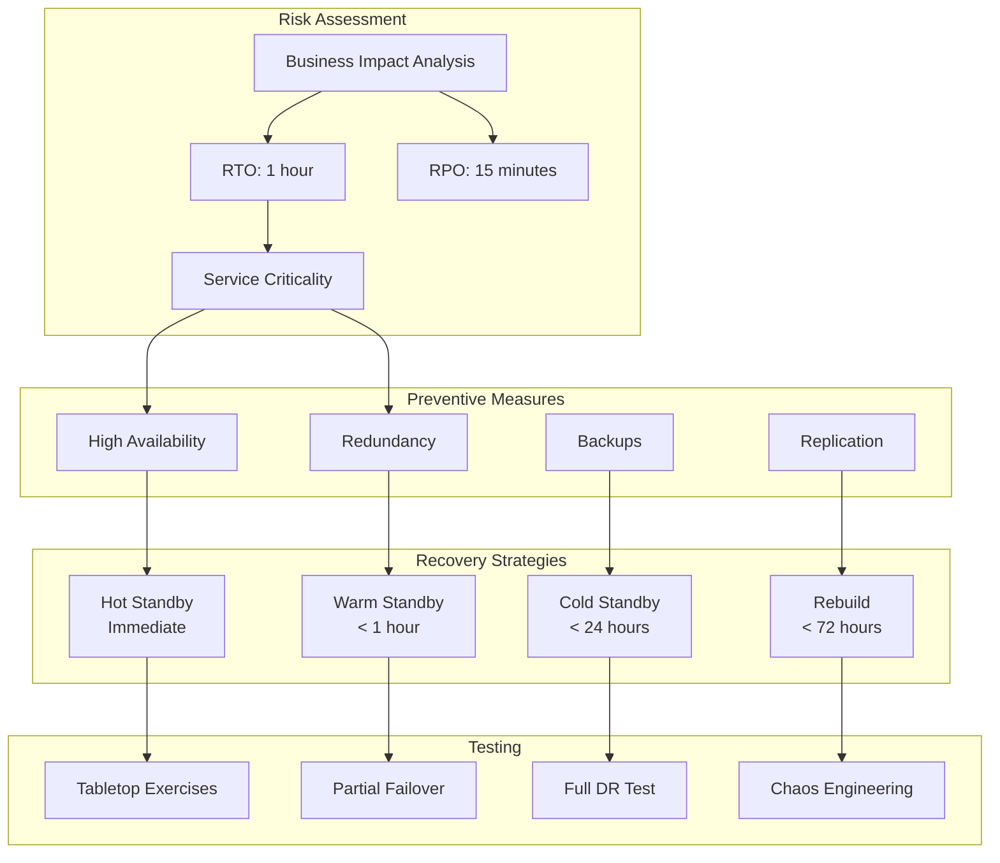
```mermaid
graph TD
    subgraph "Risk Assessment"
        BIA[Business Impact Analysis]
        RTO_DEF[RTO: 1 hour]
        RPO_DEF[RPO: 15 minutes]
        CRITICALITY[Service Criticality]
    end
    
    subgraph "Preventive Measures"
        HA[High Availability]
        REDUNDANCY[Redundancy]
        BACKUP2[Backups]
        REPLICATION[Replication]
    end
    
    subgraph "Recovery Strategies"
        HOT[Hot Standby<br/>Immediate]
        WARM[Warm Standby<br/>< 1 hour]
        COLD[Cold Standby<br/>< 24 hours]
        REBUILD2[Rebuild<br/>< 72 hours]
    end
    
    subgraph "Testing"
        TABLETOP[Tabletop Exercises]
        PARTIAL[Partial Failover]
        FULL[Full DR Test]
        CHAOS[Chaos Engineering]
    end
    
    BIA --> RTO_DEF
    BIA --> RPO_DEF
    RTO_DEF --> CRITICALITY
    
    CRITICALITY --> HA
    CRITICALITY --> REDUNDANCY
    HA --> HOT
    REDUNDANCY --> WARM
    BACKUP2 --> COLD
    REPLICATION --> REBUILD2
    
    HOT --> TABLETOP
    WARM --> PARTIAL
    COLD --> FULL
    REBUILD2 --> CHAOS
```

### 10.2 DR Runbook Flow

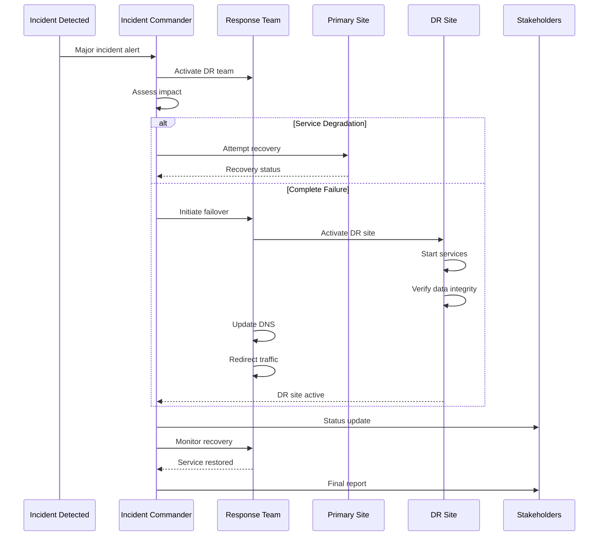
```mermaid
sequenceDiagram
    participant Incident as Incident Detected
    participant Commander as Incident Commander
    participant Team as Response Team
    participant Primary as Primary Site
    participant Secondary as DR Site
    participant Stakeholder as Stakeholders
    
    Incident->>Commander: Major incident alert
    Commander->>Team: Activate DR team
    Commander->>Commander: Assess impact
    
    alt Service Degradation
        Commander->>Primary: Attempt recovery
        Primary-->>Commander: Recovery status
    else Complete Failure
        Commander->>Team: Initiate failover
        Team->>Secondary: Activate DR site
        Secondary->>Secondary: Start services
        Secondary->>Secondary: Verify data integrity
        Team->>Team: Update DNS
        Team->>Team: Redirect traffic
        Secondary-->>Commander: DR site active
    end
    
    Commander->>Stakeholder: Status update
    Commander->>Team: Monitor recovery
    Team-->>Commander: Service restored
    Commander->>Stakeholder: Final report
```

---

## 11. Audit and Compliance Monitoring

### 11.1 Audit Trail Architecture

```mermaid
graph TB
    subgraph "Audit Events"
        AUTH_EVENT[Authentication]
        AUTHZ_EVENT[Authorization]
        DATA_EVENT[Data Access]
        ADMIN_EVENT[Admin Actions]
        SECURITY_EVENT[Security Events]
    end
    
    subgraph "Audit Pipeline"
        CAPTURE[Event Capture]
        SIGN2[Digital Signing]
        TIMESTAMP[Timestamping]
        IMMUTABLE[Immutable Storage]
    end
    
    subgraph "Audit Analysis"
        SEARCH[Search & Query]
        REPORT[Reporting]
        ANOMALY[Anomaly Detection]
        FORENSICS[Forensics]
    end
    
    subgraph "Retention"
        HOT_STORE[Hot Storage<br/>90 days]
        WARM_STORE[Warm Storage<br/>1 year]
        COLD_STORE[Cold Storage<br/>7 years]
        PURGE[Secure Deletion]
    end
    
    AUTH_EVENT --> CAPTURE
    AUTHZ_EVENT --> CAPTURE
    DATA_EVENT --> CAPTURE
    ADMIN_EVENT --> CAPTURE
    SECURITY_EVENT --> CAPTURE
    
    CAPTURE --> SIGN2
    SIGN2 --> TIMESTAMP
    TIMESTAMP --> IMMUTABLE
    
    IMMUTABLE --> SEARCH
    SEARCH --> REPORT
    SEARCH --> ANOMALY
    SEARCH --> FORENSICS
    
    IMMUTABLE --> HOT_STORE
    HOT_STORE --> WARM_STORE
    WARM_STORE --> COLD_STORE
    COLD_STORE --> PURGE
```

### 11.2 Compliance Dashboard

| Compliance Area | Current Status | Target | Gap | Actions |
|-----------------|---------------|--------|-----|---------|
| ISO 27001 Controls | 85% | 100% | 15% | Q1 2025 audit |
| Privacy Act Compliance | 100% | 100% | 0% | Maintain |
| Vulnerability Patching | 92% | 95% | 3% | Improve automation |
| Security Training | 88% | 95% | 7% | Mandatory refresher |
| Incident Response Time | 45 min | 30 min | 15 min | Process optimization |
| Audit Log Coverage | 95% | 99% | 4% | Add missing events |
| Encryption Coverage | 100% | 100% | 0% | Maintain |
| Access Reviews | 90% | 100% | 10% | Quarterly reviews |

---

## 12. Security Governance

### 12.1 Governance Structure

```mermaid
graph TD
    subgraph "Governance Bodies"
        BOARD[Board/Executive]
        RISK_COMM[Risk Committee]
        SEC_COMM[Security Committee]
        ARCH_BOARD[Architecture Board]
    end
    
    subgraph "Roles"
        CISO[Chief Information Security Officer]
        DPO[Data Protection Officer]
        SEC_ARCH[Security Architect]
        SEC_OPS[Security Operations]
    end
    
    subgraph "Processes"
        POLICY[Policy Management]
        RISK_MGT[Risk Management]
        COMPLIANCE[Compliance Management]
        INCIDENT_MGT[Incident Management]
    end
    
    subgraph "Artifacts"
        POLICIES2[Security Policies]
        STANDARDS[Security Standards]
        PROCEDURES2[Procedures]
        GUIDELINES[Guidelines]
    end
    
    BOARD --> RISK_COMM
    RISK_COMM --> SEC_COMM
    SEC_COMM --> ARCH_BOARD
    
    SEC_COMM --> CISO
    CISO --> DPO
    CISO --> SEC_ARCH
    CISO --> SEC_OPS
    
    CISO --> POLICY
    DPO --> RISK_MGT
    SEC_ARCH --> COMPLIANCE
    SEC_OPS --> INCIDENT_MGT
    
    POLICY --> POLICIES2
    RISK_MGT --> STANDARDS
    COMPLIANCE --> PROCEDURES2
    INCIDENT_MGT --> GUIDELINES
```

### 12.2 Security Review Process

```mermaid
sequenceDiagram
    participant Dev as Development Team
    participant SecArch as Security Architect
    participant SecOps as Security Operations
    participant Review as Security Review Board
    participant Approve as Approval Authority
    
    Dev->>SecArch: Submit design for review
    SecArch->>SecArch: Threat modeling
    SecArch->>SecArch: Security assessment
    
    alt Low Risk
        SecArch->>Dev: Approve with recommendations
    else Medium Risk
        SecArch->>SecOps: Operational review
        SecOps->>Review: Schedule review
        Review->>Review: Evaluate risks
        Review->>Dev: Conditional approval
        Dev->>Dev: Implement controls
        Dev->>SecOps: Verify implementation
        SecOps->>Review: Final approval
    else High Risk
        SecArch->>Review: Escalate to board
        Review->>Approve: Executive decision
        Approve->>Dev: Approval/Rejection
    end
```

---

## Security Assurance

### Assurance Activities Schedule

| Activity | Frequency | Scope | Responsible |
|----------|-----------|-------|-------------|
| Vulnerability Scanning | Weekly | All systems | Security Operations |
| Penetration Testing | Quarterly | External-facing | Third-party |
| Security Architecture Review | Per release | Major changes | Security Architect |
| Code Security Review | Per PR | All code | Development + Security |
| Compliance Audit | Annual | Full scope | External auditor |
| Security Training | Quarterly | All staff | HR + Security |
| Tabletop Exercises | Bi-annual | Incident response | All teams |
| Security Metrics Review | Monthly | KPIs | CISO |

### Security Maturity Model

| Domain | Current Level | Target Level | Timeline |
|--------|--------------|--------------|----------|
| Identity Management | 3 - Defined | 4 - Managed | Q2 2025 |
| Data Protection | 4 - Managed | 4 - Managed | Maintain |
| Application Security | 3 - Defined | 4 - Managed | Q3 2025 |
| Infrastructure Security | 4 - Managed | 5 - Optimized | Q4 2025 |
| Security Operations | 3 - Defined | 4 - Managed | Q2 2025 |
| Incident Response | 3 - Defined | 4 - Managed | Q1 2025 |
| Compliance Management | 4 - Managed | 4 - Managed | Maintain |
| Risk Management | 3 - Defined | 4 - Managed | Q3 2025 |

---

**END OF SECURITY, PRIVACY & COMPLIANCE APPENDIX**