# Appendix: Solution Architecture
## Digital Wallet and Verifiable Credentials Solution

**Document Version:** 1.0  
**Parent Document:** [Master PRD](./PRD_Master.md)  
**Last Updated:** December 2024

---

## 1. High-Level Architecture

### 1.1 System Context Diagram

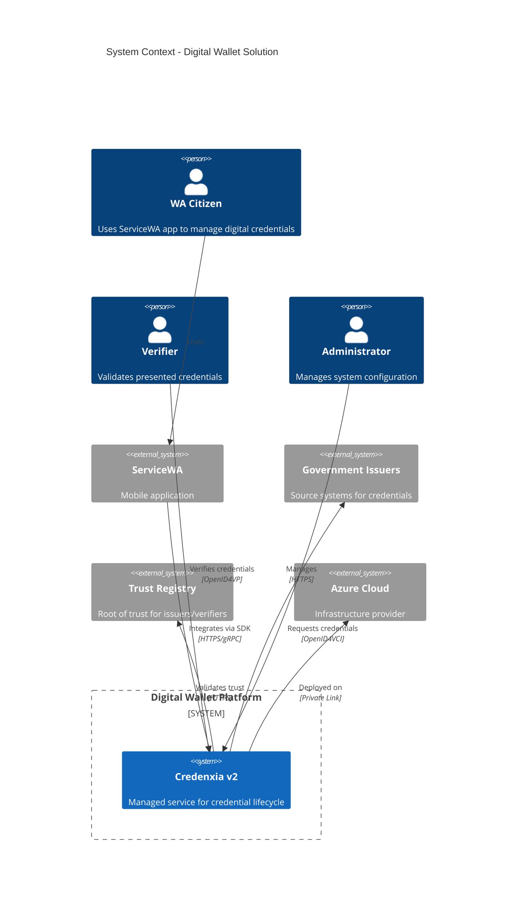

### 1.2 Container Architecture

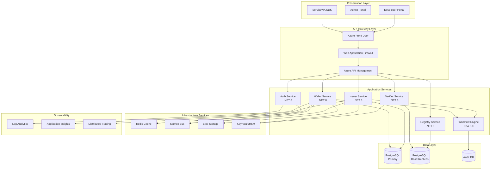

---

## 2. Component Details

### 2.1 Core Services Architecture

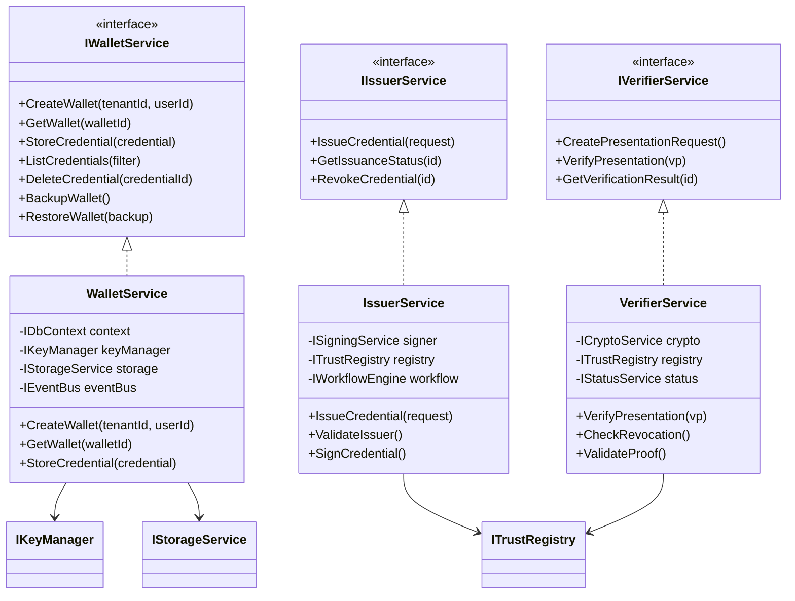

### 2.2 Multi-Tenant Data Architecture

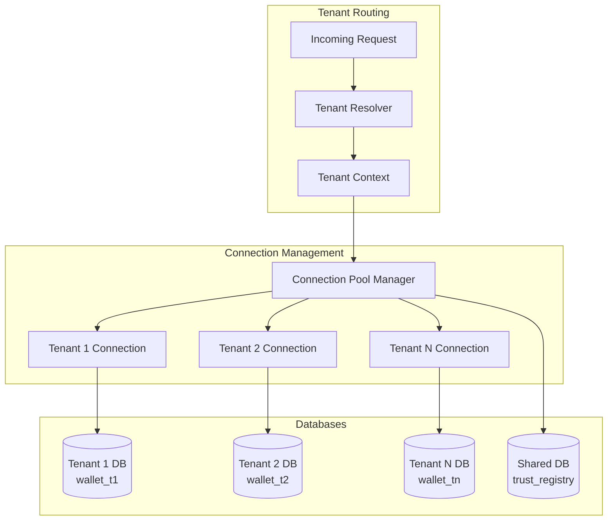

---

## 3. Deployment Architecture

### 3.1 Azure Infrastructure

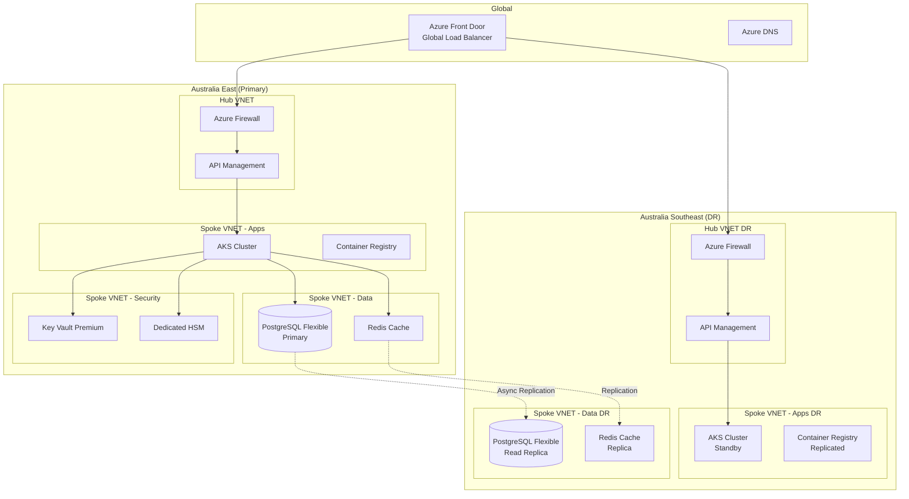

### 3.2 Kubernetes Architecture

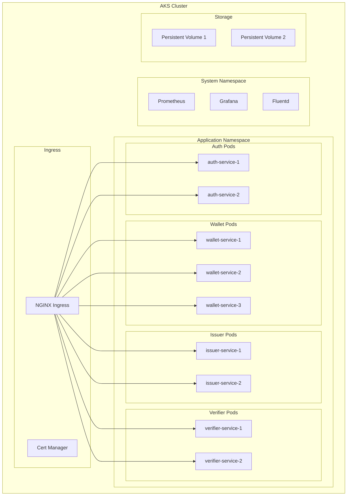

---

## 4. Security Architecture

### 4.1 Defense in Depth

```mermaid
graph LR
    subgraph "Layer 1: Network"
        DDOS[DDoS Protection]
        WAF2[WAF Rules]
        NSG[Network Security Groups]
    end
    
    subgraph "Layer 2: Identity"
        OIDC[OIDC/OAuth2]
        MFA[Multi-Factor Auth]
        RBAC2[Role-Based Access]
    end
    
    subgraph "Layer 3: Application"
        AUTHZ[Authorization]
        VALIDATION[Input Validation]
        CRYPTO[Cryptography]
    end
    
    subgraph "Layer 4: Data"
        TDE[Encryption at Rest]
        TLS[Encryption in Transit]
        DLP[Data Loss Prevention]
    end
    
    subgraph "Layer 5: Monitoring"
        SIEM[SIEM/SOAR]
        THREAT[Threat Detection]
        AUDIT2[Audit Logging]
    end
    
    DDOS --> WAF2
    WAF2 --> NSG
    NSG --> OIDC
    OIDC --> MFA
    MFA --> RBAC2
    RBAC2 --> AUTHZ
    AUTHZ --> VALIDATION
    VALIDATION --> CRYPTO
    CRYPTO --> TDE
    TDE --> TLS
    TLS --> DLP
    DLP --> SIEM
    SIEM --> THREAT
    THREAT --> AUDIT2
```

### 4.2 Zero Trust Architecture

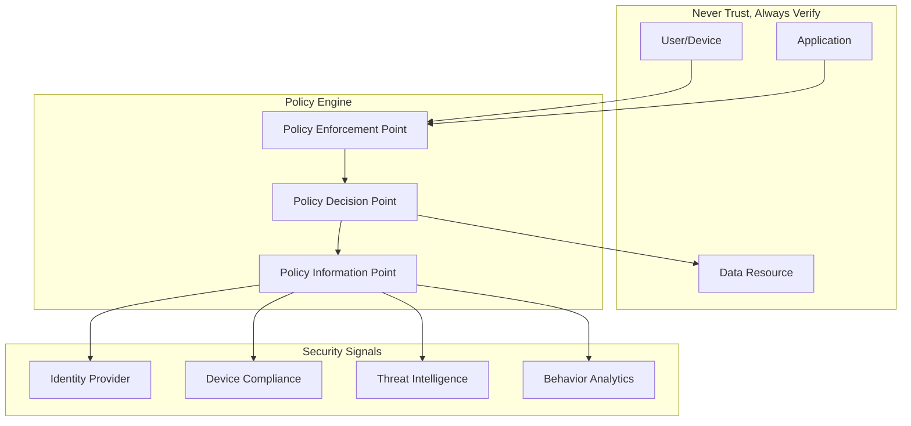

---

## 5. Integration Architecture

### 5.1 ServiceWA Integration

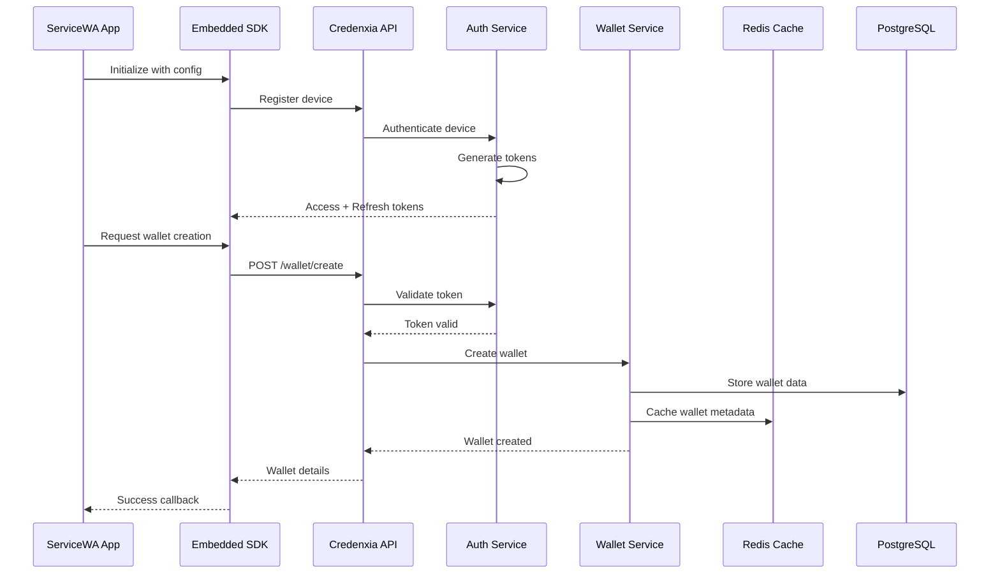

### 5.2 Issuer Integration Flow

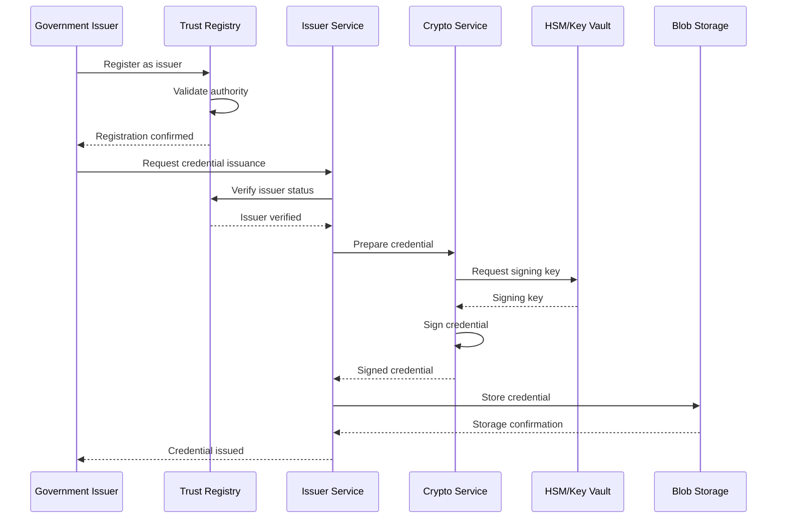

---

## 6. Data Flow Architecture

### 6.1 Credential Lifecycle Flow

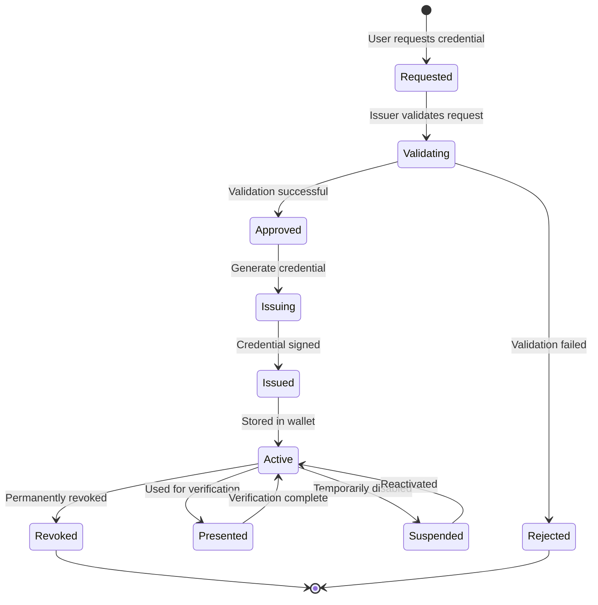

### 6.2 Verification Flow

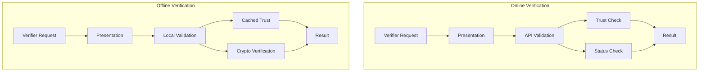

---

## 7. Scalability Architecture

### 7.1 Auto-Scaling Strategy

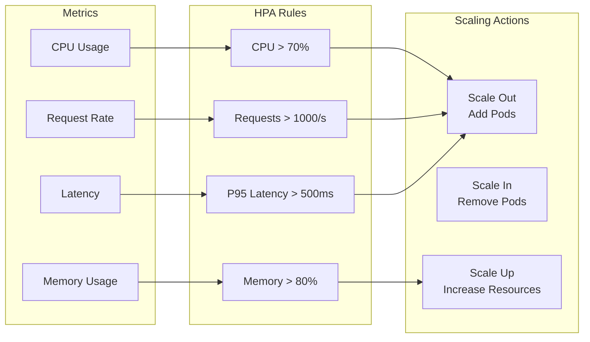

### 7.2 Database Scaling

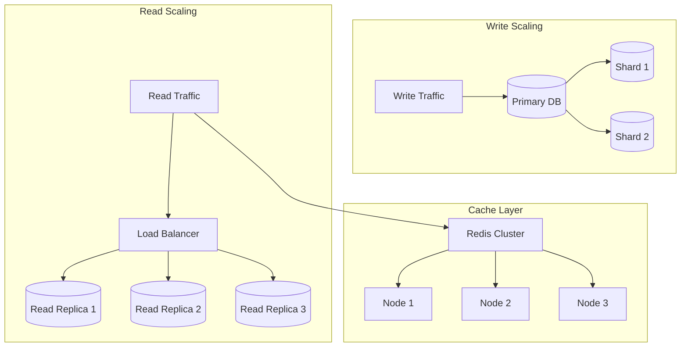

---

## 8. Disaster Recovery Architecture

### 8.1 Backup and Recovery

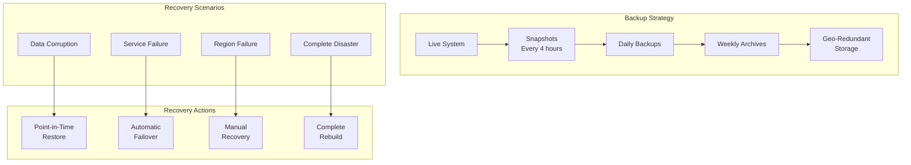

### 8.2 High Availability Design

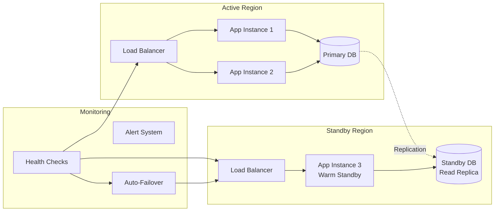

---

## 9. Performance Architecture

### 9.1 Caching Strategy

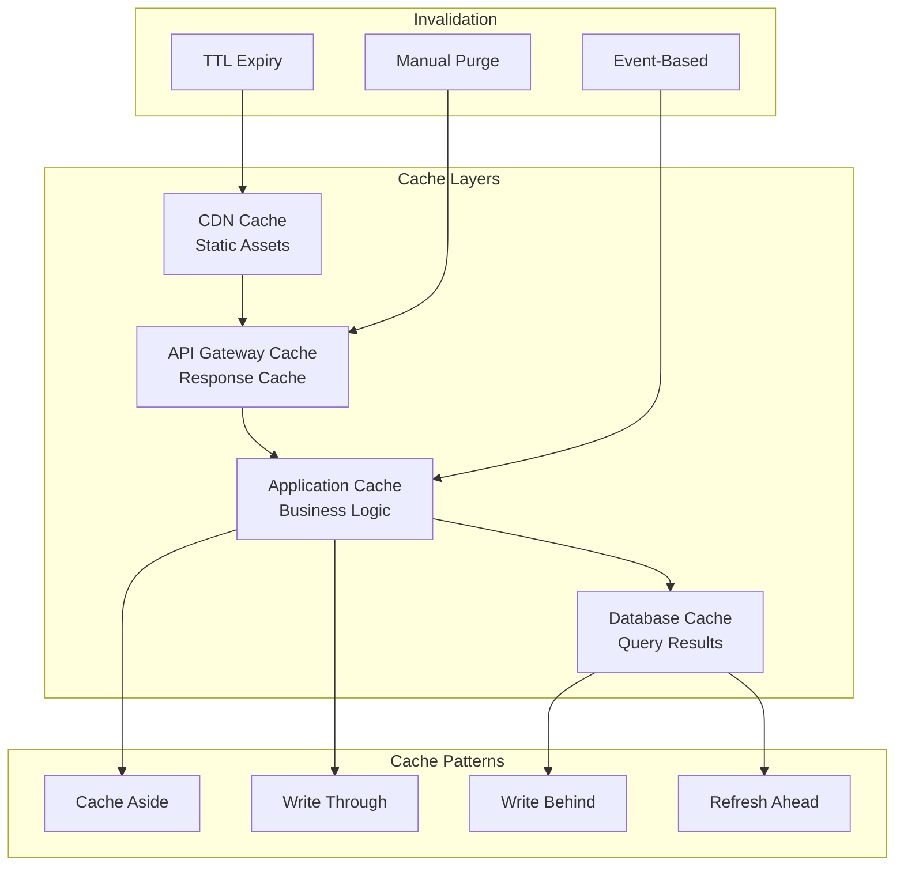

### 9.2 Performance Optimization

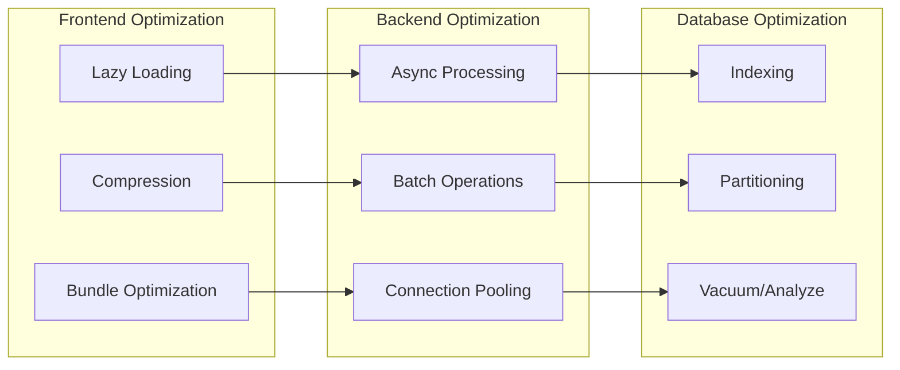

---

## 10. Migration Architecture

### 10.1 Migration from Per-Tenant to Shared DB (If Needed)

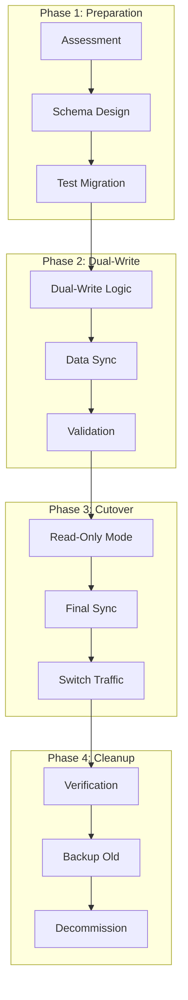

---

## 11. Technology Stack Summary

### 11.1 Core Technologies

| Layer | Technology | Version | Purpose |
|-------|------------|---------|---------|
| Runtime | .NET | 8.0 LTS | Application framework |
| Language | C# | 12.0 | Primary language |
| API | ASP.NET Core | 8.0 | REST/gRPC APIs |
| Database | PostgreSQL | 15+ | Primary datastore |
| Cache | Redis | 7.0 | Distributed cache |
| Message Queue | Azure Service Bus | - | Async messaging |
| Workflow | Elsa | 3.0 | Business workflows |
| Container | Docker | Latest | Containerization |
| Orchestration | Kubernetes | 1.28+ | Container orchestration |
| Service Mesh | Linkerd | 2.14 | Service communication |

### 11.2 Azure Services

| Service | SKU | Purpose |
|---------|-----|---------|
| AKS | Standard | Container hosting |
| PostgreSQL Flexible | General Purpose | Database |
| Key Vault | Premium | Key management |
| HSM | Dedicated | Hardware security |
| Front Door | Premium | Global load balancing |
| API Management | Standard | API gateway |
| Service Bus | Standard | Messaging |
| Storage | Standard GRS | Object storage |
| Monitor | - | Observability |
| Sentinel | - | SIEM/SOAR |

---

## 12. Architecture Decision Records (ADRs)

### ADR-001: Multi-Tenancy Strategy

**Decision:** Use per-tenant database isolation  
**Status:** Accepted  
**Context:** Need to balance security, performance, and operational complexity  
**Decision:** Implement one database per tenant on shared infrastructure  
**Consequences:** Higher operational overhead but better security isolation  

### ADR-002: API Protocol

**Decision:** REST as primary, gRPC for inter-service  
**Status:** Accepted  
**Context:** Need to support various client types and ensure performance  
**Decision:** REST for external APIs, gRPC for internal service communication  
**Consequences:** Broader compatibility with some complexity in protocol management  

### ADR-003: Workflow Engine

**Decision:** Use Elsa Workflows  
**Status:** Accepted  
**Context:** Need flexible, code-first workflow engine  
**Decision:** Implement Elsa 3.0 for credential issuance workflows  
**Consequences:** Modern workflow capabilities with .NET integration  

---

## Architecture Governance

### Review Schedule
- Weekly architecture review during POA
- Bi-weekly during Pilot setup
- Monthly during steady-state operations

### Change Control
- All architectural changes require ADR
- Review board approval for significant changes
- Impact assessment for all modifications

### Documentation
- Architecture diagrams updated with each release
- Decision log maintained in Git
- Runbooks updated quarterly

---

**END OF SOLUTION ARCHITECTURE APPENDIX**