# Appendix: Testing, QA, POA & Pilot
## Digital Wallet and Verifiable Credentials Solution

**Document Version:** 1.0  
**Parent Document:** [Master PRD](./PRD_Master.md)  
**Last Updated:** December 2024

---

## 1. Testing Strategy Overview

### 1.1 Test Architecture

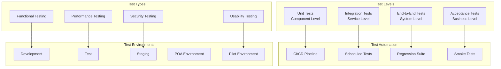

### 1.2 Test Coverage Requirements

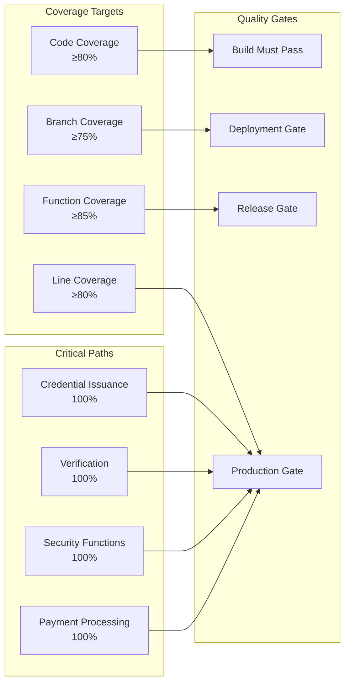

---

## 2. Proof of Authority (POA) Plan

### 2.1 POA Timeline (3 Weeks)

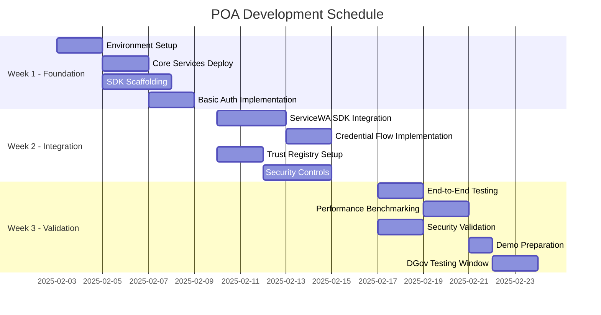

### 2.2 POA Test Scenarios

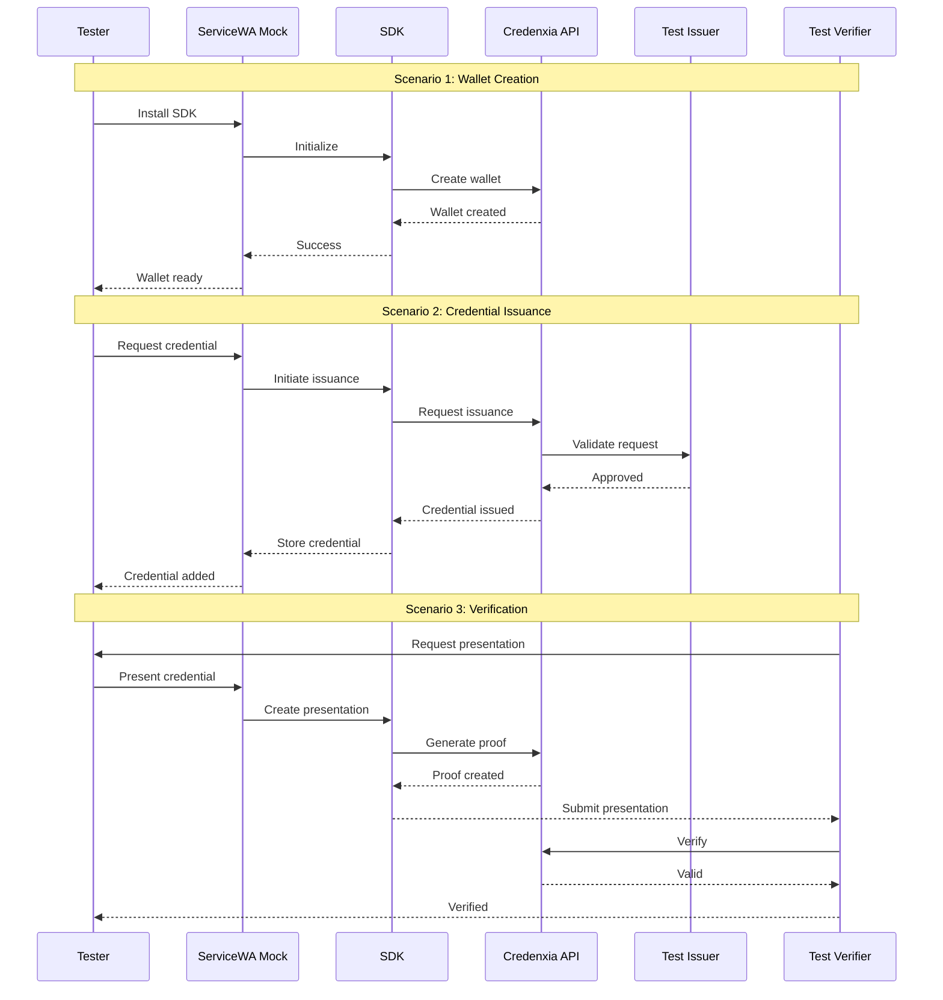

### 2.3 POA Success Criteria

| Category | Criteria | Target | Measurement |
|----------|----------|--------|-------------|
| **Functional** | Wallet creation | 100% success | Automated test |
| **Functional** | Credential issuance | 100% success | End-to-end test |
| **Functional** | Verification flow | 100% success | Integration test |
| **Performance** | API response time | <2s P95 | Load test |
| **Performance** | Concurrent users | 100+ | Stress test |
| **Security** | Authentication | OIDC compliant | Security scan |
| **Security** | Encryption | AES-256 | Validation test |
| **Integration** | SDK integration | Working demo | Manual test |
| **Integration** | ServiceWA compatible | Validated | Integration test |
| **Reliability** | Uptime during demo | 100% | Monitoring |

---

## 3. Pilot Program Plan

### 3.1 Pilot Phases (12 Months)

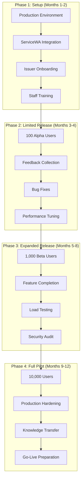

### 3.2 Pilot Success Metrics

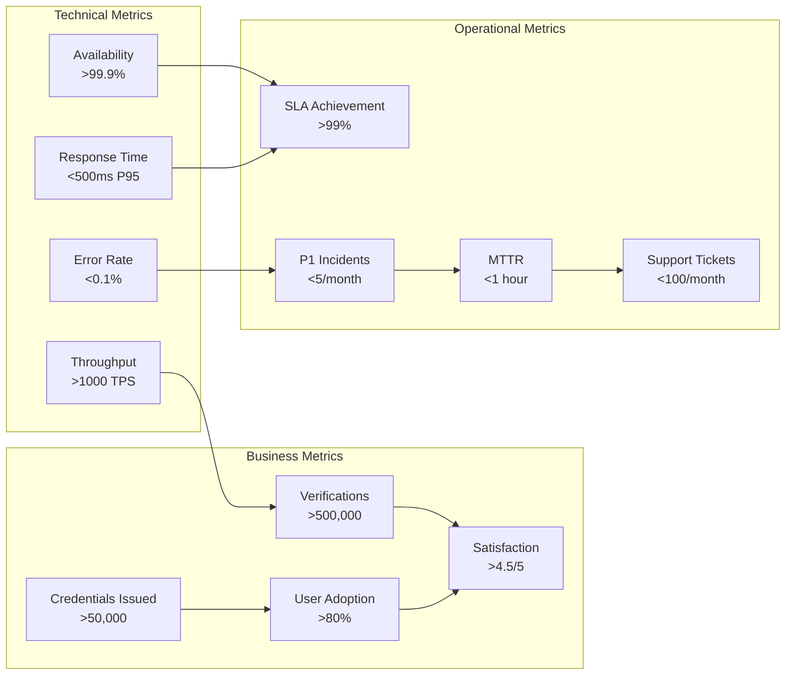

---

## 4. Test Plans

### 4.1 Functional Test Plan

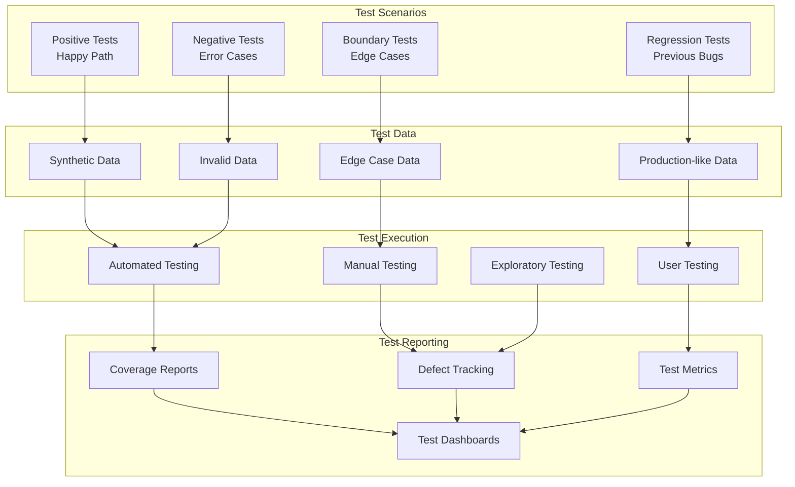

### 4.2 Performance Test Plan

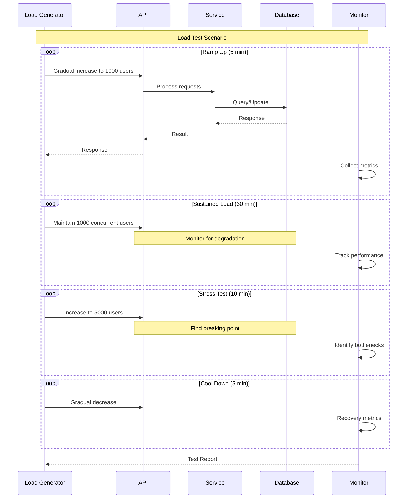

### 4.3 Security Test Plan

| Test Category | Test Cases | Tools | Frequency |
|--------------|------------|-------|-----------|
| **Authentication** | Password policies, MFA, session management | Burp Suite | Each release |
| **Authorization** | RBAC, privilege escalation, access controls | Custom scripts | Weekly |
| **Input Validation** | SQL injection, XSS, command injection | OWASP ZAP | Daily |
| **Cryptography** | Encryption strength, key management, TLS | SSLyze, Nmap | Monthly |
| **API Security** | Rate limiting, CORS, authentication | Postman, K6 | Each sprint |
| **Infrastructure** | Network security, firewall rules, ports | Nessus | Quarterly |
| **Compliance** | OWASP Top 10, CIS benchmarks | Various | Monthly |
| **Penetration** | Full system penetration test | External firm | Quarterly |

---

## 5. Quality Assurance Process

### 5.1 QA Workflow

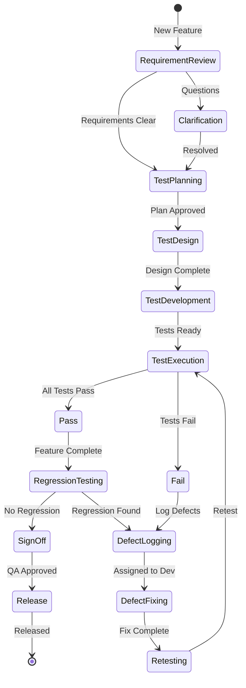

### 5.2 Defect Management

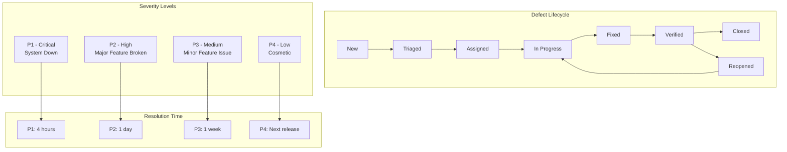

---

## 6. Test Automation Framework

### 6.1 Automation Architecture

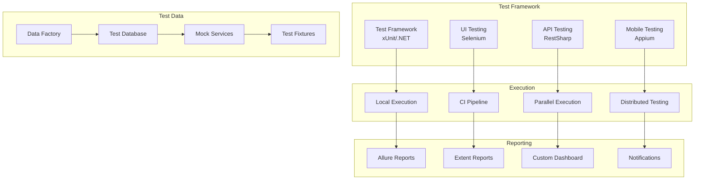

### 6.2 CI/CD Test Pipeline

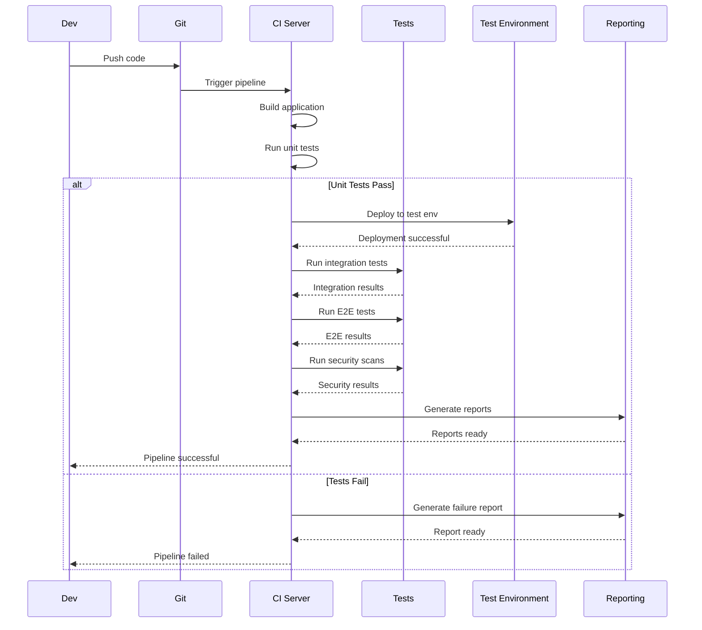

---

## 7. POA Test Execution

### 7.1 POA Test Schedule

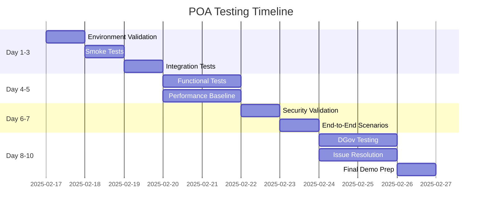

### 7.2 POA Test Results Template

| Test Category | Test Cases | Passed | Failed | Blocked | Pass Rate |
|--------------|------------|--------|--------|---------|-----------|
| **Functional** | 50 | 48 | 2 | 0 | 96% |
| **Integration** | 30 | 29 | 1 | 0 | 97% |
| **Performance** | 20 | 19 | 0 | 1 | 95% |
| **Security** | 25 | 25 | 0 | 0 | 100% |
| **E2E Scenarios** | 15 | 14 | 1 | 0 | 93% |
| **Total** | **140** | **135** | **4** | **1** | **96.4%** |

---

## 8. Pilot Testing Strategy

### 8.1 Pilot Test Phases

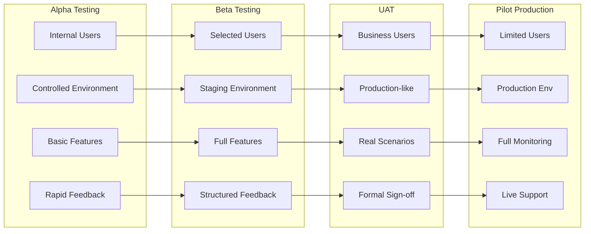

### 8.2 Pilot Monitoring Dashboard

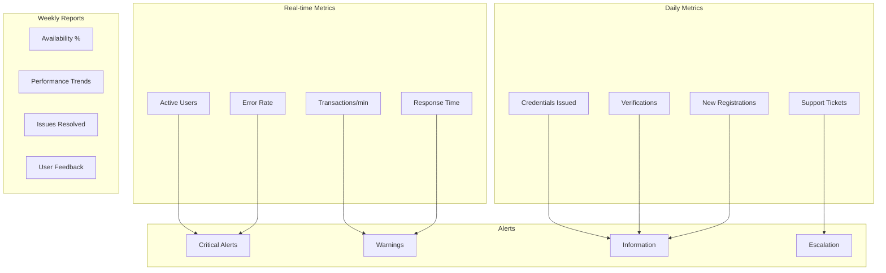

---

## 9. Test Data Management

### 9.1 Test Data Strategy

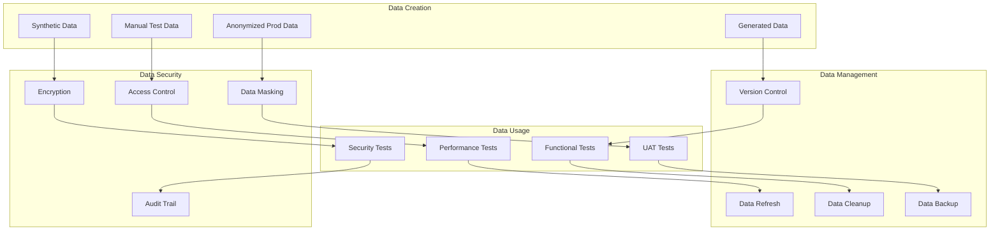

### 9.2 Test Data Requirements

| Data Type | Volume | Refresh Frequency | Security Level | Storage |
|-----------|--------|-------------------|----------------|---------|
| **User Accounts** | 10,000 | Weekly | High | Encrypted DB |
| **Credentials** | 50,000 | Daily | High | Encrypted DB |
| **Transactions** | 100,000 | Daily | Medium | Standard DB |
| **Audit Logs** | 1M records | Continuous | Medium | Log Storage |
| **Performance Data** | 10M records | Per test | Low | Temp Storage |

---

## 10. Acceptance Criteria

### 10.1 POA Acceptance

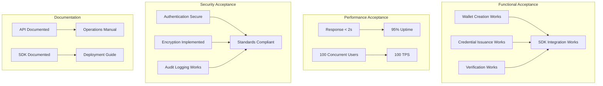

### 10.2 Pilot Exit Criteria

| Category | Criteria | Target | Actual | Status |
|----------|----------|--------|--------|--------|
| **Availability** | System uptime | 99.9% | - | Pending |
| **Performance** | P95 response time | <500ms | - | Pending |
| **Scale** | Active users | 10,000+ | - | Pending |
| **Quality** | Critical defects | 0 | - | Pending |
| **Security** | Security incidents | 0 | - | Pending |
| **User Satisfaction** | NPS score | >50 | - | Pending |
| **Documentation** | Complete | 100% | - | Pending |
| **Training** | Staff trained | 100% | - | Pending |
| **Handover** | Knowledge transfer | Complete | - | Pending |

---

## Test Tools and Infrastructure

### Development and Testing Tools

| Tool | Purpose | License | Environment |
|------|---------|---------|-------------|
| **xUnit** | Unit testing | Open Source | All |
| **Selenium** | UI automation | Open Source | Test/Staging |
| **Postman** | API testing | Commercial | All |
| **K6** | Load testing | Open Source | Performance |
| **OWASP ZAP** | Security testing | Open Source | Security |
| **SonarQube** | Code quality | Commercial | CI/CD |
| **Allure** | Test reporting | Open Source | All |
| **Azure DevOps** | Test management | Commercial | All |

### Test Environment Specifications

| Environment | Purpose | Infrastructure | Data |
|------------|---------|----------------|------|
| **Development** | Developer testing | Shared, minimal | Synthetic |
| **Test** | Automated testing | Dedicated, scaled down | Test data |
| **Staging** | Pre-production | Production-like | Anonymized |
| **POA** | Proof of Authority | Isolated, temporary | Demo data |
| **Pilot** | Pilot program | Production-grade | Real data |

---

**END OF TESTING, QA, POA & PILOT APPENDIX**