# Appendix: Workflows
## Digital Wallet and Verifiable Credentials Solution

**Document Version:** 1.0  
**Parent Document:** [Master PRD](./PRD_Master.md)  
**Last Updated:** December 2024

---

## 1. Core Business Workflows

### 1.1 Workflow Architecture Overview

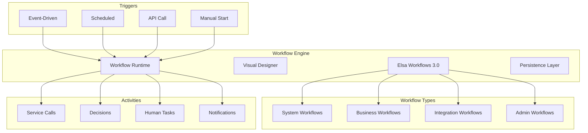
```mermaid
graph TB
    subgraph "Workflow Engine"
        ELSA[Elsa Workflows 3.0]
        DESIGNER[Visual Designer]
        RUNTIME[Workflow Runtime]
        PERSIST[Persistence Layer]
    end
    
    subgraph "Workflow Types"
        SYSTEM[System Workflows]
        BUSINESS[Business Workflows]
        INTEGRATION[Integration Workflows]
        ADMIN[Admin Workflows]
    end
    
    subgraph "Triggers"
        EVENT[Event-Driven]
        SCHEDULE[Scheduled]
        API_TRIGGER[API Call]
        MANUAL[Manual Start]
    end
    
    subgraph "Activities"
        SERVICE[Service Calls]
        DECISION[Decisions]
        HUMAN[Human Tasks]
        NOTIFY[Notifications]
    end
    
    ELSA --> SYSTEM
    ELSA --> BUSINESS
    ELSA --> INTEGRATION
    ELSA --> ADMIN
    
    EVENT --> RUNTIME
    SCHEDULE --> RUNTIME
    API_TRIGGER --> RUNTIME
    MANUAL --> RUNTIME
    
    RUNTIME --> SERVICE
    RUNTIME --> DECISION
    RUNTIME --> HUMAN
    RUNTIME --> NOTIFY
```

### 1.2 Credential Issuance Workflow

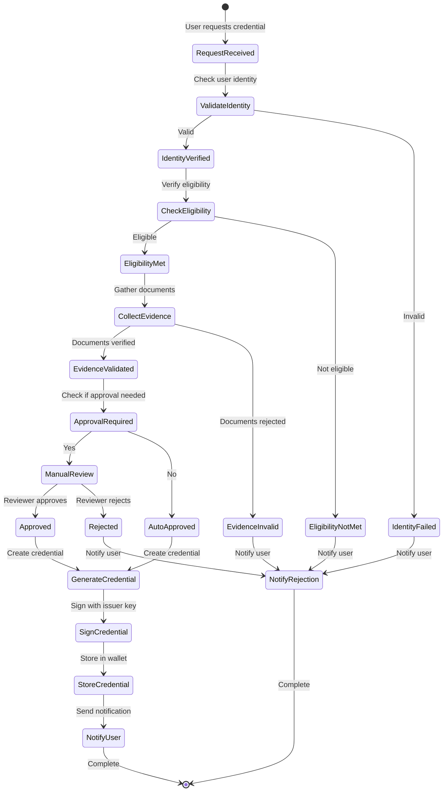
```mermaid
stateDiagram-v2
    [*] --> RequestReceived: User requests credential
    
    RequestReceived --> ValidateIdentity: Check user identity
    ValidateIdentity --> IdentityVerified: Valid
    ValidateIdentity --> IdentityFailed: Invalid
    
    IdentityVerified --> CheckEligibility: Verify eligibility
    CheckEligibility --> EligibilityMet: Eligible
    CheckEligibility --> EligibilityNotMet: Not eligible
    
    EligibilityMet --> CollectEvidence: Gather documents
    CollectEvidence --> EvidenceValidated: Documents verified
    CollectEvidence --> EvidenceInvalid: Documents rejected
    
    EvidenceValidated --> ApprovalRequired: Check if approval needed
    ApprovalRequired --> ManualReview: Yes
    ApprovalRequired --> AutoApproved: No
    
    ManualReview --> Approved: Reviewer approves
    ManualReview --> Rejected: Reviewer rejects
    
    AutoApproved --> GenerateCredential: Create credential
    Approved --> GenerateCredential: Create credential
    
    GenerateCredential --> SignCredential: Sign with issuer key
    SignCredential --> StoreCredential: Store in wallet
    StoreCredential --> NotifyUser: Send notification
    NotifyUser --> [*]: Complete
    
    IdentityFailed --> NotifyRejection: Notify user
    EligibilityNotMet --> NotifyRejection: Notify user
    EvidenceInvalid --> NotifyRejection: Notify user
    Rejected --> NotifyRejection: Notify user
    NotifyRejection --> [*]: Complete
```

---

## 2. Verification Workflows

### 2.1 Online Verification Workflow

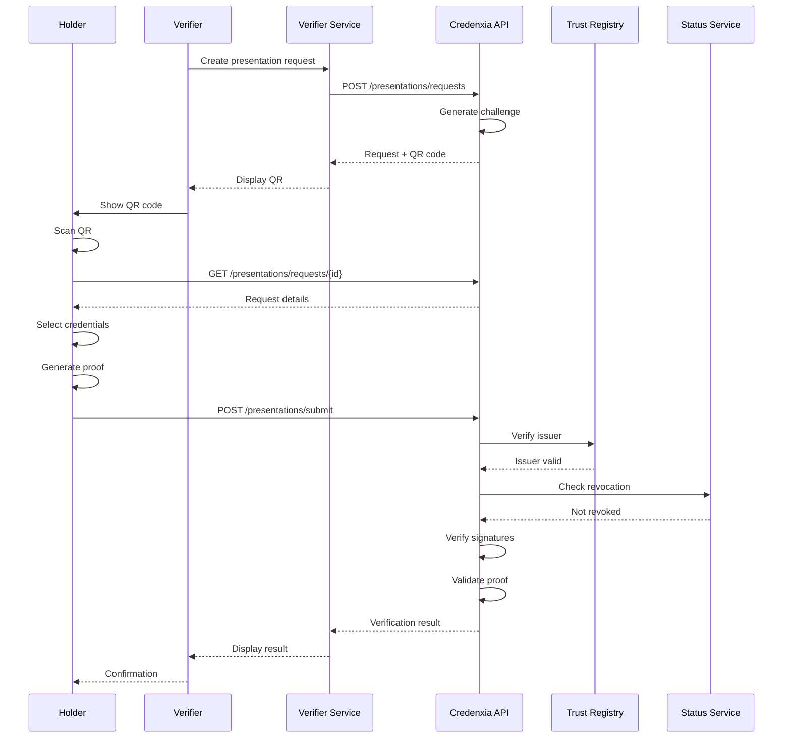
```mermaid
sequenceDiagram
    participant Holder
    participant Verifier
    participant VerifierApp as Verifier Service
    participant API as Credenxia API
    participant Trust as Trust Registry
    participant Status as Status Service
    
    Verifier->>VerifierApp: Create presentation request
    VerifierApp->>API: POST /presentations/requests
    API->>API: Generate challenge
    API-->>VerifierApp: Request + QR code
    VerifierApp-->>Verifier: Display QR
    
    Verifier->>Holder: Show QR code
    Holder->>Holder: Scan QR
    Holder->>API: GET /presentations/requests/{id}
    API-->>Holder: Request details
    
    Holder->>Holder: Select credentials
    Holder->>Holder: Generate proof
    Holder->>API: POST /presentations/submit
    
    API->>Trust: Verify issuer
    Trust-->>API: Issuer valid
    
    API->>Status: Check revocation
    Status-->>API: Not revoked
    
    API->>API: Verify signatures
    API->>API: Validate proof
    API-->>VerifierApp: Verification result
    
    VerifierApp-->>Verifier: Display result
    Verifier-->>Holder: Confirmation
```

### 2.2 Offline Verification Workflow

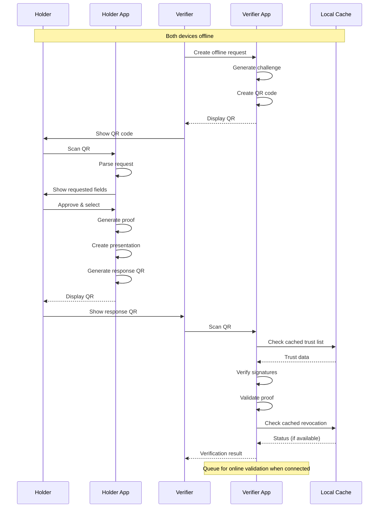
```mermaid
sequenceDiagram
    participant Holder
    participant HolderApp as Holder App
    participant Verifier
    participant VerifierApp as Verifier App
    participant Cache as Local Cache
    
    Note over Holder,Cache: Both devices offline
    
    Verifier->>VerifierApp: Create offline request
    VerifierApp->>VerifierApp: Generate challenge
    VerifierApp->>VerifierApp: Create QR code
    VerifierApp-->>Verifier: Display QR
    
    Verifier->>Holder: Show QR code
    Holder->>HolderApp: Scan QR
    HolderApp->>HolderApp: Parse request
    
    HolderApp->>Holder: Show requested fields
    Holder->>HolderApp: Approve & select
    
    HolderApp->>HolderApp: Generate proof
    HolderApp->>HolderApp: Create presentation
    HolderApp->>HolderApp: Generate response QR
    HolderApp-->>Holder: Display QR
    
    Holder->>Verifier: Show response QR
    Verifier->>VerifierApp: Scan QR
    
    VerifierApp->>Cache: Check cached trust list
    Cache-->>VerifierApp: Trust data
    
    VerifierApp->>VerifierApp: Verify signatures
    VerifierApp->>VerifierApp: Validate proof
    VerifierApp->>Cache: Check cached revocation
    Cache-->>VerifierApp: Status (if available)
    
    VerifierApp-->>Verifier: Verification result
    
    Note over VerifierApp: Queue for online validation when connected
```

---

## 3. Administrative Workflows

### 3.1 User Onboarding Workflow

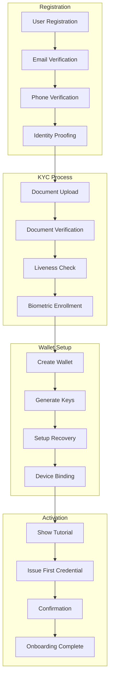
```mermaid
graph TD
    subgraph "Registration"
        START[User Registration]
        EMAIL[Email Verification]
        PHONE[Phone Verification]
        IDENTITY[Identity Proofing]
    end
    
    subgraph "KYC Process"
        DOC_UPLOAD[Document Upload]
        DOC_VERIFY[Document Verification]
        LIVENESS[Liveness Check]
        BIOMETRIC[Biometric Enrollment]
    end
    
    subgraph "Wallet Setup"
        CREATE_WALLET[Create Wallet]
        GEN_KEYS[Generate Keys]
        BACKUP_SETUP[Setup Recovery]
        DEVICE_BIND[Device Binding]
    end
    
    subgraph "Activation"
        TUTORIAL[Show Tutorial]
        FIRST_CRED[Issue First Credential]
        CONFIRM[Confirmation]
        COMPLETE[Onboarding Complete]
    end
    
    START --> EMAIL
    EMAIL --> PHONE
    PHONE --> IDENTITY
    
    IDENTITY --> DOC_UPLOAD
    DOC_UPLOAD --> DOC_VERIFY
    DOC_VERIFY --> LIVENESS
    LIVENESS --> BIOMETRIC
    
    BIOMETRIC --> CREATE_WALLET
    CREATE_WALLET --> GEN_KEYS
    GEN_KEYS --> BACKUP_SETUP
    BACKUP_SETUP --> DEVICE_BIND
    
    DEVICE_BIND --> TUTORIAL
    TUTORIAL --> FIRST_CRED
    FIRST_CRED --> CONFIRM
    CONFIRM --> COMPLETE
```

### 3.2 Credential Revocation Workflow

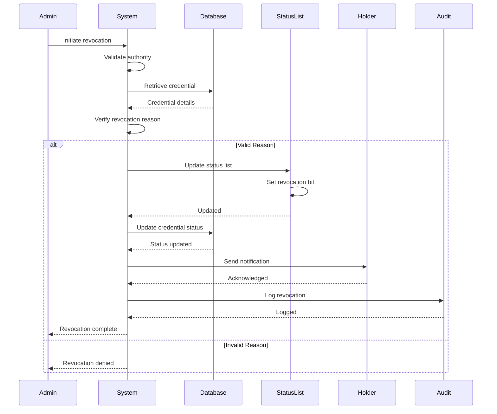
```mermaid
sequenceDiagram
    participant Admin
    participant System
    participant Database
    participant StatusList
    participant Holder
    participant Audit
    
    Admin->>System: Initiate revocation
    System->>System: Validate authority
    
    System->>Database: Retrieve credential
    Database-->>System: Credential details
    
    System->>System: Verify revocation reason
    
    alt Valid Reason
        System->>StatusList: Update status list
        StatusList->>StatusList: Set revocation bit
        StatusList-->>System: Updated
        
        System->>Database: Update credential status
        Database-->>System: Status updated
        
        System->>Holder: Send notification
        Holder-->>System: Acknowledged
        
        System->>Audit: Log revocation
        Audit-->>System: Logged
        
        System-->>Admin: Revocation complete
    else Invalid Reason
        System-->>Admin: Revocation denied
    end
```

---

## 4. Support Workflows

### 4.1 Automated Support Flow (Chatbot/Voicebot)

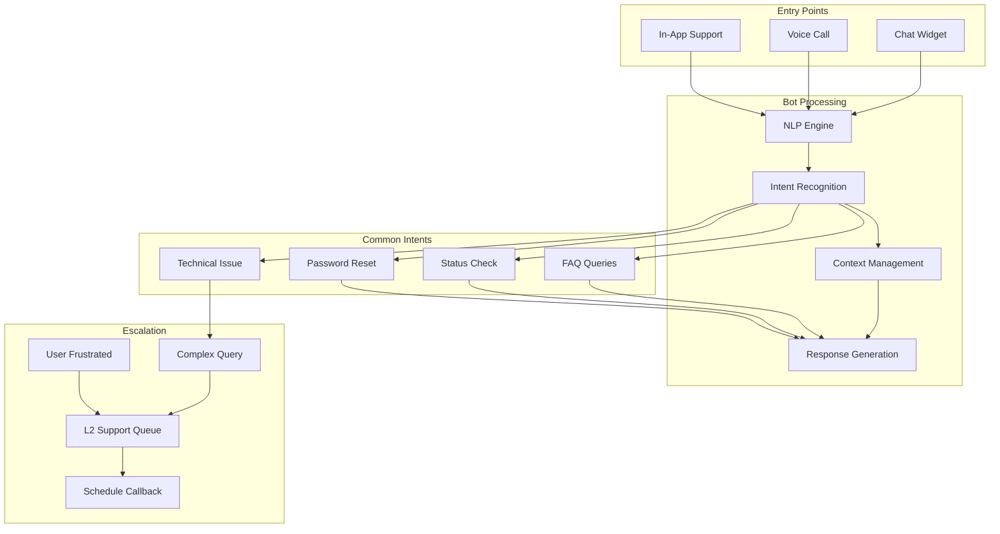
```mermaid
graph TD
    subgraph "Entry Points"
        CHAT[Chat Widget]
        VOICE[Voice Call]
        APP[In-App Support]
    end
    
    subgraph "Bot Processing"
        NLP[NLP Engine]
        INTENT[Intent Recognition]
        CONTEXT[Context Management]
        RESPONSE[Response Generation]
    end
    
    subgraph "Common Intents"
        FAQ[FAQ Queries]
        STATUS[Status Check]
        RESET[Password Reset]
        TECH[Technical Issue]
    end
    
    subgraph "Escalation"
        COMPLEX[Complex Query]
        FRUSTRATED[User Frustrated]
        L2[L2 Support Queue]
        CALLBACK[Schedule Callback]
    end
    
    CHAT --> NLP
    VOICE --> NLP
    APP --> NLP
    
    NLP --> INTENT
    INTENT --> CONTEXT
    CONTEXT --> RESPONSE
    
    INTENT --> FAQ
    INTENT --> STATUS
    INTENT --> RESET
    INTENT --> TECH
    
    FAQ --> RESPONSE
    STATUS --> RESPONSE
    RESET --> RESPONSE
    TECH --> COMPLEX
    
    COMPLEX --> L2
    FRUSTRATED --> L2
    L2 --> CALLBACK
```

### 4.2 Incident Response Workflow

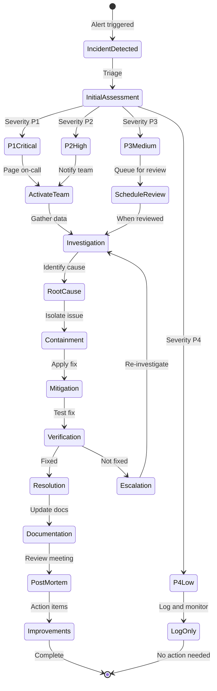
```mermaid
stateDiagram-v2
    [*] --> IncidentDetected: Alert triggered
    
    IncidentDetected --> InitialAssessment: Triage
    InitialAssessment --> P1Critical: Severity P1
    InitialAssessment --> P2High: Severity P2
    InitialAssessment --> P3Medium: Severity P3
    InitialAssessment --> P4Low: Severity P4
    
    P1Critical --> ActivateTeam: Page on-call
    P2High --> ActivateTeam: Notify team
    P3Medium --> ScheduleReview: Queue for review
    P4Low --> LogOnly: Log and monitor
    
    ActivateTeam --> Investigation: Gather data
    Investigation --> RootCause: Identify cause
    
    RootCause --> Containment: Isolate issue
    Containment --> Mitigation: Apply fix
    
    Mitigation --> Verification: Test fix
    Verification --> Resolution: Fixed
    Verification --> Escalation: Not fixed
    
    Escalation --> Investigation: Re-investigate
    
    Resolution --> Documentation: Update docs
    Documentation --> PostMortem: Review meeting
    PostMortem --> Improvements: Action items
    Improvements --> [*]: Complete
    
    ScheduleReview --> Investigation: When reviewed
    LogOnly --> [*]: No action needed
```

---

## 5. Security Workflows

### 5.1 Key Rotation Workflow

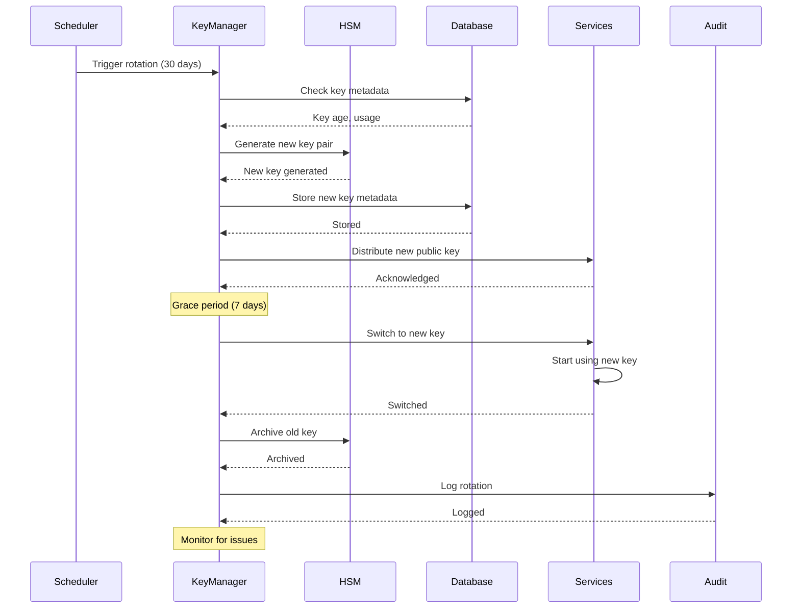
```mermaid
sequenceDiagram
    participant Scheduler
    participant KeyManager
    participant HSM
    participant Database
    participant Services
    participant Audit
    
    Scheduler->>KeyManager: Trigger rotation (30 days)
    KeyManager->>Database: Check key metadata
    Database-->>KeyManager: Key age, usage
    
    KeyManager->>HSM: Generate new key pair
    HSM-->>KeyManager: New key generated
    
    KeyManager->>Database: Store new key metadata
    Database-->>KeyManager: Stored
    
    KeyManager->>Services: Distribute new public key
    Services-->>KeyManager: Acknowledged
    
    Note over KeyManager: Grace period (7 days)
    
    KeyManager->>Services: Switch to new key
    Services->>Services: Start using new key
    Services-->>KeyManager: Switched
    
    KeyManager->>HSM: Archive old key
    HSM-->>KeyManager: Archived
    
    KeyManager->>Audit: Log rotation
    Audit-->>KeyManager: Logged
    
    Note over KeyManager: Monitor for issues
```

### 5.2 Security Incident Workflow

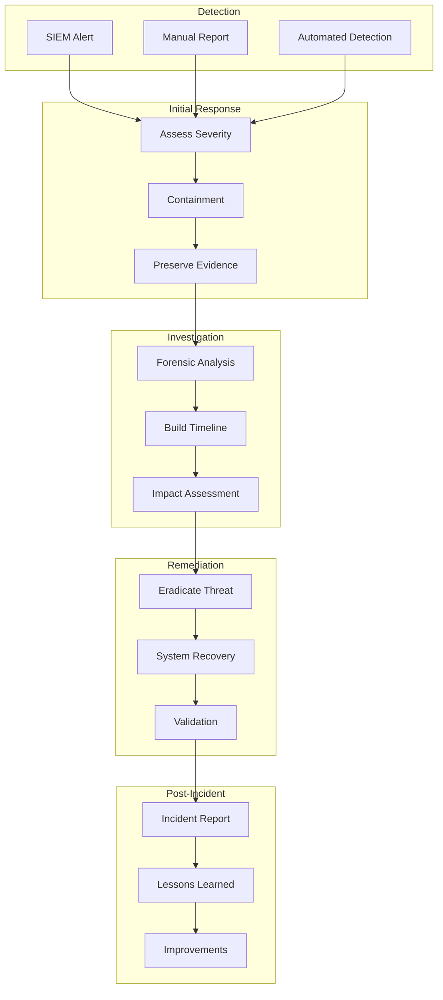
```mermaid
graph TD
    subgraph "Detection"
        SIEM[SIEM Alert]
        MANUAL_REPORT[Manual Report]
        AUTOMATED[Automated Detection]
    end
    
    subgraph "Initial Response"
        ASSESS[Assess Severity]
        CONTAIN[Containment]
        PRESERVE[Preserve Evidence]
    end
    
    subgraph "Investigation"
        FORENSICS[Forensic Analysis]
        TIMELINE[Build Timeline]
        IMPACT[Impact Assessment]
    end
    
    subgraph "Remediation"
        ERADICATE[Eradicate Threat]
        RECOVER[System Recovery]
        VALIDATE[Validation]
    end
    
    subgraph "Post-Incident"
        REPORT[Incident Report]
        LESSONS[Lessons Learned]
        IMPROVE[Improvements]
    end
    
    SIEM --> ASSESS
    MANUAL_REPORT --> ASSESS
    AUTOMATED --> ASSESS
    
    ASSESS --> CONTAIN
    CONTAIN --> PRESERVE
    
    PRESERVE --> FORENSICS
    FORENSICS --> TIMELINE
    TIMELINE --> IMPACT
    
    IMPACT --> ERADICATE
    ERADICATE --> RECOVER
    RECOVER --> VALIDATE
    
    VALIDATE --> REPORT
    REPORT --> LESSONS
    LESSONS --> IMPROVE
```

---

## 6. Integration Workflows

### 6.1 ServiceWA Integration Workflow

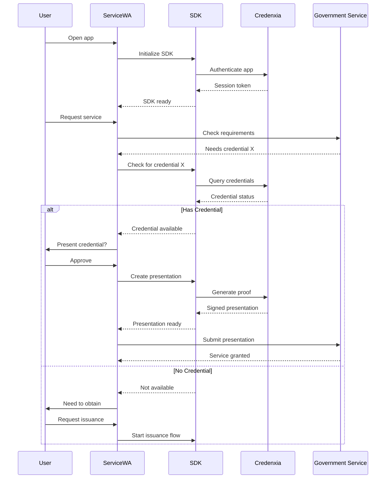
```mermaid
sequenceDiagram
    participant User
    participant ServiceWA
    participant SDK
    participant Credenxia
    participant GovService as Government Service
    
    User->>ServiceWA: Open app
    ServiceWA->>SDK: Initialize SDK
    SDK->>Credenxia: Authenticate app
    Credenxia-->>SDK: Session token
    SDK-->>ServiceWA: SDK ready
    
    User->>ServiceWA: Request service
    ServiceWA->>GovService: Check requirements
    GovService-->>ServiceWA: Needs credential X
    
    ServiceWA->>SDK: Check for credential X
    SDK->>Credenxia: Query credentials
    Credenxia-->>SDK: Credential status
    
    alt Has Credential
        SDK-->>ServiceWA: Credential available
        ServiceWA->>User: Present credential?
        User->>ServiceWA: Approve
        ServiceWA->>SDK: Create presentation
        SDK->>Credenxia: Generate proof
        Credenxia-->>SDK: Signed presentation
        SDK-->>ServiceWA: Presentation ready
        ServiceWA->>GovService: Submit presentation
        GovService-->>ServiceWA: Service granted
    else No Credential
        SDK-->>ServiceWA: Not available
        ServiceWA->>User: Need to obtain
        User->>ServiceWA: Request issuance
        ServiceWA->>SDK: Start issuance flow
    end
```

### 6.2 Third-Party Issuer Integration

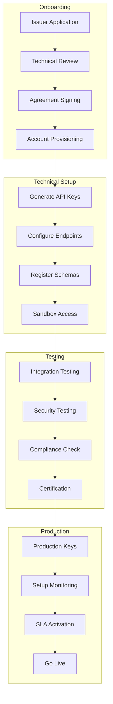
```mermaid
graph TB
    subgraph "Onboarding"
        APPLY[Issuer Application]
        REVIEW[Technical Review]
        CONTRACT[Agreement Signing]
        PROVISION[Account Provisioning]
    end
    
    subgraph "Technical Setup"
        API_KEYS[Generate API Keys]
        ENDPOINTS[Configure Endpoints]
        SCHEMA[Register Schemas]
        TEST_ENV[Sandbox Access]
    end
    
    subgraph "Testing"
        INTEGRATION_TEST[Integration Testing]
        SECURITY_TEST[Security Testing]
        COMPLIANCE[Compliance Check]
        CERTIFICATION[Certification]
    end
    
    subgraph "Production"
        PROD_KEYS[Production Keys]
        MONITORING_SETUP[Setup Monitoring]
        SLA[SLA Activation]
        GO_LIVE[Go Live]
    end
    
    APPLY --> REVIEW
    REVIEW --> CONTRACT
    CONTRACT --> PROVISION
    
    PROVISION --> API_KEYS
    API_KEYS --> ENDPOINTS
    ENDPOINTS --> SCHEMA
    SCHEMA --> TEST_ENV
    
    TEST_ENV --> INTEGRATION_TEST
    INTEGRATION_TEST --> SECURITY_TEST
    SECURITY_TEST --> COMPLIANCE
    COMPLIANCE --> CERTIFICATION
    
    CERTIFICATION --> PROD_KEYS
    PROD_KEYS --> MONITORING_SETUP
    MONITORING_SETUP --> SLA
    SLA --> GO_LIVE
```

---

## 7. Operational Workflows

### 7.1 Deployment Workflow


```mermaid
graph LR
    subgraph "Development"
        CODE[Code Commit]
        BUILD[Build Pipeline]
        TEST[Automated Tests]
        SCAN[Security Scan]
    end
    
    subgraph "Staging"
        DEPLOY_STAGE[Deploy to Staging]
        SMOKE[Smoke Tests]
        UAT[UAT Testing]
        APPROVAL[Approval Gate]
    end
    
    subgraph "Production"
        DEPLOY_PROD[Blue-Green Deploy]
        HEALTH[Health Checks]
        CANARY[Canary Release]
        FULL[Full Release]
    end
    
    subgraph "Rollback"
        MONITOR[Monitor Metrics]
        DETECT[Detect Issues]
        ROLLBACK[Auto Rollback]
    end
    
    CODE --> BUILD
    BUILD --> TEST
    TEST --> SCAN
    
    SCAN --> DEPLOY_STAGE
    DEPLOY_STAGE --> SMOKE
    SMOKE --> UAT
    UAT --> APPROVAL
    
    APPROVAL --> DEPLOY_PROD
    DEPLOY_PROD --> HEALTH
    HEALTH --> CANARY
    CANARY --> FULL
    
    FULL --> MONITOR
    MONITOR --> DETECT
    DETECT --> ROLLBACK
```

### 7.2 Backup and Recovery Workflow

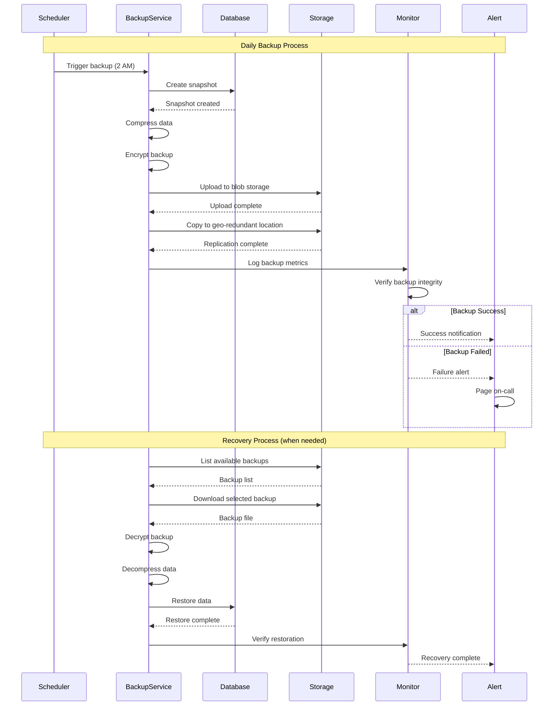
```mermaid
sequenceDiagram
    participant Scheduler
    participant BackupService
    participant Database
    participant Storage
    participant Monitor
    participant Alert
    
    Note over Scheduler,Alert: Daily Backup Process
    
    Scheduler->>BackupService: Trigger backup (2 AM)
    BackupService->>Database: Create snapshot
    Database-->>BackupService: Snapshot created
    
    BackupService->>BackupService: Compress data
    BackupService->>BackupService: Encrypt backup
    
    BackupService->>Storage: Upload to blob storage
    Storage-->>BackupService: Upload complete
    
    BackupService->>Storage: Copy to geo-redundant location
    Storage-->>BackupService: Replication complete
    
    BackupService->>Monitor: Log backup metrics
    Monitor->>Monitor: Verify backup integrity
    
    alt Backup Success
        Monitor-->>Alert: Success notification
    else Backup Failed
        Monitor-->>Alert: Failure alert
        Alert->>Alert: Page on-call
    end
    
    Note over Scheduler,Alert: Recovery Process (when needed)
    
    BackupService->>Storage: List available backups
    Storage-->>BackupService: Backup list
    
    BackupService->>Storage: Download selected backup
    Storage-->>BackupService: Backup file
    
    BackupService->>BackupService: Decrypt backup
    BackupService->>BackupService: Decompress data
    
    BackupService->>Database: Restore data
    Database-->>BackupService: Restore complete
    
    BackupService->>Monitor: Verify restoration
    Monitor-->>Alert: Recovery complete
```

---

## 8. Compliance Workflows

### 8.1 Privacy Rights Workflow (GDPR/APP)

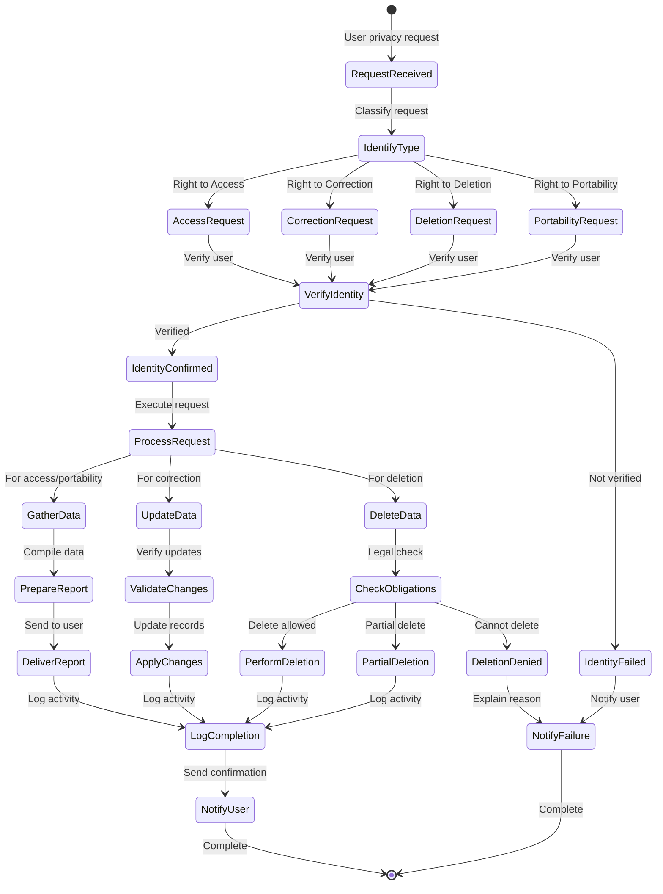
```mermaid
stateDiagram-v2
    [*] --> RequestReceived: User privacy request
    
    RequestReceived --> IdentifyType: Classify request
    IdentifyType --> AccessRequest: Right to Access
    IdentifyType --> CorrectionRequest: Right to Correction
    IdentifyType --> DeletionRequest: Right to Deletion
    IdentifyType --> PortabilityRequest: Right to Portability
    
    AccessRequest --> VerifyIdentity: Verify user
    CorrectionRequest --> VerifyIdentity: Verify user
    DeletionRequest --> VerifyIdentity: Verify user
    PortabilityRequest --> VerifyIdentity: Verify user
    
    VerifyIdentity --> IdentityConfirmed: Verified
    VerifyIdentity --> IdentityFailed: Not verified
    
    IdentityConfirmed --> ProcessRequest: Execute request
    
    ProcessRequest --> GatherData: For access/portability
    ProcessRequest --> UpdateData: For correction
    ProcessRequest --> DeleteData: For deletion
    
    GatherData --> PrepareReport: Compile data
    PrepareReport --> DeliverReport: Send to user
    
    UpdateData --> ValidateChanges: Verify updates
    ValidateChanges --> ApplyChanges: Update records
    
    DeleteData --> CheckObligations: Legal check
    CheckObligations --> PerformDeletion: Delete allowed
    CheckObligations --> PartialDeletion: Partial delete
    CheckObligations --> DeletionDenied: Cannot delete
    
    DeliverReport --> LogCompletion: Log activity
    ApplyChanges --> LogCompletion: Log activity
    PerformDeletion --> LogCompletion: Log activity
    PartialDeletion --> LogCompletion: Log activity
    
    LogCompletion --> NotifyUser: Send confirmation
    NotifyUser --> [*]: Complete
    
    IdentityFailed --> NotifyFailure: Notify user
    DeletionDenied --> NotifyFailure: Explain reason
    NotifyFailure --> [*]: Complete
```

### 8.2 Audit Trail Workflow

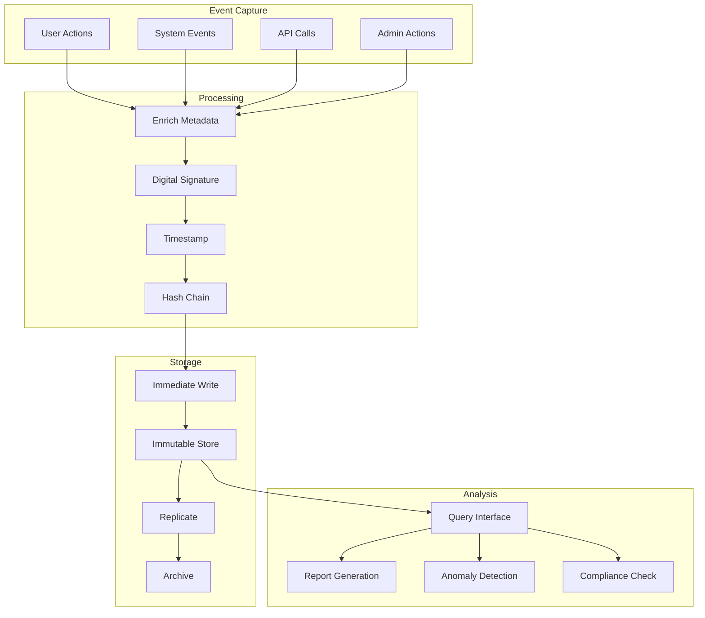
```mermaid
graph TD
    subgraph "Event Capture"
        USER_ACTION[User Actions]
        SYSTEM_EVENT[System Events]
        API_CALL[API Calls]
        ADMIN_ACTION[Admin Actions]
    end
    
    subgraph "Processing"
        ENRICH[Enrich Metadata]
        SIGN[Digital Signature]
        TIMESTAMP[Timestamp]
        HASH[Hash Chain]
    end
    
    subgraph "Storage"
        IMMEDIATE[Immediate Write]
        IMMUTABLE[Immutable Store]
        REPLICATE[Replicate]
        ARCHIVE[Archive]
    end
    
    subgraph "Analysis"
        QUERY[Query Interface]
        REPORT_GEN[Report Generation]
        ANOMALY_DET[Anomaly Detection]
        COMPLIANCE_CHECK[Compliance Check]
    end
    
    USER_ACTION --> ENRICH
    SYSTEM_EVENT --> ENRICH
    API_CALL --> ENRICH
    ADMIN_ACTION --> ENRICH
    
    ENRICH --> SIGN
    SIGN --> TIMESTAMP
    TIMESTAMP --> HASH
    
    HASH --> IMMEDIATE
    IMMEDIATE --> IMMUTABLE
    IMMUTABLE --> REPLICATE
    REPLICATE --> ARCHIVE
    
    IMMUTABLE --> QUERY
    QUERY --> REPORT_GEN
    QUERY --> ANOMALY_DET
    QUERY --> COMPLIANCE_CHECK
```

---

## 9. Performance Optimization Workflows

### 9.1 Auto-Scaling Workflow

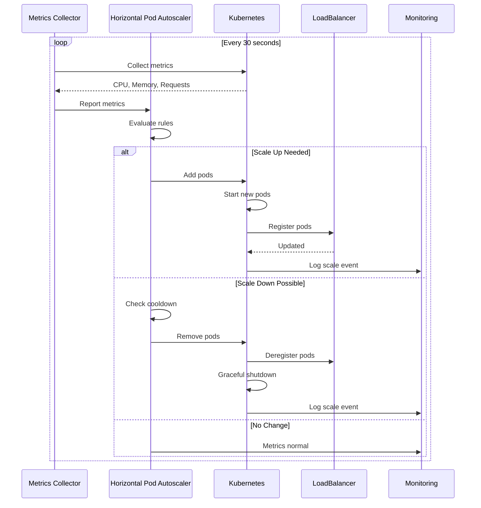
```mermaid
sequenceDiagram
    participant Metrics as Metrics Collector
    participant HPA as Horizontal Pod Autoscaler
    participant Kubernetes
    participant LoadBalancer
    participant Monitoring
    
    loop Every 30 seconds
        Metrics->>Kubernetes: Collect metrics
        Kubernetes-->>Metrics: CPU, Memory, Requests
        
        Metrics->>HPA: Report metrics
        HPA->>HPA: Evaluate rules
        
        alt Scale Up Needed
            HPA->>Kubernetes: Add pods
            Kubernetes->>Kubernetes: Start new pods
            Kubernetes->>LoadBalancer: Register pods
            LoadBalancer-->>Kubernetes: Updated
            Kubernetes->>Monitoring: Log scale event
        else Scale Down Possible
            HPA->>HPA: Check cooldown
            HPA->>Kubernetes: Remove pods
            Kubernetes->>LoadBalancer: Deregister pods
            Kubernetes->>Kubernetes: Graceful shutdown
            Kubernetes->>Monitoring: Log scale event
        else No Change
            HPA->>Monitoring: Metrics normal
        end
    end
```

### 9.2 Cache Management Workflow

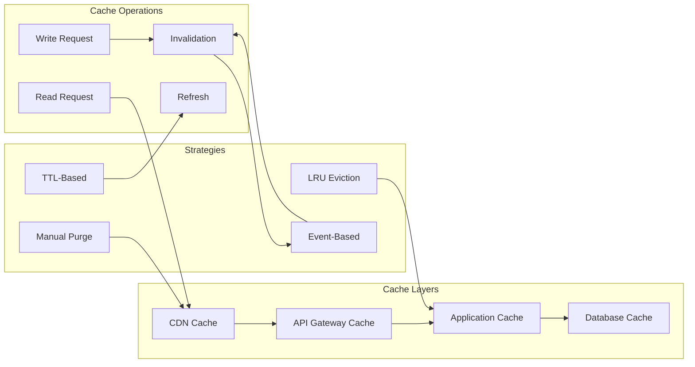
```mermaid
graph LR
    subgraph "Cache Layers"
        CDN_CACHE[CDN Cache]
        API_CACHE[API Gateway Cache]
        APP_CACHE[Application Cache]
        DB_CACHE[Database Cache]
    end
    
    subgraph "Cache Operations"
        READ[Read Request]
        WRITE[Write Request]
        INVALIDATE[Invalidation]
        REFRESH[Refresh]
    end
    
    subgraph "Strategies"
        TTL[TTL-Based]
        LRU[LRU Eviction]
        EVENT_BASED[Event-Based]
        MANUAL_PURGE[Manual Purge]
    end
    
    READ --> CDN_CACHE
    CDN_CACHE --> API_CACHE
    API_CACHE --> APP_CACHE
    APP_CACHE --> DB_CACHE
    
    WRITE --> INVALIDATE
    INVALIDATE --> EVENT_BASED
    
    TTL --> REFRESH
    LRU --> APP_CACHE
    EVENT_BASED --> INVALIDATE
    MANUAL_PURGE --> CDN_CACHE
```

---

## 10. Workflow Monitoring and Analytics

### 10.1 Workflow Performance Metrics

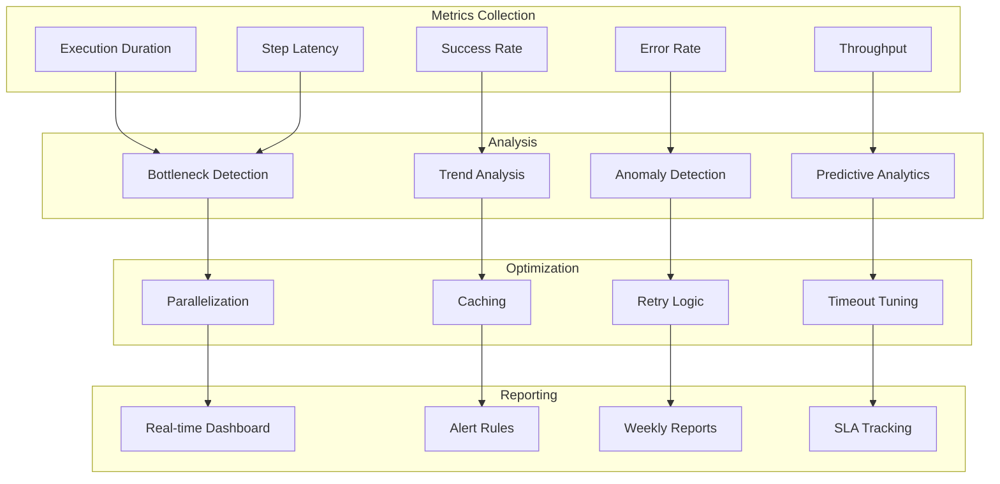
```mermaid
graph TD
    subgraph "Metrics Collection"
        DURATION[Execution Duration]
        SUCCESS[Success Rate]
        ERROR[Error Rate]
        THROUGHPUT[Throughput]
        LATENCY[Step Latency]
    end
    
    subgraph "Analysis"
        BOTTLENECK[Bottleneck Detection]
        TREND[Trend Analysis]
        ANOMALY_W[Anomaly Detection]
        PREDICTION[Predictive Analytics]
    end
    
    subgraph "Optimization"
        PARALLEL[Parallelization]
        CACHE_OPT[Caching]
        RETRY_OPT[Retry Logic]
        TIMEOUT[Timeout Tuning]
    end
    
    subgraph "Reporting"
        DASHBOARD[Real-time Dashboard]
        ALERTS_W[Alert Rules]
        REPORTS_W[Weekly Reports]
        SLA_TRACK[SLA Tracking]
    end
    
    DURATION --> BOTTLENECK
    SUCCESS --> TREND
    ERROR --> ANOMALY_W
    THROUGHPUT --> PREDICTION
    LATENCY --> BOTTLENECK
    
    BOTTLENECK --> PARALLEL
    TREND --> CACHE_OPT
    ANOMALY_W --> RETRY_OPT
    PREDICTION --> TIMEOUT
    
    PARALLEL --> DASHBOARD
    CACHE_OPT --> ALERTS_W
    RETRY_OPT --> REPORTS_W
    TIMEOUT --> SLA_TRACK
```

### 10.2 Workflow Health Dashboard

| Workflow | Executions/Day | Success Rate | Avg Duration | P95 Duration | Status |
|----------|---------------|--------------|--------------|--------------|--------|
| **Credential Issuance** | 1,250 | 98.5% | 3.2s | 5.8s | ✅ Healthy |
| **Verification** | 8,500 | 99.8% | 450ms | 780ms | ✅ Healthy |
| **User Onboarding** | 85 | 96.2% | 5.5min | 8.2min | ⚠️ Warning |
| **Key Rotation** | 12 | 100% | 45s | 52s | ✅ Healthy |
| **Backup** | 24 | 100% | 12min | 15min | ✅ Healthy |
| **Support Bot** | 350 | 87% | 28s | 45s | ⚠️ Warning |

---

## Workflow Configuration

### Elsa Workflow Configuration

```yaml
# Workflow Engine Configuration
ElsaOptions:
  Server:
    BaseUrl: https://workflow.credenxia.gov.au
    WorkflowChannelOptions:
      MaxConcurrency: 10
      PartitionCount: 4
  
  Persistence:
    Provider: EntityFrameworkCore
    ConnectionString: ${WORKFLOW_DB_CONNECTION}
    
  Activities:
    HttpEndpoint:
      Timeout: 30
      RetryPolicy:
        MaxAttempts: 3
        BackoffMultiplier: 2
    
  Features:
    - WorkflowManagement
    - WorkflowInstances
    - WorkflowDefinitions
    - Scheduler
    - Timers
    - HttpActivities
    
  Security:
    RequireAuthentication: true
    TokenValidation:
      Audience: workflow-api
      Issuer: https://auth.credenxia.gov.au
```

### Workflow Retention Policy

| Workflow Type | Retention Period | Archive Location | Purge Policy |
|--------------|------------------|------------------|--------------|
| **Credential Issuance** | 7 years | Cold storage | Auto-purge after retention |
| **Verification** | 90 days | Warm storage | Auto-purge |
| **Administrative** | 3 years | Cold storage | Manual review |
| **Support** | 1 year | Warm storage | Auto-purge |
| **System** | 30 days | Hot storage | Auto-purge |

---

**END OF WORKFLOWS APPENDIX**