# Master Product Requirements Document (PRD)
## Digital Wallet and Verifiable Credentials Solution for WA Government

**Document Version:** 1.0  
**Date:** December 2024  
**Tender Reference:** DPC2142  
**Client:** Department of the Premier and Cabinet (DGov), Western Australia  

---

## Executive Summary

This Product Requirements Document defines the comprehensive solution for the **Digital Wallet and Verifiable Credentials Solution** as specified in Request No. DPC2142. Our solution, **Credenxia v2**, delivers a cloud-native, multi-tenant managed service that enables secure issuance, storage, and verification of digital credentials through the ServiceWA mobile application.

### Key Value Propositions
- **Standards-compliant:** W3C VC Data Model 2.0, OpenID4VCI/VP, ISO/IEC 18013-5 (mDL)
- **Azure-native:** Leveraging Azure's AU regions for data sovereignty
- **Multi-tenant architecture:** Isolated per-tenant databases with enterprise-grade security
- **SDK-first approach:** Native Flutter, .NET, and TypeScript/JavaScript SDKs
- **Privacy-preserving:** Zero-knowledge proofs, selective disclosure, minimal data retention
- **Offline-capable:** Full offline verification with cryptographic validation

### Solution Overview Diagram

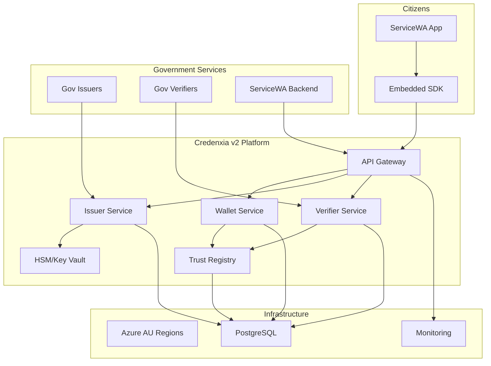

---

## 1. Goals, Non-Goals, and Success Metrics

### 1.1 Goals
- **Primary Goal:** Deliver a production-ready digital wallet solution for WA citizens by Q2 2025
- **POA Success:** Demonstrate end-to-end credential lifecycle within 3-week build window
- **Pilot Success:** Support 10,000+ active wallets with 99.9% availability
- **Production Readiness:** Scale to 2M+ citizens with sub-second response times

### 1.2 Non-Goals
- Building a standalone mobile application (we provide SDKs for ServiceWA)
- Blockchain/DLT implementation (unless explicitly required)
- Physical card production or NFC hardware provisioning
- Direct citizen support (handled through ServiceWA channels)

### 1.3 Success Metrics

| Metric | POA Target | Pilot Target | Production Target |
|--------|------------|--------------|-------------------|
| Availability | 95% | 99.9% | 99.95% |
| Response Time (P95) | <2s | <500ms | <200ms |
| Concurrent Users | 100 | 10,000 | 100,000 |
| Credentials Issued/Day | 50 | 1,000 | 50,000 |
| Verification Rate | 100/hour | 10,000/hour | 1M/hour |
| SDK Integration Time | <1 week | <3 days | <1 day |

---

## 2. Stakeholders and Tenancy Model

### 2.1 Primary Stakeholders

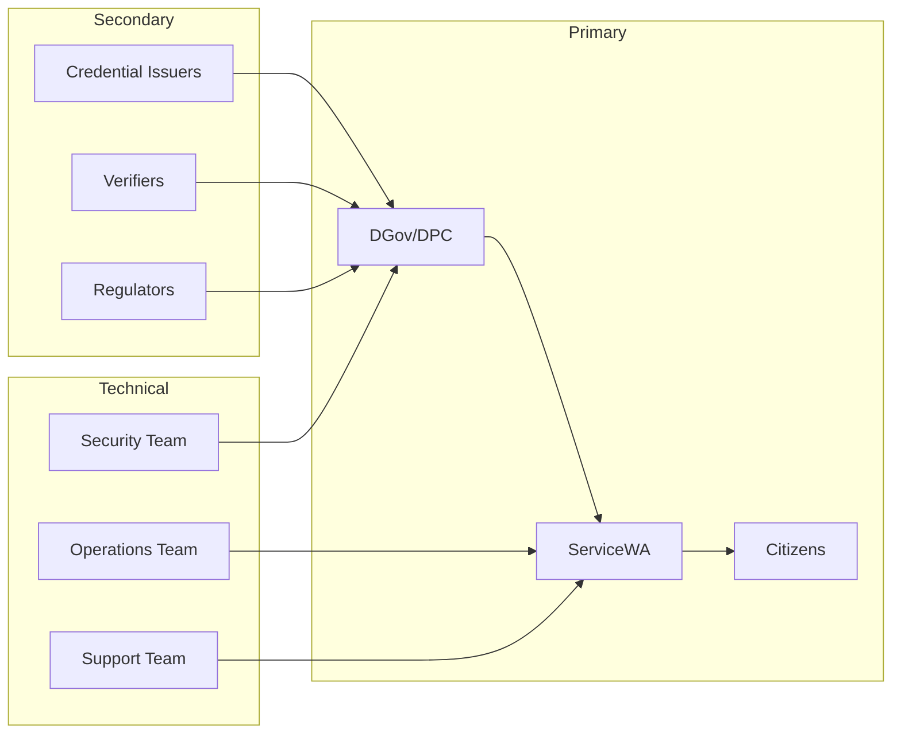

### 2.2 Multi-Tenancy Model

**Recommended Architecture: Per-Tenant Database Isolation**

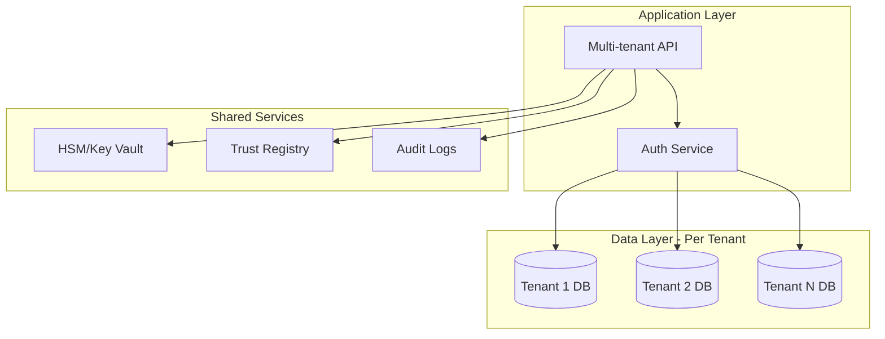

**Rationale:**
- **Security isolation:** Complete data separation at database level
- **Performance predictability:** No noisy neighbor issues
- **Compliance simplicity:** Clear data boundaries for auditing
- **Migration path:** Can move to shared DB + RLS if needed

---

## 3. Functional Requirements

### 3.1 Core Wallet Functions

#### 3.1.1 Credential Issuance

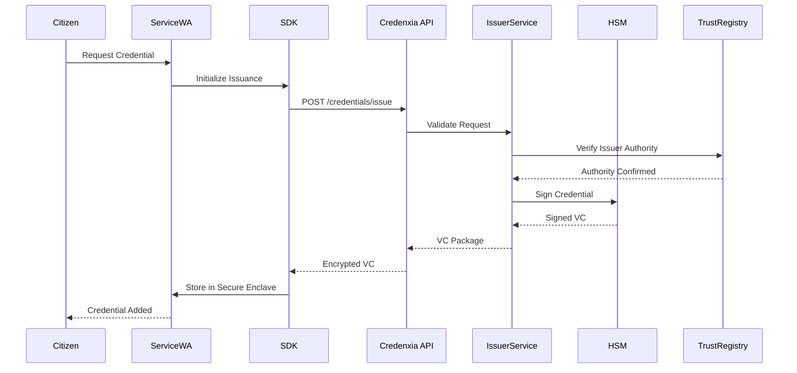

#### 3.1.2 Credential Presentation

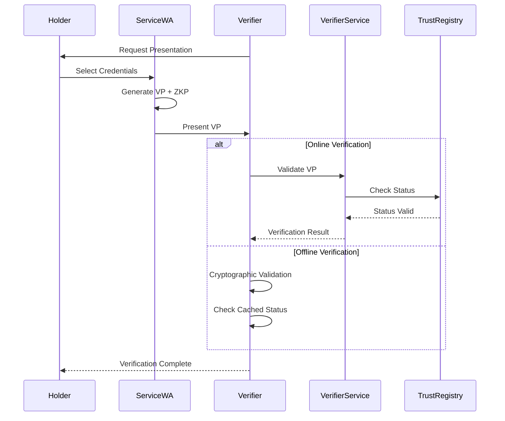

### 3.2 Identity and Authentication

- **OIDC/OAuth2** with PKCE for all API access
- **Device binding** using biometric-protected keys
- **Multi-factor authentication** for sensitive operations
- **Session management** with sliding expiration

### 3.3 Credential Types Support

| Credential Type | Standard | POA | Pilot | Production |
|----------------|----------|-----|-------|------------|
| Driver's License | ISO 18013-5 | ✓ | ✓ | ✓ |
| Working with Children | W3C VC 2.0 | ✓ | ✓ | ✓ |
| Proof of Age | W3C VC 2.0 | ✓ | ✓ | ✓ |
| Senior's Card | W3C VC 2.0 | | ✓ | ✓ |
| Student ID | W3C VC 2.0 | | ✓ | ✓ |
| Health Credentials | SMART Health | | | ✓ |

---

## 4. Non-Functional Requirements

### 4.1 Performance Requirements

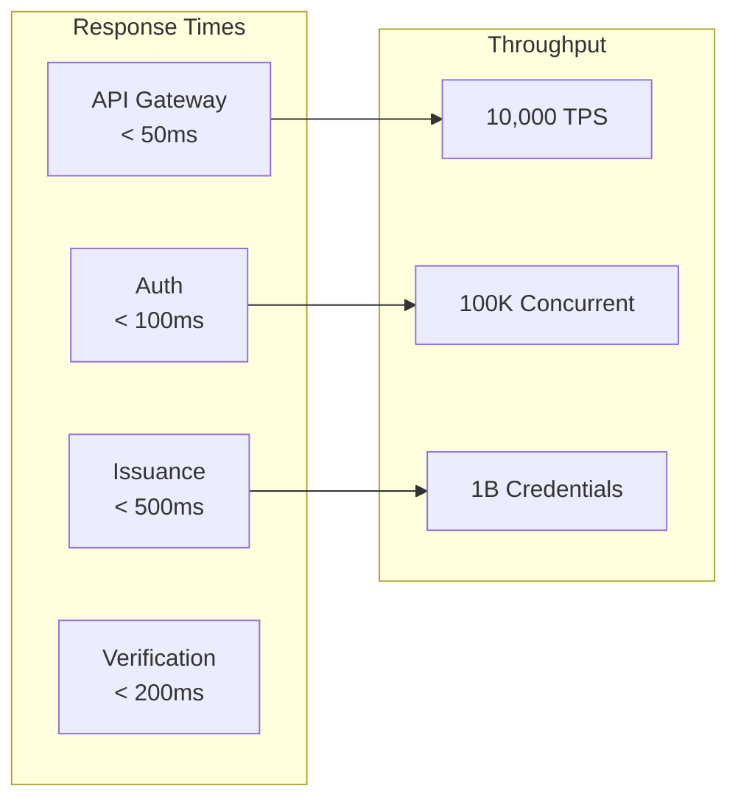

### 4.2 Security Requirements

- **Encryption at Rest:** AES-256-GCM with envelope encryption
- **Encryption in Transit:** TLS 1.3 minimum
- **Key Management:** Azure Key Vault with HSM backing
- **Cryptographic Agility:** Support for multiple algorithms
- **Zero-Knowledge Proofs:** BBS+ signatures for selective disclosure

### 4.3 Availability and Reliability

- **SLA Targets:**
  - POA: 95% availability
  - Pilot: 99.9% availability (43 minutes downtime/month)
  - Production: 99.95% availability (22 minutes downtime/month)
- **RTO:** 1 hour
- **RPO:** 15 minutes
- **Multi-region:** Active-passive with AU-East primary, AU-Southeast secondary

### 4.4 Scalability

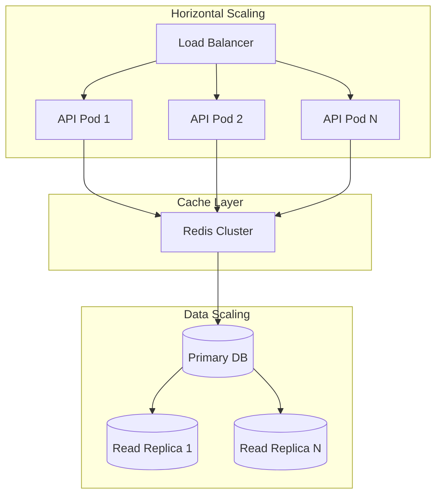

---

## 5. Standards and Protocols

### 5.1 Core Standards Compliance

| Standard | Version | Component | Status |
|----------|---------|-----------|---------|
| W3C VC Data Model | 2.0 | Core | Required |
| W3C DID Core | 1.0 | Identity | Required |
| OpenID4VCI | Draft 13 | Issuance | Required |
| OpenID4VP | Draft 20 | Presentation | Required |
| ISO/IEC 18013-5 | 2021 | mDL | Required |
| OAuth 2.1 | Draft | Auth | Required |
| FIDO2/WebAuthn | Level 2 | Biometrics | Recommended |

### 5.2 Cryptographic Standards

- **Signatures:** ECDSA (P-256), EdDSA (Ed25519), BBS+ (selective disclosure)
- **Encryption:** AES-256-GCM, ChaCha20-Poly1305
- **Hashing:** SHA-256, SHA-384, BLAKE3
- **Key Exchange:** ECDH, X25519
- **Post-Quantum:** Prepare for CRYSTALS-Dilithium, CRYSTALS-Kyber

---

## 6. Interfaces and SDKs

### 6.1 SDK Architecture

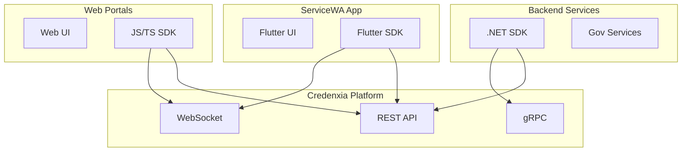

### 6.2 API Endpoints Summary

| Endpoint | Method | Purpose | SDK Support |
|----------|--------|---------|-------------|
| `/credentials/issue` | POST | Issue new credential | All |
| `/credentials/verify` | POST | Verify presentation | All |
| `/credentials/status` | GET | Check credential status | All |
| `/credentials/revoke` | POST | Revoke credential | .NET only |
| `/wallet/backup` | POST | Backup wallet | Flutter |
| `/wallet/restore` | POST | Restore wallet | Flutter |
| `/trust/registry` | GET | Get trust anchors | All |

---

## 7. Data Model and Storage

### 7.1 Core Entity Model

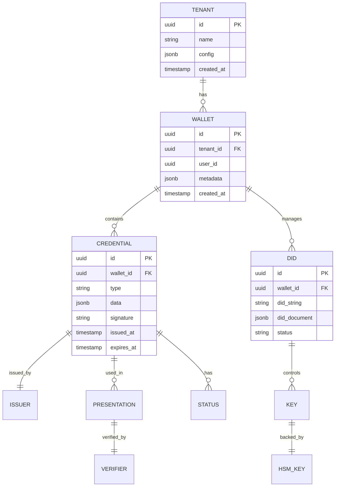

### 7.2 Storage Architecture

- **Primary Storage:** PostgreSQL 15+ with JSONB
- **Hot Cache:** Redis Cluster
- **Cold Storage:** Azure Blob Storage for archives
- **Search Index:** PostgreSQL FTS or dedicated search service
- **Audit Trail:** Append-only table with triggers

---

## 8. Security and Privacy

### 8.1 Security Architecture

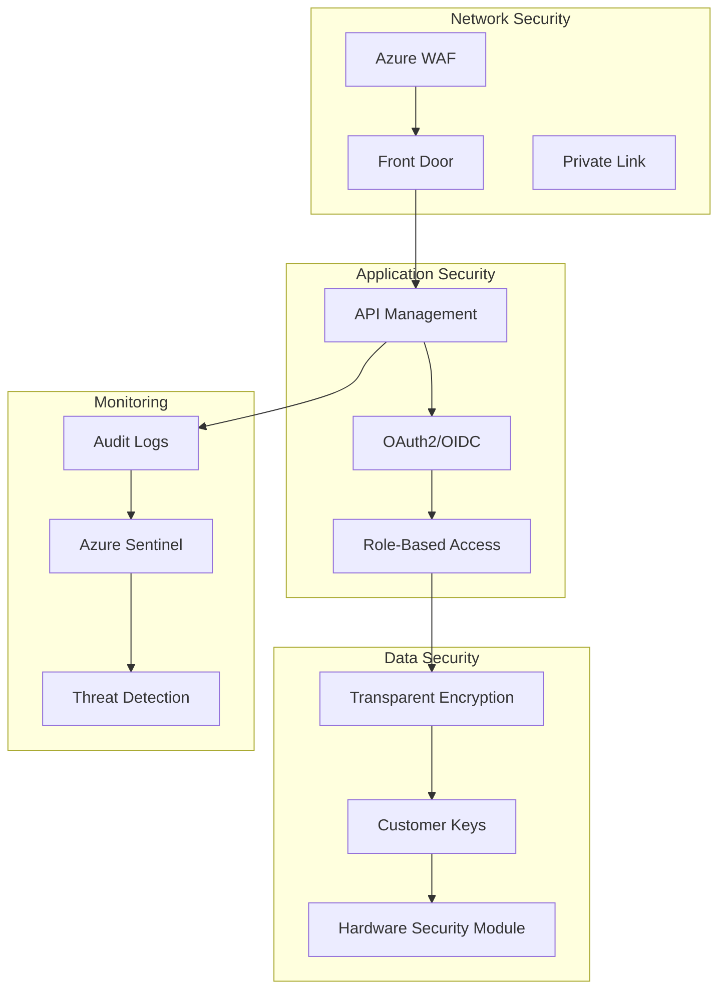

### 8.2 Privacy Controls

- **Data Minimization:** Only collect necessary attributes
- **Purpose Limitation:** Explicit consent for each use
- **Selective Disclosure:** Zero-knowledge proofs with BBS+
- **Right to Erasure:** Automated data deletion workflows
- **Audit Trail:** Immutable log of all data access

---

## 9. Compliance and Assurance

### 9.1 Regulatory Compliance Matrix

| Regulation | Requirement | Implementation | Status |
|------------|-------------|----------------|---------|
| Privacy Act 1988 | APP compliance | Privacy by design | Required |
| WA State Records Act | Record keeping | Audit trail system | Required |
| ISO 27001 | ISMS | Azure compliance | In Progress |
| SOC 2 Type II | Security controls | Annual audit | Planned |
| WCAG 2.2 AA | Accessibility | UI/UX testing | Required |

### 9.2 Assurance Activities

- **Penetration Testing:** Quarterly by certified testers
- **Vulnerability Scanning:** Weekly automated scans
- **Code Review:** All PRs require 2 approvals
- **Compliance Audits:** Annual third-party assessment
- **Privacy Impact Assessment:** Before each major release

---

## 10. Operations and SRE

### 10.1 Monitoring Stack

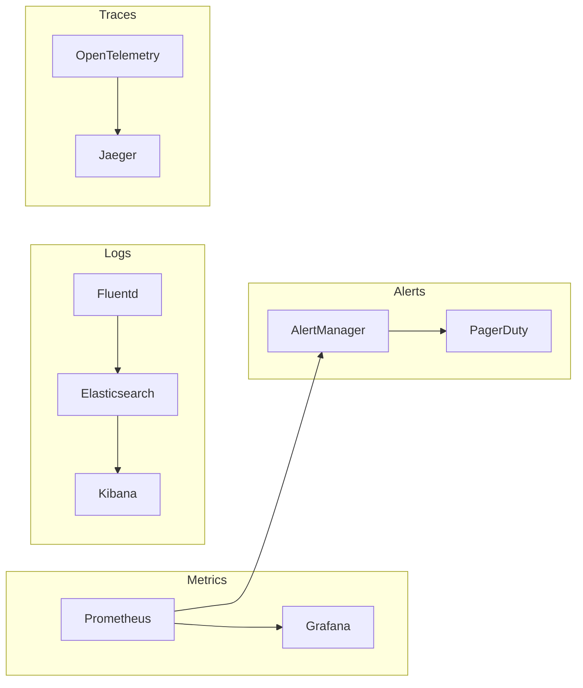

### 10.2 SRE Practices

- **Error Budgets:** 99.9% SLA = 43 minutes/month error budget
- **Toil Reduction:** Automate repetitive tasks
- **Chaos Engineering:** Monthly failure injection tests
- **Blameless Postmortems:** Learn from incidents
- **On-Call Rotation:** 24x7 coverage with 2-person teams

---

## 11. Support Model

### 11.1 Tiered Support Structure

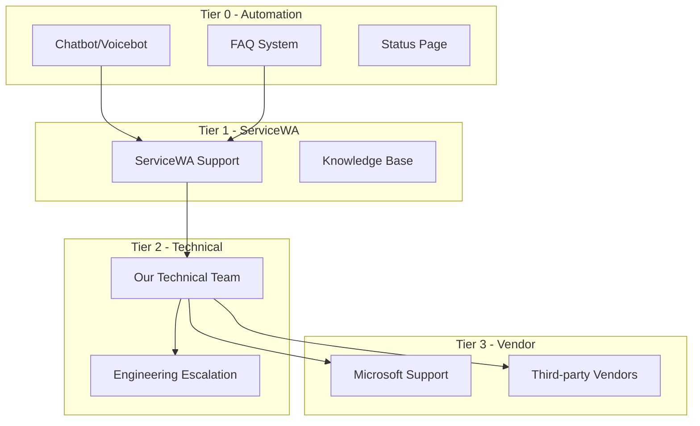

### 11.2 Support Metrics

| Metric | Target | Measurement |
|--------|--------|-------------|
| First Response Time | <1 hour | P1 issues |
| Resolution Time | <4 hours | P1 issues |
| Customer Satisfaction | >90% | CSAT score |
| Ticket Deflection | >60% | Via automation |
| Knowledge Base Coverage | >80% | Common issues |

---

## 12. POA and Pilot Plans

### 12.1 Proof of Authority (POA) - 3 Weeks

#### Week 1: Foundation
- Azure environment setup
- Base services deployment
- SDK scaffold creation
- Trust registry initialization

#### Week 2: Integration
- ServiceWA SDK integration
- End-to-end credential flow
- Basic UI components
- Security controls

#### Week 3: Validation
- Testing scenarios
- Performance benchmarks
- Security validation
- Demo preparation

### 12.2 Pilot Program - 12 Months

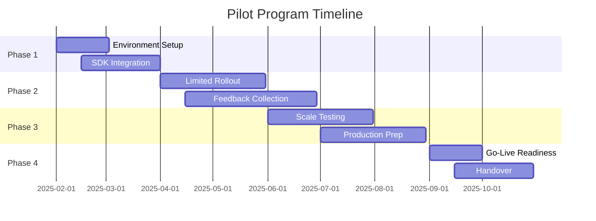

---

## 13. Delivery Phasing

### 13.1 Phase Overview

| Phase | Duration | Scope | Team Size |
|-------|----------|-------|-----------|
| POA | 3 weeks | Core functionality demo | 5 FTE |
| Pilot Setup | 2 months | Production environment | 8 FTE |
| Pilot Run | 10 months | 10,000 users | 6 FTE |
| Production | Ongoing | 2M+ users | 10 FTE |

### 13.2 Exit Criteria

**POA Exit Criteria:**
- ✓ End-to-end credential lifecycle demonstrated
- ✓ SDK integrated with ServiceWA mockup
- ✓ Security controls validated
- ✓ Performance benchmarks met

**Pilot Exit Criteria:**
- ✓ 10,000+ active wallets
- ✓ 99.9% availability achieved
- ✓ <500ms P95 response time
- ✓ Zero critical security incidents

---

## 14. Team and Effort Estimates

### 14.1 Team Composition

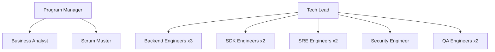

### 14.2 Effort Estimates by Phase

| Role | POA (FTE) | Pilot Setup (FTE) | Pilot Run (FTE) | Production (FTE) |
|------|-----------|-------------------|-----------------|------------------|
| Program Manager | 1.0 | 1.0 | 0.5 | 0.5 |
| Tech Lead | 1.0 | 1.0 | 1.0 | 1.0 |
| Backend Engineer | 2.0 | 3.0 | 2.0 | 3.0 |
| SDK Engineer | 1.0 | 2.0 | 1.0 | 1.0 |
| SRE Engineer | 0.5 | 2.0 | 1.5 | 2.0 |
| Security Engineer | 0.5 | 1.0 | 0.5 | 1.0 |
| QA Engineer | 1.0 | 2.0 | 1.0 | 1.5 |
| **Total** | **7.0** | **12.0** | **7.5** | **10.0** |

---

## 15. Pilot Pricing Options

### 15.1 Option 1: Consumption-Based Pricing

| Component | Unit Price (AUD) | Included | Overage |
|-----------|-----------------|----------|---------|
| Base Platform Fee | $15,000/month | - | - |
| Active Wallets | $0.50/wallet/month | 10,000 | $0.75 |
| Credential Issuance | $0.10/credential | 50,000 | $0.15 |
| Verifications | $0.01/verification | 500,000 | $0.02 |
| Storage | $5/GB/month | 100 GB | $8/GB |
| API Calls | $1/million | 10M | $1.50/M |
| Support | $5,000/month | Business hours | 24x7 +$10k |

**Monthly Estimate:** $25,000 - $35,000

### 15.2 Option 2: Fixed-Fee Pricing

| Component | Cost (AUD) |
|-----------|------------|
| POA Development & Demo | $150,000 |
| Pilot Environment Setup | $200,000 |
| 12-Month Pilot Operation | $480,000 |
| Training & Documentation | $50,000 |
| L2 Support (Business Hours) | $120,000 |
| Change Request Budget | $100,000 |
| **Total Fixed Price** | **$1,100,000** |

**Payment Schedule:**
- 20% on contract signing
- 20% on POA completion
- 5% monthly during pilot (12 payments)

---

## 16. Assumptions and Risks

### 16.1 Key Assumptions

- ✓ All data and processing remains within Australian regions
- ✓ ServiceWA will integrate our SDK within their existing app
- ✓ DGov will provide test credentials and verification scenarios
- ✓ Existing Azure EA can be leveraged for infrastructure
- ✓ Network connectivity between ServiceWA and our platform via Private Link

### 16.2 Risk Register

| Risk | Impact | Probability | Mitigation |
|------|--------|-------------|------------|
| ServiceWA integration delays | High | Medium | Early SDK delivery, dedicated support |
| Scalability beyond 10K users | High | Low | Load testing, auto-scaling design |
| Privacy regulation changes | Medium | Medium | Flexible consent framework |
| Third-party service outages | Medium | Low | Multi-region, vendor diversity |
| Security breach | High | Low | Defense in depth, regular audits |

---

## 17. Appendices

### Linked Documents

1. [Solution Architecture](./Appendix_SolutionArchitecture.md) - Detailed technical architecture
2. [Security, Privacy & Compliance](./Appendix_Security_Privacy_Compliance.md) - Comprehensive security framework
3. [Data Model](./Appendix_DataModel.md) - Complete database schemas
4. [APIs and SDKs](./Appendix_APIs_SDKs.md) - Interface specifications
5. [Workflows](./Appendix_Workflows.md) - Detailed process flows
6. [Testing, QA, POA & Pilot](./Appendix_Testing_QA_POA_Pilot.md) - Test plans and validation
7. [Operations, SRE & DR](./Appendix_Operations_SRE_DR.md) - Operational procedures
8. [Project Plan, Team & Effort](./Appendix_ProjectPlan_Team_Effort.md) - Detailed resourcing
9. [Pricing and Assumptions](./Appendix_Pricing_and_Assumptions.md) - Commercial details
10. [Regulatory Mapping](./Appendix_Regulatory_Mapping.md) - Tender requirement traceability

---

## Approval and Sign-off

| Role | Name | Signature | Date |
|------|------|-----------|------|
| Program Director | | | |
| Technical Lead | | | |
| Security Officer | | | |
| Commercial Manager | | | |
| DGov Representative | | | |

---

**END OF MASTER PRD**

*This document is confidential and proprietary. Distribution is limited to authorized personnel only.*