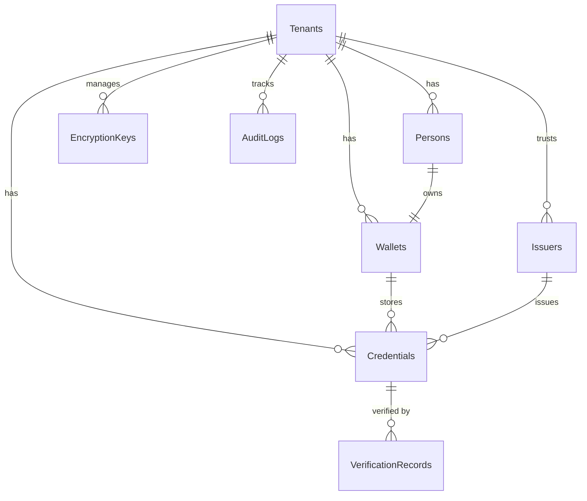

# NumbatWallet Database Schema Design

## Overview
Multi-tenant PostgreSQL database with comprehensive security, audit, and encryption features.

## Schema Version
- **Version**: 1.0.0
- **Date**: 2025-09-18
- **Database**: PostgreSQL 16+
- **Compatibility**: EF Core 9.0

## Multi-Tenancy Strategy
- **Option A (POA)**: Database-per-tenant isolation
- **Option B (Future)**: Row-level security with shared database

## Core Entities

### 1. Tenants
```sql
CREATE TABLE tenants (
    id UUID PRIMARY KEY DEFAULT gen_random_uuid(),
    name VARCHAR(255) NOT NULL,
    identifier VARCHAR(100) UNIQUE NOT NULL,
    configuration JSONB NOT NULL DEFAULT '{}',
    settings JSONB NOT NULL DEFAULT '{}',
    created_at TIMESTAMPTZ NOT NULL DEFAULT CURRENT_TIMESTAMP,
    updated_at TIMESTAMPTZ NOT NULL DEFAULT CURRENT_TIMESTAMP,
    created_by VARCHAR(255),
    updated_by VARCHAR(255),
    is_active BOOLEAN NOT NULL DEFAULT true,
    is_deleted BOOLEAN NOT NULL DEFAULT false,
    deleted_at TIMESTAMPTZ,

    CONSTRAINT tenants_name_unique UNIQUE (name) WHERE is_deleted = false
);

CREATE INDEX idx_tenants_identifier ON tenants(identifier);
CREATE INDEX idx_tenants_active ON tenants(is_active) WHERE is_active = true;
CREATE INDEX idx_tenants_deleted ON tenants(is_deleted) WHERE is_deleted = false;
```

### 2. Persons
```sql
CREATE TABLE persons (
    id UUID PRIMARY KEY DEFAULT gen_random_uuid(),
    tenant_id VARCHAR(100) NOT NULL,
    first_name VARCHAR(100) NOT NULL,
    middle_name VARCHAR(100),
    last_name VARCHAR(100) NOT NULL,
    date_of_birth DATE NOT NULL,
    email_value VARCHAR(255),  -- Encrypted
    email_search_token VARCHAR(64),  -- HMAC for searching
    phone_number_value VARCHAR(20),  -- Encrypted
    phone_number_country_code VARCHAR(5),
    phone_search_token VARCHAR(64),  -- HMAC for searching
    address_data JSONB,  -- Complex object
    is_verified BOOLEAN NOT NULL DEFAULT false,
    status VARCHAR(50) NOT NULL DEFAULT 'Active',
    created_at TIMESTAMPTZ NOT NULL DEFAULT CURRENT_TIMESTAMP,
    updated_at TIMESTAMPTZ NOT NULL DEFAULT CURRENT_TIMESTAMP,
    created_by VARCHAR(255),
    updated_by VARCHAR(255),
    is_deleted BOOLEAN NOT NULL DEFAULT false,
    deleted_at TIMESTAMPTZ,

    CONSTRAINT persons_tenant_email UNIQUE(tenant_id, email_search_token) WHERE is_deleted = false
);

CREATE INDEX idx_persons_tenant ON persons(tenant_id);
CREATE INDEX idx_persons_email_token ON persons(email_search_token);
CREATE INDEX idx_persons_phone_token ON persons(phone_search_token);
CREATE INDEX idx_persons_deleted ON persons(is_deleted) WHERE is_deleted = false;
```

### 3. Wallets
```sql
CREATE TABLE wallets (
    id UUID PRIMARY KEY DEFAULT gen_random_uuid(),
    tenant_id VARCHAR(100) NOT NULL,
    person_id UUID NOT NULL REFERENCES persons(id),
    wallet_identifier VARCHAR(255) NOT NULL,
    did_value VARCHAR(500),
    did_method VARCHAR(50),
    did_method_specific_id VARCHAR(255),
    public_key TEXT NOT NULL,  -- Encrypted
    encrypted_private_key TEXT NOT NULL,  -- Double encrypted
    key_type VARCHAR(50) NOT NULL DEFAULT 'secp256k1',
    recovery_phrase_hash VARCHAR(255),
    metadata JSONB NOT NULL DEFAULT '{}',
    pin_hash VARCHAR(255),
    biometric_data BYTEA,  -- Encrypted biometric template
    created_at TIMESTAMPTZ NOT NULL DEFAULT CURRENT_TIMESTAMP,
    updated_at TIMESTAMPTZ NOT NULL DEFAULT CURRENT_TIMESTAMP,
    created_by VARCHAR(255),
    updated_by VARCHAR(255),
    last_accessed_at TIMESTAMPTZ,
    is_active BOOLEAN NOT NULL DEFAULT true,
    is_locked BOOLEAN NOT NULL DEFAULT false,
    is_deleted BOOLEAN NOT NULL DEFAULT false,
    deleted_at TIMESTAMPTZ,

    CONSTRAINT wallets_unique_per_tenant UNIQUE(tenant_id, person_id) WHERE is_deleted = false
);

CREATE INDEX idx_wallets_tenant ON wallets(tenant_id);
CREATE INDEX idx_wallets_person ON wallets(person_id);
CREATE INDEX idx_wallets_did ON wallets(did_value);
CREATE INDEX idx_wallets_active ON wallets(is_active) WHERE is_active = true;
CREATE INDEX idx_wallets_deleted ON wallets(is_deleted) WHERE is_deleted = false;
```

### 4. Credentials
```sql
CREATE TABLE credentials (
    id UUID PRIMARY KEY DEFAULT gen_random_uuid(),
    tenant_id VARCHAR(100) NOT NULL,
    wallet_id UUID NOT NULL REFERENCES wallets(id),
    person_id UUID NOT NULL REFERENCES persons(id),
    issuer_id UUID NOT NULL REFERENCES issuers(id),
    credential_type VARCHAR(100) NOT NULL,
    schema_id VARCHAR(500) NOT NULL,
    credential_subject JSONB NOT NULL,  -- Encrypted content
    claims JSONB NOT NULL DEFAULT '{}',
    proof JSONB NOT NULL,
    status VARCHAR(50) NOT NULL DEFAULT 'Active',
    issued_at TIMESTAMPTZ NOT NULL,
    expires_at TIMESTAMPTZ,
    revoked_at TIMESTAMPTZ,
    revocation_reason VARCHAR(255),
    metadata JSONB NOT NULL DEFAULT '{}',
    created_at TIMESTAMPTZ NOT NULL DEFAULT CURRENT_TIMESTAMP,
    updated_at TIMESTAMPTZ NOT NULL DEFAULT CURRENT_TIMESTAMP,
    created_by VARCHAR(255),
    updated_by VARCHAR(255),
    is_deleted BOOLEAN NOT NULL DEFAULT false,
    deleted_at TIMESTAMPTZ,

    CONSTRAINT credentials_unique_type_per_wallet UNIQUE(wallet_id, credential_type, issuer_id) WHERE is_deleted = false
);

CREATE INDEX idx_credentials_tenant ON credentials(tenant_id);
CREATE INDEX idx_credentials_wallet ON credentials(wallet_id);
CREATE INDEX idx_credentials_person ON credentials(person_id);
CREATE INDEX idx_credentials_issuer ON credentials(issuer_id);
CREATE INDEX idx_credentials_type ON credentials(credential_type);
CREATE INDEX idx_credentials_status ON credentials(status);
CREATE INDEX idx_credentials_expires ON credentials(expires_at);
CREATE INDEX idx_credentials_deleted ON credentials(is_deleted) WHERE is_deleted = false;
```

### 5. Issuers
```sql
CREATE TABLE issuers (
    id UUID PRIMARY KEY DEFAULT gen_random_uuid(),
    tenant_id VARCHAR(100) NOT NULL,
    name VARCHAR(255) NOT NULL,
    code VARCHAR(100) NOT NULL,
    domain VARCHAR(255) NOT NULL,
    did_value VARCHAR(500),
    public_key TEXT NOT NULL,
    trusted_from TIMESTAMPTZ NOT NULL DEFAULT CURRENT_TIMESTAMP,
    trusted_until TIMESTAMPTZ,
    certificate JSONB,
    metadata JSONB NOT NULL DEFAULT '{}',
    status VARCHAR(50) NOT NULL DEFAULT 'Active',
    created_at TIMESTAMPTZ NOT NULL DEFAULT CURRENT_TIMESTAMP,
    updated_at TIMESTAMPTZ NOT NULL DEFAULT CURRENT_TIMESTAMP,
    created_by VARCHAR(255),
    updated_by VARCHAR(255),
    is_deleted BOOLEAN NOT NULL DEFAULT false,
    deleted_at TIMESTAMPTZ,

    CONSTRAINT issuers_unique_code UNIQUE(tenant_id, code) WHERE is_deleted = false
);

CREATE INDEX idx_issuers_tenant ON issuers(tenant_id);
CREATE INDEX idx_issuers_code ON issuers(code);
CREATE INDEX idx_issuers_domain ON issuers(domain);
CREATE INDEX idx_issuers_status ON issuers(status);
CREATE INDEX idx_issuers_deleted ON issuers(is_deleted) WHERE is_deleted = false;
```

### 6. Verification Records
```sql
CREATE TABLE verification_records (
    id UUID PRIMARY KEY DEFAULT gen_random_uuid(),
    tenant_id VARCHAR(100) NOT NULL,
    credential_id UUID NOT NULL REFERENCES credentials(id),
    verifier_did VARCHAR(500),
    verifier_name VARCHAR(255),
    verification_purpose VARCHAR(100),
    verification_result BOOLEAN NOT NULL,
    verification_details JSONB NOT NULL DEFAULT '{}',
    verified_at TIMESTAMPTZ NOT NULL DEFAULT CURRENT_TIMESTAMP,
    ip_address INET,
    user_agent TEXT,
    created_at TIMESTAMPTZ NOT NULL DEFAULT CURRENT_TIMESTAMP,

    CONSTRAINT fk_verification_credential FOREIGN KEY (credential_id)
        REFERENCES credentials(id) ON DELETE CASCADE
);

CREATE INDEX idx_verification_tenant ON verification_records(tenant_id);
CREATE INDEX idx_verification_credential ON verification_records(credential_id);
CREATE INDEX idx_verification_verifier ON verification_records(verifier_did);
CREATE INDEX idx_verification_date ON verification_records(verified_at);
```

### 7. Audit Logs
```sql
CREATE TABLE audit_logs (
    id UUID PRIMARY KEY DEFAULT gen_random_uuid(),
    tenant_id VARCHAR(100) NOT NULL,
    entity_type VARCHAR(100) NOT NULL,
    entity_id UUID NOT NULL,
    action VARCHAR(50) NOT NULL,
    user_id VARCHAR(255),
    timestamp TIMESTAMPTZ NOT NULL DEFAULT CURRENT_TIMESTAMP,
    old_values JSONB,
    new_values JSONB,
    ip_address INET,
    user_agent TEXT,
    correlation_id UUID,

    CONSTRAINT chk_action CHECK (action IN ('Create', 'Update', 'Delete', 'Read', 'Verify'))
);

CREATE INDEX idx_audit_tenant ON audit_logs(tenant_id);
CREATE INDEX idx_audit_entity ON audit_logs(entity_type, entity_id);
CREATE INDEX idx_audit_user ON audit_logs(user_id);
CREATE INDEX idx_audit_timestamp ON audit_logs(timestamp DESC);
CREATE INDEX idx_audit_correlation ON audit_logs(correlation_id);
```

### 8. Encryption Keys (DEK/KEK Management)
```sql
CREATE TABLE encryption_keys (
    id UUID PRIMARY KEY DEFAULT gen_random_uuid(),
    tenant_id VARCHAR(100) NOT NULL,
    key_type VARCHAR(50) NOT NULL, -- 'DEK' or 'KEK'
    key_id VARCHAR(255) NOT NULL,
    encrypted_key BYTEA NOT NULL,
    key_version INT NOT NULL DEFAULT 1,
    algorithm VARCHAR(50) NOT NULL DEFAULT 'AES-256-GCM',
    created_at TIMESTAMPTZ NOT NULL DEFAULT CURRENT_TIMESTAMP,
    rotated_at TIMESTAMPTZ,
    expires_at TIMESTAMPTZ,
    is_active BOOLEAN NOT NULL DEFAULT true,

    CONSTRAINT encryption_keys_unique UNIQUE(tenant_id, key_type, key_id, key_version)
);

CREATE INDEX idx_encryption_tenant ON encryption_keys(tenant_id);
CREATE INDEX idx_encryption_type ON encryption_keys(key_type);
CREATE INDEX idx_encryption_active ON encryption_keys(is_active) WHERE is_active = true;
```

## Relationships



## Security Features

### 1. Encryption at Rest
- All PII fields encrypted using AES-256-GCM
- Envelope encryption with DEK/KEK architecture
- Keys stored in Azure Key Vault

### 2. Search Capability
- HMAC tokens for searchable encrypted fields
- Salted hashing for exact match searches
- No plaintext PII stored

### 3. Audit Trail
- Comprehensive audit logging
- Immutable audit records
- Correlation IDs for request tracking

### 4. Multi-Tenancy
- Complete data isolation per tenant
- Tenant ID in all tables
- Row-level security policies

### 5. Soft Delete
- All entities support soft delete
- Deleted records retained for audit
- Unique constraints exclude deleted records

## Indexes Strategy

### Performance Indexes
- Primary keys (UUID with gen_random_uuid())
- Foreign key relationships
- Tenant isolation queries
- Search token lookups

### Composite Indexes
- (tenant_id, entity_specific_field)
- (is_deleted, is_active) for active record queries
- (created_at DESC) for recent records

## Migration Notes

### Initial Migration
1. Create extension: `CREATE EXTENSION IF NOT EXISTS "uuid-ossp";`
2. Create tables in dependency order
3. Add foreign key constraints
4. Create indexes
5. Add RLS policies (if using shared database)

### Data Types
- **UUID**: All primary keys
- **TIMESTAMPTZ**: All timestamps (UTC storage)
- **JSONB**: Flexible structured data
- **BYTEA**: Binary encrypted data
- **INET**: IP address storage

## Maintenance

### Regular Tasks
1. **VACUUM**: Weekly for deleted records
2. **ANALYZE**: After bulk operations
3. **REINDEX**: Monthly for frequently updated tables
4. **Partition**: Consider for audit_logs after 1M records

### Backup Strategy
- **Continuous archiving**: WAL archiving to Azure Blob
- **Daily snapshots**: Full backup with point-in-time recovery
- **Cross-region replication**: For disaster recovery

## Performance Considerations

### Query Optimization
- Use partial indexes for soft-delete queries
- Avoid SELECT * on encrypted fields
- Use covering indexes for frequent queries
- Implement connection pooling

### Scaling
- **Read replicas**: For reporting queries
- **Table partitioning**: For time-series data (audit logs)
- **Caching**: Redis for frequently accessed data
- **Async processing**: For verification records

## Compliance

### GDPR/Privacy
- Right to erasure: Soft delete with crypto-shredding
- Data portability: JSONB export capability
- Audit trail: Complete data access history
- Encryption: End-to-end for PII

### Standards
- **ISO/IEC 18013-5**: Mobile driving license
- **W3C VC**: Verifiable Credentials data model
- **TDIF**: Trusted Digital Identity Framework
- **AU ISM**: Australian Information Security Manual