# Appendix A: Solution Architecture
## Digital Wallet and Verifiable Credentials Solution

**Document Version:** 2.0 FINAL  
**Parent Document:** [Master PRD](./PRD_Master.md)  
**Last Updated:** December 2024

---

## Table of Contents
1. [High-Level Architecture](#1-high-level-architecture)
2. [Component Architecture](#2-component-architecture)
3. [Azure Infrastructure Design](#3-azure-infrastructure-design)
4. [Data Architecture](#4-data-architecture)
5. [Security Architecture](#5-security-architecture)
6. [Integration Architecture](#6-integration-architecture)
7. [Deployment Architecture](#7-deployment-architecture)
8. [Scalability and Performance](#8-scalability-and-performance)

---

## 1. High-Level Architecture

### 1.1 System Context Diagram

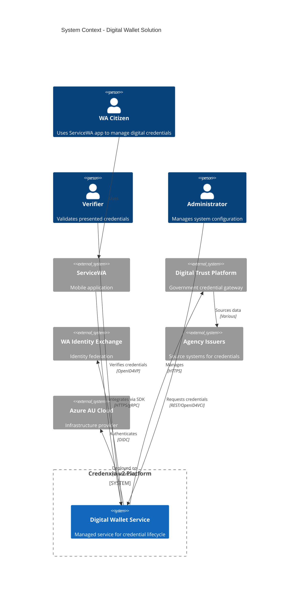

### 1.2 Container Architecture

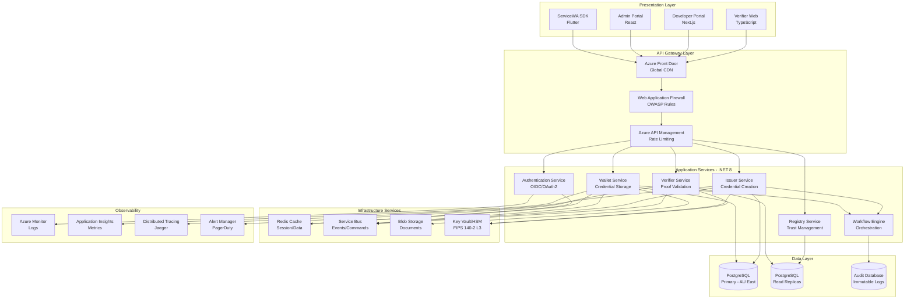

---

## 2. Component Architecture

### 2.1 Microservices Design

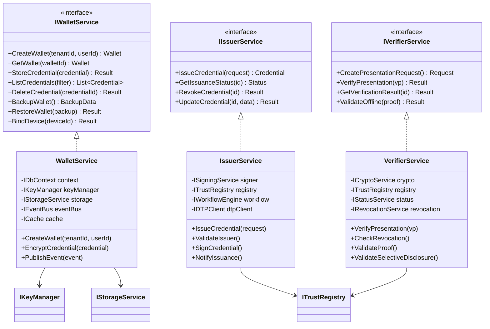

### 2.2 Event-Driven Architecture

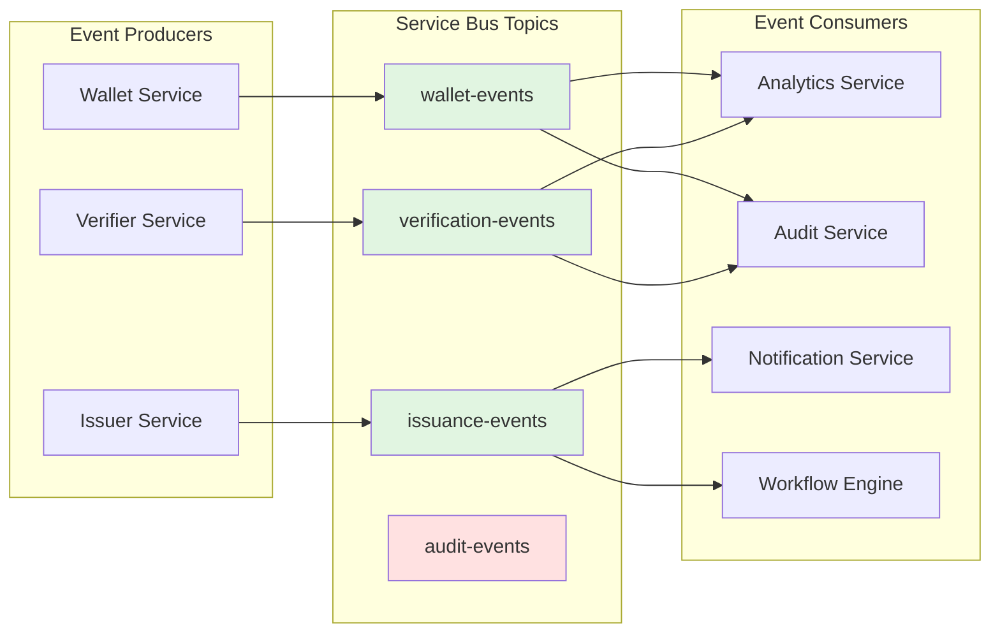

---

## 3. Azure Infrastructure Design

→ **See [Azure Platform Justification](./Azure_Justification_and_Pricing.md) for detailed analysis including Perth Extended Zone announcement (mid-2025)**

### 3.1 Network Architecture

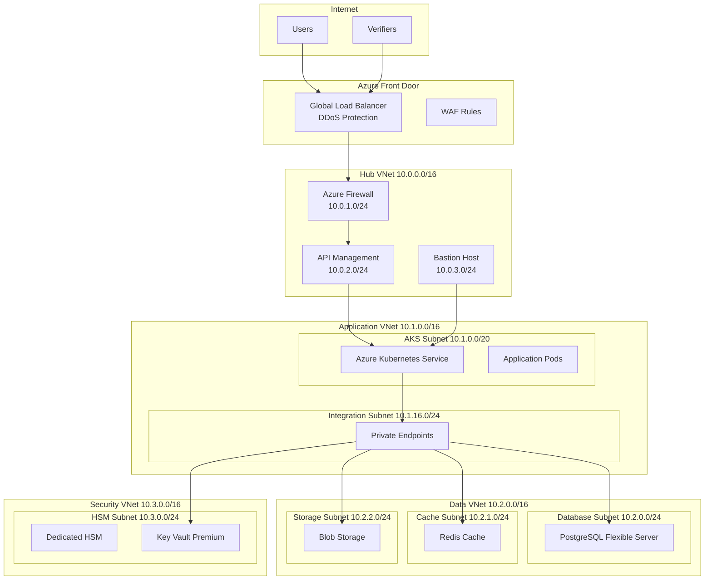

### 3.2 High Availability Design

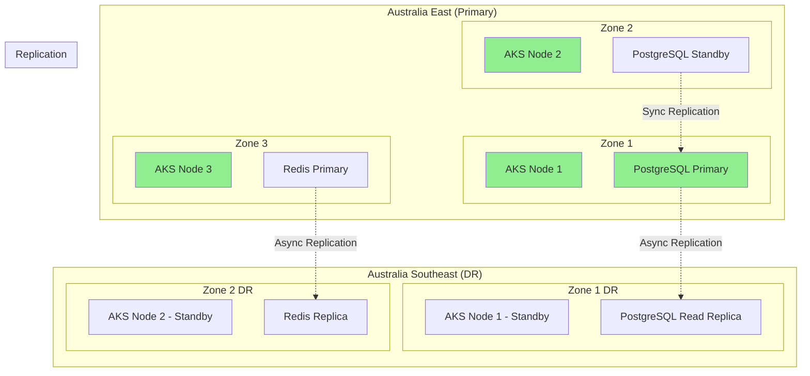

---

## 4. Data Architecture

### 4.1 Multi-Tenant Database Design

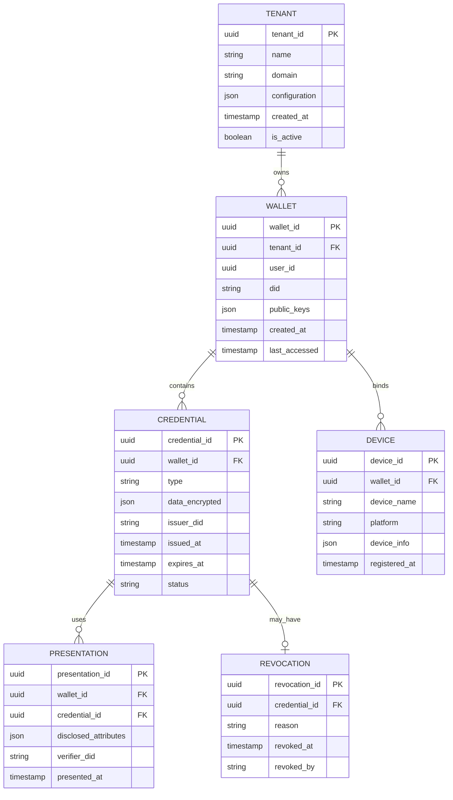

### 4.2 Data Isolation Strategy

| Aspect | Implementation | Benefit |
| --- | --- | --- |
| **Database** | Per-tenant PostgreSQL database | Complete data isolation |
| **Encryption** | Per-tenant Data Encryption Keys (DEK) | Cryptographic isolation |
| **Backup** | Independent backup schedules | Tenant-specific recovery |
| **Connection** | Dedicated connection pools | Performance isolation |
| **Audit** | Separate audit trails | Compliance isolation |

---

## 5. Security Architecture

### 5.1 Defense in Depth

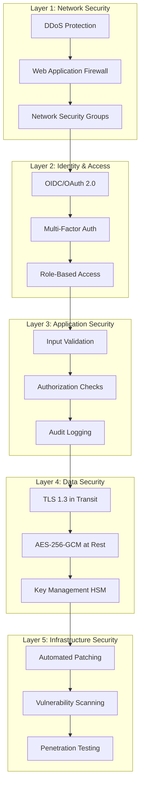

### 5.2 Cryptographic Architecture

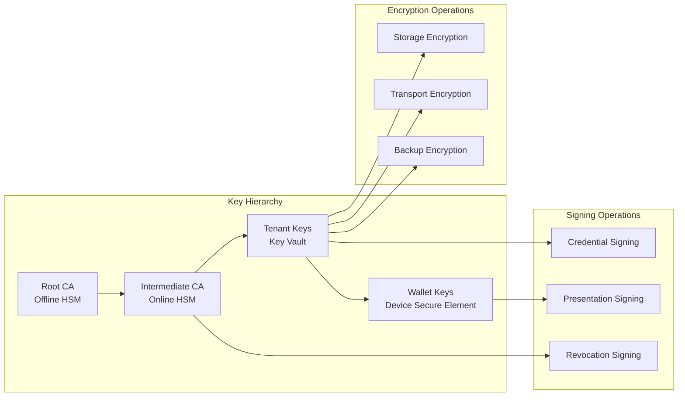

---

## 6. Integration Architecture

### 6.1 External System Integration

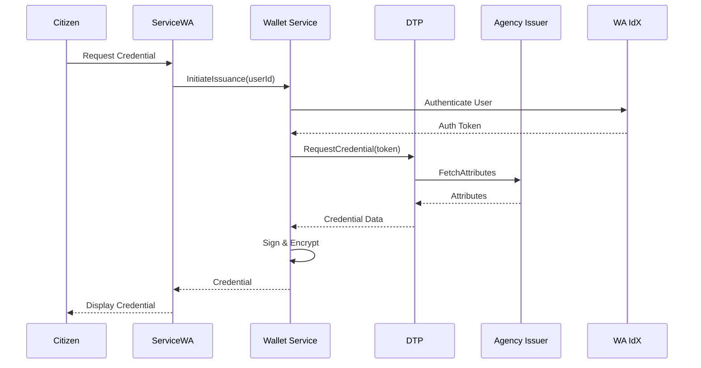

### 6.2 API Gateway Pattern

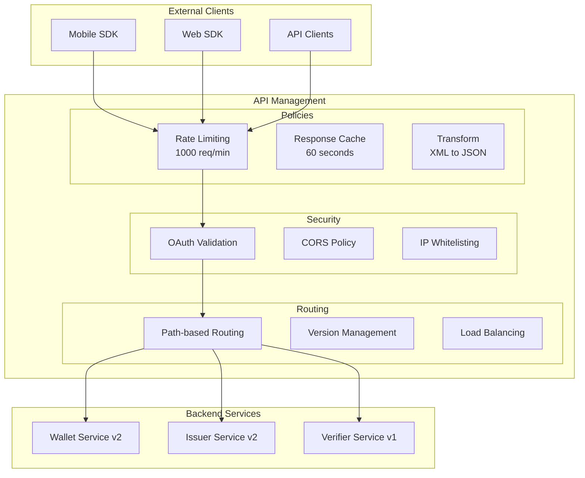

---

## 7. Deployment Architecture

### 7.1 Container Orchestration

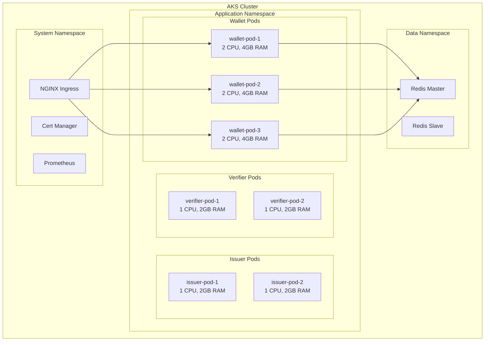

### 7.2 CI/CD Pipeline

```mermaid
graph LR
    subgraph "Source Control"
        GIT[GitHub]
        PR[Pull Request]
    end
    
    subgraph "Build Stage"
        BUILD[.NET Build]
        TEST[Unit Tests]
        SCAN[Security Scan]
        DOCKER[Docker Build]
    end
    
    subgraph "Deploy Dev"
        DEV_ENV[Dev AKS]
        SMOKE[Smoke Tests]
    end
    
    subgraph "Deploy Test"
        TEST_ENV[Test AKS]
        E2E[E2E Tests]
        PERF[Perf Tests]
    end
    
    subgraph "Deploy Prod"
        APPROVE[Manual Approval]
        PROD_ENV[Prod AKS]
        HEALTH[Health Checks]
    end
    
    GIT --> PR
    PR --> BUILD
    BUILD --> TEST
    TEST --> SCAN
    SCAN --> DOCKER
    DOCKER --> DEV_ENV
    DEV_ENV --> SMOKE
    SMOKE --> TEST_ENV
    TEST_ENV --> E2E
    E2E --> PERF
    PERF --> APPROVE
    APPROVE --> PROD_ENV
    PROD_ENV --> HEALTH
```

---

## 8. Scalability and Performance

### 8.1 Scaling Strategy

| Component | Scaling Type | Trigger | Target |
| --- | --- | --- | --- |
| **API Gateway** | Horizontal | CPU > 70% | 3-10 instances |
| **Wallet Service** | Horizontal | Memory > 80% | 3-20 pods |
| **Issuer Service** | Horizontal | Queue depth > 100 | 2-10 pods |
| **Verifier Service** | Horizontal | Requests > 1000/min | 2-15 pods |
| **PostgreSQL** | Vertical + Read Replicas | CPU > 80% | Up to 32 vCPUs |
| **Redis Cache** | Cluster Mode | Memory > 75% | 3-6 shards |

### 8.2 Performance Optimization

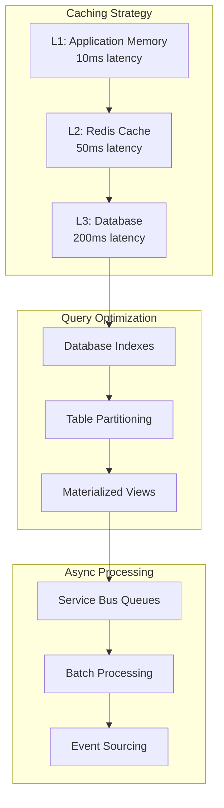

### 8.3 Load Distribution

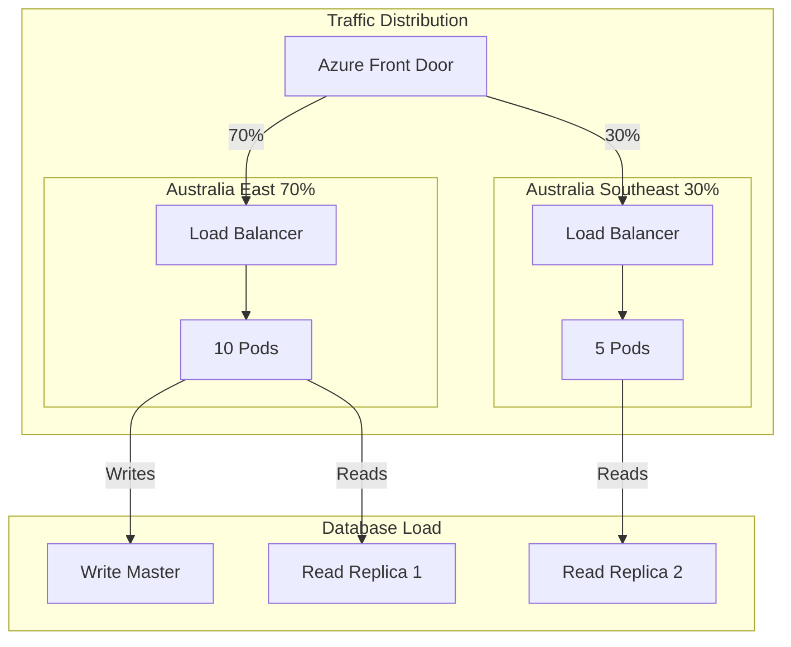

---

## Infrastructure Cost Implications

### Azure Services Monthly Estimate (Production)

| Service | Configuration | Monthly Cost |
| --- | --- | --- |
| **AKS** | 3 nodes D4s v5 (primary) + 2 nodes (DR) | $1,200 |
| **PostgreSQL** | 8 vCore, 256GB storage, HA | $1,800 |
| **Redis Cache** | Premium P2, 6GB | $450 |
| **API Management** | Standard tier, 2 units | $580 |
| **Key Vault/HSM** | Premium + 1 HSM pool | $3,500 |
| **Storage** | 1TB blob, 100GB tables | $150 |
| **Networking** | VNets, Private Links, Firewall | $800 |
| **Monitoring** | App Insights, Log Analytics | $300 |
| **Backup** | Automated backups, retention | $200 |
| **Total** | | **$8,980/month** |

*Note: These costs align with the infrastructure estimates in the pricing model and do not affect the overall pilot pricing of $1,866,250.*

---

## 8. Architecture Design Decisions

### 8.1 Application Gateway/DMZ Layer Consideration

#### Current Architecture Decision
The solution uses **Azure Front Door with integrated WAF** as the primary edge security layer, without an additional Application Gateway in a DMZ pattern. This decision was made after careful analysis of security, performance, and cost factors.

#### Rationale for Excluding Application Gateway

| Factor | Analysis | Decision Impact |
| --- | --- | --- |
| **Security** | Azure Front Door provides enterprise-grade WAF with OWASP Core Rule Set, DDoS protection, and bot protection | No security compromise |
| **Performance** | Eliminates additional network hop, reducing latency by 10-20ms | Better user experience |
| **Cost** | Saves $740-2,000/month per environment | More budget for core features |
| **Complexity** | Single WAF policy management, simpler troubleshooting | Reduced operational overhead |
| **Compliance** | Front Door + API Management meet all WA Government security requirements | Fully compliant |

#### Architecture Comparison

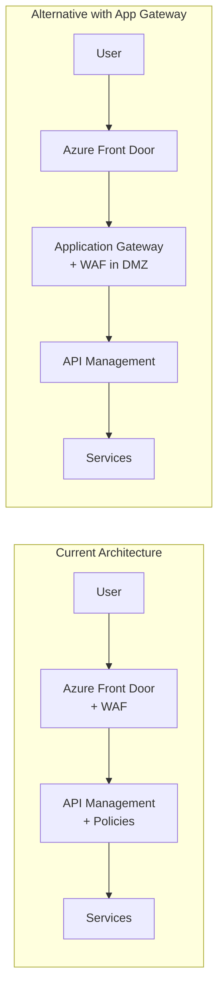

#### When Application Gateway SHOULD be Added

Application Gateway can be added to the architecture if the client requires:

1. **Strict DMZ Requirements**: Regulatory mandate for explicit DMZ layer separation
2. **Legacy Integration**: On-premises systems requiring specific L7 routing
3. **Protocol Support**: WebSocket or non-HTTP protocols not supported by Front Door
4. **Enhanced Inspection**: Deep packet inspection beyond WAF capabilities
5. **Regional Isolation**: Strict network segmentation between regions

#### Implementation Path if Required

If Application Gateway is requested:
- **Additional Cost**: $740-2,000/month per environment
- **Implementation Time**: 2-3 weeks including testing
- **Architecture Change**: Add between Front Door and API Management
- **Configuration**: 
  - Deploy in dedicated subnet (DMZ)
  - Configure mTLS to backend
  - Synchronize WAF rules with Front Door
  - Update monitoring and alerts

#### Recommendation
The current architecture without Application Gateway is **recommended for this solution** as it:
- Meets all security and compliance requirements
- Provides better performance
- Reduces operational complexity
- Optimizes costs

However, the architecture is **flexible** and Application Gateway can be added post-deployment if specific requirements emerge.

---

## Summary

This solution architecture delivers:
1. **Enterprise-grade security** with defense-in-depth
2. **High availability** across Australian regions
3. **Scalability** to support 2M+ citizens
4. **Performance** with sub-200ms response times
5. **Compliance** with Australian data sovereignty requirements
6. **Cost-effectiveness** through Azure-native services

The architecture supports the complete digital wallet lifecycle while maintaining the pricing structure outlined in the Master PRD.

---
[Back to Master PRD](./PRD_Master.md) | [Next: Security & Compliance](./Appendix_B_Security_Privacy_Compliance.md)