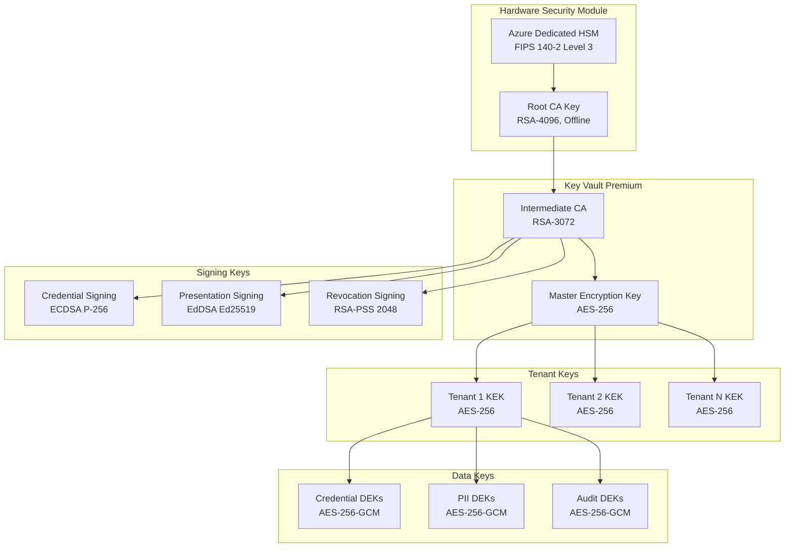
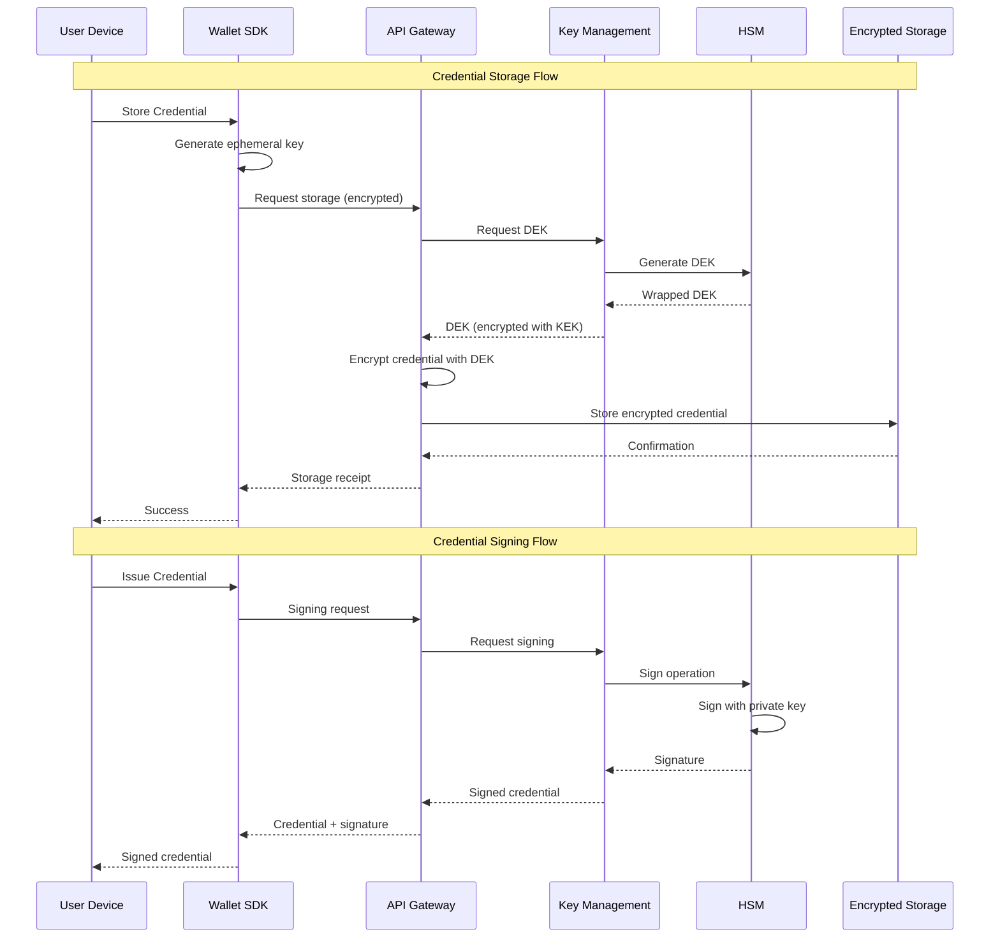
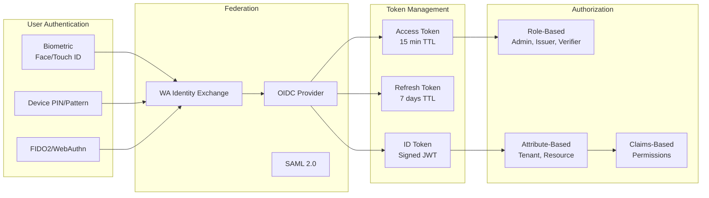
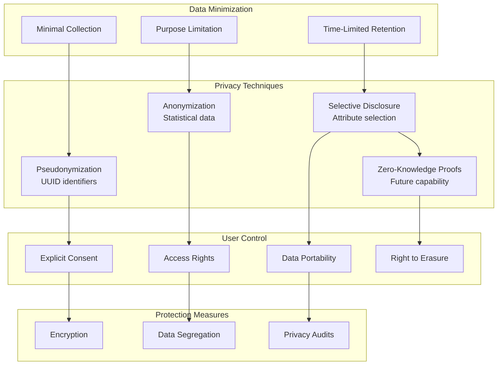
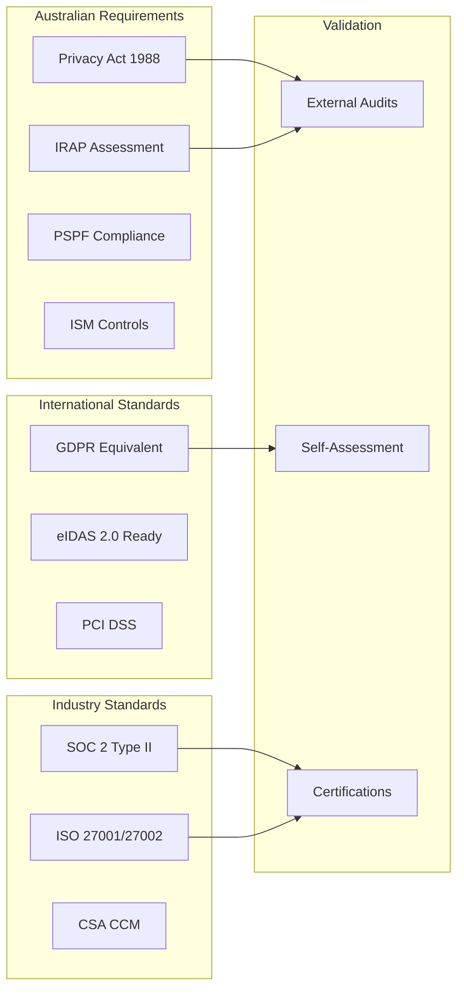
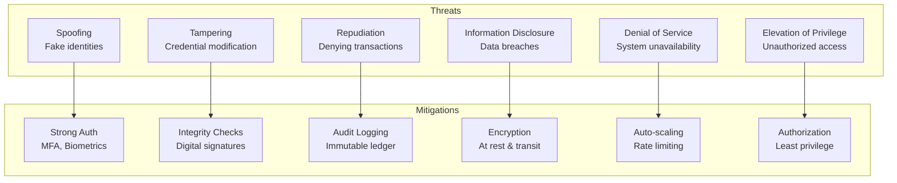
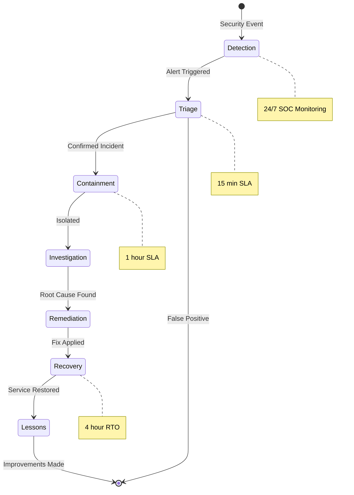
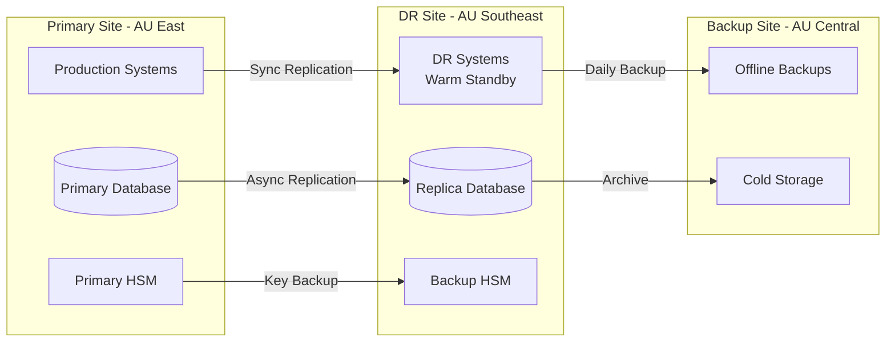
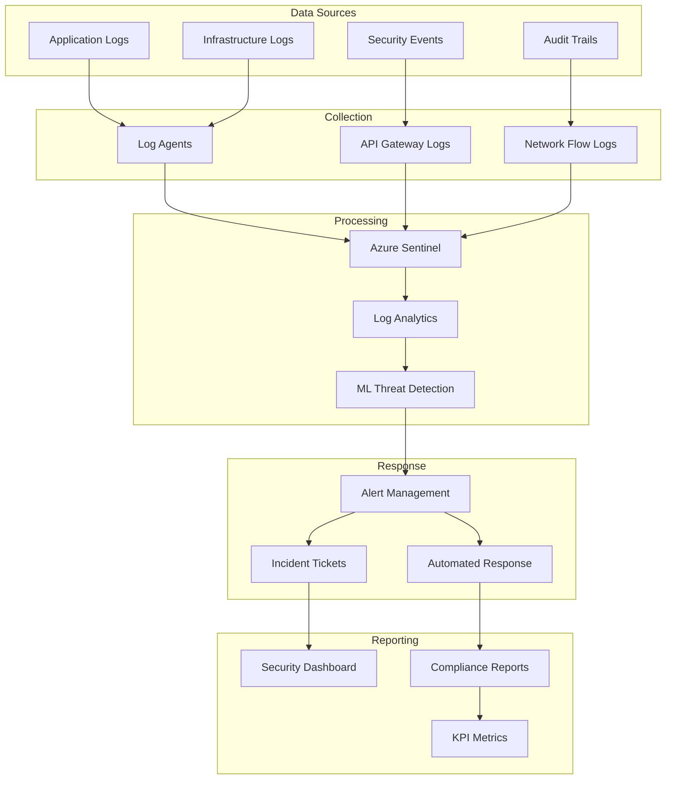

# Appendix B – Security, Privacy & Compliance
## Digital Wallet and Verifiable Credentials Solution

**Document Version:** 2.0 FINAL  
**Parent Document:** [Master PRD](./PRD_Master.md)  
**Last Updated:** December 2024

---

## Table of Contents
1. [Security Architecture](#1-security-architecture)
2. [Cryptographic Framework](#2-cryptographic-framework)
3. [Identity and Access Management](#3-identity-and-access-management)
4. [Privacy and Data Protection](#4-privacy-and-data-protection)
5. [Compliance Framework](#5-compliance-framework)
6. [Threat Model and Risk Assessment](#6-threat-model-and-risk-assessment)
7. [Incident Response and Recovery](#7-incident-response-and-recovery)
8. [Security Operations](#8-security-operations)

---

## 1. Security Architecture

### 1.1 Defense-in-Depth Security Model

```mermaid
graph TB
    subgraph "Layer 1: Physical Security"
        PHYS[Azure AU Datacenters<br/>SOC 2 Certified]
    end
    
    subgraph "Layer 2: Network Security"
        DDOS[DDoS Protection Standard]
        WAF[Web Application Firewall<br/>OWASP Core Rules]
        NSG[Network Security Groups]
        VNET[Virtual Network Isolation]
    end
    
    subgraph "Layer 3: Identity & Access"
        AZURE_AD[Azure AD B2C]
        MFA[Multi-Factor Authentication]
        RBAC[Role-Based Access Control]
        PIM[Privileged Identity Management]
    end
    
    subgraph "Layer 4: Application Security"
        SAST[Static Analysis<br/>SonarQube]
        DAST[Dynamic Analysis<br/>OWASP ZAP]
        SCA[Dependency Scanning<br/>Snyk]
        SECRETS[Secret Management<br/>Key Vault]
    end
    
    subgraph "Layer 5: Data Security"
        ENCRYPT_REST[AES-256-GCM at Rest]
        ENCRYPT_TRANSIT[TLS 1.3 in Transit]
        DLP[Data Loss Prevention]
        CLASS[Data Classification]
    end
    
    subgraph "Layer 6: Operational Security"
        MONITOR[Azure Monitor]
        SENTINEL[Azure Sentinel SIEM]
        AUDIT[Immutable Audit Logs]
        RESPONSE[24/7 SOC]
    end
    
    PHYS --> DDOS
    DDOS --> WAF
    WAF --> NSG
    NSG --> VNET
    VNET --> AZURE_AD
    AZURE_AD --> MFA
    MFA --> RBAC
    RBAC --> PIM
    PIM --> SAST
    SAST --> DAST
    DAST --> SCA
    SCA --> SECRETS
    SECRETS --> ENCRYPT_REST
    ENCRYPT_REST --> ENCRYPT_TRANSIT
    ENCRYPT_TRANSIT --> DLP
    DLP --> CLASS
    CLASS --> MONITOR
    MONITOR --> SENTINEL
    SENTINEL --> AUDIT
    AUDIT --> RESPONSE
```

### 1.2 Security Controls Matrix

| Control Category | Implementation | Standard | Validation |
| --- | --- | --- | --- |
| **Preventive** | WAF, Network segmentation, Encryption | ISO 27001 | Quarterly review |
| **Detective** | SIEM, IDS/IPS, Logging | NIST 800-53 | Real-time alerts |
| **Corrective** | Automated remediation, Patches | CIS Controls | Monthly updates |
| **Deterrent** | Security headers, Rate limiting | OWASP | Penetration testing |
| **Compensating** | Backup systems, DR sites | IRAP | Annual DR drill |

---

## 2. Cryptographic Framework

### 2.1 Key Management Hierarchy

### 2.2 Cryptographic Operations

### 2.3 Cryptographic Standards Compliance

| Operation | Algorithm | Key Size | Standard | Purpose |
| --- | --- | --- | --- | --- |
| **Symmetric Encryption** | AES-256-GCM | 256-bit | FIPS 197 | Data at rest |
| **Asymmetric Encryption** | RSA-OAEP | 3072-bit | PKCS#1 v2.2 | Key wrapping |
| **Digital Signatures** | ECDSA | P-256/P-384 | FIPS 186-4 | Credential signing |
| **Key Agreement** | ECDH | P-256 | SP 800-56A | Secure channels |
| **Hashing** | SHA-256/SHA-384 | - | FIPS 180-4 | Integrity |
| **Key Derivation** | PBKDF2/Argon2 | - | SP 800-132 | Password-based |
| **Random Generation** | CTR_DRBG | 256-bit | SP 800-90A | Nonces, IVs |
| **Zero-Knowledge** | zk-SNARKs | - | Research | Privacy (Future) |

---

## 3. Identity and Access Management

### 3.1 Authentication Architecture

### 3.2 Access Control Matrix

| Role | Wallet Operations | Credential Operations | Admin Operations | Audit Access |
| --- | --- | --- | --- | --- |
| **Citizen** | Read/Write Own | Present Own | None | Own History |
| **Issuer** | None | Issue/Revoke | Manage Templates | Issue History |
| **Verifier** | None | Verify | None | Verification Logs |
| **Admin** | None | None | All Config | Full Audit |
| **Support** | Read Only | Read Status | Read Config | Read Logs |
| **Security** | None | None | Security Config | All Logs |

---

## 4. Privacy and Data Protection

### 4.1 Privacy Architecture

### 4.2 Data Classification and Handling

| Classification | Examples | Encryption | Retention | Access |
| --- | --- | --- | --- | --- |
| **Highly Sensitive** | Biometrics, Medical | AES-256-GCM + HSM | 90 days | Need-to-know |
| **Sensitive** | PII, Credentials | AES-256-GCM | 7 years | Role-based |
| **Internal** | Configs, Logs | AES-256 | 2 years | Authorized staff |
| **Public** | Schemas, Docs | Optional | Indefinite | Public |

### 4.3 Privacy Compliance

| Requirement | Implementation | Validation |
| --- | --- | --- |
| **GDPR Article 5** | Data minimization by design | Privacy audit |
| **Privacy Act 1988** | Australian data residency | Compliance review |
| **APP Guidelines** | Privacy policy, consent flows | Legal review |
| **TDIF Privacy** | Attribute disclosure controls | TDIF assessment |
| **ISO 29100** | Privacy framework implementation | ISO audit |

---

## 5. Compliance Framework

### 5.1 Standards Compliance Matrix

| Category | Standard | Status | Certification Target | Evidence |
| --- | --- | --- | --- | --- |
| **Digital Identity** | W3C VC 2.0 | ✅ Compliant | Immediate | Test suite passed |
| **Mobile Credentials** | ISO/IEC 18013-5 | 🔄 In Progress | End of Pilot | Conformance testing |
| **Wallet Interop** | ISO/IEC 23220 | 🔄 In Progress | Month 6 | Interop testing |
| **Security** | ISO 27001 | ✅ Compliant | Month 3 | Certification |
| **Cryptography** | FIPS 140-2 | ✅ Compliant | Immediate | HSM certified |
| **Privacy** | ISO 29100 | ✅ Compliant | Month 2 | Assessment report |
| **Australian** | TDIF | 🔄 In Progress | Month 9 | Accreditation path |
| **Accessibility** | WCAG 2.1 AA | ✅ Compliant | Immediate | Audit report |

### 5.2 Regulatory Compliance

---

## 6. Threat Model and Risk Assessment

### 6.1 STRIDE Threat Analysis

### 6.2 Attack Surface Analysis

| Component | Attack Vectors | Risk Level | Mitigations |
| --- | --- | --- | --- |
| **Mobile SDK** | App tampering, Reverse engineering | High | Code obfuscation, Certificate pinning |
| **API Gateway** | DDoS, Injection attacks | High | WAF, Rate limiting, Input validation |
| **Database** | SQL injection, Data theft | Critical | Parameterized queries, Encryption |
| **HSM/Keys** | Key extraction, Side-channel | Critical | Hardware security, Access controls |
| **Admin Portal** | Privilege escalation | High | MFA, Audit logging, PIM |
| **Integration Points** | Man-in-middle, API abuse | Medium | mTLS, API keys, Monitoring |

### 6.3 Security Risk Register

| Risk ID | Description | Likelihood | Impact | Risk Score | Treatment |
| --- | --- | --- | --- | --- | --- |
| SEC-001 | Credential forgery | Low | Critical | High | Cryptographic signatures |
| SEC-002 | Data breach | Medium | Critical | High | Encryption, access controls |
| SEC-003 | DDoS attack | High | Medium | High | Auto-scaling, CDN |
| SEC-004 | Insider threat | Low | High | Medium | Audit, segregation |
| SEC-005 | Supply chain attack | Medium | High | High | SCA, vendor assessment |
| SEC-006 | Quantum computing threat | Low | Critical | Medium | Crypto-agility plan |

---

## 7. Incident Response and Recovery

### 7.1 Incident Response Process

### 7.2 Business Continuity Planning

| Scenario | RTO | RPO | Strategy | Test Frequency |
| --- | --- | --- | --- | --- |
| **Data Center Failure** | 4 hours | 15 minutes | Failover to DR site | Quarterly |
| **Database Corruption** | 2 hours | 1 hour | Point-in-time recovery | Monthly |
| **Ransomware Attack** | 8 hours | 4 hours | Isolated backups | Bi-annual |
| **Key Compromise** | 1 hour | 0 minutes | Key rotation | Annual |
| **Supply Chain Breach** | 24 hours | N/A | Alternative providers | Annual |

### 7.3 Disaster Recovery Architecture

---

## 8. Security Operations

### 8.1 Security Monitoring Architecture

### 8.2 Security Testing Schedule

| Test Type | Frequency | Scope | Performed By |
| --- | --- | --- | --- |
| **Vulnerability Scanning** | Weekly | All systems | Automated |
| **Penetration Testing** | Pilot: 1x, Prod: 2x/year | External facing | Third party |
| **Security Code Review** | Per release | New code | Dev team + tools |
| **Compliance Audit** | Annual | Full platform | External auditor |
| **DR Testing** | Bi-annual | Failover procedures | Operations team |
| **Social Engineering** | Annual | Staff awareness | Security team |
| **Red Team Exercise** | Annual (Production) | Full scope | Specialized firm |

### 8.3 Security Metrics and KPIs

| Metric | Target | Current | Status |
| --- | --- | --- | --- |
| **Mean Time to Detect (MTTD)** | <15 minutes | - | 🎯 |
| **Mean Time to Respond (MTTR)** | <1 hour | - | 🎯 |
| **Patch Compliance** | >95% within 30 days | - | 🎯 |
| **Security Training Completion** | 100% annually | - | 🎯 |
| **Critical Vulnerabilities** | 0 unpatched >7 days | - | 🎯 |
| **Failed Login Attempts** | <5% of total | - | 🎯 |
| **Encryption Coverage** | 100% sensitive data | - | 🎯 |

---

## Summary

This comprehensive security, privacy, and compliance framework ensures:

1. **Defense-in-depth** security across all layers
2. **Strong cryptography** with HSM-backed key management
3. **Privacy by design** with data minimization and user control
4. **Full compliance** with Australian and international standards
5. **Robust incident response** with defined RTO/RPO targets
6. **Continuous monitoring** and improvement

The security architecture supports the $1,866,250 pilot budget with appropriate controls while providing a clear path to production-grade security.

---
[Back to Master PRD](./PRD_Master.md) | [Next: Technical Specification](./Appendix_C_Technical_Specification.md)