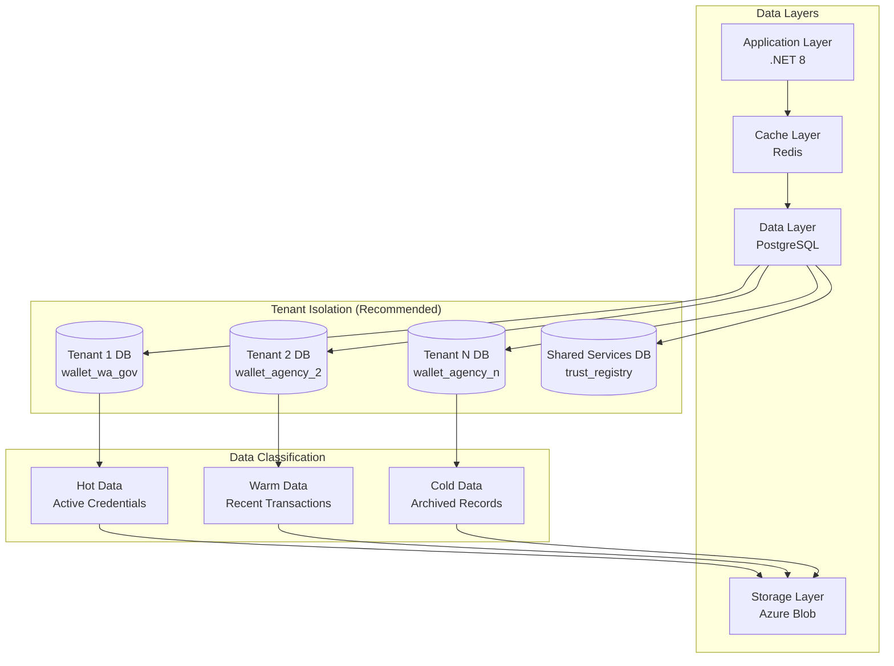
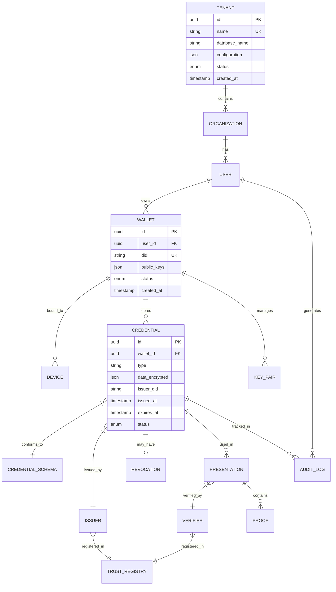
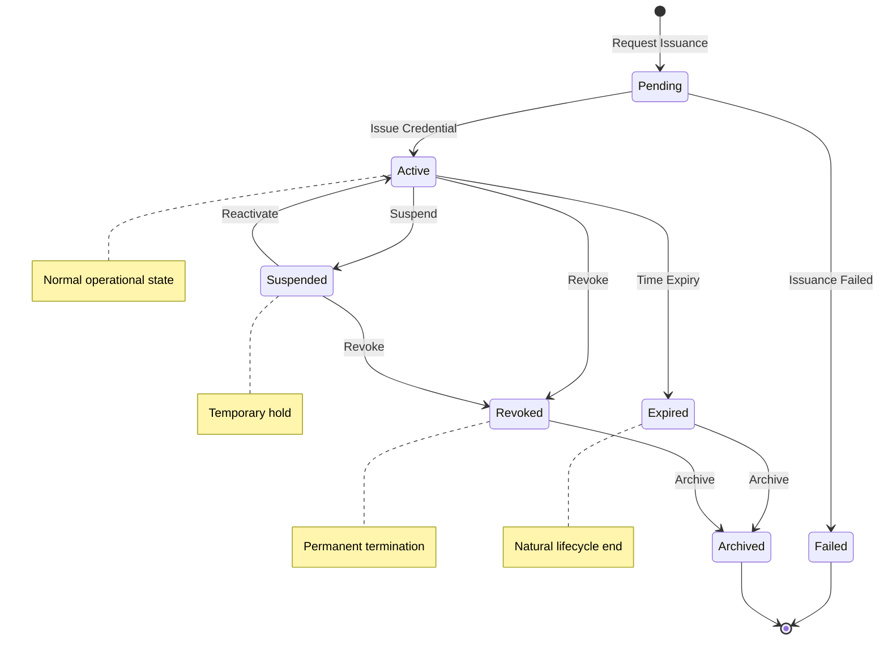
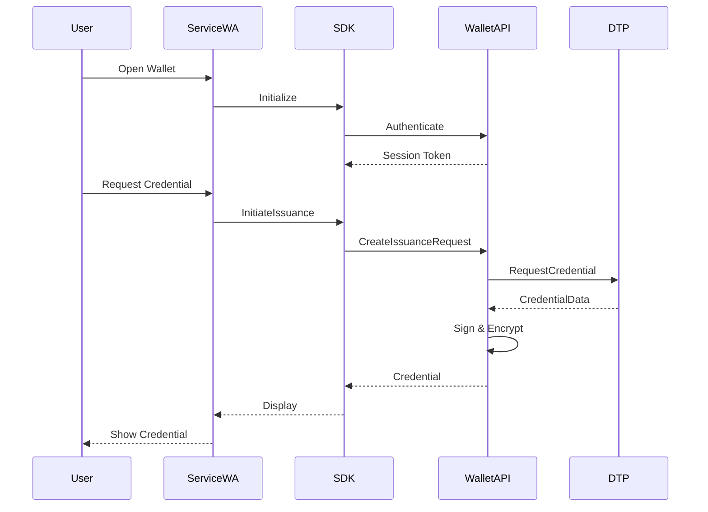
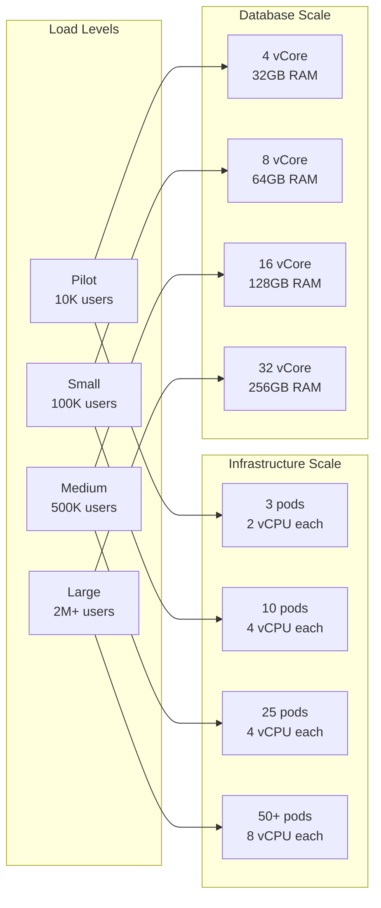

# Appendix C – Technical Specification
## Digital Wallet and Verifiable Credentials Solution

**Document Version:** 2.0 FINAL  
**Parent Document:** [Master PRD](./PRD_Master.md)  
**Last Updated:** December 2024

---

## Table of Contents
1. [Data Architecture](#1-data-architecture)
2. [Core Data Models](#2-core-data-models)
3. [Credential Lifecycle State Machine](#3-credential-lifecycle-state-machine)
4. [Component Specifications](#4-component-specifications)
5. [Integration Specifications](#5-integration-specifications)
6. [Performance Specifications](#6-performance-specifications)
7. [Technical Constraints](#7-technical-constraints)

---

## 1. Data Architecture

### 1.1 Multi-Tenant Data Architecture



### 1.2 Data Storage Strategy

| Data Type | Storage | Encryption | Retention | Backup |
| --- | --- | --- | --- | --- |
| **Credentials** | PostgreSQL | AES-256-GCM | 7 years | Daily |
| **User Profiles** | PostgreSQL | AES-256-GCM | Account lifetime | Daily |
| **Transaction Logs** | PostgreSQL | AES-256-GCM | 7 years | Daily |
| **Audit Logs** | Immutable Store | AES-256-GCM | 7 years | Real-time |
| **Documents** | Blob Storage | AES-256-GCM | 7 years | Daily |
| **Cache Data** | Redis | TLS only | 24 hours | None |
| **Session Data** | Redis | TLS only | 4 hours | None |

---

## 2. Core Data Models

### 2.1 Entity Relationship Model



### 2.2 Tenant Configuration Model

```json
{
  "tenant": {
    "id": "uuid",
    "name": "wa_government",
    "display_name": "WA Government",
    "configuration": {
      "features": {
        "biometric_auth": true,
        "offline_mode": true,
        "selective_disclosure": true,
        "batch_issuance": false,
        "delegation": false
      },
      "limits": {
        "max_wallets": 100000,
        "max_credentials_per_wallet": 20,
        "max_devices_per_wallet": 3,
        "max_api_calls_per_minute": 1000
      },
      "security": {
        "mfa_required": true,
        "session_timeout_minutes": 30,
        "password_policy": "strong",
        "ip_whitelist": ["10.0.0.0/8"]
      },
      "branding": {
        "logo_url": "https://...",
        "primary_color": "#003366",
        "support_url": "https://..."
      }
    }
  }
}
```

### 2.3 Credential Schema Model

```json
{
  "credential_schema": {
    "id": "https://wallet.wa.gov.au/schemas/drivers-license/v1",
    "type": "DriverLicense",
    "version": "1.0",
    "name": "WA Driver's License",
    "description": "Western Australia Driver's License Credential",
    "issuer": "wa_transport",
    "attributes": [
      {
        "name": "license_number",
        "type": "string",
        "required": true,
        "indexed": true
      },
      {
        "name": "full_name",
        "type": "string",
        "required": true,
        "pii": true
      },
      {
        "name": "date_of_birth",
        "type": "date",
        "required": true,
        "pii": true
      },
      {
        "name": "address",
        "type": "object",
        "required": true,
        "pii": true
      },
      {
        "name": "license_class",
        "type": "string",
        "required": true
      },
      {
        "name": "expiry_date",
        "type": "date",
        "required": true
      }
    ],
    "selective_disclosure": {
      "enabled": true,
      "mandatory_fields": ["license_number", "expiry_date"]
    }
  }
}
```

---

## 3. Credential Lifecycle State Machine

### 3.1 Credential States



### 3.2 State Transition Rules

| From State | To State | Trigger | Validation | Notification |
| --- | --- | --- | --- | --- |
| Pending | Active | Issuance approved | Identity verified | User, Issuer |
| Pending | Failed | Validation failed | Error logged | User, Support |
| Active | Suspended | Admin action | Reason required | User |
| Active | Expired | Time trigger | Automatic | User (30 days prior) |
| Active | Revoked | Revocation request | Authority check | User, Verifiers |
| Suspended | Active | Reinstatement | Review complete | User |
| Suspended | Revoked | Final decision | Authority check | User, Verifiers |

---

## 4. Component Specifications

### 4.1 Wallet Service Specification

```typescript
interface IWalletService {
  // Wallet Management
  createWallet(userId: string, tenantId: string): Promise<Wallet>;
  getWallet(walletId: string): Promise<Wallet>;
  updateWallet(walletId: string, updates: Partial<Wallet>): Promise<Wallet>;
  deleteWallet(walletId: string): Promise<void>;
  
  // Credential Operations
  storeCredential(walletId: string, credential: Credential): Promise<void>;
  getCredential(credentialId: string): Promise<Credential>;
  listCredentials(walletId: string, filter?: CredentialFilter): Promise<Credential[]>;
  removeCredential(credentialId: string): Promise<void>;
  
  // Device Management
  bindDevice(walletId: string, device: Device): Promise<void>;
  listDevices(walletId: string): Promise<Device[]>;
  removeDevice(deviceId: string): Promise<void>;
  
  // Backup & Recovery
  backupWallet(walletId: string): Promise<BackupData>;
  restoreWallet(backupData: BackupData): Promise<Wallet>;
  
  // Security
  rotateKeys(walletId: string): Promise<void>;
  validateAccess(walletId: string, token: string): Promise<boolean>;
}
```

### 4.2 Issuer Service Specification

```typescript
interface IIssuerService {
  // Credential Issuance
  issueCredential(request: IssuanceRequest): Promise<Credential>;
  batchIssue(requests: IssuanceRequest[]): Promise<BatchResult>;
  
  // Template Management
  createTemplate(template: CredentialTemplate): Promise<string>;
  getTemplate(templateId: string): Promise<CredentialTemplate>;
  listTemplates(issuerId: string): Promise<CredentialTemplate[]>;
  
  // Revocation
  revokeCredential(credentialId: string, reason: string): Promise<void>;
  suspendCredential(credentialId: string): Promise<void>;
  reactivateCredential(credentialId: string): Promise<void>;
  
  // Status Management
  updateStatus(credentialId: string, status: CredentialStatus): Promise<void>;
  getStatus(credentialId: string): Promise<CredentialStatus>;
  publishStatusList(issuerId: string): Promise<void>;
  
  // Trust Registry
  registerIssuer(issuer: IssuerProfile): Promise<void>;
  updateIssuerProfile(issuerId: string, profile: Partial<IssuerProfile>): Promise<void>;
}
```

### 4.3 Verifier Service Specification

```typescript
interface IVerifierService {
  // Presentation Request
  createPresentationRequest(requirements: PresentationRequirements): Promise<PresentationRequest>;
  
  // Verification
  verifyPresentation(presentation: VerifiablePresentation): Promise<VerificationResult>;
  verifyOffline(proof: OfflineProof): Promise<VerificationResult>;
  
  // Selective Disclosure
  requestAttributes(credentialId: string, attributes: string[]): Promise<DisclosureRequest>;
  verifyDisclosure(disclosure: SelectiveDisclosure): Promise<boolean>;
  
  // Status Checking
  checkRevocation(credentialId: string): Promise<RevocationStatus>;
  validateExpiry(credential: Credential): Promise<boolean>;
  
  // Trust Validation
  validateIssuer(issuerId: string): Promise<boolean>;
  getTrustChain(credential: Credential): Promise<TrustChain>;
}
```

---

## 5. Integration Specifications

### 5.1 ServiceWA Integration



### 5.2 Digital Trust Platform Integration

```yaml
integration:
  dtp:
    endpoint: https://dtp.wa.gov.au/api/v1
    authentication:
      type: oauth2
      client_id: ${DTP_CLIENT_ID}
      scope: credential.issue credential.revoke
    
    operations:
      - name: RequestCredential
        method: POST
        path: /credentials/issue
        timeout: 30s
        retry: 3
        
      - name: RevokeCredential
        method: POST
        path: /credentials/revoke
        timeout: 10s
        
      - name: GetIssuerProfile
        method: GET
        path: /issuers/{id}
        cache: 3600s
```

### 5.3 WA Identity Exchange Integration

```yaml
integration:
  idx:
    endpoint: https://idx.wa.gov.au
    protocol: OIDC
    
    configuration:
      issuer: https://idx.wa.gov.au
      authorization_endpoint: /authorize
      token_endpoint: /token
      userinfo_endpoint: /userinfo
      jwks_uri: /.well-known/jwks.json
      
    claims:
      required:
        - sub
        - email
        - name
      optional:
        - phone_number
        - address
```

---

## 6. Performance Specifications

### 6.1 Performance Requirements

| Operation | Pilot Target | Production Target | Peak Load |
| --- | --- | --- | --- |
| **API Response Time (p95)** | <500ms | <200ms | <500ms |
| **Credential Issuance** | <2s | <1s | <2s |
| **Credential Verification** | <500ms | <100ms | <200ms |
| **Offline Verification** | <50ms | <50ms | <50ms |
| **Database Query (p95)** | <100ms | <50ms | <100ms |
| **Cache Hit Ratio** | >80% | >95% | >90% |
| **Throughput** | 100 TPS | 1,000 TPS | 10,000 TPS |

### 6.2 Scalability Specifications



### 6.3 Capacity Planning

| Resource | Pilot | Small | Medium | Large |
| --- | --- | --- | --- | --- |
| **Active Wallets** | 10,000 | 100,000 | 500,000 | 2,000,000 |
| **Credentials** | 50,000 | 500,000 | 2,500,000 | 10,000,000 |
| **Daily Issuances** | 1,000 | 10,000 | 50,000 | 200,000 |
| **Daily Verifications** | 10,000 | 100,000 | 500,000 | 2,000,000 |
| **Storage (GB)** | 100 | 1,000 | 5,000 | 20,000 |
| **Bandwidth (GB/month)** | 500 | 5,000 | 25,000 | 100,000 |

---

## 7. Technical Constraints

### 7.1 Platform Constraints

| Constraint | Requirement | Rationale |
| --- | --- | --- |
| **Cloud Platform** | Azure AU regions only | Data sovereignty |
| **Runtime** | .NET 8 LTS | Support lifecycle |
| **Database** | PostgreSQL 15+ | Features & performance |
| **Container** | Linux containers | Compatibility |
| **Orchestration** | Kubernetes 1.27+ | Azure AKS support |
| **TLS Version** | 1.3 minimum | Security requirement |

### 7.2 Integration Constraints

| System | Constraint | Impact |
| --- | --- | --- |
| **ServiceWA** | Flutter SDK only | Mobile development |
| **DTP** | REST API only | No GraphQL |
| **WA IdX** | OIDC/SAML only | Authentication |
| **HSM** | FIPS 140-2 Level 3 | Key management |

### 7.3 Operational Constraints

| Area | Constraint | Mitigation |
| --- | --- | --- |
| **Maintenance Window** | Sunday 2-6 AM AWST | Blue-green deployment |
| **Backup Window** | Daily 2-4 AM AWST | Incremental backups |
| **Deployment Frequency** | Weekly maximum | Feature flags |
| **Change Approval** | 48 hours notice | Automated testing |

---

## Summary

This technical specification provides:
1. **Complete data architecture** with multi-tenant isolation
2. **Detailed data models** for all entities
3. **State machines** for credential lifecycle
4. **Component specifications** for all services
5. **Integration specifications** for external systems
6. **Performance targets** aligned with requirements
7. **Technical constraints** clearly defined

The specifications support the $1,866,250 pilot budget while providing a clear technical roadmap to production scale.

---
[Back to Master PRD](./PRD_Master.md) | [Next: API Documentation](./Appendix_D_API_Documentation.md)