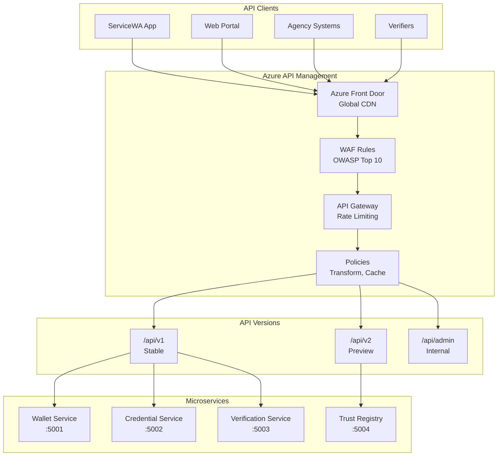
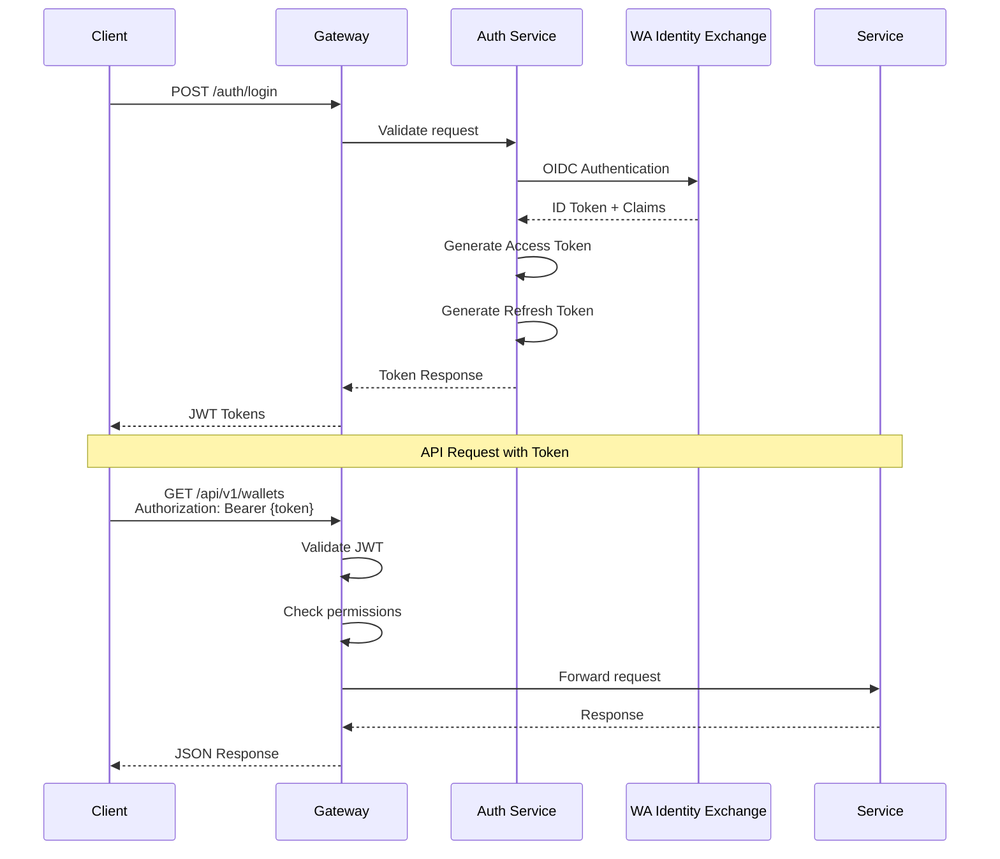
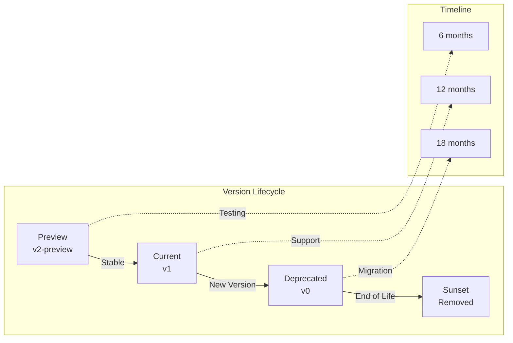

# Appendix D – API Documentation
## Digital Wallet and Verifiable Credentials Solution

**Document Version:** 2.0 FINAL  
**Parent Document:** [Master PRD](./PRD_Master.md)  
**Last Updated:** December 2024

---

## Table of Contents
1. [API Architecture Overview](#1-api-architecture-overview)
2. [Authentication and Authorization](#2-authentication-and-authorization)
3. [Core API Endpoints](#3-core-api-endpoints)
4. [API Specifications](#4-api-specifications)
5. [Error Handling](#5-error-handling)
6. [Rate Limiting and Throttling](#6-rate-limiting-and-throttling)
7. [API Versioning](#7-api-versioning)
8. [Code Examples](#8-code-examples)

---

## 1. API Architecture Overview

### 1.1 API Gateway Architecture



### 1.2 API Standards

| Standard | Implementation | Purpose |
| --- | --- | --- |
| **OpenAPI 3.1** | All REST APIs | Documentation & Client Generation |
| **JSON:API** | Resource responses | Standardized format |
| **RFC 7807** | Error responses | Problem Details |
| **RFC 6750** | Bearer tokens | OAuth 2.0 |
| **RFC 7519** | JWT tokens | Claims-based auth |
| **ISO 8601** | Date/time format | Consistency |

---

## 2. Authentication and Authorization

### 2.1 Authentication Flow



### 2.2 Token Structure

```json
{
  "header": {
    "alg": "RS256",
    "typ": "JWT",
    "kid": "2024-12-01"
  },
  "payload": {
    "iss": "https://wallet.wa.gov.au",
    "sub": "user:123e4567-e89b-12d3-a456-426614174000",
    "aud": "https://api.wallet.wa.gov.au",
    "exp": 1703980800,
    "iat": 1703977200,
    "jti": "550e8400-e29b-41d4-a716-446655440000",
    "scope": "wallet:read wallet:write credential:read",
    "tenant": "wa_government",
    "roles": ["citizen"],
    "device_id": "device:987654321"
  }
}
```

---

## 3. Core API Endpoints

### 3.1 Wallet Management APIs

| Endpoint | Method | Description | Auth Required |
| --- | --- | --- | --- |
| `/api/v1/wallets` | POST | Create new wallet | Yes |
| `/api/v1/wallets/{id}` | GET | Get wallet details | Yes |
| `/api/v1/wallets/{id}` | PUT | Update wallet | Yes |
| `/api/v1/wallets/{id}` | DELETE | Delete wallet | Yes |
| `/api/v1/wallets/{id}/backup` | POST | Backup wallet | Yes |
| `/api/v1/wallets/{id}/restore` | POST | Restore wallet | Yes |
| `/api/v1/wallets/{id}/devices` | GET | List bound devices | Yes |
| `/api/v1/wallets/{id}/devices` | POST | Bind new device | Yes |

### 3.2 Credential APIs

| Endpoint | Method | Description | Auth Required |
| --- | --- | --- | --- |
| `/api/v1/credentials` | GET | List credentials | Yes |
| `/api/v1/credentials` | POST | Issue credential | Issuer |
| `/api/v1/credentials/{id}` | GET | Get credential | Yes |
| `/api/v1/credentials/{id}` | DELETE | Remove credential | Yes |
| `/api/v1/credentials/{id}/revoke` | POST | Revoke credential | Issuer |
| `/api/v1/credentials/{id}/status` | GET | Check status | Public |
| `/api/v1/credentials/schemas` | GET | List schemas | Public |

### 3.3 Verification APIs

| Endpoint | Method | Description | Auth Required |
| --- | --- | --- | --- |
| `/api/v1/presentations/requests` | POST | Create presentation request | Verifier |
| `/api/v1/presentations/submit` | POST | Submit presentation | Yes |
| `/api/v1/presentations/verify` | POST | Verify presentation | Verifier |
| `/api/v1/presentations/{id}/result` | GET | Get verification result | Verifier |
| `/api/v1/presentations/offline` | POST | Verify offline proof | Public |

### 3.4 Trust Registry APIs

| Endpoint | Method | Description | Auth Required |
| --- | --- | --- | --- |
| `/api/v1/trust/issuers` | GET | List trusted issuers | Public |
| `/api/v1/trust/verifiers` | GET | List trusted verifiers | Public |
| `/api/v1/trust/schemas` | GET | List credential schemas | Public |
| `/api/v1/trust/did/{did}` | GET | Resolve DID document | Public |
| `/api/v1/trust/registry` | POST | Register entity | Admin |

---

## 4. API Specifications

### 4.1 Create Wallet Request

```yaml
openapi: 3.1.0
paths:
  /api/v1/wallets:
    post:
      summary: Create new wallet
      operationId: createWallet
      tags:
        - Wallets
      security:
        - bearerAuth: []
      requestBody:
        required: true
        content:
          application/json:
            schema:
              type: object
              required:
                - userId
                - deviceId
              properties:
                userId:
                  type: string
                  format: uuid
                  description: User identifier from IdX
                deviceId:
                  type: string
                  description: Device identifier for binding
                displayName:
                  type: string
                  maxLength: 100
                  description: Wallet display name
                backup:
                  type: object
                  properties:
                    enabled:
                      type: boolean
                      default: true
                    method:
                      type: string
                      enum: [cloud, offline]
                      default: cloud
      responses:
        '201':
          description: Wallet created successfully
          content:
            application/json:
              schema:
                $ref: '#/components/schemas/Wallet'
        '400':
          $ref: '#/components/responses/BadRequest'
        '401':
          $ref: '#/components/responses/Unauthorized'
        '409':
          $ref: '#/components/responses/Conflict'
```

### 4.2 Issue Credential Request

```yaml
paths:
  /api/v1/credentials:
    post:
      summary: Issue new credential
      operationId: issueCredential
      tags:
        - Credentials
      security:
        - bearerAuth: [credential:issue]
      requestBody:
        required: true
        content:
          application/json:
            schema:
              type: object
              required:
                - walletId
                - schemaId
                - claims
              properties:
                walletId:
                  type: string
                  format: uuid
                schemaId:
                  type: string
                  format: uri
                claims:
                  type: object
                  additionalProperties: true
                validFrom:
                  type: string
                  format: date-time
                validUntil:
                  type: string
                  format: date-time
                evidence:
                  type: array
                  items:
                    type: object
      responses:
        '201':
          description: Credential issued
          content:
            application/json:
              schema:
                $ref: '#/components/schemas/Credential'
```

### 4.3 Verify Presentation Request

```yaml
paths:
  /api/v1/presentations/verify:
    post:
      summary: Verify credential presentation
      operationId: verifyPresentation
      tags:
        - Verification
      security:
        - bearerAuth: [presentation:verify]
      requestBody:
        required: true
        content:
          application/json:
            schema:
              type: object
              required:
                - presentation
                - challenge
              properties:
                presentation:
                  type: object
                  description: Verifiable Presentation
                challenge:
                  type: string
                  description: Challenge nonce
                options:
                  type: object
                  properties:
                    checkRevocation:
                      type: boolean
                      default: true
                    allowExpired:
                      type: boolean
                      default: false
      responses:
        '200':
          description: Verification result
          content:
            application/json:
              schema:
                $ref: '#/components/schemas/VerificationResult'
```

---

## 5. Error Handling

### 5.1 Error Response Format (RFC 7807)

```json
{
  "type": "https://wallet.wa.gov.au/errors/validation-failed",
  "title": "Validation Failed",
  "status": 400,
  "detail": "The wallet name exceeds maximum length of 100 characters",
  "instance": "/api/v1/wallets",
  "timestamp": "2024-12-01T10:30:00Z",
  "correlationId": "550e8400-e29b-41d4-a716-446655440000",
  "errors": [
    {
      "field": "displayName",
      "message": "Must be 100 characters or less",
      "code": "STRING_TOO_LONG"
    }
  ]
}
```

### 5.2 Common Error Codes

| HTTP Status | Error Code | Description | Retry |
| --- | --- | --- | --- |
| 400 | `INVALID_REQUEST` | Malformed request | No |
| 401 | `UNAUTHORIZED` | Invalid or expired token | No |
| 403 | `FORBIDDEN` | Insufficient permissions | No |
| 404 | `NOT_FOUND` | Resource not found | No |
| 409 | `CONFLICT` | Resource already exists | No |
| 422 | `VALIDATION_FAILED` | Business rule violation | No |
| 429 | `RATE_LIMITED` | Too many requests | Yes |
| 500 | `INTERNAL_ERROR` | Server error | Yes |
| 503 | `SERVICE_UNAVAILABLE` | Service down | Yes |

---

## 6. Rate Limiting and Throttling

### 6.1 Rate Limit Headers

```http
HTTP/1.1 200 OK
X-RateLimit-Limit: 1000
X-RateLimit-Remaining: 999
X-RateLimit-Reset: 1703980800
X-RateLimit-Policy: tenant-standard
Retry-After: 60
```

### 6.2 Rate Limit Tiers

| Tier | Requests/Minute | Burst | Daily Limit | Target |
| --- | --- | --- | --- | --- |
| **Public** | 10 | 20 | 1,000 | Anonymous |
| **Basic** | 100 | 200 | 10,000 | Citizens |
| **Standard** | 1,000 | 2,000 | 100,000 | Agencies |
| **Premium** | 10,000 | 20,000 | 1,000,000 | High-volume |

### 6.3 Throttling Response

```json
{
  "type": "https://wallet.wa.gov.au/errors/rate-limited",
  "title": "Rate Limit Exceeded",
  "status": 429,
  "detail": "API rate limit of 1000 requests per minute exceeded",
  "retryAfter": 60,
  "limit": 1000,
  "remaining": 0,
  "reset": "2024-12-01T10:31:00Z"
}
```

---

## 7. API Versioning

### 7.1 Versioning Strategy



### 7.2 Version Headers

```http
GET /api/v1/wallets HTTP/1.1
Accept: application/json
Api-Version: 1.0

HTTP/1.1 200 OK
Api-Version: 1.0
Api-Deprecated: false
Api-Sunset-Date: 2025-12-01
```

---

## 8. Code Examples

### 8.1 C# (.NET SDK)

```csharp
using WalletSDK;
using WalletSDK.Models;

// Initialize client
var client = new WalletClient(new WalletConfig
{
    BaseUrl = "https://api.wallet.wa.gov.au",
    ApiKey = "your-api-key",
    TenantId = "wa_government"
});

// Create wallet
var wallet = await client.Wallets.CreateAsync(new CreateWalletRequest
{
    UserId = userId,
    DeviceId = deviceId,
    DisplayName = "My Wallet"
});

// Issue credential
var credential = await client.Credentials.IssueAsync(new IssueCredentialRequest
{
    WalletId = wallet.Id,
    SchemaId = "https://wallet.wa.gov.au/schemas/drivers-license/v1",
    Claims = new Dictionary<string, object>
    {
        ["licenseNumber"] = "WA123456",
        ["fullName"] = "John Doe",
        ["dateOfBirth"] = "1990-01-01"
    }
});

// Verify presentation
var result = await client.Presentations.VerifyAsync(presentation, challenge);
if (result.IsValid)
{
    Console.WriteLine($"Verified: {result.Subject}");
}
```

### 8.2 TypeScript (Web SDK)

```typescript
import { WalletClient, CredentialSchema } from '@wa-wallet/sdk';

// Initialize client
const client = new WalletClient({
  baseUrl: 'https://api.wallet.wa.gov.au',
  apiKey: process.env.API_KEY,
  tenantId: 'wa_government'
});

// Create wallet
const wallet = await client.wallets.create({
  userId: userId,
  deviceId: deviceId,
  displayName: 'My Wallet'
});

// List credentials
const credentials = await client.credentials.list(wallet.id, {
  status: 'active',
  limit: 10
});

// Request presentation
const request = await client.presentations.createRequest({
  credentialTypes: ['DriverLicense'],
  requiredClaims: ['licenseNumber', 'fullName'],
  challenge: crypto.randomUUID()
});

// Verify offline
const isValid = await client.presentations.verifyOffline(
  presentation,
  publicKey
);
```

### 8.3 Flutter (Mobile SDK)

```dart
import 'package:wa_wallet_sdk/wa_wallet_sdk.dart';

// Initialize SDK
final walletSDK = WalletSDK(
  config: WalletConfig(
    baseUrl: 'https://api.wallet.wa.gov.au',
    apiKey: 'your-api-key',
    tenantId: 'wa_government',
  ),
);

// Create wallet
final wallet = await walletSDK.createWallet(
  userId: userId,
  deviceId: await getDeviceId(),
  displayName: 'My Wallet',
);

// Store credential
await walletSDK.storeCredential(
  walletId: wallet.id,
  credential: credential,
  encrypted: true,
);

// Present credential
final presentation = await walletSDK.presentCredential(
  credentialId: credentialId,
  verifierDid: verifierDid,
  selectedClaims: ['licenseNumber', 'fullName'],
);

// Handle offline verification
final qrCode = await walletSDK.generateOfflineProof(
  credential: credential,
  claims: requestedClaims,
);
```

### 8.4 cURL Examples

```bash
# Get access token
curl -X POST https://api.wallet.wa.gov.au/auth/token \
  -H "Content-Type: application/json" \
  -d '{
    "client_id": "servicewa-app",
    "client_secret": "secret",
    "grant_type": "client_credentials",
    "scope": "wallet:read credential:read"
  }'

# Create wallet
curl -X POST https://api.wallet.wa.gov.au/api/v1/wallets \
  -H "Authorization: Bearer {token}" \
  -H "Content-Type: application/json" \
  -d '{
    "userId": "123e4567-e89b-12d3-a456-426614174000",
    "deviceId": "device-001",
    "displayName": "John's Wallet"
  }'

# List credentials
curl -X GET https://api.wallet.wa.gov.au/api/v1/credentials \
  -H "Authorization: Bearer {token}" \
  -H "Accept: application/json"

# Check credential status (public)
curl -X GET https://api.wallet.wa.gov.au/api/v1/credentials/{id}/status \
  -H "Accept: application/json"
```

---

## Summary

This API documentation provides:
1. **Complete REST API specification** using OpenAPI 3.1
2. **Comprehensive authentication** with OAuth 2.0/OIDC
3. **Detailed endpoint documentation** for all operations
4. **Standardized error handling** with RFC 7807
5. **Rate limiting** appropriate for pilot and production
6. **Clear versioning strategy** for API evolution
7. **Code examples** in multiple languages

The API design supports the pilot requirements while providing a clear path to production scale within the $1,866,250 budget.

---
[Back to Master PRD](./PRD_Master.md) | [Next: SDK Documentation](./Appendix_E_SDK_Documentation.md)