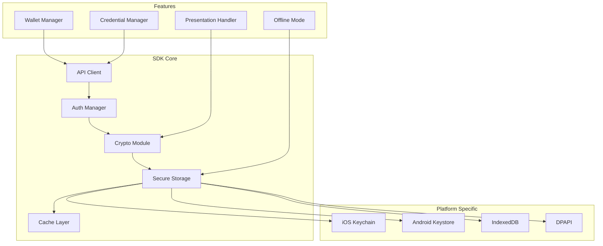

# Appendix E – SDK Documentation
## Digital Wallet and Verifiable Credentials Solution

**Document Version:** 2.0 FINAL  
**Parent Document:** [Master PRD](./PRD_Master.md)  
**Last Updated:** December 2024

---

## Table of Contents
1. [SDK Overview](#1-sdk-overview)
2. [Flutter SDK (ServiceWA)](#2-flutter-sdk-servicewa)
3. [.NET SDK (Agencies)](#3-net-sdk-agencies)
4. [TypeScript/JavaScript SDK (Web)](#4-typescriptjavascript-sdk-web)
5. [SDK Architecture](#5-sdk-architecture)
6. [Installation and Setup](#6-installation-and-setup)

---

## 1. SDK Overview

### 1.1 SDK Suite

| SDK | Platform | Primary Use | Package |
| --- | --- | --- | --- |
| **Flutter SDK** | iOS/Android | ServiceWA Integration | `wa_wallet_sdk` |
| **.NET SDK** | Server/Desktop | Agency Systems | `WA.Wallet.SDK` |
| **TypeScript SDK** | Web/Node.js | Web Verifiers | `@wa-wallet/sdk` |
| **iOS Native** | iOS | Future Native Apps | `WAWalletKit` |
| **Android Native** | Android | Future Native Apps | `au.gov.wa.wallet` |

### 1.2 Feature Matrix

| Feature | Flutter | .NET | TypeScript | iOS | Android |
| --- | --- | --- | --- | --- | --- |
| Wallet Management | ✅ | ✅ | ✅ | 🔄 | 🔄 |
| Credential Storage | ✅ | ✅ | ✅ | 🔄 | 🔄 |
| Issuance | ❌ | ✅ | ❌ | ❌ | ❌ |
| Verification | ✅ | ✅ | ✅ | 🔄 | 🔄 |
| Offline Mode | ✅ | ❌ | ⚠️ | 🔄 | 🔄 |
| Biometric Auth | ✅ | ❌ | ❌ | 🔄 | 🔄 |
| QR Scanning | ✅ | ❌ | ✅ | 🔄 | 🔄 |

---

## 2. Flutter SDK (ServiceWA)

### 2.1 Installation

```yaml
dependencies:
  wa_wallet_sdk: ^1.0.0
```

### 2.2 Quick Start

```dart
import 'package:wa_wallet_sdk/wa_wallet_sdk.dart';

class WalletService {
  late WalletSDK _sdk;
  
  Future<void> initialize() async {
    _sdk = WalletSDK(
      config: WalletConfig(
        baseUrl: 'https://api.wallet.wa.gov.au',
        apiKey: 'your-api-key',
        tenantId: 'wa_government',
        enableBiometric: true,
        enableOffline: true,
      ),
    );
    
    await _sdk.initialize();
  }
  
  Future<Wallet> createWallet(String userId) async {
    return await _sdk.wallets.create(
      userId: userId,
      deviceId: await DeviceInfo.getDeviceId(),
      displayName: 'ServiceWA Wallet',
    );
  }
  
  Future<List<Credential>> getCredentials() async {
    return await _sdk.credentials.list(
      status: CredentialStatus.active,
    );
  }
}
```

### 2.3 UI Components

```dart
// Pre-built UI components
WalletCard(
  credential: driverLicense,
  onTap: () => presentCredential(driverLicense),
);

QRScanner(
  onScan: (data) => verifyPresentation(data),
);

BiometricPrompt(
  reason: 'Authenticate to access wallet',
  onSuccess: () => unlockWallet(),
);
```

### 2.4 Offline Capabilities

```dart
// Generate offline proof
final proof = await _sdk.offline.generateProof(
  credential: credential,
  claims: ['name', 'dateOfBirth'],
  validityMinutes: 5,
);

// Display as QR code
QRCodeWidget(
  data: proof.toBase64(),
  size: 300,
);

// Verify offline
final isValid = await _sdk.offline.verifyProof(
  proof: scannedProof,
  trustedIssuers: ['did:web:wa.gov.au'],
);
```

---

## 3. .NET SDK (Agencies)

### 3.1 Installation

```xml
<PackageReference Include="WA.Wallet.SDK" Version="1.0.0" />
```

### 3.2 Configuration

```csharp
using WA.Wallet.SDK;
using Microsoft.Extensions.DependencyInjection;

public class Startup
{
    public void ConfigureServices(IServiceCollection services)
    {
        services.AddWalletSDK(options =>
        {
            options.BaseUrl = "https://api.wallet.wa.gov.au";
            options.ClientId = Configuration["Wallet:ClientId"];
            options.ClientSecret = Configuration["Wallet:ClientSecret"];
            options.TenantId = "wa_government";
            options.RetryPolicy = new ExponentialBackoff();
        });
    }
}
```

### 3.3 Issuing Credentials

```csharp
public class CredentialIssuer
{
    private readonly IWalletClient _client;
    
    public async Task<Credential> IssueDriverLicense(
        string walletId, 
        DriverLicenseData data)
    {
        var request = new IssueCredentialRequest
        {
            WalletId = walletId,
            SchemaId = "https://wallet.wa.gov.au/schemas/drivers-license/v1",
            Claims = new Dictionary<string, object>
            {
                ["licenseNumber"] = data.LicenseNumber,
                ["fullName"] = data.FullName,
                ["dateOfBirth"] = data.DateOfBirth,
                ["address"] = data.Address,
                ["licenseClass"] = data.Class,
                ["expiryDate"] = data.ExpiryDate
            },
            ValidFrom = DateTime.UtcNow,
            ValidUntil = data.ExpiryDate,
            Evidence = new[]
            {
                new Evidence
                {
                    Type = "document_verification",
                    Method = "automated",
                    Time = DateTime.UtcNow
                }
            }
        };
        
        return await _client.Credentials.IssueAsync(request);
    }
}
```

### 3.4 Batch Operations

```csharp
// Batch issuance
var batchResult = await _client.Credentials.BatchIssueAsync(
    credentials.Select(c => new IssueCredentialRequest { ... })
);

// Batch revocation
await _client.Credentials.BatchRevokeAsync(
    credentialIds,
    reason: "License suspended"
);
```

---

## 4. TypeScript/JavaScript SDK (Web)

### 4.1 Installation

```bash
npm install @wa-wallet/sdk
# or
yarn add @wa-wallet/sdk
```

### 4.2 Initialization

```typescript
import { WalletSDK, Environment } from '@wa-wallet/sdk';

const sdk = new WalletSDK({
  environment: Environment.Production,
  apiKey: process.env.WALLET_API_KEY,
  tenantId: 'wa_government',
  options: {
    timeout: 30000,
    retries: 3,
  }
});
```

### 4.3 React Integration

```tsx
import { WalletProvider, useWallet } from '@wa-wallet/sdk/react';

function App() {
  return (
    <WalletProvider config={sdkConfig}>
      <WalletComponent />
    </WalletProvider>
  );
}

function WalletComponent() {
  const { wallet, credentials, isLoading } = useWallet();
  
  if (isLoading) return <Spinner />;
  
  return (
    <div>
      <h2>My Credentials ({credentials.length})</h2>
      {credentials.map(cred => (
        <CredentialCard key={cred.id} credential={cred} />
      ))}
    </div>
  );
}
```

### 4.4 Verification Flow

```typescript
// Create verification request
const request = await sdk.presentations.createRequest({
  credentialTypes: ['DriverLicense'],
  requiredClaims: ['licenseNumber', 'fullName', 'dateOfBirth'],
  purpose: 'Age Verification',
  challenge: crypto.randomUUID(),
});

// Generate QR code for request
const qrCode = await QRCode.toDataURL(request.uri);

// Handle presentation submission
sdk.presentations.onSubmission(async (presentation) => {
  const result = await sdk.presentations.verify(
    presentation,
    request.challenge
  );
  
  if (result.isValid) {
    console.log('Verified:', result.claims);
  }
});
```

---

## 5. SDK Architecture

### 5.1 Common SDK Architecture



### 5.2 Security Features

| Feature | Implementation | Platform |
| --- | --- | --- |
| **Key Storage** | Hardware-backed when available | All |
| **Biometric Auth** | Platform APIs | Mobile |
| **Certificate Pinning** | Built-in | All |
| **Encrypted Storage** | AES-256-GCM | All |
| **Secure Communication** | TLS 1.3 | All |
| **Code Obfuscation** | ProGuard/R8 | Mobile |

---

## 6. Installation and Setup

### 6.1 Flutter SDK Setup

```bash
# Add to pubspec.yaml
flutter pub add wa_wallet_sdk

# iOS setup
cd ios && pod install

# Android setup (add to AndroidManifest.xml)
<uses-permission android:name="android.permission.USE_BIOMETRIC" />
<uses-permission android:name="android.permission.CAMERA" />
```

### 6.2 .NET SDK Setup

```bash
# Install via NuGet
dotnet add package WA.Wallet.SDK

# Add to appsettings.json
{
  "Wallet": {
    "BaseUrl": "https://api.wallet.wa.gov.au",
    "ClientId": "your-client-id",
    "ClientSecret": "your-client-secret"
  }
}
```

### 6.3 TypeScript SDK Setup

```bash
# Install dependencies
npm install @wa-wallet/sdk

# TypeScript configuration
{
  "compilerOptions": {
    "types": ["@wa-wallet/sdk"]
  }
}

# Environment variables
WALLET_API_KEY=your-api-key
WALLET_TENANT_ID=wa_government
```

### 6.4 SDK Documentation Links

- **Flutter SDK**: [/sdk/flutter/README.md](./sdk/flutter/README.md)
- **.NET SDK**: [/sdk/dotnet/README.md](./sdk/dotnet/README.md)
- **TypeScript SDK**: [/sdk/web/README.md](./sdk/web/README.md)
- **API Reference**: [Appendix D - API Documentation](./Appendix_D_API_Documentation.md)
- **Developer Portal**: https://developers.wallet.wa.gov.au

---

## Summary

The SDK suite provides:
1. **Native Flutter SDK** for ServiceWA integration
2. **Server-side .NET SDK** for agency systems
3. **Web TypeScript SDK** for browser-based verification
4. **Comprehensive documentation** and examples
5. **Platform-specific optimizations** for security and performance
6. **Offline capabilities** for disconnected scenarios

All SDKs are designed to work within the pilot budget of $1,866,250 while providing a foundation for production scale.

---
[Back to Master PRD](./PRD_Master.md) | [Next: Testing Strategy](./Appendix_F_Testing_Strategy.md)