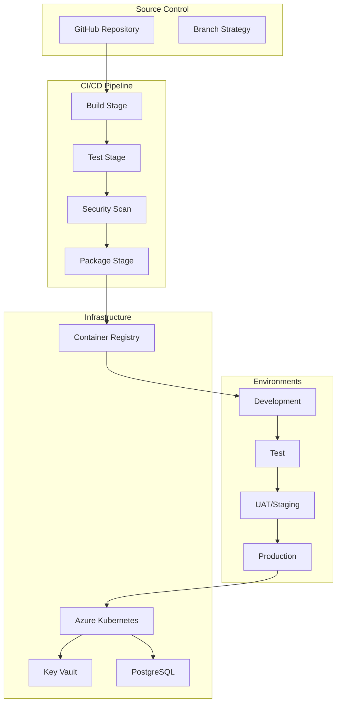
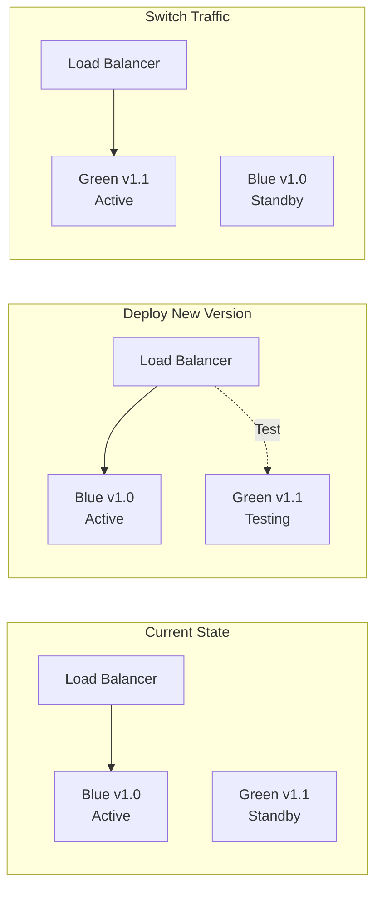
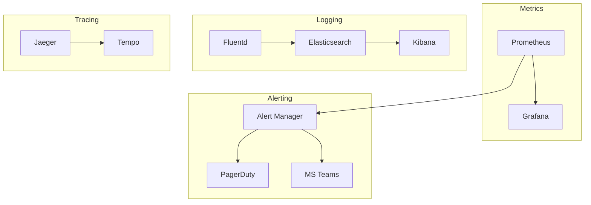

# Appendix G – Deployment Guide
## Digital Wallet and Verifiable Credentials Solution

**Document Version:** 2.0 FINAL  
**Parent Document:** [Master PRD](./PRD_Master.md)  
**Last Updated:** December 2024

---

## Table of Contents
1. [Deployment Overview](#1-deployment-overview)
2. [Infrastructure as Code](#2-infrastructure-as-code)
3. [CI/CD Pipeline](#3-cicd-pipeline)
4. [Deployment Environments](#4-deployment-environments)
5. [Deployment Process](#5-deployment-process)
6. [Monitoring and Observability](#6-monitoring-and-observability)
7. [Rollback Procedures](#7-rollback-procedures)

---

## 1. Deployment Overview

### 1.1 Deployment Architecture



### 1.2 Deployment Stack

| Component | Technology | Purpose |
| --- | --- | --- |
| **Container Orchestration** | Azure Kubernetes Service (AKS) | Application hosting |
| **Container Registry** | Azure Container Registry | Image storage |
| **CI/CD** | GitHub Actions + Azure DevOps | Automation |
| **IaC** | Terraform + Bicep | Infrastructure provisioning |
| **GitOps** | ArgoCD | Kubernetes deployments |
| **Secrets Management** | Azure Key Vault + Sealed Secrets | Secure configuration |

---

## 2. Infrastructure as Code

### 2.1 Terraform Configuration

```hcl
# main.tf - Azure Infrastructure
terraform {
  required_version = ">= 1.5.0"
  
  backend "azurerm" {
    resource_group_name  = "wallet-tfstate-rg"
    storage_account_name = "wallettfstate"
    container_name       = "tfstate"
    key                  = "prod.terraform.tfstate"
  }
}

# Resource Group
resource "azurerm_resource_group" "wallet" {
  name     = "wallet-${var.environment}-rg"
  location = "Australia East"
  tags     = local.common_tags
}

# AKS Cluster
resource "azurerm_kubernetes_cluster" "wallet" {
  name                = "wallet-${var.environment}-aks"
  location            = azurerm_resource_group.wallet.location
  resource_group_name = azurerm_resource_group.wallet.name
  dns_prefix          = "wallet-${var.environment}"
  
  default_node_pool {
    name                = "system"
    node_count          = var.node_count
    vm_size             = var.vm_size
    enable_auto_scaling = true
    min_count          = 2
    max_count          = 10
    availability_zones  = ["1", "2", "3"]
  }
  
  identity {
    type = "SystemAssigned"
  }
  
  network_profile {
    network_plugin    = "azure"
    network_policy    = "calico"
    load_balancer_sku = "standard"
  }
}

# PostgreSQL Flexible Server
resource "azurerm_postgresql_flexible_server" "wallet" {
  name                = "wallet-${var.environment}-psql"
  resource_group_name = azurerm_resource_group.wallet.name
  location            = azurerm_resource_group.wallet.location
  version             = "15"
  
  administrator_login    = "walletadmin"
  administrator_password = random_password.db_password.result
  
  storage_mb = 32768
  sku_name   = "GP_Standard_D4s_v3"
  
  high_availability {
    mode                      = "ZoneRedundant"
    standby_availability_zone = "2"
  }
}
```

### 2.2 Kubernetes Manifests

```yaml
# deployment.yaml
apiVersion: apps/v1
kind: Deployment
metadata:
  name: wallet-service
  namespace: wallet
spec:
  replicas: 3
  strategy:
    type: RollingUpdate
    rollingUpdate:
      maxSurge: 1
      maxUnavailable: 0
  selector:
    matchLabels:
      app: wallet-service
  template:
    metadata:
      labels:
        app: wallet-service
        version: v1.0.0
    spec:
      containers:
      - name: wallet
        image: walletacr.azurecr.io/wallet-service:1.0.0
        ports:
        - containerPort: 8080
        env:
        - name: ASPNETCORE_ENVIRONMENT
          value: "Production"
        - name: ConnectionStrings__Database
          valueFrom:
            secretKeyRef:
              name: wallet-secrets
              key: db-connection
        resources:
          requests:
            memory: "512Mi"
            cpu: "500m"
          limits:
            memory: "2Gi"
            cpu: "2000m"
        livenessProbe:
          httpGet:
            path: /health/live
            port: 8080
          initialDelaySeconds: 30
          periodSeconds: 10
        readinessProbe:
          httpGet:
            path: /health/ready
            port: 8080
          initialDelaySeconds: 5
          periodSeconds: 5
```

---

## 3. CI/CD Pipeline

### 3.1 GitHub Actions Workflow

```yaml
name: CI/CD Pipeline

on:
  push:
    branches: [main, develop]
  pull_request:
    branches: [main]

env:
  REGISTRY: walletacr.azurecr.io
  IMAGE_NAME: wallet-service

jobs:
  build:
    runs-on: ubuntu-latest
    steps:
    - uses: actions/checkout@v3
    
    - name: Setup .NET
      uses: actions/setup-dotnet@v3
      with:
        dotnet-version: '8.0.x'
    
    - name: Restore dependencies
      run: dotnet restore
    
    - name: Build
      run: dotnet build --configuration Release
    
    - name: Test
      run: dotnet test --configuration Release --collect:"XPlat Code Coverage"
    
    - name: Security Scan
      uses: aquasecurity/trivy-action@master
      with:
        scan-type: 'fs'
        scan-ref: '.'
    
    - name: Build Docker Image
      run: |
        docker build -t $REGISTRY/$IMAGE_NAME:$GITHUB_SHA .
        docker tag $REGISTRY/$IMAGE_NAME:$GITHUB_SHA $REGISTRY/$IMAGE_NAME:latest
    
    - name: Push to Registry
      run: |
        echo ${{ secrets.AZURE_REGISTRY_PASSWORD }} | docker login $REGISTRY -u ${{ secrets.AZURE_REGISTRY_USERNAME }} --password-stdin
        docker push $REGISTRY/$IMAGE_NAME:$GITHUB_SHA
        docker push $REGISTRY/$IMAGE_NAME:latest

  deploy-dev:
    needs: build
    if: github.ref == 'refs/heads/develop'
    runs-on: ubuntu-latest
    steps:
    - name: Deploy to Dev
      uses: azure/k8s-deploy@v4
      with:
        manifests: |
          k8s/deployment.yaml
          k8s/service.yaml
        images: |
          ${{ env.REGISTRY }}/${{ env.IMAGE_NAME }}:${{ github.sha }}
        namespace: wallet-dev

  deploy-prod:
    needs: build
    if: github.ref == 'refs/heads/main'
    runs-on: ubuntu-latest
    environment: production
    steps:
    - name: Deploy to Production
      uses: azure/k8s-deploy@v4
      with:
        manifests: |
          k8s/deployment.yaml
          k8s/service.yaml
        images: |
          ${{ env.REGISTRY }}/${{ env.IMAGE_NAME }}:${{ github.sha }}
        namespace: wallet-prod
```

---

## 4. Deployment Environments

### 4.1 Environment Configuration

| Environment | Purpose | Scale | Availability | Data |
| --- | --- | --- | --- | --- |
| **Development** | Feature development | 1 node | 95% | Synthetic |
| **Test** | Integration testing | 2 nodes | 99% | Test data |
| **UAT/Staging** | User acceptance | 3 nodes | 99.9% | Production-like |
| **Production** | Live system | 5+ nodes | 99.95% | Real data |

### 4.2 Environment Variables

```yaml
# configmap.yaml
apiVersion: v1
kind: ConfigMap
metadata:
  name: wallet-config
  namespace: wallet
data:
  ASPNETCORE_ENVIRONMENT: "Production"
  API_BASE_URL: "https://api.wallet.wa.gov.au"
  TENANT_ID: "wa_government"
  ENABLE_SWAGGER: "false"
  LOG_LEVEL: "Information"
  CACHE_DURATION: "3600"
  
---
# secret.yaml (encrypted with Sealed Secrets)
apiVersion: bitnami.com/v1alpha1
kind: SealedSecret
metadata:
  name: wallet-secrets
  namespace: wallet
spec:
  encryptedData:
    db-connection: AgBy3i4OJSWK+PiTySYZZA9...
    api-key: AgCDxI7yYSOS7HTlTFdFjz8...
    jwt-secret: AgAtSO6YiLqAdKzxQXDrj...
```

---

## 5. Deployment Process

### 5.1 Blue-Green Deployment



### 5.2 Deployment Checklist

```markdown
## Pre-Deployment
- [ ] Code review completed
- [ ] All tests passing
- [ ] Security scan clean
- [ ] Documentation updated
- [ ] Change approval obtained

## Deployment
- [ ] Backup current version
- [ ] Deploy to staging
- [ ] Run smoke tests
- [ ] Deploy to production (blue-green)
- [ ] Verify health checks

## Post-Deployment
- [ ] Monitor metrics for 30 minutes
- [ ] Check error rates
- [ ] Verify performance
- [ ] Update status page
- [ ] Notify stakeholders
```

---

## 6. Monitoring and Observability

### 6.1 Monitoring Stack



### 6.2 Key Metrics

| Metric | Target | Alert Threshold |
| --- | --- | --- |
| **Availability** | 99.95% | <99.9% |
| **Response Time (p95)** | <200ms | >500ms |
| **Error Rate** | <0.1% | >1% |
| **CPU Usage** | <70% | >85% |
| **Memory Usage** | <80% | >90% |
| **Pod Restarts** | 0/hour | >5/hour |

---

## 7. Rollback Procedures

### 7.1 Automated Rollback

```yaml
# flagger-canary.yaml
apiVersion: flagger.app/v1beta1
kind: Canary
metadata:
  name: wallet-service
  namespace: wallet
spec:
  targetRef:
    apiVersion: apps/v1
    kind: Deployment
    name: wallet-service
  progressDeadlineSeconds: 300
  service:
    port: 8080
  analysis:
    interval: 1m
    threshold: 5
    maxWeight: 50
    stepWeight: 10
    metrics:
    - name: request-success-rate
      thresholdRange:
        min: 99
      interval: 1m
    - name: request-duration
      thresholdRange:
        max: 500
      interval: 1m
  webhooks:
    - name: rollback-notification
      url: https://hooks.slack.com/services/...
      timeout: 5s
```

### 7.2 Manual Rollback Process

```bash
# Quick rollback to previous version
kubectl rollout undo deployment/wallet-service -n wallet

# Rollback to specific revision
kubectl rollout history deployment/wallet-service -n wallet
kubectl rollout undo deployment/wallet-service --to-revision=2 -n wallet

# Verify rollback
kubectl rollout status deployment/wallet-service -n wallet
kubectl get pods -n wallet -l app=wallet-service

# Database rollback (if needed)
psql -h wallet-prod-psql.postgres.database.azure.com -U walletadmin -d wallet <<EOF
BEGIN;
-- Rollback migration
\i /migrations/rollback/v1.0.0.sql
COMMIT;
EOF
```

---

## Summary

This deployment guide provides:
1. **Complete IaC setup** using Terraform and Kubernetes
2. **Automated CI/CD pipeline** with GitHub Actions
3. **Multi-environment strategy** from dev to production
4. **Blue-green deployment** for zero-downtime releases
5. **Comprehensive monitoring** and observability
6. **Automated rollback** procedures

The deployment architecture supports the pilot phase within the $1,866,250 budget while providing a clear path to production scale.

---
[Back to Master PRD](./PRD_Master.md) | [Next: Support Model](./Appendix_H_Support_Model.md)