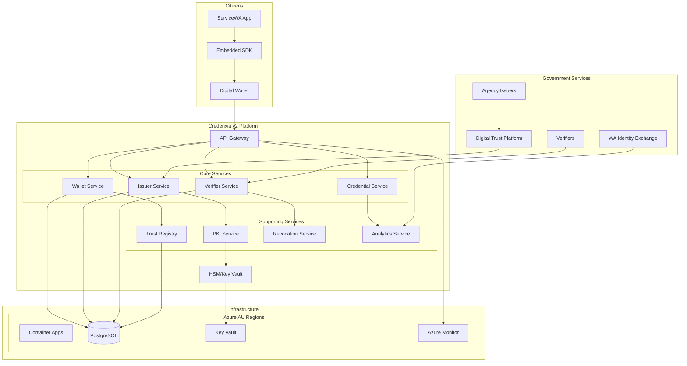
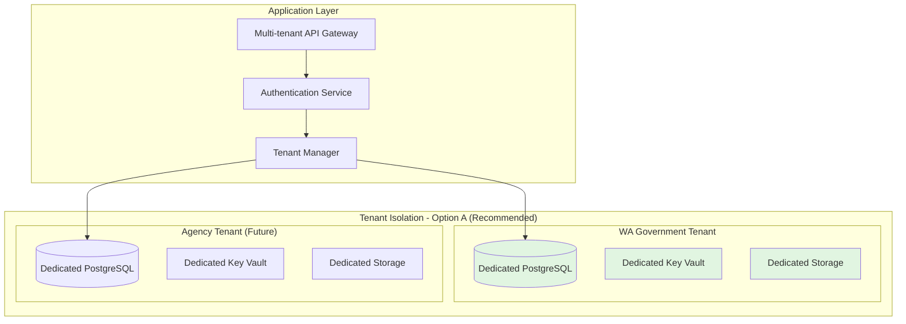
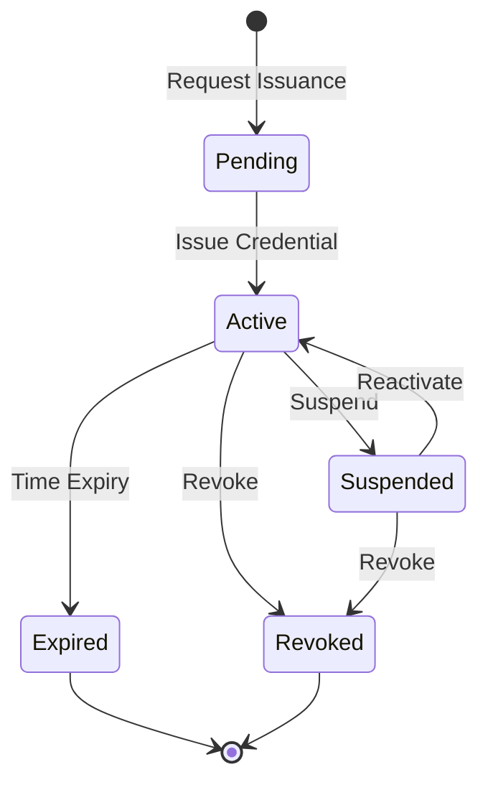

# Digital Wallet & Verifiable Credentials Solution for Western Australia – Master PRD

**Document Version:** 2.0 FINAL  
**Date:** December 2024  
**Tender Reference:** DPC2142  
**Client:** Department of the Premier and Cabinet (DGov), Western Australia  
**Solution:** Credenxia v2 Platform

---

## Table of Contents
- [Executive Summary](#executive-summary)
- [Solution Overview](#solution-overview)
- [Goals and Non-goals](#goals-and-non-goals)
- [Stakeholders and Tenancy Model](#stakeholders-and-tenancy-model)
- [Functional Requirements](#functional-requirements)
- [Non-functional Requirements](#non-functional-requirements)
- [Standards and Protocols](#standards-and-protocols)
- [Interfaces and SDKs](#interfaces-and-sdks)
- [Team & Effort Estimates](#team--effort-estimates)
- [Pricing Options](#pricing-options)
- [Risk Management](#risk-management)
- [Success Metrics](#success-metrics)

## Documentation Structure

### Core Documents
- **[PRD_Master.md](PRD_Master.md)** - This document. Executive overview, requirements, team structure, and pricing summary
- **[CLAUDE.md](../CLAUDE.md)** - Repository context for AI assistants, project overview, and quick reference

### Technical Appendices
- **[Appendix A – Solution Architecture](Appendix_A_Solution_Architecture.md)** - Complete technical architecture with visual diagrams, Azure infrastructure, microservices design, and integration patterns
- **[Appendix B – Security, Privacy & Compliance](Appendix_B_Security_Privacy_Compliance.md)** - Advanced security controls, encryption standards, privacy measures, threat model, and compliance mapping
- **[Appendix C – Technical Specification](Appendix_C_Technical_Specification.md)** - Detailed technical implementation, data models, state machines, and component specifications
- **[Appendix D – API Documentation](Appendix_D_API_Documentation.md)** - OpenAPI 3.0 specifications, endpoint details, authentication flows, and code examples
- **[Appendix E – SDK Documentation](Appendix_E_SDK_Documentation.md)** - Comprehensive SDK guides for Flutter, .NET, TypeScript/JS, and native platforms

### Operational Appendices
- **[Appendix F – Testing Strategy](Appendix_F_Testing_Strategy.md)** - Comprehensive testing approach, quality assurance, POA plan, and pilot phases
- **[Appendix G – Deployment Guide](Appendix_G_Deployment_Guide.md)** - GitOps deployment, infrastructure as code, CI/CD pipelines, and monitoring setup
- **[Appendix H – Support Model](Appendix_H_Support_Model.md)** - Support tiers, SLAs, incident management, and training programs

### Commercial Appendices
- **[Appendix I – Pricing & Assumptions](Appendix_I_Pricing_Assumptions.md)** - Detailed pricing models, team costs, infrastructure breakdown, and comprehensive assumptions
  - **[Detailed Cost Breakdown](Appendix_I_Detailed_Cost_Breakdown_Internal.md)** - Phase-by-phase analysis, professional services rates, ROI metrics, TCO analysis
- **[Appendix J – Team & Resources](Appendix_J_Team_Resources.md)** - Team structure, roles, responsibilities, and resource allocation
- **[Appendix K – Risk Matrix](Appendix_K_Risk_Matrix.md)** - Comprehensive risk assessment with 38 identified risks and mitigation strategies
- **[Appendix L – Compliance Matrix](Appendix_L_Compliance_Matrix.md)** - Detailed mapping to Australian standards, TDIF requirements, and certification roadmap

## Executive Summary

The Office of Digital Government (DGov) within the WA Department of the Premier and Cabinet is seeking a managed service provider to deliver, host and support a **digital wallet and verifiable credentials solution** that integrates with the ServiceWA mobile application. The Request DPC2142 requires a Proof-of-Operation (POA) followed by a twelve-month Pilot Phase and an option to scale to full production.

Our proposed solution, **Credenxia v2**, is a **cloud-native, multi-tenant wallet platform** built on **Microsoft .NET** and **C#**, using **PostgreSQL** for persistence and running in **Azure AU regions**. The platform implements W3C verifiable credential standards with support for decentralised identifiers (DIDs), OpenID Connect flows, offline presentation and selective disclosure.

### Key Value Propositions
- **Standards-compliant:** Full alignment with ISO/IEC 18013-5/7, ISO/IEC 23220, W3C VC 2.0, OID4VCI/OIDC4VP, and TDIF
- **Azure-native:** Leveraging Azure's Australian regions for complete data sovereignty
- **Multi-tenant architecture:** Per-tenant database isolation with enterprise-grade security
- **Comprehensive SDK suite:** Native Flutter, .NET, TypeScript/JS, iOS, and Android SDKs
- **Privacy-preserving:** Zero-knowledge proofs, selective disclosure, homomorphic encryption options
- **Offline-capable:** Full offline verification with QR codes, NFC, and mesh networking capabilities
- **AI-augmented development:** 40-50% productivity gains through GitHub Copilot and AI tools

## Solution Overview

→ **See [Appendix A – Solution Architecture](Appendix_A_Solution_Architecture.md) for detailed technical architecture**

### Technical Architecture Highlights
- **Microservices architecture** with event-driven communication
- **API-first design** with OpenAPI 3.0 specifications
- **Multi-layered security** with defense-in-depth approach
- **Horizontal scalability** with auto-scaling capabilities
- **High availability** with multi-zone deployment
- **Comprehensive observability** with distributed tracing

## Goals and Non-goals

### Goals
- Deliver an ISO-compliant digital wallet platform integrated with ServiceWA via SDKs
- Support complete credential lifecycle: issuance, storage, presentation, selective disclosure, and revocation
- Provide robust PKI and trust registry for issuers and verifiers
- Enable multi-tenancy with strong isolation and configurable trust policies
- Ensure security, privacy and compliance with ISO/IEC 27001, TDIF, and Australian privacy laws
- Offer 99.95% availability with sub-200ms response times at scale
- Deliver comprehensive training, documentation, and 24/7 support
- Provide flexible pricing options with transparent consumption reporting

### Non-goals
- Implementing citizen onboarding or KYC processes (out of scope per Addendum 2)
- Replacing the ServiceWA front-end (SDK integration only)
- Building bespoke agency credential issuance flows (managed via DTP)
- Providing biometric authentication during Pilot (future roadmap)
- Providing Root CA infrastructure (managed by DGov)
- Blockchain/DLT implementation (unless explicitly required)

## Stakeholders and Tenancy Model

### Stakeholder Matrix

| Stakeholder | Role & Responsibilities | Engagement Model |
| --- | --- | --- |
| **Office of Digital Government (DGov)** | Contract owner; defines requirements; governs service; manages DTP and IdX | Weekly steering committee |
| **ServiceWA & Adapptor** | Owns ServiceWA app; integrates SDK; manages UX | Daily standups during integration |
| **Digital Wallet Provider (Us)** | Develops and operates platform; provides SDKs; ensures compliance | Dedicated Account Manager |
| **Credential Issuers (Agencies)** | Provide credentials via DTP; maintain attribute sources | Monthly issuer forums |
| **Citizens** | Hold credentials; consent to usage; recover wallets | Support via ServiceWA |
| **Verifiers & Relying Parties** | Accept credentials; validate proofs | Developer portal access |
| **WA Identity Exchange (IdX)** | Provides federated authentication | Technical integration team |

### Multi-Tenancy Architecture

**Recommended: Option A - Per-tenant Database**
- Complete data isolation for regulatory compliance
- Dedicated encryption keys per tenant
- Independent backup and recovery
- Simplified audit and compliance reporting
- Migration path to shared infrastructure if needed

## Functional Requirements

→ **See [Appendix C – Technical Specification](Appendix_C_Technical_Specification.md) for detailed functional specifications**  
→ **See [Appendix F – Testing Strategy](Appendix_F_Testing_Strategy.md) for test coverage**

### Core Capabilities

#### Credential Lifecycle Management

- **Issuance:** API-driven credential creation with template management
- **Storage:** Encrypted storage with device binding and backup
- **Presentation:** Online/offline presentation with selective disclosure
- **Verification:** Real-time and offline verification with status checking
- **Revocation:** Immediate revocation with status list updates
- **Recovery:** Secure wallet recovery with identity verification

#### Identity and Security
- **Identity Binding:** Integration with WA IdX for strong authentication
- **Device Management:** Multi-device support with configurable limits
- **Cryptographic Operations:** Hardware-backed key storage where available
- **Privacy Controls:** Consent management and data minimization

#### Integration Capabilities
- **ServiceWA Integration:** Native Flutter SDK with UI components
- **Agency Integration:** .NET SDK for credential issuance
- **Verifier Integration:** TypeScript/JS SDK for web verification
- **DTP Integration:** RESTful APIs with webhook support

## Non-functional Requirements

→ **See [Appendix C – Technical Specification](Appendix_C_Technical_Specification.md) for detailed technical requirements**

### Performance Requirements

| Metric | POA | Pilot | Production |
| --- | --- | --- | --- |
| **Availability** | 95% | 99.9% | 99.95% |
| **Response Time (p95)** | <2s | <500ms | <200ms |
| **Throughput** | 100 TPS | 1,000 TPS | 10,000 TPS |
| **Concurrent Users** | 100 | 10,000 | 100,000 |
| **Data Retention** | 30 days | 90 days | 7 years |

### Security Requirements

→ **See [Appendix B – Security, Privacy & Compliance](Appendix_B_Security_Privacy_Compliance.md) for comprehensive security framework**
- **Encryption:** AES-256-GCM at rest, TLS 1.3 in transit
- **Key Management:** HSM-backed with FIPS 140-2 Level 3
- **Authentication:** OAuth 2.0/OIDC with PKCE
- **Authorization:** Fine-grained RBAC with attribute-based policies
- **Audit:** Immutable audit logs with tamper detection

### Compliance Requirements
- **Standards:** ISO/IEC 27001, ISO/IEC 18013-5, W3C VC 2.0
- **Frameworks:** TDIF accreditation pathway
- **Privacy:** Privacy Act 1988, GDPR-equivalent controls
- **Accessibility:** WCAG 2.1 Level AA compliance

## Standards and Protocols

→ **See [Appendix L – Compliance Matrix](Appendix_L_Compliance_Matrix.md) for detailed standards mapping**

### Supported Standards
- **ISO/IEC 18013-5:** Mobile driving license (mDL)
- **ISO/IEC 18013-7:** Mobile driving license add-on functions
- **ISO/IEC 23220:** Building blocks for identity management via mobile devices
- **W3C VC Data Model 2.0:** Verifiable Credentials specification
- **OpenID4VCI:** OpenID for Verifiable Credential Issuance
- **OpenID4VP:** OpenID for Verifiable Presentations
- **TDIF:** Trusted Digital Identity Framework

### Protocol Support
- **DIDComm v2:** Secure messaging between agents
- **OIDC/OAuth 2.0:** Authentication and authorization
- **WebAuthn:** Passwordless authentication
- **mDOC:** ISO 18013-5 mobile document format

## Interfaces and SDKs

→ **See [Appendix D – API Documentation](Appendix_D_API_Documentation.md) for API specifications**  
→ **See [Appendix E – SDK Documentation](Appendix_E_SDK_Documentation.md) for SDK guides**

### SDK Suite

| Platform | Primary Use | Key Features |
| --- | --- | --- |
| **Flutter SDK** | ServiceWA Integration | UI components, secure storage, biometric auth |
| **.NET SDK** | Agency Systems | Credential issuance, template management |
| **TypeScript/JS SDK** | Web Verifiers | Browser-based verification, QR scanning |
| **iOS Native SDK** | Future Native Apps | Swift Package Manager, Keychain integration |
| **Android Native SDK** | Future Native Apps | Kotlin, Android Keystore |

### API Categories
- **Wallet APIs:** Credential storage and retrieval
- **Issuer APIs:** Credential issuance and revocation
- **Verifier APIs:** Presentation verification
- **Admin APIs:** Tenant and policy management
- **Analytics APIs:** Metrics and reporting

## Team & Effort Estimates

→ **See [Appendix J – Team & Resources](Appendix_J_Team_Resources.md) for detailed team structure and RACI matrix**

### Team Structure (6.5 FTE)

| Role | FTE | Responsibilities |
| --- | --- | --- |
| **Project Manager** | 1.0 | Project delivery, stakeholder management |
| **Business Analyst** | 1.0 | Requirements analysis, documentation |
| **Tester/QA** | 1.0 | Test planning, execution, automation |
| **Solution Architect/Lead** | 1.0 | Technical leadership, architecture decisions |
| **Full-Stack Developer** | 1.0 | Feature development, integration |
| **DevOps/Security Engineer** | 1.0 | Infrastructure, security, CI/CD |
| **Support/Documentation** | 0.5 | User support, documentation |

### AI Augmentation
- **Tools:** GitHub Copilot, Claude, GPT-4
- **Productivity Gain:** 40-50% improvement
- **Investment:** $3,000/month (included in infrastructure)

## Pricing Options

→ **See [Appendix I – Pricing & Assumptions](Appendix_I_Pricing_Assumptions.md) for detailed pricing models**  
→ **See [Appendix I – Detailed Cost Breakdown](Appendix_I_Detailed_Cost_Breakdown_Internal.md) for phase-by-phase analysis**

### Pilot Phase (12 Months)
**Total Price: $1,487,880.00**

#### Cost Breakdown
| Component | Cost | Notes |
| --- | --- | --- |
| **Platform Infrastructure** | $107,880 | Azure services + dev tools |
| **Personnel Costs** | $1,311,000 | 6.5 FTE (includes setup, development, training) |
| **Security & Compliance** | $69,000 | Penetration testing, audits, DR testing |
| **Total** | **$1,487,880** | Fixed price with 15% contingency & 20% margin |

### Production Options

#### Option 1: Infrastructure Plus (Fixed Annual)
- **Small (100K users):** $1,187,391.60/year
- **Medium (500K users):** $1,424,555.18/year
- **Large (2M+ users):** $2,402,520.29/year

#### Option 2: Consumption-Based
- **Base Platform:** $25,000/month
- **Per Active Wallet:** $0.50/month
- **Per Credential Issued:** $0.10
- **Per Verification:** $0.01
- **Volume discounts:** Up to 40% for large volumes

## Risk Management

→ **See [Appendix K – Risk Matrix](Appendix_K_Risk_Matrix.md) for comprehensive risk assessment with 38 identified risks**

### Top 5 Risks

| Risk | Impact | Likelihood | Mitigation |
| --- | --- | --- | --- |
| **Integration Complexity** | High | Medium | Early SDK delivery, dedicated support |
| **Performance at Scale** | High | Low | Load testing, auto-scaling architecture |
| **Compliance Delays** | Medium | Medium | Early engagement with regulators |
| **Security Breach** | High | Low | Defense-in-depth, regular testing |
| **Scope Creep** | Medium | Medium | Clear change management process |

## Success Metrics

### Pilot Success Criteria

| Category | Metric | Target |
| --- | --- | --- |
| **Technical** | System Availability | >99.9% |
| **Technical** | Response Time (p95) | <500ms |
| **Business** | Active Wallets | >10,000 |
| **Business** | Credentials Issued | >50,000 |
| **Business** | Successful Verifications | >95% |
| **User** | App Store Rating | >4.0 stars |
| **User** | Support Ticket Resolution | <24 hours |
| **Compliance** | TDIF Alignment | 100% mapped |
| **Security** | Security Incidents | Zero critical |

### Production Readiness Gates
1. **Performance:** Successfully handle 10x pilot load
2. **Security:** Pass penetration testing with no critical findings
3. **Compliance:** Achieve TDIF accreditation pathway milestone
4. **Operations:** Demonstrate 99.95% availability over 30 days
5. **User Acceptance:** >90% satisfaction in user testing

---

## Approval and Sign-off

| Role | Name | Signature | Date |
| --- | --- | --- | --- |
| **DGov Program Director** | | | |
| **ServiceWA Product Owner** | | | |
| **Technical Architect** | | | |
| **Security Lead** | | | |
| **Delivery Partner PM** | | | |

---

*This Master PRD represents the complete solution design for the Digital Wallet and Verifiable Credentials platform. All appendices provide detailed implementation specifications.*

**Next Steps:**
1. Review and approve Master PRD
2. Commence POA development (3 weeks)
3. Deploy pilot environment
4. Begin ServiceWA integration

---
[Back to Repository Root](../../../README.md)